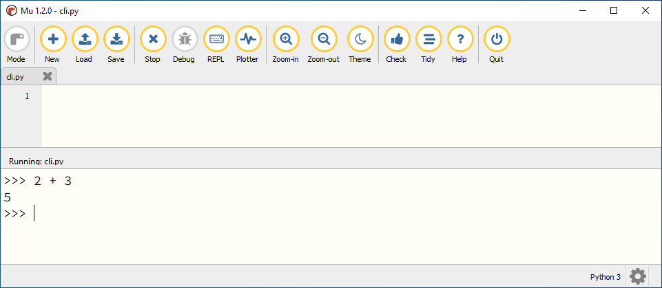

.. role:: python(code)
   :language: python

Editor en CLI
=============

Mu editor is een zogenoemde :abbr:`IDE (Integrated Development Environment)`: een programmeeromgeving waarin je code kunt typen, bewerken en uitvoeren. Er zijn echter twee plekken waar je code kunt typen:

1. In een :file:`.py` bestand in het editor venster.
2. In de :abbr:`CLI (Command Line Interface)`, om rechtstreeks met Python te communiceren.

.. dropdown:: Wat leer je in dit hoofdstuk
    :open:
    :color: primary
    :icon: book

    * Hoe gebruik je in Mu editor de CLI.
    * Wat is het verschil tussen werken in de editor en in de CLI.
    

CLI in Mu editor
-----------------
In het vorige deel maakte je het eenvoudige programma Hello, World! Dat programma bestond uit twee regels code, die je typte in het editor venster en opsloeg in het bestand :file:`hello_world.py`. Toen je op de :guilabel:`Run` knop klikte, verscheen onderin Mu editor een tweede venster dat de output van je code toonde:

Onder de output ``Hello, World!`` heb je wellicht de drie ``>>>`` symbolen opgemerkt. Dit is de zogenoemde *prompt*, die aangeeft dat je directe commando's aan Python kunt geven. Je hebt de CLI gevonden!

Zoals je ziet, verschijnt de CLI pas wanneer je een programma runt. Om die reden ga je nu een *leeg* programma maken.

Klik op de :guilabel:`New` knop om een nieuw codebestand te starten. Verwijder de regel :python:`# Write your code here :-)`, zodat het bestand helemaal leeg is en sla het vervolgens op onder de naam :file:`cli.py` in je Sharepoint map.

.. figure:: images/mu_editor_cli_py_2.png

Klik op de :guilabel:`Run` knop om je lege codebestand uit te voeren. De CLI verschijnt en verder gebeurt er uiteraard niets.
Maar als je nu achter de Python prompt ``>>>`` bijvoorbeeld de som :python:`2 + 3` typt en op :kbd:`Enter` drukt, geeft Python direct antwoord:

Verschillen tussen editor en CLI
---------------------------------
Hieronder zie je de belangrijkste verschillen tussen het gebruik van de editor en de CLI:

.. grid:: 2

    .. grid-item-card:: Editor
        :columns: 6
        :class-card: bgcolor-lavenderblush

        * Voor programma's van meerdere coderegels.
        * Code wordt uitgevoerd wanneer je op :guilabel:`Run` klikt.
        * Code kun je opslaan.
        * Gebruik je om een programma te maken.

    .. grid-item-card:: CLI
        :columns: 6
        :class-card: bgcolor-azure

        * Voor één coderegel per keer.
        * Code wordt uitgevoerd zodra je op :kbd:`Enter` drukt.
        * Code kun je niet opslaan.
        * Gebruik je om snel iets te testen.

Er is nog een - wellicht minder opvallend - verschil tussen de werking van de editor en de CLI. Probeer het volgende maar eens:

1. Klik op :guilabel:`Stop` om de uitvoering van :file:`cli.py` te stoppen.
2. Typ in de editor :python:`2 + 3`.
3. Klik op :guilabel:`Run`.

Je zou verwachten dat de uitkomst van de berekening :python:`2 + 3` verschijnt, maar dat gebeurt niet:

Om de uitkomst van de berekening te tonen, moet je :python:`print(2 + 3)` gebruiken:

Zoals je waarschijnlijk al hebt gemerkt is :python:`print()` een commando dat iets op het scherm afdrukt, zoals ``Hello, World!`` of ``5``. In de CLI hoef je :python:`print()` niet te gebruiken, omdat de CLI dat zelf al doet. Maar in de editor is het wél nodig.

.. dropdown:: Niet vergeten
    :open:
    :color: warning
    :icon: alert

    Verwijder alle code uit :file:`cli.py` en sla het bestand op voordat je verder gaat. Zo heb je de volgende keer weer een schoon bestand voor je CLI experimenten. 