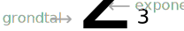

.. role:: python(code)
    :language: python

Berekeningen in de CLI
======================

Het woord 'computer' komt van het Latijnse *computare*, dat 'berekenen' betekent. Soms ook wordt een computer gekscherend een uit de kluiten gewassen rekenmachine genoemd. Het is vrijwel onmogelijk een computerprogramma te maken waarin níets wordt berekend. Daarom is het belangrijk dat je leert hoe rekenen in Python werkt.

.. dropdown:: Wat leer je in dit hoofdstuk
    :open:
    :color: primary
    :icon: book

    * Wat zijn de rekenkundige operatoren in Python.
    * Hoe voer je berekeningen uit in de CLI.

Optellen, aftrekken, vermenigvuldigen en delen
----------------------------------------------

In het dagelijks leven gebruiken we meestal de symbolen :math:`+`, :math:`-`, :math:`\times` en :math:`:` voor optellen, aftrekken, vermenigvuldigen en delen. In Python noemen we de symbolen voor berekeningen *operatoren* en ze wijken voor vermenigvuldigen en delen af van de symbolen die je gewend bent.

.. card:: Rekenkundige operatoren

    .. list-table::
        :header-rows: 1
        :align: center

        * - Berekening
          - Dagelijks leven
          - Python
        * - Optellen
          - :math:`+`
          - :math:`+`
        * - Aftrekken
          - :math:`-`
          - :math:`-`
        * - Vermenigvuldigen
          - :math:`\times`
          - :math:`*`
        * - Delen
          - :math:`:`
          - :math:`/`

Probeer de rekenkundige operatoren eens uit in de CLI. Voer bijvoorbeeld de volgende berekeningen in en druk telkens op :kbd:`Enter` om Python het antwoord te laten geven:

.. code-block:: python
    :class: no-copybutton
    
    >>> 15 + 49
    64
    >>> 1048 - 256
    792
    >>> 12 * 14
    168
    >>> 345 / 23
    15.0

Het antwoord op de deling :python:`345 / 23` wekt misschien enige verbazing. Waarom antwoordt Python hier :python:`15.0` en niet gewoon :python:`15`? Daar komen we later op terug in het hoofdstuk datatypes.

..
    TODO: verwijzing maken naar hoofdstuk datatypes.

.. dropdown:: Spaties
    :open:
    :color: info
    :icon: info

    Wellicht is je opgevallen dat in de voorbeelden spaties zijn gebruikt in de berekeningen: :python:`15 + 49` in plaats van :python:`15+49`. De reden hiervoor is betere leesbaarheid. Voor Python maakt het niet uit of je wel of geen spaties tussen de operator en de getallen typt.

Haakjes veranderen de rekenvolgorde
-----------------------------------

Door haakjes te gebruiken in berekeningen kun je de `standaard rekenvolgorde <https://nl.wikipedia.org/wiki/Bewerkingsvolgorde>`_ aanpassen. Kijk maar eens naar de volgende twee berekeningen:

.. code-block:: python
    :class: no-copybutton
    
    >>> 2 + 3 * 4
    14
    >>> (2 + 3) * 4
    20

In de berekening :python:`2 + 3 * 4` wordt volgens de standaard rekenvolgorde eerst de vermenigvuldiging :python:`3 * 4 = 12` uitgevoerd en daarna pas de optelling :python:`2 + 12 = 14`. In de berekening :python:`(2 + 3) * 4` geven de haakjes voorrang aan de optelling :python:`2 + 3 = 5` en wordt pas naarna vermenigvuldigd: :python:`5 * 4 = 20`.

Machtsverheffen
---------------

De vermenigvuldiging :math:`2\times2\times2` kun je korter schrijven als :math:`2^{3}`. Dit noemen we machtsverheffen: we verheffen :math:`2` tot de macht :math:`3`. Het getal :math:`2` heet in deze berekening het *grondtal* en het getal :math:`3` heet de *exponent*.

De exponent geeft aan hoe vaak je het grondtal met zichzelf vermenigvuldigt. Bijvoorbeeld de machtsverheffing :math:`3^{5}` betekent :math:`3\times3\times3\times3\times3`. Je spreekt de berekening uit als 'drie tot de macht vijf' of 'drie tot de vijfde (macht)'.

De Python operator voor machtsverheffen is :python:`**`. Best logisch als je bedenkt dat machtsverheffen neerkomt op herhaald vermenigvuldigen.

.. code-block:: python
    :class: no-copybutton

    >>> 2 ** 3
    8
    >>> 2 * 2 * 2
    8
    >>> 3 ** 5
    243
    >>> 3 * 3 * 3 * 3 * 3
    243

Delen met rest
--------------
Wanneer je in Python twee getallen deelt met de :python:`/` operator, is het resultaat een decimaal getal: een getal met een komma.

.. code-block:: python
    :class: no-copybutton

    >>> 345 / 23
    15.0
    >>> 345 / 12
    28.75

Op de basisschool heb je waarschijnlijk 'delen met rest' geleerd, bijvoorbeeld door een staartdeling te maken zoals hieronder.

De uitkomst van :math:`345:12` is volgens deze berekening :math:`28\text{ rest }9`. In Python heb je voor dit resultaat twee aparte operatoren nodig: :python:`//` en :python:`%`. Met de operator :python:`//` verkrijg je de *naar beneden afgeronde uitkomst* van de deling en met :python:`%` de rest van de deling.

.. code-block:: python
    :class: no-copybutton

    >>> 345 // 12
    28
    >>> 345 % 12
    9

Overzicht rekenkundige operatoren
---------------------------------
In dit hoofdstuk heb je de onderstaande rekenkundige operatoren leren kennen.

.. card:: Rekenkundige operatoren
    
    .. list-table::
        :header-rows: 1
        :align: center

        * - Operator
          - Naam
          - Voorbeeld
          - Uitkomst
        * - :python:`+`
          - Optellen (som)
          - :python:`7 + 3`
          - :python:`10`
        * - :python:`-`
          - Aftrekken (verschil)
          - :python:`7 - 3`
          - :python:`4`
        * - :python:`*`
          - Vermenigvuldigen (product)
          - :python:`7 * 3`
          - :python:`21`
        * - :python:`/`
          - Delen (quotiënt)
          - :python:`7 / 3`
          - :python:`2.3333333333333335`
        * - :python:`**`
          - Machtsverheffen
          - :python:`7 ** 3`
          - :python:`343`
        * - :python:`//`
          - Geheeltallige deling
          - :python:`7 // 3`
          - :python:`2`
        * - :python:`%`
          - Rest of modulus
          - :python:`7 % 3`
          - :python:`1`

Opdrachten
-----------

.. dropdown:: Opdracht 01
    :open:
    :color: secondary
    :icon: pencil

    Maak in de CLI de volgende berekeningen. Noteer je antwoorden op een kladblaadje (of gebruik bijvoorbeeld Windows Kladblok op je PC), zodat je ze later kunt nakijken.

    a. :math:`525 + 935`
    b. :math:`1024 - 32 \times 4`
    c. :math:`182 : (2 \times 13)`
    d. :math:`6^5 + 4^3`

.. dropdown:: Opdracht 02
    :open:
    :color: secondary
    :icon: pencil

    Bereken in de CLI welke rest je overhoudt als je :math:`999999` deelt door :math:`34`.

Antwoorden
-----------

.. dropdown:: Antwoord opdracht 01
    :color: secondary
    :icon: check-circle

    a. :math:`1460`
    b. :math:`896`
    c. :math:`7.0`
    d. :math:`7840`

.. dropdown:: Antwoord opdracht 02
    :color: secondary
    :icon: check-circle

    :math:`25`