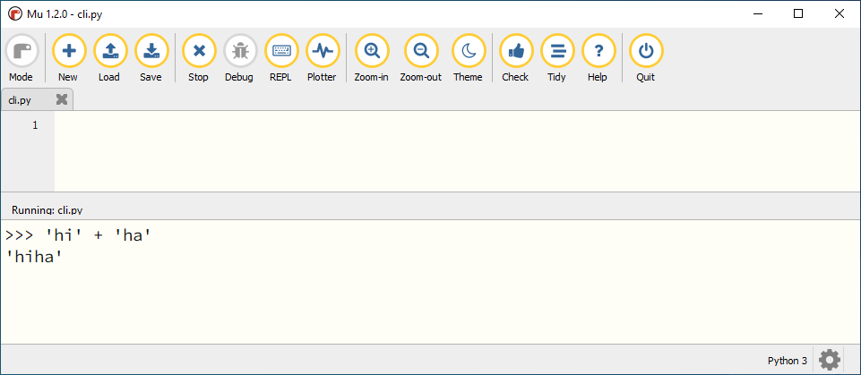
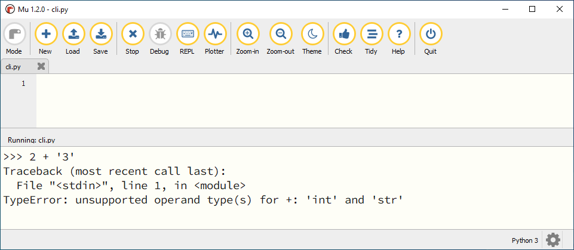
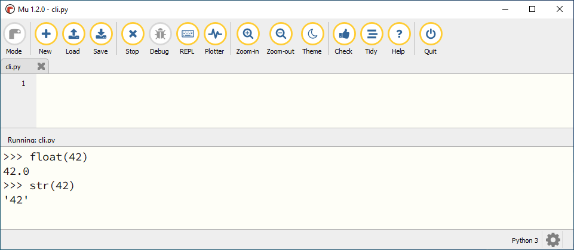

.. role:: python(code)
    :language: python

.. |br| raw:: html

    

Datatypes
======================

In het Nederlands heeft het woord *data* twee betekenissen:

1. Meervoud van datum. |br| 'Er zijn twee data geschikt voor het feestje.'
2. Gegevens, informatie. |br| 'De data wordt opgeslagen in de cloud.'

Bij computerprogrammeren gebruiken we data vrijwel altijd in de betekenis van *gegevens*, *informatie*. Voorbeelden van data waarmee computerprogramma's werken zijn:

* De nickname van een gebruiker.
* De positie van een figuurtje in een game.
* Het aantal seconden dat verstrijkt voordat een gebruiker een reclame kan wegklikken.
* De geboortedatum van een gebruiker.

Het laatste voorbeeld laat zien dat een datum ook data kan zijn. :far:`face-smile;sd-text-primary`

.. dropdown:: Wat leer je in dit hoofdstuk
    :open:
    :color: primary
    :icon: book

    * Wat bedoelen we met een *datatype*.
    * Welke datatypes voor getallen en tekst zijn er in Python.
    * Hoe kun je het datatype van een waarde opvragen in Python.
    * Hoe kun je een waarde van het ene datatype naar het andere datatype converteren met type casting.

Getallen en tekst
----------------------------------------------

Probeer het volgende eens uit in de CLI:

.. code-block:: python
  :class: no-copybutton

  >>> 2 + 3
  ...
  >>> '2' + '3'
  ...

Wat geeft Python als antwoord terug op deze berekeningen?

.. dropdown:: Resultaat - pas openen nadat je het zelf hebt geprobeerd
    :color: light
    
    .. image:: images/num_or_str_cli.png

Waarden die tussen aanhalingstekens staan, herkent Python als tekst. Aanhalingstekens kwam je eerder tegen in het Hello, World! programma:

.. code-block:: python

  print('Hello, World!')

In de code :python:`'2' + '3'` behandelt Python de waarden 2 en 3 dus niet als getallen, maar als tekst. En je zag dat het optellen van tekst een ander resultaat geeft dan het optellen van getallen; Python plakt de tekst aan elkaar:

Wat zou er gebeuren als je probeert een getalswaarde bij een tekstwaarde op te tellen, bijvoorbeeld :python:`2 + '3'` ? De beste manier om daar achter te komen is het gewoon te proberen:

Python geeft een foutmelding: ``TypeError: unsupported operand type(s) for +: 'int' and 'str'``. Omdat het *type* van de eerste waarde (getal) niet overeenkomt met het *type* van de tweede waarde (tekst), kan Python de optelling niet uitvoeren en meldt een *Type*\Error.

Integer, float en string
-------------------------
Met getallen kun je andere dingen doen dan met tekst. Getallen en tekst zijn twee verschillende soorten data. Zelfs getallen onderling kunnen van een verschillend type zijn. Met de functie :python:`type()` kun je in Python het *datatype* van een waarde opvragen. Typ de volgende regels maar eens in de CLI en bekijk het resultaat.

.. code-block:: python
  :class: no-copybutton

  >>> type(42)
  ...
  >>> type(42.0)
  ...
  >>> type('42')
  ...
  >>> type('42.0')
  ...

.. dropdown:: Resultaat - pas openen nadat je het zelf hebt geprobeerd
    :color: light
    
    .. image:: images/type_function.png

Python kan werken met een grote verscheidenheid aan datatypes, maar vooralsnog beschouwen we de volgende drie:

.. card::

    .. list-table::
        :header-rows: 1
        :align: center

        * - Datatype
          - Naam
          - Waarde
        * - int
          - integer
          - geheel getal
        * - float
          - floating point number
          - getal met decimalen
        * - str
          - string
          - tekst

Je ziet dat Python twee soorten getallen onderscheidt: gehele getallen en kommagetallen. De eerste heten in Python *integers* en de laatste *floats*. En je hebt vast al opgemerkt dat je kommagetallen in Python niet met een komma schrijft, maar met een punt: :python:`42.0`.

Type casting
-------------

Helaas is de data waarmee een computerprogramma moet werken niet altijd meteen van het juiste type. Soms ontvangt je code (van de gebruiker of vanuit andere code) een stringwaarde terwijl je een integer nodig hebt. Of er komt een float binnen terwijl je juist een string had willen hebben. In dat geval is het handig als je de waarde kunt converteren naar een ander datatype. Dat noemen we *type casting*. 

Voor de datatypes :python:`int`, :python:`float` en :python:`str` heeft Python de type casting functies :python:`int()`, :python:`float()` en :python:`str()`.

In bovenstaand voorbeeld zie je dat :python:`float(42)` de floating point versie teruggeeft van de integer :python:`42`. Net zo geeft :python:`str(42)` de string :python:`'42'` terug.

Opdrachten
-----------

.. dropdown:: Opdracht 01
    :open:
    :color: secondary
    :icon: pencil

    Probeer het resultaat te voorspellen van de volgende :python:`type()` aanroepen, en check vervolgens je voorspelling in de CLI. 

    a. :python:`type('Hello, World!')` 
    b. :python:`type(12345)`
    c. :python:`type(3.1415927)`
    d. :python:`type('1.618')` 

.. dropdown:: Opdracht 02
    :open:
    :color: secondary
    :icon: pencil

    In plaats van één waarde, kun je tussen de haakjes bij :python:`type()` ook een berekening typen. Bijvoorbeeld :python:`type(2 + 3)`. Python geeft dan het datatype van het *resultaat* van de berekening.

    Probeer te voorspellen hoe Python reageert op de volgende :python:`type()` aanroepen, en check vervolgens je voorspelling in de CLI. Kun je de verschillen verklaren tussen de resulterende datatypen van de vijf berekeningen?

    a. :python:`type(12 + 3)` 
    b. :python:`type(12 + 3.0)`
    c. :python:`type(12 * 3)`
    d. :python:`type(12 / 3)`
    e. :python:`type(12 // 3)`

.. dropdown:: Opdracht 03
    :open:
    :color: secondary
    :icon: pencil

    Type casting werkt alleen als Python de ingevoerde waarde logisch kan omzetten naar een ander datatype. Wanneer dat niet kan, krijg je een foutmelding. Probeer in de CLI de onderstaande type casts uit te voeren en bedenk van tevoren of het zal werken.

    a. de float :python:`42.0` naar een integer. 
    b. de float :python:`42.0` naar een string.
    c. de string :python:`'42.0'` naar een float.
    d. de string :python:`'42.0'` naar een integer.
    e. de string :python:`'42'` naar een float.
    f. de string :python:`'42'` naar een integer.
    g. de string :python:`'Hello, World!'` naar een integer.
    h. de string :python:`'Hello, World!'` naar een float.

Antwoorden
-----------

.. dropdown:: Antwoord opdracht 01
    :color: secondary
    :icon: check-circle

    a. string (``<class 'str'>``)
    b. integer (``<class 'int'>``)
    c. float (``<class 'float'>``)
    d. string (``<class 'str'>``)

.. dropdown:: Antwoord opdracht 02
    :color: secondary
    :icon: check-circle

    a. integer (``<class 'int'>``)
    b. float (``<class 'float'>``)
    c. integer (``<class 'int'>``)
    d. float (``<class 'float'>``)
    e. integer (``<class 'int'>``)

.. dropdown:: Antwoord opdracht 03
    :color: secondary
    :icon: check-circle

    a. :python:`int(42.0)` levert :python:`42`  
    b. :python:`str(42.0)` levert :python:`'42.0'`
    c. :python:`float('42.0')` levert :python:`42.0`
    d. :python:`int('42.0')` levert :python:`ValueError`
    e. :python:`float('42')` levert :python:`42.0`  
    f. :python:`int('42')` levert :python:`42`
    g. :python:`int('Hello, World!')` levert :python:`ValueError`
    h. :python:`float('Hello, World!')` levert :python:`ValueError`