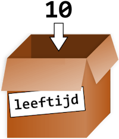

.. role:: python(code)
    :language: python

.. |br| raw:: html

    

Variabelen
======================

Stel je de volgende situatie eens voor:

.. card:: Zakgeld
    :class-card: bgcolor-khaki

    De opa en oma van Alan hebben acht kleinkinderen en geven aan elk van hen wekelijks een zakcentje. Omdat ze aan de oudere kleinkinderen meer zakgeld willen geven dan de jongere, hebben ze het volgende systeem bedacht: 
    
    .. card::
      :class-card: bgcolor-white

      Elk kleinkind krijgt 1 euro en daarbij per levensjaar nog 50 cent.

    Alan is 10 jaar oud en hij krijgt van opa en oma dus €1,00 + 10 :math:`\times` €0,50 = €6,00.

Alans opa en oma moeten voor dit systeem acht keer dezelfde berekening maken, telkens met een andere leeftijd. Dat is nog wel te doen, maar stel dat opa en oma vijftig kleinkinderen hadden? Of dat de berekening veel ingewikkelder zou zijn? Dan zouden opa en oma beter een computerprogramma gebruiken, want daarin kun je met variabelen werken!

In de zakgeldberekening zijn de waarden €1,00 en €0,50 constanten; ze veranderen niet. De waarde die *variabel* is, is de leeftijd. Voor de berekening van het zakgeld, kun je een formule gebruiken met de variabele :python:`leeftijd`:

.. code-block:: python
  :class: no-copybutton

    1.00 + leeftijd * 0.50

Nu hoeven opa en oma slechts voor elk kleinkind de waarde van :python:`leeftijd` in te vullen en het computerprogramma voert de berekening uit.

.. dropdown:: Wat leer je in dit hoofdstuk
    :open:
    :color: primary
    :icon: book

    * Wat bedoelen we met een *variabele*.
    * Hoe maak je in Python een variabele.
    * Hoe geef je in Python een variabele een waarde.
    * Wat is een *assignment statement*.
    * Waar moet je op letten bij het bedenken van een naam voor een variabele.
    * Wat is het verschil tussen een *constante* en een variabele.
    * Hoe kun je met de assignment operatoren +=, -=, \*= en /= snel de waarde van een variabele veranderen.

Enkele teksten en voorbeelden in dit hoofdstuk zijn afkomstig uit of geïnspireerd op het boek *De programmeursleerling*, geschreven door Pieter Spronck. Dit is een gratis boek dat je `hier kunt downloaden <https://www.spronck.net/pythonbook/dutchindex.xhtml>`_

Waarden opslaan
---------------
Na het bovenstaande zakgeldvoorbeeld zou je kunnen denken dat een variabele een woord is dat een getal vervangt in een berekening. Een variabele is echter meer dan dat. Het is een plek in het geheugen van de computer die je een naam kunt geven en waarin je een waarde kunt opslaan. Die waarde kan een getal zijn, maar ook tekst of iets anders. Vaak wordt een variabele vergeleken met een doosje, voorzien van een label dat aangeeft wat er in zit.

   In een variabele kun je een waarde opslaan

Om in Python een waarde op te slaan in een variabele gebruik je een *assignment statement*. Assignment betekent toekenning: je kent een waarde toe aan de variabele. Python gebruikt hiervoor de assignment operator :python:`=`.

.. code-block:: python
    :class: no-copybutton
    
    >>> leeftijd = 10

Met deze ene regel code bewerkstellig je drie dingen:

1. Er wordt een plek in het geheugen gereserveerd.
2. De plek in het geheugen krijgt de naam :python:`leeftijd`.
3. Op de plek in het geheugen wordt de waarde :python:`10` opgeslagen.

Vervolgens kun je de variabele gebruiken in berekeningen. Wanneer je in de CLI de naam van de variabele typt en op :kbd:`Enter` drukt, toont Python de waarde.

.. code-block:: python
    :class: no-copybutton
    
    >>> leeftijd = 10
    >>> leeftijd
    10
    >>> leeftijd + 2
    12

Je kunt in een variabele slechts één waarde tegelijkertijd opslaan. Wanneer je een nieuwe waarde in een variabele opslaat, wordt de oude weggegooid.

.. code-block:: python
    :class: no-copybutton

    >>> leeftijd = 10
    >>> leeftijd
    10
    >>> leeftijd = 3
    >>> leeftijd
    3

De uitkomst van een berekening kun je natuurlijk ook opslaan in een variabele, zoals hieronder getoond.

.. code-block:: python
    :class: no-copybutton

    >>> leeftijd = 10
    >>> zakgeld = 1 + leeftijd * 0.5
    >>> zakgeld
    6.0
    >>> leeftijd = 3
    >>> zakgeld
    6.0

Deze code berekent het zakgeldbedrag en slaat het resultaat op in de variabele :python:`zakgeld`. Vervolgens krijgt de variabele :python:`leeftijd` de waarde :python:`3`, maar de waarde van :python:`zakgeld` blijft ongewijzigd; er is immers geen nieuwe waarde aan toegekend. Om dat te verhelpen, zou je het volgende moeten doen:

.. code-block:: python
    :class: no-copybutton

    >>> leeftijd = 10
    >>> zakgeld = 1 + leeftijd * 0.5
    >>> zakgeld
    6.0
    >>> leeftijd = 3
    >>> zakgeld = 1 + leeftijd * 0.5
    >>> zakgeld
    2.5

.. dropdown:: Tip: terug in je geschiedenis in de CLI
    :open:
    :color: info
    :icon: info

    In Mu editor kun je in de CLI met de toets :kbd:`⇧` (pijltje omhoog) terug in je geschiedenis. Met de toets :kbd:`⇩` (pijltje omlaag) ga je weer vooruit in je geschiedenis. Dit is handig bij het bovenstaande voorbeeld, want daardoor hoef je niet twee keer hetzelfde te typen.

Naamgeving
----------
Een goede variabelenaam beschrijft de data die de variabele bevat. Stel je voor dat je gaat verhuizen en op alle verhuisdozen het etiket 'Spullen' plakt. Je zou niks meer kunnen terugvinden! In Python mag je je variabelen vrijwel elke naam geven die je maar wilt, zolang hij voldoet aan de volgende regels:

* De naam mag enkel letters, cijfers en het underscore karakter :python:`_` bevatten. Spaties zijn dus niet toegestaan.
* De naam mag niet met een cijfer beginnen.
* De naam mag geen *gereserveerd woord* zijn.

Gereserveerde woorden (*keywords*) hebben al een betekenis in Python en daarom kun je ze niet als variabelenaam gebruiken. Met het commando :python:`help('keywords')` kun je in de CLI de lijst van keywords opvragen:

.. code-block:: python
    :class: no-copybutton

    >>> help('keywords')
    Here is a list of the Python keywords.  Enter any keyword to get more help.

    False               class               from                or
    None                continue            global              pass
    True                def                 if                  raise
    and                 del                 import              return
    as                  elif                in                  try
    assert              else                is                  while
    async               except              lambda              with
    await               finally             nonlocal            yield
    break               for                 not              

Hieronder zie je enkele voorbeelden van geldige en ongeldige variabelenamen.

.. list-table::
    :header-rows: 1
    :align: center

    * - Geldige variabelenaam 
      - Ongeldige variabelenaam
    * - :python:`favoriete_kleur`
      - :python:`favoriete-kleur` (streepjes mogen niet)
    * - :python:`favorieteKleur`
      - :python:`favoriete kleur` (spaties mogen niet)
    * - :python:`speler2` 
      - :python:`2speler` (geen cijfer aan het begin)
    * - :python:`_42` 
      - :python:`42` (geen cijfer aan het begin)
    * - :python:`TOTALE_SOM`
      - :python:`TOTALE_$OM` (speciale karakters als $ mogen niet)
    * - :python:`hoi`
      - :python:`'hoi'` (speciale karakters als ' mogen niet)
    * - :python:`password` 
      - :python:`pass` (keywords mogen niet)

Variabelenamen zijn hoofdlettergevoelig (*case-sensitive*), wat betekent dat :python:`spam`, :python:`SPAM`, :python:`Spam` en :python:`sPaM` vier verschillende variabelen zijn. Hoewel :python:`Spam` een geldige variabelenaam is, is het gebruikelijk in Python voor variabelenamen uitsluitend kleine letters te gebruiken. De `stijlgids voor Python code <https://peps.python.org/pep-0008/#function-and-variable-names>`_ schrijft voor:

.. card:: PEP 8 - Style Guide for Python Code
    :class-card: bgcolor-lightgray

    Variable names should be lowercase, with words separated by underscores as necessary to improve readability.

Dus gebruik liever :python:`aantal_appels` dan :python:`aantalAppels` als variabelenaam.

Richtlijnen
^^^^^^^^^^^^^^
Uiteraard dien je je aan de regels voor variabelenamen te houden, anders werkt je programma niet. Maar daarnaast is het goed om de volgende richtlijnen in acht te nemen wanneer je een naam bedenkt voor een variabele:

* Gebruik nooit een naam die ook de naam is van een functie. Je hebt al kennisgemaakt met de functie :python:`print()`. Wanneer je een variabele de naam :python:`print` geeft, is dat vragen om problemen.
* Probeer een variabelenaam te kiezen die aangeeft wat je in de variabele gaat opslaan. Bijvoorbeeld een variabele die het aantal levens van de speler van een game bijhoudt, zou de naam :python:`aantal_levens` kunnen hebben, en beter niet :python:`de_zon_schijnt`. |br| Een uitzondering hierop zijn de namen voor *wegwerp variabelen*: variabelen die slechts even gebruikt worden voor een klein stukje code en van zichzelf eigenlijk geen betekenis hebben. Daarvoor gebruiken we vaak namen van 1 letter zoals :python:`i` of :python:`j`.

Door je te houden aan deze richtlijnen wordt je code beter leesbaar. Kijk maar eens naar de volgende code:

.. code-block:: python

    a = 3.14159265
    b = 4
    c = 9
    d = a * b**2 * c / 3
    print(d)

Snap je wat deze code doet? Waarschijnlijk zie je wel dat in de variabele :python:`a` een benadering van het getal :math:`\pi` (pi) is opgeslagen, maar wat stelt :python:`d` voor?

De code berekent de inhoud (het volume) van een kegel. De wiskundige formule die daarbij hoort is:

.. grid:: 2

    .. grid-item::
        :columns: 8
        :child-align: center

        .. math::
            Inhoud = \frac{\pi \times straal^{2} \times hoogte}{3}

    .. grid-item::
        :columns: 4
        :child-align: center

        .. figure:: images/cone.png
            :scale: 40%

Bekijk nu eens de volgende code:

.. code-block:: python
    
    PI = 3.14159265
    straal = 4
    hoogte = 9
    inhoud_van_kegel = pi * straal**2 * hoogte / 3
    print(inhoud_van_kegel)

Dit is een stuk leesbaarder, nietwaar? Probeer in je code dus altijd betekenisvolle namen te gebruiken.

.. dropdown:: spam, eggs en bacon
    :open:
    :color: info
    :icon: info

    In boeken over Python en zelfs in de officiële documentatie kom je regelmatig de variabelenamen :python:`spam`, :python:`eggs` en :python:`bacon` tegen. Die namen zijn afkomstig uit een sketch van de beroemde Engelse komediegroep `Monty Python <https://nl.wikipedia.org/wiki/Monty_Python>`_ waaraan de programmeertaal haar naam dankt. Monty Python's Flying Circus was een favoriet televisieprogramma van Guido van Rossum, de Nederlandse bedenker van Python (`bron <https://docs.python.org/3/faq/general.html#why-is-it-called-python>`_).

    Voor code waarin de variabelen geen speciale betekenis hebben, kun je dit soort namen prima gebruiken, maar voor een variabele die wél een betekenis heeft, is een beschrijvende naam beter.

Constanten
^^^^^^^^^^^^
Meestal veranderen de waarden van variabelen gedurende de uitvoering van je programma. Bijvoorbeeld een variabele :python:`aantal_levens` kan bij aanvang van een game de waarde :python:`5` krijgen en tijdens het spelen teruglopen naar :python:`0` (game over). 
Een *constante* is een variabele die slechts één keer een waarde krijgt en daarna niet meer verandert. Het is gebruikelijk om de namen van constanten met hoofdletters te schrijven.

.. code-block:: python
    :linenos:

    ZWAARTEKRACHT = 0.1
    valsnelheid = 2
    print(valsnelheid)
    valsnelheid = valsnelheid + ZWAARTEKRACHT
    print(valsnelheid)

In de code hierboven zie je dat op regel 1 de constante :python:`ZWAARTEKRACHT` wordt gemaakt en op regel 2 de variabele :python:`valsnelheid`. Zwaartekracht is typisch een waarde die niet verandert (tenzij je naar een andere planeet gaat), terwijl valsnelheid juist heel veranderlijk is. Op regel 4 zie je dat :python:`valsnelheid` de waarde krijgt van de oude valsnelheid vermeerderd met de zwaartekracht.

Verkorte operatoren
--------------------
Bij programmeren komt het vaak voor dat je de waarde van een variabele met 1 wilt verhogen of verlagen. Je zou dat als volgt kunnen doen:

.. code-block:: python

    spam = 6
    spam = spam + 1
    print(spam)

Omdat deze situatie zo vaak voorkomt, kent Python een aantal *verkorte notaties* om de inhoud van een variabele aan te passen. De volgende code doet hetzelfde als de code hierboven:

.. code-block:: python

    spam = 6
    spam += 1
    print(spam)

Zie je het verschil in de tweede regel? Wanneer je iets wilt optellen bij een variabele kun je :python:`+=` gebruiken als *assignment operator*, met de variabele aan de linkerkant en wat je erbij op wilt tellen aan de rechterkant. Net zo kun je voor aftrekken, vermenigvuldigen en delen de operators :python:`-=`, :python:`*=` en :python:`/=` gebruiken.

.. code-block:: python

    aantal_bananen = 100
    aantal_bananen += 12
    aantal_bananen -= 13
    aantal_bananen *= 19
    aantal_bananen /= aantal_bananen
    print(aantal_bananen)

Opdrachten
-----------

.. dropdown:: Opdracht 01
    :open:
    :color: secondary
    :icon: pencil

    Maak in Mu editor een nieuw codebestand aan met de :guilabel:`New` knop. Sla het bestand met de :guilabel:`Save` knop op in je huiswerkmap als :file:`rekenen_met_variabelen.py`. |br| Kopieer onderstaande code naar het bestand.

    .. code-block:: python
        :caption: rekenen_met_variabelen.py 
        :linenos:

        # Variabelen - opdracht 01
        
        
        som = getal1 + getal2
        print(som)

    Wanneer je deze code runt, krijg je een foutmelding:

    .. figure:: images/name_error.png

    Deze code werkt nog niet doordat de variabelen :python:`getal1` en :python:`getal2` die in regel ``4`` worden gebruikt nog niet zijn gemaakt; ze bestaan nog niet. Python geeft dat aan met ``NameError: name 'getal1' is not defined``. Los dit als volgt op:

    * Schrijf op regel ``2`` een assignment statement waarmee je de variabele :python:`getal1` maakt en de waarde :python:`15` geeft.
    * Schrijf op regel ``3`` een assignment statement waarmee je de variabele :python:`getal2` maakt en de waarde :python:`10` geeft.

    Run de code. Als je het goed hebt gedaan, wordt de uitkomst ``25`` getoond:

    .. figure:: images/rekenen_met_variabelen.png

.. dropdown:: Opdracht 02
    :open:
    :color: secondary
    :icon: pencil

    Maak deze opdracht pas nadat je opdracht 01 hebt volbracht. Breid je code :file:`rekenen_met_variabelen.py` uit met de variabelen :python:`verschil`, :python:`product` en :python:`quotient` waarin je respectievelijk het verschil (aftrekking), het product (vermenigvuldiging) en het quotiënt (deling) van :python:`getal1` en :python:`getal2` opslaat. Toon de waarden van deze nieuwe variabelen als volgt met :python:`print()` aanroepen:
    

    .. code-block:: python
        :caption: rekenen_met_variabelen.py 
        :linenos:

        # Variabelen - opdracht 01 en 02
        
        
        som = getal1 + getal2

        print(som)
        print(verschil)
        print(product)
        print(quotient)

    Op de regels ``5``, ``6`` en ``7`` schrijf je dus assignment statements voor de variabelen :python:`verschil`, :python:`product` en :python:`quotient`.

.. dropdown:: Opdracht 03
    :open:
    :color: secondary
    :icon: pencil

    De oppervlakte van een rechthoek kun je berekenen met de formule

    .. centered:: :math:`oppervlakte = lengte \times breedte`

    .. image:: images/rectangle_transparent.png
        :align: center

    Maak in Mu editor een nieuw codebestand aan en sla het op onder de naam :file:`oppervlakte.py`. Schrijf hierin de volgende code:

    * Een commentaarregel met de tekst ``Variabelen - opdracht 03``
    * Twee assignment statements om de variabelen :python:`lengte` en :python:`breedte` te maken. Je mag zelf waarden kiezen voor deze variabelen.
    * Een assignment statement om de variabele :python:`oppervlakte` te maken. Gebruik bovenstaande formule om deze variabele de juiste waarde te geven.
    * Een :python:`print()` aanroep om de waarde van :python:`oppervlakte` te tonen.

    Run je code om te testen of hij naar behoren werkt.

.. dropdown:: Opdracht 04
    :open:
    :color: secondary
    :icon: pencil

    Maak in Mu editor een nieuw codebestand aan en sla het op onder de naam :file:`gemiddelde.py`. Schrijf hierin de volgende code:

    * Een commentaarregel met de tekst ``Variabelen - opdracht 04``
    * Definieer drie variabelen :python:`getal1`, :python:`getal2` en :python:`getal3` en geef ze willekeurige integer waarden.
    * Bereken het gemiddelde van de drie getallen en stop het in de variabele :python:`gemiddelde`.
    * Toon het gemiddelde.
    * Voeg bij elk van de drie voorgaande punten een commentaarregel toe waarin je uitlegt wat de bijbehorende code doet.

.. dropdown:: Opdracht 05
    :open:
    :color: secondary
    :icon: pencil

    Arthur wil de waarden van twee variabelen verwisselen: variabele :python:`a` moet de waarde krijgen van variabele :python:`b` en :python:`b` de waarde van :python:`a`. Hij probeert het volgende:

    .. code-block:: python
        :caption: wisseltruc.py
        :linenos:

        # Variabelen - opdracht 05

        a = 42
        b = 63
        print("De beginwaarden van de variabelen zijn:")
        print("a = " + str(a) + " en b = " + str(b))
        a = b
        b = a
        print("Nu zijn de waarden verwisseld:")
        print("a = " + str(a) + " en b = " + str(b))
  
    Wanneer hij deze code uitvoert, blijkt het resultaat niet te kloppen! Kun jij de code verbeteren?

    Maak in Mu editor een nieuw codebestand aan en sla het op onder de naam :file:`wisseltruc.py`. Kopieer Arthurs code naar je bestand en klik op :guilabel:`Run` om te controleren dat Arthurs code inderdaad niet goed werkt. Probeer het probleem op te lossen.

    .. dropdown:: Hint
        :color: secondary
        :icon: light-bulb

        Het probleem zit in regel 6. Wanneer je variabele :python:`a` de waarde van variabele :python:`b` geeft, verdwijnt de oude waarde van :python:`a`! Je kunt dit oplossen door een extra *dummy variabele* te maken, waarin je de oude waarde van :python:`a` even bewaart.

    .. dropdown:: toelichting bij regels 6 en 10
        :color: info
        :icon: info

        In de regels 6 en 10 worden de waarden van :python:`a` en :python:`b` getoond met de regel

        .. code-block:: python

            print("a = " + str(a) + " en b = " + str(b))

        In het hoofdstuk :doc:`/ch02_datatypes/ch02_01_datatypes` heb je gezien dat :python:`str(a)` van de integer :python:`42` de string :python:`'42'` maakt. Dat noemden we *type casting*. Het is hier nodig om de waarden van de variabelen te kunnen vastplakken aan de twee stringwaarden :python:`"a = "` en :python:`"b = "`  
