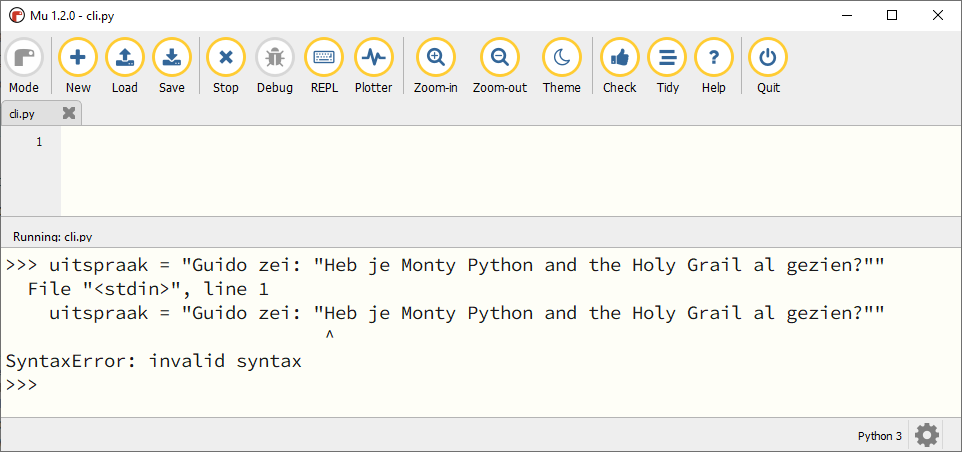

.. role:: python(code)
    :language: python

.. |br| raw:: html

    

Strings
=======

In het hoofdstuk :doc:`/ch02_datatypes/ch02_01_datatypes` maakte je kennis met de datatypes :python:`int`, :python:`float` en :python:`string`. Daarna leerde je in het hoofdstuk :doc:`/ch03_variables/ch03_01_variables` hoe je getallen kunt opslaan in variabelen en er vervolgens mee rekenen. Je kunt in variabelen ook stringwaarden (oftewel tekst) opslaan. Letterlijk vertaald betekent *string*: *sliert* van tekens, of ook wel *tekenreeks*.

.. dropdown:: Wat leer je in dit hoofdstuk
    :open:
    :color: primary
    :icon: book

    * Hoe ga je om met aanhalingstekens in een string.
    * Hoe kun je escaping gebruiken in een string.
    * Hoe maak je een meerregelige string.
    * Hoe plak je strings aan elkaar (concatenatie).
    * Hoe herhaal je een string (repetitie).

Aanhalingstekens
----------------

In Python maak je een string door aanhalingstekens (:python:`'`) om de tekst te zetten:

.. code-block:: python
    :class: no-copybutton
    
    >>> begroeting = 'Hartelijk welkom'
    >>> begroeting
    'Hartelijk welkom' 

Dubbele aanhalingstekens (:python:`"`) mogen ook:

.. code-block:: python
    :class: no-copybutton
    
    >>> begroeting = "Hartelijk welkom"
    >>> begroeting
    'Hartelijk welkom'

Je ziet dat Python de dubbele aanhalingstekens hier zelf vervangt door enkele. Maar let op, je mag de enkele en dubbele aanhalingstekens niet mixen:

.. code-block:: python
    :class: no-copybutton
    
    >>> begroeting = 'Hartelijk welkom"
    SyntaxError: EOL while scanning string literal
    >>> begroeting = "Hartelijk welkom'
    SyntaxError: EOL while scanning string literal

Wanneer je een string *begint* met een enkel aanhalingsteken, verwacht Python dat de string ook *eindigt* met een enkel aanhalingsteken, en hetzelfde geldt voor dubbele aanhalingstekens.

Soms wil je *binnen* een string ook aanhalingstekens gebruiken. Bijvoorbeeld als je de volgende tekst in een variabele wilt opslaan:

``Guido zei: "Heb je Monty Python and the Holy Grail al gezien?"``

Deze tekst bevat dubbele aanhalingstekens. Wanneer je de string ook zou beginnen en eindigen met dubbele aanhalingstekens raakt Python in de war:

Bij de aanhalingstekens voor het woordje ``Heb`` denkt Python dat de string afgelopen is, maar vervolgens ziet het dat er tóch nog tekst volgt. Dat is tegen de taalregels van Python en daarom krijg je een ``Syntaxerror: invalid syntax`` melding.

Je kunt het probleem eenvoudig oplossen door de string te beginnen en eindigen met enkele aanhalingstekens. En wanneer je enkele aanhalingstekens in je tekst wilt gebruiken, dan begin en eindig je juist met dubbele aanhalingstekens:

.. code-block:: python
    :class: no-copybutton
    
    >>> uitspraak = 'Guido zei: "Heb je Monty Python and the Holy Grail al gezien?"'
    >>> uitspraak
    'Guido zei: "Heb je Monty Python and the Holy Grail al gezien?"'
    >>> filmtitel = "Monty Python's Life of Brian"
    >>> filmtitel
    "Monty Python's Life of Brian"

Het gaat echter mis wanneer je binnen een string zowel enkele als dubbele aanhalingstekens wilt gebruiken:

.. code-block:: python
    :class: no-copybutton
    
    >>> uitspraak = 'Guido zei: "Heb je Monty Python's Life of Brian al gezien?"'
    SyntaxError: invalid syntax

Python ziet dat de string begint met een enkel aanhalingsteken en denkt daardoor dat de string eindigt bij het enkele aanhalingsteken in :python:`Python's`. Dit probleem kun je op twee manieren oplossen: met *escaping* of met *multiline* strings.

Escaping
^^^^^^^^

Je kunt aan de manier waarop Python aanhalingstekens interpreteert *ontsnappen* door backslashes (:python:`\\`) te plaatsen voor de aanhalingstekens binnen de string. Python zal dan deze aanhalingsteken niet zien als het begin of einde van een string. Om het effect hiervan goed te zien, gebruik je de :python:`print()` functie. In onderstaand voorbeeld zie je dat :python:`print()` de tekst precies weergeeft zoals we willen, terwijl het commando :python:`uitspraak` de waarde van de variabele toont waarin de buitenste aanhalingstekens en de backslash nog zichtbaar zijn.

.. code-block:: python
    :class: no-copybutton
    
    >>> uitspraak = 'Guido zei: "Heb je Monty Python\'s Life of Brian al gezien?"'
    >>> uitspraak
    'Guido zei: "Heb je Monty Python\'s Life of Brian al gezien?"'
    >>> print(uitspraak)
    Guido zei: "Heb je Monty Python's Life of Brian al gezien?"

Multiline strings
^^^^^^^^^^^^^^^^^

Een multiline string is een string die begint en eindigt met drie enkele aanhalingstekens (:python:`'''`). Binnen zo'n string kun je naar hartelust andere aanhalingstekens gebruiken, zolang het maar niet drie enkele aanhalingstekens zijn.

.. code-block:: python
    :class: no-copybutton
    
    >>> uitspraak = '''Guido zei: "Heb je Monty Python's Life of Brian al gezien?"'''
    >>> uitspraak
    'Guido zei: "Heb je Monty Python\'s Life of Brian al gezien?"'
    >>> print(uitspraak)
    Guido zei: "Heb je Monty Python's Life of Brian al gezien?"

Je ziet dat het effect hetzelfde is al bij escaping. Sterker nog, Python heeft nu zelf een backslash in de string geplaatst om het aanhalingsteken te escapen!

Multiline betekent meerregelig, en een multiline string kan dus ook meerdere regels beslaan:

.. code-block:: python
    :class: no-copybutton
    
    >>> regels = '''Dit is de eerste regel.
    ... Dit is de tweede regel.
    ... Dit is de derde regel.'''
    >>> regels
    'Dit is de eerste regel.\nDit is de tweede regel.\nDit is de derde regel.'
    >>> print(regels)
    Dit is de eerste regel.
    Dit is de tweede regel.
    Dit is de derde regel.

.. dropdown:: Escape karakters
    :open:
    :color: info
    :icon: info

    Het escape karakter :python:`\\n` is het *new line* karakter, waardoor Python het vervolg van de string op een nieuwe regel afdrukt. Er zijn meer van dit soort escape karakters, bijvoorbeeld :python:`\\t`, waarmee je een *tab* kunt invoegen. Tabs worden vaak gebruikt om tekst mooi recht onder elkaar uit te lijnen.

Rekenen met strings
-------------------

Met getallen kun je rekenen, maar kan het ook met tekst? Niet echt, maar in Python kun je wel de operators :python:`+` en :python:`*` toepassen op strings. Met de eerste voeg je strings samen en met de tweede kun je strings herhalen.

Concatenatie
^^^^^^^^^^^^

Het aan elkaar plakken van twee strings wordt door programmeurs *concatenatie*  genoemd. Een moeilijk woord voor een eenvoudige bewerking, zie de voorbeelden hieronder.

.. code-block:: python
    :class: no-copybutton
    
    >>> 'Hallo' + 'Python'
    'HalloPython'
    >>> voornaam = 'John'
    >>> achternaam = 'Cleese'
    >>> print(voornaam + ' ' + achternaam)
    John Cleese

Wanneer je een integer of een float aan een string wilt plakken, moet je eerst naar een string *typecasten* met de functie :python:`str()`:

.. code-block:: python
    :class: no-copybutton
    
    >>> straat = 'Beekvlietstraat'
    >>> huisnummer = 4
    >>> print(straat + ' ' + str(huisnummer))
    Beekvlietstraat 4
    >>> temperatuur = 37.2
    >>> print('Uw temperatuur is ' + str(temperatuur) + ' graden.')
    Uw temperatuur is 37.2 graden.

Repetitie
^^^^^^^^^

Om een string een aantal keren te herhalen (repeteren), gebruik je de :python:`*` operator, zie de voorbeelden hieronder.

.. code-block:: python
    :class: no-copybutton
    
    >>> 2 * 'bla'
    'blabla'
    >>> antwoord = 'ni'
    >>> print(5 * antwoord)
    ninininini

Opdrachten
-----------

.. dropdown:: Opdracht 01
    :open:
    :color: secondary
    :icon: pencil

    Maak in Mu editor een nieuw codebestand en sla het op onder de naam :file:`foute_strings.py`. Kopieer de onderstaande code naar het bestand:

    .. code-block::
      :linenos:
      :caption: foute_strings.py

      # Strings - opdracht 01

      print('Goedemorgen allemaal!)
      print("Het is nog vroeg."
      print("Kunt u mij de weg naar Hamelen vertellen meneer?')
      print('De opa's reden in oude auto's')
      print(""Wie dit leest is gek", stond op het briefje.")
      print('Opa vroeg: "Wie van de oma's vind je het eigenaardigst?"')
      print('De geheime code is ' + 112358)

    Elk van de regels 3 t/m 9 bevat een of meerdere fouten. Verbeter deze fouten, opdat de teksten goed worden getoond.

.. dropdown:: Opdracht 02
    :open:
    :color: secondary
    :icon: pencil

    Maak in Mu editor een nieuw codebestand en sla het op als :file:`concatenatie.py`. Kopieer de onderstaande code naar het bestand:

    .. code-block::
      :linenos:
      :caption: concatenatie.py

      # Strings - opdracht 02

      naam = "Galahad"
      leeftijd = 10
      favoriete_eten = "gehaktbrood"

      voorsteltekst = ...
      print(voorsteltekst)

    Gebruik de variabelen :python:`naam`, :python:`leeftijd` en :python:`favoriete_eten` om op regel 7 de variabele :python:`voorsteltekst` een waarde te geven, zodanig dat het programma exact (!) de volgende tekst toont:

    ``Hallo! Mijn naam is Galahad. Ik ben 10 jaar oud en mijn favoriete eten is gehaktbrood.``

    Extra uitdaging: gebruik een escape karakter om ervoor te zorgen dat de derde zin van de tekst op een nieuwe regel begint:

    ``Hallo! Mijn naam is Galahad.`` |br| ``Ik ben 10 jaar oud en mijn favoriete eten is gehaktbrood.``