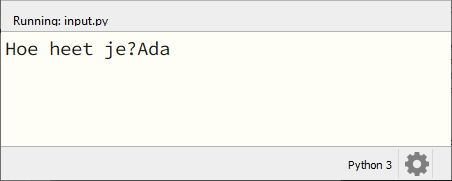
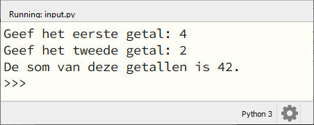

.. role:: python(code)
    :language: python

.. |br| raw:: html

    

Input van de gebruiker
=======================

In de voorgaande hoofdstukken hebben we veelvuldig gebruik gemaakt van de functie :python:`print()` om tekst op het scherm te tonen. Het wordt een stuk interessanter wanneer je de gebruiker de mogelijkheid geeft om zelf tekst te typen, waarmee het programma vervolgens iets doet. Op die manier maak je je programma *interactief*. 

.. dropdown:: Wat leer je in dit hoofdstuk
    :open:
    :color: primary
    :icon: book

    * Hoe laat je met de functie :python:`input()` de gebruiker iets typen.
    * Hoe geef je de vraagtekst mee aan de functie :python:`input()`.
    * Waarom heb je soms typecasting nodig bij deze functie.

De functie :python:`input()` 
-----------------------------

De werking van de functie :python:`input()` kun je het beste begrijpen door er meteen mee aan de slag te gaan. Maak een nieuw codebestand, met bijvoorbeeld de naam :file:`input.py` en probeer de volgende code uit:

.. code-block:: python
    :linenos:
    :caption: input.py

    # Demonstratie van de functie input()

    print('Hoe heet je?')
    naam = input()
    print(f'Aangenaam kennis te maken {naam}!')

De aanroep :python:`input` in regel 4 zorgt ervoor dat de gebruiker data kan invoeren; in dit geval een naam. De invoer van de gebruiker wordt met het assignment statement opgeslagen in de variabele :python:`naam` .

.. figure:: images/input_animation.gif
    :align: center

In het bovenstaande voorbeeld gebruikten we twee coderegels voor de vraagstelling: regel 3 zorgde voor het tonen van de vraag en regel 4 voor het opslaan van de gebruikersinvoer in de variabele :python:`naam`. Het kan echter ook met slechts één coderegel:

.. code-block:: python
    :linenos:
    :emphasize-lines: 3
    :caption: input.py

    # Demonstratie van de functie input()

    naam = input('Hoe heet je?')
    print(f'Aangenaam kennis te maken {naam}!')

Run deze versie van de code en let op het verschil met de eerste versie!

Tussen de haakjes van een :python:`input()` aanroep kun je de vraagtekst meegeven, maar het gevolg hiervan is dat de gebruiker direct achter die vraagtekst kan typen:

Dit ziet er niet zo mooi uit. Je kunt het verbeteren door aan het einde van je vraagtekst een extra spatie te plaatsen:

.. code-block:: python

    naam = input('Hoe heet je? ')

Maar je kunt ook het escape karakter :python:`\\n` gebruiken om een regeleinde in te voegen, zodat de gebruiker het antwoord op een nieuwe regel typt (zoals in de eerste versie van :file:`input.py`):

.. code-block:: python

    naam = input('Hoe heet je?\n')

Altijd een string
--------------------

Wijzig de inhoud van :file:`input.py` als volgt:

.. code-block:: python
    :linenos:
    :caption: input.py

    # Demonstratie van de functie input()

    getal1 = input('Geef het eerste getal: ')
    getal2 = input('Geef het tweede getal: ')
    print(f'De som van deze getallen is {getal1 + getal2}.')

Run deze code, voer twee getallen in en bekijk het resultaat. Had je dit verwacht?

Wanneer we de getallen :python:`4` en :python:`2` invoeren, is het resultaat van de optelling niet :python:`6` maar :python:`42`! Wanneer je tijdens het runnen van de code in de CLI de waarden van :python:`getal1` en :python:`getal2` opvraagt, wordt de oorzaak duidelijk:

De variabelen :python:`getal1` en :python:`getal2` bevatten niet de integers :python:`4` en :python:`2` maar de strings :python:`'4'` en :python:`'2'`. Uiteraard kunnen we dit oplossen met typecasting:

.. code-block:: python
    :linenos:
    :emphasize-lines: 5-6
    :caption: input.py

    # Demonstratie van de functie input()

    getal1 = input('Geef het eerste getal: ')
    getal2 = input('Geef het tweede getal: ')
    getal1 = int(getal1)
    getal2 = int(getal2)
    print(f'De som van deze getallen is {getal1 + getal2}.')

of korter (maar misschien moeilijker te doorgronden):

.. code-block:: python
    :linenos:
    :emphasize-lines: 3-4
    :caption: input.py

    # Demonstratie van de functie input()

    getal1 = int(input('Geef het eerste getal: '))
    getal2 = int(input('Geef het tweede getal: '))
    print(f'De som van deze getallen is {getal1 + getal2}.')

.. dropdown:: Onthouden
    :open:
    :color: warning
    :icon: alert

    De functie :python:`input()` *retourneert* altijd een stringwaarde; ook wanneer de gebruiker getallen typt. Je moet deze dus zelf typecasten naar het gewenste datatype.

.. dropdown:: Het programma laten crashen
    :color: info
    :icon: info

    Wanneer je de gebruiker iets laat invoeren, loop je het gevaar dat je programma daar niet goed op reageert. De laatste versie van ons programma :file:`input.py` kun je bijvoorbeeld heel gemakkelijk laten crashen door in plaats van een getal een letter in te vullen:

    .. figure:: images/input_error.png
    
    Een manier om dit te voorkomen is de volgende:

    .. code-block:: python
        :linenos:
        :caption: input.py

        # Demonstratie van de functie input()

        try:
            getal1 = int(input('Geef het eerste getal: '))
            getal2 = int(input('Geef het tweede getal: '))
        except:
            print('U dient een getal in te vullen!')
        else:
            print(f'De som van deze getallen is {getal1 + getal2}.')

    We gaan nu niet verder in op deze constructie (je hoeft dit namelijk nog geenszins te kunnen), maar wellicht komen we er later op terug.    

Opdrachten
-----------

.. dropdown:: Opdracht 01
    :open:
    :color: secondary
    :icon: pencil

    Maak in Mu editor een nieuw codebestand en sla het op onder de naam :file:`begroeting.py`. Schrijf een programma dat het volgende doet:

    * Vraag de gebruiker om zijn/haar voornaam te typen.
    * Vraag de gebruiker om zijn/haar achternaam te typen.
    * Toon een begroeting waarin je de voornaam en achternaam verwerkt.

    Een voorbeeld:

    .. image:: images/begroeting.png

.. dropdown:: Opdracht 02
    :open:
    :color: secondary
    :icon: pencil

    Maak in Mu editor een nieuw codebestand en sla het op als :file:`verhaal.py`. Kopieer de onderstaande code naar het bestand:

    .. code-block:: python
        :linenos:
        :caption: verhaal.py

        # Input - opdracht 02

        # Uitleg van het programma:
        print('*** Dit programma maakt een verhaal met jouw input! ***')
        print()

        # Input van de gegevens:
        dag = input('Wat is je favoriete dag van de week: ')
        hoofdpersoon = input('Welke meisjesnaam kom je weinig tegen: ')
        winkel = input('Bij welke supermarkt kom je wel eens: ')

        # Het verhaal:
        print()
        print(f'Op een zonnige {dag} fietste {hoofdpersoon} naar de {winkel}.')
        print(f'{hoofdpersoon} was dol op boodschappen doen en ze kwam bijna dagelijks bij de {winkel}.')
        print(f'Maar wat {hoofdpersoon} niet wist, was dat er vandaag iets heel bijzonders zou gebeuren.')

    Run en test de code. Dit programma produceert de eerste drie regels van een verhaal met ingrediënten die de gebruiker typt. Merk op dat in regels ``5`` en ``13`` een lege :python:`print()` aanroep staat. Daarmee wordt een witregel geprint.
    
    Breid de code zodanig uit dat:
    
    * er nog meer gegevens voor het verhaal aan de gebruiker worden gevraagd (voeg code in na regel ``10``);
    * het verhaal tenminste acht zinnen telt en een duidelijk einde heeft.

    Eventueel mag je ook de eerste drie zinnen wijzigen als dat beter past bij jouw verhaal.

.. dropdown:: Opdracht 03
    :open:
    :color: secondary
    :icon: pencil

    Maak in Mu editor een nieuw codebestand en sla het op als :file:`gemiddelde.py`. Schrijf een programma dat:

    * de gebruiker vraagt de laatste drie behaalde schoolcijfers te typen;
    * het gemiddelde van die drie cijfers toont.
    
    Afronden van het gemiddelde op één cijfer achter de komma levert bonuspunten op!

    Voorbeeld:

    .. image:: images/gemiddelde.png