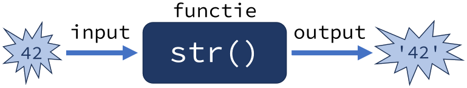

.. role:: python(code)
    :language: python

.. |br| raw:: html

    

Functiebeginselen
=======================

Je hebt inmiddels kennisgemaakt met de functies :python:`print()`, :python:`input()`, :python:`type()`, :python:`int()`, :python:`float()` en :python:`str()`. Dit zestal vormt slechts het topje van de spreekwoordelijke ijsberg. Python telt bijna zeventig standaard ingebouwde functies, en daarnaast nog duizenden (misschien zelfs miljoenen) andere functies die je kunt gebruiken. Functies zijn, net als variabelen, belangrijke bouwstenen voor een computerprogramma. Hoog tijd dus om er wat dieper op in te gaan.      

.. dropdown:: Wat leer je in dit hoofdstuk
    :open:
    :color: primary
    :icon: book

    * ...

Onderdelen van een functie
----------------------------

Wanneer je in Python :python:`print('Hello, World!')` aanroept, wordt op de achtergrond een stuk code uitgevoerd waardoor de tekst ``Hello, World!`` op het scherm verschijnt. Die code is geprogrammeerd door de makers van Python. Een functie is dan ook eigenlijk een blok code dat je kunt laten uitvoeren wanneer je het nodig hebt. Om dat voor elkaar te krijgen moet je drie dingen weten:

* De naam van de functie.
* De eventuele argumenten die de functie nodig heeft (de input).
* De eventuele waarde die de functie teruggeeft (de output).

Je zou een functie enigszins kunnen vergelijken met een recept in een kookboek. Wanneer je een appeltaart wilt bakken, gebruik je het recept ``Appeltaart``. De ingrediënten voor de taart zijn de input en de output is een overheerlijke versgebakken appeltaart.

.. card::

    .. list-table::
        :header-rows: 1
        :align: center
        :stub-columns: 1

        * - 
          - Functie
          - Recept
        * - Naam
          - :python:`str()` 
          - ``Appeltaart``
        * - Input
          - een waarde, bijvoorbeeld :python:`42` 
          - ingrediënten
        * - Output
          - de :python:`string` versie van de waarde: :python:`'42'` 
          - een taart

Meestal verbeelden we een functie als een *black box* of een machientje waar je input in kunt stoppen en waar output uit komt:

Naam
^^^^^^

Net als variabelen hebben functies een naam. En net als bij variabelen mag die naam slechts bestaan uit letters, cijfers en underscores, en mag hij niet met een cijfer beginnen. Zoals het handig is om voor variabelen namen te gebruiken die iets zeggen over de inhoud van de variabele, hebben functies een naam die aangeeft wat de functie doet.

Argumenten
^^^^^^^^^^^^

Aan de meeste functies kun je input meegeven in de vorm van zogenoemde *argumenten*. Dat zijn waarden die je aan de functie meegeeft om te verwerken. De argumenten zet je tussen de haakjes bij de functieaanroep. Bijvoorbeeld de functie :python:`int()` roep je aan met één argument, namelijk de waarde waarvan de functie probeert een integer versie te maken. 

.. code-block:: python

  >>> int('21')
  21

De functie :python:`max()`, die het grootste getal in een reeks teruggeeft, kun je aanroepen met twee argumenten...

.. code-block:: python

  >>> max(3, 5)
  5

...maar ook met meer argumenten:

.. code-block:: python

  >>> max(3, 5, 2, 8, 1, 6)
  8

Over het algemeen kan een functie de waarden van de argumenten niet wijzigen. Wanneer je bijvoorbeeld aan de functie :python:`int()` een stringvariabele meegeeft, blijft dat een stringvariabele:

.. code-block:: python

  >>> a = '21'
  >>> int(a)
  21
  >>> a
  '21'

De aanroep :python:`int(a)` in het voorbeeld hierboven heeft de integer :python:`21` teruggegeven, maar de variabele :python:`a` bevat nog steeds de stringwaarde :python:`'21'`. Als je wilt dat :python:`a` de integerwaarde :python:`21` krijgt, zou je het resultaat van :python:`int(a)` weer moeten opslaan in :python:`a` met een assignment statement:

.. code-block:: python
  :emphasize-lines: 2

  >>> a = '21'
  >>> a = int(a)
  >>> a
  21

Returnwaarde
^^^^^^^^^^^^^^^^

De output van een functie wordt vaak de *returnwaarde* of *retourwaarde* genoemd. Bijvoorbeeld de functie :python:`int()` retourneert een integer versie van de inputwaarde. Zoals je in het laatste voorbeeld hierboven zag, kun je die returnwaarde weer in een variabele stoppen met een assignment statement. Maar je kunt de waarde ook op een andere manier gebruiken, bijvoorbeeld in een berekening of in een :python:`print()` aanroep.

.. code-block:: python
  
  >>> a = '21'
  >>> b = int(a) // 7
  >>> print(b * int(4.75))
  12

Niet alle functies retourneren een waarde. Bijvoorbeeld :python:`print()` drukt tekst af op het scherm, maar geeft geen waarde terug. Dat kun je als volgt checken:

.. code-block:: python
  
  >>> a = print('Hello, World!')
  Hello, World!
  >>> print(a)
  None

In dit voorbeeld wordt de returnwaarde van :python:`print('Hello, World!')` opgeslagen in :python:`a`. Wanneer we vervolgens :python:`print(a)` aanroepen om de waarde van :python:`a` te tonen, wordt :python:`None` afgedrukt. Dit is een van de Python keywords die je eerder tegenkwam in het hoofdstuk :ref:`Variabelen <python-keywords>`. Het geeft aan dat :python:`a` geen waarde heeft. 

Ingebouwde functies
---------------------

Zoals gezegd kent Python een kleine zeventig ingebouwde functies. De werking van :python:`print()`, :python:`input()`, :python:`type()`, :python:`int()`, :python:`float()` en :python:`str()` ken je inmiddels, maar hieronder volgen er nog enkele die je vaak van pas kunnen komen.

:python:`min()` en :python:`max()`
^^^^^^^^^^^^^^^^^^^^^^^^^^^^^^^^^^^^

...