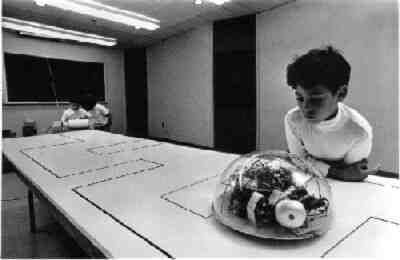
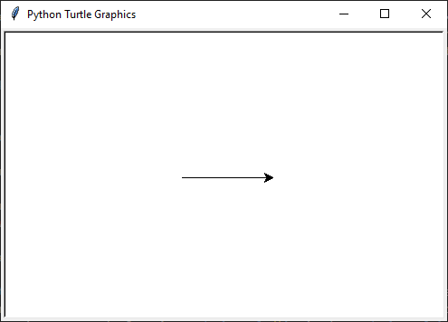
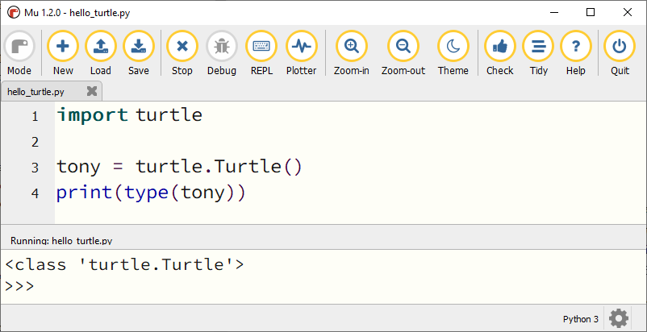
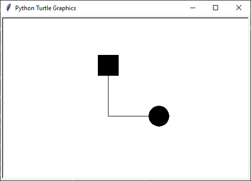

.. role:: python(code)
    :language: python

.. |br| raw:: html

    

Tekenen met Turtle
====================

  
Halverwege de vorige eeuw ontwikkelden de makers van de programmeertaal `LOGO <https://nl.wikipedia.org/wiki/Logo_(programmeertaal)>`_ een robotschildpad waarmee ze kinderen wilden leren programmeren. Door de schildpad instructies te geven, bewoog deze zich over een vel papier. Aan de schildpad was een viltstift gemonteerd. Op die manier kon je de robot een tekening laten maken. |br| Met de :python:`turtle` module kunnen we in Python hetzelfde doen.

.. dropdown:: Wat leer je in dit hoofdstuk
    :open:
    :color: primary
    :icon: book

    * Hoe importeer je de :python:`turtle` module in je programma.
    * Hoe maak je een turtle aan.
    * Hoe laat je de turtle bewegen.
    * Hoe verander je het uiterlijk van de turtle.
    * Hoe haal je de pen van het tekenpapier en hoe zet je hem weer neer.
    * Hoe wijzig je de dikte en de kleur van de pen.
    * Hoe vul je een getekende figuur op met een kleur.
    * Hoe laat je de turtle een cirkel tekenen.

Turtle variabelen
------------------

Start in Mu editor met een nieuw bestand door op de knop :guilabel:`New` te klikken. Typ onderstaande code in het bestand en let daarbij goed op het verschil tussen hoofdletters en kleine letters! Sla het bestand op als :file:`hello_turtle.py`.

.. code-block:: python
    :class: no-copybutton
    :linenos:
    :caption: hello_turtle.py
    :name: hello_turtle_v01

    import turtle

    tony = turtle.Turtle()

    tony.forward(100)

Run deze code om het resultaat te bekijken.

Sommige functies zoals :python:`print()` zitten standaard in Python, maar om met de schildpad te kunnen werken is het nodig de module :python:`turtle` te importeren. Dat gebeurt op regel 1. Op regel 3 maken we met de functie :python:`turtle.Turtle()` een schildpad aan met de naam :python:`tony`. Op regel 5 sturen we :python:`tony` 100 pixels naar voren.

Maar wat is dat nu? Onze Tony lijkt helemaal niet op een schildpad! Hij lijkt meer op een pijlpunt! Daar gaan we verandering in brengen. En we gaan hem ook van richting laten veranderen. Pas je code als volgt aan (de nieuwe regels zijn gemarkeerd):

.. code-block:: python
    :class: no-copybutton
    :linenos:
    :caption: hello_turtle.py
    :name: hello_turtle_v02
    :emphasize-lines: 4,7-12

    import turtle

    tony = turtle.Turtle()
    tony.shape('turtle')

    tony.forward(100)
    tony.left(90)
    tony.forward(50)
    tony.left(90)
    tony.forward(100)
    tony.left(90)
    tony.forward(50)

Op regel 4 zorgt :python:`tony.shape('turtle')` ervoor dat onze schildpad er ook uitziet als een schildpad. De regels 7, 9 en 11 laten :python:`tony` linksaf slaan alvorens verder te lopen.

.. dropdown:: Meer weten over turtle shapes?
    :color: info
    :icon: info

    Om de vorm van :python:`tony` in een schildpad te veranderen, gaven we de functie :python:`tony.shape()` de waarde :python:`'turtle'` mee. Er zijn echter nog andere vormen mogelijk. Dit is de volledige lijst:

    * :python:`'arrow'`
    * :python:`'turtle'`
    * :python:`'circle'`
    * :python:`'square'`
    * :python:`'triangle'`
    * :python:`'classic'`
 
De waarde die je tussen de haakjes aan de functie :python:`tony.forward()` meegeeft, is het aantal pixels dat de schildpad vooruit moet bewegen. Maar wat doet het getal :python:`90` tussen de haakjes van :python:`tony.left()`?

.. dropdown:: Vraag
    :open:
    :color: secondary
    :icon: question

    Wat betekent het getal :python:`90` tussen de haakjes van :python:`turtle.left()`?

    .. dropdown:: Antwoord
        :color: secondary
        :icon: check-circle

        Dat getal geeft aan hoeveel **graden** de turtle moet draaien. Een hoek van 90° is een rechte hoek. De aanroep :python:`turtle.left(90)` zorgt er dus voor dat de turtle 90° naar links draait, oftewel linksaf slaat.

        In onderstaande figuur zie je hoe een cirkel in graden is verdeeld. Hoeveel graden zitten er in een volledige cirkel denk je?

        .. image:: images/turtle_angles.png

Regel 3 in onze code bevat het assignment statement :python:`tony = turtle.Turtle`. Je weet dat met een assignment statement een variabele wordt gemaakt. Dat betekent dat :python:`tony` een variabele is. Maar wat is het datatype van deze variabele? Het is geen integer, float of string, maar wat is het wel? De functie :python:`type()` biedt uitkomst:

Blijkbaar heeft de variabele :python:`tony` het datatype :python:`turtle.Turtle`. Een variabele hoeft dus niet altijd een getal of tekst te bevatten maar kan ook een *object* bevatten zoals in dit geval een virtuele schildpad.

Niets belet ons om meer dan één turtle variabele te maken. Probeer het volgende maar eens:

.. code-block:: python
    :class: no-copybutton
    :linenos:
    :caption: hello_turtle.py

    import turtle

    tony = turtle.Turtle()
    tina = turtle.Turtle()

    tony.shape('circle')
    tony.shapesize(2)

    tina.shape('square')
    tina.shapesize(2)

    tony.forward(100)

    tina.left(90)
    tina.forward(100)

In dit voorbeeld zijn :python:`tony` en :python:`tina` twee turtle variabelen, waarvan de eerste eruitziet als een cirkel en de tweede als een vierkant. Met :python:`tony.shapesize(2)` en :python:`tina.shapesize(2)` maken we hun vormen iets groter, zodat je ze beter kunt zien.

De basisbewegingen
------------------
        
Tot nu toe hebben we in onze code voor de beweging van de schilpad de functies :python:`forward()` en :python:`left()` gebruikt. Kun je voorspellen welke bewegingsfuncties er nog meer zijn? Juist, :python:`backward()` en :python:`right()`. Omdat je deze vier functies heel vaak gebruikt, zijn er afkortingen voor, zodat je minder hoeft te typen.

.. list-table:: Afkortingen van de turtle functies
    :header-rows: 1

    * - Functie
      - Afkorting
    * - :python:`turtle.forward()`
      - :python:`turtle.fd()`
    * - :python:`turtle.backward()`
      - :python:`turtle.bk()`
    * - :python:`turtle.left()`
      - :python:`turtle.lt()`
    * - :python:`turtle.right()`
      - :python:`turtle.rt()`

Let op: in je eigen code vervang je bij het aanroepen van een turtle functie het woord :python:`turtle` door de naam van jouw schildpad, dus bijvoorbeeld :python:`tony.rt()` in plaats van :python:`turtle.rt()` .  

.. dropdown:: Opdracht 01
    :open:
    :color: secondary
    :icon: pencil

    Vervang de code in :file:`hello_turtle.py` door onderstaande code. Je hoeft de code niet over te typen, je kunt kopiëren en plakken.

    .. code-block:: python
        :linenos:
        :caption: hello_turtle.py
        :name: hello_turtle_oef01

        import turtle

        tony = turtle.Turtle()
        tony.shape('turtle')

        tony.lt(90)
        tony.fd(100)
        tony.bk(50)
        tony.rt(90)
        tony.fd(60)

    Run de code om te zien dat de schildpad het begin van een hoofdletter H tekent. Maak de code af zodat een volledige hoofdletter H wordt getekend. 

Pen up, pen down en pen size
----------------------------

Zoals je hebt gemerkt, is :python:`tony` een schildpad die van tekenen houdt, want hij heeft een pen vast waarmee hij zijn afgelegde weg tekent. Soms wil je echter dat :python:`tony` zijn pen even van het 'papier' haalt. Met de volgende twee functies kun je de pen van de schildpad bedienen:

.. list-table::
    :header-rows: 1

    * - Functie
      - Afkorting
    * - :python:`turtle.penup()`
      - :python:`turtle.pu()` of :python:`turtle.up()`
    * - :python:`turtle.pendown()`
      - :python:`turtle.pd()` of :python:`turtle.down()`

Daarnaast kun je de pendikte instellen met de volgende functie:

.. list-table::
    :header-rows: 1

    * - Functie
    * - :python:`turtle.pensize()`

Bij de functies :python:`turtle.penup()` en :python:`turtle.pendown()` zet je niks tussen de haakjes, maar de functie :python:`turtle.pensize()` heeft wél input nodig. Tussen de haakjes zet je een geheel getal dat de pendikte in pixels aangeeft. Dus bijvoorbeeld :python:`turtle.pensize(10)`

.. dropdown:: Opdracht 02
    :open:
    :color: secondary
    :icon: pencil

    Breid je code in :file:`hello_turtle.py` uit zodat naast de letter H ook een hoofdletter E wordt getekend, met pendikte 5.

    .. image:: images/turtle_HE.png

    Kies zelf mooie lengtes voor de drie horizontale lijnen van de letter E, zodat je resultaat lijkt op het bovenstaande plaatje.

    .. dropdown:: Hint
        :color: secondary
        :icon: light-bulb

        Na de code die de letter H tekent, moet je dus eerst :python:`tony.penup()` aanroepen om de pen van het papier te halen. Vervolgens beweeg je de schildpad 20 pixels vooruit met :python:`tony.fd(20)` (misschien moet je hem eerst nog draaien, zodat hij de goede kant op gaat). Daarna roep je :python:`tony.pendown()` aan om de pen weer op het papier te zetten. Als je dat voor elkaar hebt, kun je de code maken die de letter E tekent. 

Kleuren
-------

Onze schildpad tekent vooralsnog zwarte lijnen; tijd voor wat fleurigheid! Uiteraard is er een functie om de penkleur van :python:`tony` te veranderen.

.. list-table::
    :header-rows: 1

    * - Functie
    * - :python:`turtle.pencolor()`

Tussen de haakjes geef je de gewenste kleur mee met de Engelse naam tussen aanhalingstekens, bijvoorbeeld :python:`turtle.pencolor('yellow')` of :python:`turtle.pencolor('green')`. Andere kleuren zijn :python:`gold`, :python:`orange`, :python:`red`, :python:`maroon`, :python:`violet`, :python:`magenta`, :python:`purple`, :python:`navy`, :python:`blue`, :python:`skyblue`, :python:`cyan`, :python:`turquoise`, :python:`lightgreen`, :python:`darkgreen`, :python:`chocolate`, :python:`brown`, :python:`black` en :python:`gray`. En er zijn er nog veel meer! Op `deze website <https://trinket.io/docs/colors>`_ kun je een kleurenpalet vinden.

.. dropdown:: Opdracht 03
    :open:
    :color: secondary
    :icon: pencil

    Breid je code in :file:`hello_turtle.py` uit zodat de schildpad het woord HELLO tekent, waarbij elke letter een andere kleur en een andere pendikte heeft. Je mag zelf je favoriete kleuren en pendiktes kiezen. Hieronder staat een voorbeeldje.

    .. image:: images/turtle_HELLO.png

Draaiingshoeken
---------------

Draaien met een hoek van 90° is niet zo moeilijk. Draaiingshoeken met een andere grootte zijn lastiger dan je misschien denkt. Probeer de onderstaande opdracht maar eens.

.. dropdown:: Opdracht 04
    :open:
    :color: secondary
    :icon: pencil

    Begin met een nieuw codebestand (via de :guilabel:`New` knop). Importeer de :python:`turtle` module en maak een turtle aan. In de vorige opdrachten heette de turtle :python:`tony`, maar je mag nu ook zelf een naam verzinnen. Sla het bestand op onder de naam :file:`turtle_house.py`.

    Maak een algoritme dat de onderstaande figuur tekent zónder de pen van het papier te halen, zónder de :python:`turtle.bk()` functie te gebruiken en zónder een draai van 180° te maken.

    .. image:: images/turtle_house.png
      :align: center

    .. dropdown:: Hint 1
        :color: secondary
        :icon: light-bulb

        Teken de figuur eerst eens zelf op papier zonder je pen op te tillen. Kun je erachter komen in welk punt je het beste kunt beginnen?

    .. dropdown:: Hint 2
        :color: secondary
        :icon: light-bulb

        Begin in de hoek linksonder en teken eerst het vierkant van 80 bij 80 pixels. Maak dan de diagonaal, het dak en tenslotte de diagonaal naar rechtsonder.

    .. dropdown:: Hint 3
        :color: secondary
        :icon: light-bulb

        De hoeken in de figuur zijn niet altijd de hoeken die je moet invullen bij :python:`turtle.lt()` of :python:`turtle.rt()`. Kijk maar eens naar de onderstaande afbeelding. De turtle komt van boven naar beneden aangelopen en moet vervolgens de diagonaal van linksonder naar rechtsboven maken. Om dat te doen moet hij niet 45° draaien, maar 90° + 45° = 135°. Ook bij het tekenen van het dak moet je goed nadenken over de te draaien hoeken.

        .. image:: images/turtle_house_hint.png

Figuurvulling
-------------
Het is mogelijk om een door de turtle getekende figuur op te vullen met een kleur. Daarvoor gebruik je de volgende functies:

.. list-table::
    :header-rows: 1

    * - Functie
      - Werking 
    * - :python:`turtle.fillcolor()`
      - Op dezelfde manier als :python:`turtle.pencolor()`
    * - :python:`turtle.begin_fill()`
      - Roep deze functie aan juist voordat de te vullen vorm wordt getekend.
    * - :python:`turtle.end_fill()`
      - Roep deze functie aan meteen nadat de te vullen vorm is getekend.

Je kunt dit uitproberen met het onderstaande codevoorbeeld. Maak hiervoor weer een nieuw bestand aan, met de naam :file:`turtle_fill.py`.

.. code-block:: python
    :linenos:
    :caption: turtle_fill.py
    :name: turtle_fill

    import turtle

    tony = turtle.Turtle()
    tony.shape('turtle')
    tony.pensize(5)

    # Stel de penkleur en de vulkleur in
    tony.pencolor('black')
    tony.fillcolor('yellow')

    # Teken een driehoek met vulling
    tony.begin_fill()
    tony.fd(100)
    tony.lt(120)
    tony.fd(100)
    tony.lt(120)
    tony.fd(100)
    tony.lt(120)
    tony.end_fill()

.. dropdown:: Opdracht 05
    :open:
    :color: secondary
    :icon: pencil

    Breid de code in :file:`turtle_fill.py` uit, zodat links van het driehoekje een regelmatige vijfhoek met rode vulling wordt getekend, zoals in onderstaande figuur. De zijden van de vijfhoek zijn 60 pixels lang.

    .. image:: images/turtle_fill.png
      :align: center

    .. dropdown:: Hint
        :color: secondary
        :icon: light-bulb

        Om te berekenen hoeveel graden de turtle telkens moet draaien, kun je bedenken dat gedurende het tekenen van de vijfhoek de turtle in totaal precies één hele draai maakt van 360°. Deze draai wordt gelijk verdeeld over de vijf hoeken.

        .. list-table::
          :header-rows: 1

          * - Vorm
            - Aantal hoeken
            - Turtle draaihoek
            - Totale draaiing 
          * - Driehoek
            - 3
            - 120°
            - 3 * 120° = 360°
          * - Vierhoek
            - 4
            - 90°
            - 4 * 90° = 360°
          * - Vijfhoek
            - 5
            - ?°
            - 5 * ?° = 360°

Cirkels
-------

Veelhoeken zijn leuke figuren, en we zullen er later nog vaker op terugkomen, maar soms wil je gewoon een cirkel tekenen. Met Python turtle kan dat op twee manieren; met :python:`turtle.dot()` en met :python:`turtle.circle()`.

.. list-table::
    :header-rows: 1

    * - Functie
      - Werking 
    * - :python:`turtle.dot(size, color)`
      - Tekent een ronde stip met een diameter die je aangeeft met :python:`size` en een kleur die je aangeeft met :python:`color`. Bijvoorbeeld :python:`turtle.dot(40, "blue")`.  
    * - :python:`turtle.circle(radius)`
      - Tekent een cirkel met een straal (dat is de afstand tussen het middelpunt van de cirkel en de rand, dus eigenlijk de halve diameter) die je aangeeft met :python:`radius`. Bijvoorbeeld :python:`turtle.circle(20)`.  

Probeer beide functies uit met onderstaande code. Gebruik een nieuw bestand, met de naam :file:`turtle_circles.py`

.. code-block:: python
    :linenos:
    :caption: turtle_circles.py
    :name: turtle_circles

    import turtle

    tony = turtle.Turtle()

    tony.circle(40)
    tony.dot(80)

Zie je het verschil tussen de beide functies? :python:`turtle.dot()` levert een gevulde cirkel (een stip) en :python:`turtle.circle()` een niet-gevulde cirkel. Je kunt met :python:`turtle.begin_fill()` en :python:`turtle.end_fill()` de niet-gevulde cirkel natuurlijk alsnog vullen, zoals in onderstaand voorbeeld. Om het verschil tussen rand en vulling goed zichtbaar te maken worden in dit voorbeeld ook de pendikte en de kleuren ingesteld.

.. code-block:: python
    :linenos:
    :emphasize-lines: 4-6,8,10
    :caption: turtle_circles.py
    :name: turtle_circles_v02

    import turtle

    tony = turtle.Turtle()
    tony.pensize(5)
    tony.pencolor("black")
    tony.fillcolor("green")

    tony.begin_fill()
    tony.circle(40)
    tony.end_fill()
    tony.dot(80)

.. dropdown:: Meer weten over extra mogelijkheden met turtle.circle()? 
    :color: info
    :icon: info

    Behalve de straal van de cirkel, kun je aan :python:`turtle.circle()` nóg een getal meegeven. Probeer de volgende code maar eens:

    .. code-block:: python
        :linenos:
        :caption: turtle_circles.py
        :name: turtle_circles_v03

        import turtle

        tony = turtle.Turtle()

        tony.circle(40, 90)
    
    Run het programma en wijzig daarna regel 5 in :python:`tony.circle(40, 180)`. Run weer en wijzig daarna regel 5 in :python:`tony.circle(40, 270)`. Zie je wat dat tweede getal doet?

    Je kunt zelfs nog een derde getal toevoegen binnen de haakjes. Probeer het volgende:

    .. code-block:: python
        :linenos:
        :caption: turtle_circles.py
        :name: turtle_circles_v04

        import turtle

        tony = turtle.Turtle()

        tony.circle(40, 360, 4)
    
    Run het programma en wijzig daarna regel 5 in :python:`tony.circle(40, 360, 5)`. Run weer en wijzig daarna regel 5 in :python:`tony.circle(40, 360, 6)`. Zie je wat het derde getal doet?

.. dropdown:: Opdracht 06
    :open:
    :color: secondary
    :icon: pencil

    Vervang de code in :file:`turtle_circles.py` door een programma dat een stoplicht tekent zoals hieronder getoond. De afmetingen mag je zelf kiezen en hoeven niet exact overeen te komen met het voorbeeld.

    .. image:: images/turtle_trafficlight.png
      :align: center

Overzicht turtle functies
-------------------------

Hier nog eens een overzicht van alle turtle functies die je tot nu toe bent tegengekomen en nog een paar meer. Een veel uitgebreider overzicht vind je in de (Engelstalige) `Python documentatie <https://docs.python.org/3/library/turtle.html>`_.

.. card:: Turtle eigenschappen

  .. list-table:: 
      :header-rows: 1
      :stub-columns: 1

      * - Functie
        - Werking
      * - :python:`turtle.Turtle()` 
        - Maakt een nieuwe turtle variabele. Let op de hoofdletter T in :python:`Turtle()`. 
      * - :python:`turtle.shape(name)`
        - Stelt de vorm van de turtle in. Mogelijke waarden voor :python:`name` zijn :python:`'arrow'`, :python:`'turtle'`, :python:`'circle'`, :python:`'square'`, :python:`'triangle'` en :python:`'classic'`.
      * - :python:`turtle.shapesize(width, length, outline)`
        - Stelt de grootte van de turtle in. Met de parameters :python:`width` en :python:`length` bepaal je de breedte en lengte van de turtle. De waarde van :python:`outline` bepaalt de lijndikte van de schildpadvorm. Als je slechts één waarde aan deze functie meegeeft, wordt die gebruikt voor de breedte én de lengte.
      * - :python:`turtle.speed(speed)` 
        - Stelt de snelheid van de turtle in. Voor de parameter :python:`speed` worden waarden tussen :python:`0` en :python:`10` geaccepteerd. De hoogste snelheid krijg je met de waarde :python:`0`.    
      * - :python:`turtle.hideturtle()` 
        - Maakt de turtle onzichtbaar.
      * - :python:`turtle.showturtle()` 
        - Maakt de turtle zichtbaar.

.. card:: Bewegingen

  .. list-table::
      :header-rows: 1
      :stub-columns: 1

      * - Functie
        - Werking
      * - :python:`turtle.forward(distance)` 
        - Verplaatst de turtle vooruit met de gegeven afstand.
      * - :python:`turtle.backward(distance)` 
        - Verplaatst de turtle achteruit met de gegeven afstand.
      * - :python:`turtle.left(angle)` 
        - Draait de turtle linksom over de gegeven hoek.
      * - :python:`turtle.right(angle)` 
        - Draait de turtle rechtsom over de gegeven hoek.

  Meestal gebruiken we de afgekorte versies van deze functies :python:`turtle.fd(distance)`, :python:`turtle.bk(distance)`, :python:`turtle.lt(angle)` en :python:`turtle.rt(angle)`.

.. card:: Pen eigenschappen
  
  .. list-table::
      :header-rows: 1
      :stub-columns: 1

      * - Functie
        - Werking
      * - :python:`turtle.up()` 
        - Haalt de pen van het papier.
      * - :python:`turtle.down()` 
        - Plaatst de pen op het papier.
      * - :python:`turtle.pensize(width)` 
        - Stelt de dikte van de pen in.
      * - :python:`turtle.pencolor(colorstring)` 
        - Stelt de kleur van de pen in.
      * - :python:`turtle.fillcolor(colorstring)` 
        - Stelt de kleur waarmee een figuur wordt opgevuld in.
      * - :python:`turtle.begin_fill()` 
        - Aan te roepen juist voor het tekenen van de figuur die moet worden opgevuld.
      * - :python:`turtle.end_fill()` 
        - Aan te roepen juist na het tekenen van de figuur die moet worden opgevuld.

.. card:: Vormen
  
  .. list-table::
      :header-rows: 1
      :stub-columns: 1

      * - Functie
        - Werking
      * - :python:`turtle.circle(radius, extent, steps)` 
        - Tekent een cirkel met de gegeven radius. Als je een waarde voor :python:`extent` tussen :python:`0` en :python:`360` meegeeft, wordt slechts een gedeelte van een cirkel getekend. Als je een waarde voor :python:`steps` meegeeft, wordt de cirkel in dat aantal stappen getekend. 
      * - :python:`turtle.dot(size, colorstring)` 
        - Tekent een stip met de gegeven diameter en kleur. Je mag de kleur weglaten; dan wordt de huidige penkleur gebruikt.
      * - :python:`turtle.stamp()`
        - Stempelt een afdruk van de turtlevorm op het papier.

Oefeningen
----------

.. dropdown:: Opdracht 07 - Windows logo
    :open:
    :color: secondary
    :icon: pencil

    Schrijf een programma dat een eenvoudige versie van het Windows logo tekent:

    .. figure:: images/turtle_windows_logo.png
      :align: center

    Het logo bestaat uit vier vierkantjes met zijden van 100 pixels. De ruimte tussen de vierkantjes is 20 pixels. De in het voorbeeld gebruikte kleuren heten:
    
    * :python:`'tomato'`
    * :python:`'yellow green'`
    * :python:`'deep sky blue'`
    * :python:`'gold'`

    .. dropdown:: Hint 1
        :color: secondary
        :icon: light-bulb

        De vierkantjes hebben geen zichtbare rand. Dat kun je voor elkaar krijgen door de penkleur en de vulkleur voor elk vierkant dezelfde waarde te geven:

        .. code-block:: python

            tony.pencolor('tomato')
            tony.fillcolor('tomato')

        Het is ook mogelijk dit met één regel code te bewerkstelligen:

        .. code-block:: python

            tony.color('tomato', 'tomato')

        Met de functie :python:`turtle.color()` kun je in één keer de penkleur én de vulkleur instellen.

    .. dropdown:: Hint 2
        :color: secondary
        :icon: light-bulb

        Het is handig om je code netjes te structureren in een aantal blokken:

        * Tekenen van het rode vierkant.
        * De turtle verplaatsen.
        * Tekenen van het groene vierkant.
        * De turtle verplaatsen.
        * Tekenen van het gele vierkant.
        * De turtle verplaatsen.
        * Tekenen van het blauwe vierkant.

        Door dat te doen, kun je veel code copy-pasten. Het tekenen van een vierkant is namelijk elke keer hetzelfde.

.. dropdown:: Opdracht 08 - Zandloper
    :open:
    :color: secondary
    :icon: pencil

    Schrijf een programma dat een zandloper tekent:

    .. figure:: images/turtle_hourglass.png
      :align: center

    De zandloper bestaat uit twee gelijkzijdige driehoeken met zijden van 200 pixels. Voor het zand is in het voorbeeld de kleur :python:`'sandy brown'` gebruikt en voor het glas de kleur :python:`'alice blue'`. De pendikte in het voorbeeld is 5 pixels.

    .. dropdown:: Hint
        :color: secondary
        :icon: light-bulb

        Bij deze opdracht zou je verschillende driehoeken over elkaar kunnen tekenen. Voor de bovenste helft bijvoorbeeld eerst een driehoek met een lichtblauwe vulling en daaroverheen een driehoek met een zandkleurige vulling.
       
.. dropdown:: Opdracht 09 - Olympische ringen
    :open:
    :color: secondary
    :icon: pencil

    Schrijf een programma dat de Olympische ringen tekent:

    .. figure:: images/turtle_olympic_rings.png
      :align: center

    In het voorbeeld hebben de ringen een straal van 80 pixels (dus een diameter van 160 pixels) en is de pendikte 15 pixels. De gebruikte kleuren zijn:

    * :python:`'royal blue'`
    * :python:`'black'`
    * :python:`'crimson'`
    * :python:`'sea green'`
    * :python:`'orange'` 

    .. dropdown:: Opmerking
        :color: secondary
        :icon: note

        De echte Olympische ringen zien er iets anders uit. Kijk maar eens hoe de ringen voor en achter elkaar zijn geplaatst:

        .. figure:: images/turtle_olympic_rings_2.png
          :align: center
          :scale: 75%

        Je zou dit met de turtle wel voor elkaar kunnen krijgen, maar dat is niet eenvoudig!

.. dropdown:: Opdracht 10 - Sheriff ster
    :open:
    :color: secondary
    :icon: pencil

    Schrijf een programma dat de ster van een Sheriff tekent:

    .. figure:: images/turtle_sheriff_star.png
      :align: center

    In het voorbeeld is de pendikte 5 pixels, de penkleur :python:`'orange'` en de vulkleur :python:`'gold'`. De lijnstukjes zijn 80 pixels lang en de rondjes hebben een diameter van 32 pixels.

    .. dropdown:: Hint 1
        :color: secondary
        :icon: light-bulb

        Bedenk op welke manier je de rondjes gaat tekenen. Gebruik je daar de :python:`turtle.circle()` functie voor of liever :python:`turtle.dot()`? 

    .. dropdown:: Hint 2
        :color: secondary
        :icon: light-bulb

        De punten van de ster kun je beschouwen als gelijkzijdige driehoeken rondom een regelmatige zeshoek. Kun je daaruit afleiden wat de draaiingshoeken zijn? Je moet de turtle afwisselend linksom en rechtsom laten draaien.

Oplossingen
-----------

.. dropdown:: Oplossing opdracht 07
    :color: secondary
    :icon: check-circle

    .. code-block:: python
        :linenos:
        :caption: turtle_windows_logo.py

        import turtle

        tony = turtle.Turtle()

        # Teken rood vierkant
        tony.color('tomato', 'tomato')
        tony.begin_fill()
        tony.fd(100)
        tony.lt(90)
        tony.fd(100)
        tony.lt(90)
        tony.fd(100)
        tony.lt(90)
        tony.fd(100)
        tony.lt(90)
        tony.end_fill()

        # Verplaats 120 pixels naar rechts
        tony.pu()
        tony.fd(120)
        tony.pd()

        # Teken groen vierkant
        tony.color('yellow green', 'yellow green')
        tony.begin_fill()
        tony.fd(100)
        tony.lt(90)
        tony.fd(100)
        tony.lt(90)
        tony.fd(100)
        tony.lt(90)
        tony.fd(100)
        tony.lt(90)
        tony.end_fill()

        # Verplaats 120 pixels naar beneden
        tony.pu()
        tony.rt(90)
        tony.fd(120)
        tony.lt(90)
        tony.pd()

        # Teken geel vierkant
        tony.color('gold', 'gold')
        tony.begin_fill()
        tony.fd(100)
        tony.lt(90)
        tony.fd(100)
        tony.lt(90)
        tony.fd(100)
        tony.lt(90)
        tony.fd(100)
        tony.lt(90)
        tony.end_fill()

        # Verplaats 120 pixels naar links
        tony.pu()
        tony.bk(120)
        tony.pd()

        # Teken blauw vierkant
        tony.color('deep sky blue', 'deep sky blue')
        tony.begin_fill()
        tony.fd(100)
        tony.lt(90)
        tony.fd(100)
        tony.lt(90)
        tony.fd(100)
        tony.lt(90)
        tony.fd(100)
        tony.lt(90)
        tony.end_fill()

.. dropdown:: Oplossing opdracht 08
    :color: secondary
    :icon: check-circle

    .. code-block:: python
        :linenos:
        :caption: turtle_zandloper.py

        import turtle

        tony = turtle.Turtle()
        tony.pensize(5)

        # Teken bovenste driehoek
        tony.fillcolor('alice blue')
        tony.begin_fill()
        tony.fd(200)
        tony.rt(120)
        tony.fd(200)
        tony.rt(120)
        tony.fd(200)
        tony.end_fill()

        # Teken zandvulling in bovenste driehoek
        tony.fillcolor('sandy brown')
        tony.bk(200)
        tony.begin_fill()
        tony.fd(140)
        tony.rt(120)
        tony.fd(140)
        tony.rt(120)
        tony.fd(140)
        tony.end_fill()

        # Teken onderste driehoek
        tony.fillcolor('alice blue')
        tony.begin_fill()
        tony.fd(200)
        tony.lt(120)
        tony.fd(200)
        tony.lt(120)
        tony.fd(200)
        tony.end_fill()

        # Teken zandvulling in onderste driehoek
        tony.fillcolor('sandy brown')
        tony.bk(200)
        tony.begin_fill()
        tony.fd(60)
        tony.lt(60)
        tony.fd(140)
        tony.lt(60)
        tony.fd(60)
        tony.lt(120)
        tony.fd(200)
        tony.end_fill()
        
.. dropdown:: Oplossing opdracht 09
    :color: secondary
    :icon: check-circle

    .. code-block:: python
        :linenos:
        :caption: turtle_olympische_ringen.py

        import turtle

        tony = turtle.Turtle()
        tony.pensize(15)

        # Teken blauwe ring
        tony.pencolor('royal blue')
        tony.circle(80)

        # Verplaats 200 pixels naar rechts
        tony.pu()
        tony.fd(200)
        tony.pd()

        # Teken zwarte ring
        tony.pencolor('black')
        tony.circle(80)

        # Verplaats 200 pixels naar rechts
        tony.pu()
        tony.fd(200)
        tony.pd()

        # Teken rode ring
        tony.pencolor('crimson')
        tony.circle(80)

        # Verplaats 80 pixels naar beneden en 100 pixels naar links
        tony.pu()
        tony.rt(90)
        tony.fd(80)
        tony.lt(90)
        tony.bk(100)
        tony.pd()

        # Teken groene ring
        tony.pencolor('sea green')
        tony.circle(80)

        # Verplaats 200 pixels naar links
        tony.pu()
        tony.bk(200)
        tony.pd()

        # Teken gele ring
        tony.pencolor('orange')
        tony.circle(80)

.. dropdown:: Oplossing opdracht 10
    :color: secondary
    :icon: check-circle

    .. code-block:: python
        :linenos:
        :caption: turtle_sheriff_ster.py

        import turtle

        tony = turtle.Turtle()
        tony.pensize(5)

        tony.color('orange', 'gold')
        tony.begin_fill()

        tony.fd(80)
        tony.dot(32)
        tony.lt(120)
        tony.fd(80)
        tony.rt(60)

        tony.fd(80)
        tony.dot(32)
        tony.lt(120)
        tony.fd(80)
        tony.rt(60)

        tony.fd(80)
        tony.dot(32)
        tony.lt(120)
        tony.fd(80)
        tony.rt(60)

        tony.fd(80)
        tony.dot(32)
        tony.lt(120)
        tony.fd(80)
        tony.rt(60)

        tony.fd(80)
        tony.dot(32)
        tony.lt(120)
        tony.fd(80)
        tony.rt(60)

        tony.fd(80)
        tony.dot(32)
        tony.lt(120)
        tony.fd(80)
        tony.rt(60)

        tony.end_fill()

    .. dropdown:: Extra - Tekst tonen
        :color: secondary
        :icon: plus-circle

        Als je de tekst 'Sheriff' op de ster wilt tonen, kun je de volgende code toevoegen:

        .. code-block:: python
            :linenos:
            :lineno-start: 47
            :caption: turtle_sheriff_ster.py

            # Tekst
            tony.pu()
            tony.bk(40)
            tony.lt(90)
            tony.fd(40)
            tony.rt(90)
            tony.pencolor('dark goldenrod')
            tony.write('SHERIFF', False, align = 'center', font = ('Arial Narrow', 32, 'bold'))            

    .. dropdown:: Extra - Cirkels in plaats van stippen
        :color: secondary
        :icon: plus-circle

        Wanneer je in plaats van :python:`turtle.dot()` de functie :python:`turtle.circle()` gebruikt, kun je de volgende ster tekenen:

        .. image:: images/turtle_sheriff_star_2.png
          :align: center

        In dit voorbeeld is er met de aanroep :python:`tony.circle(16, 320)` voor gezorgd, dat de turtle 320° van een hele cirkel (360°) met straal 16 tekent. Echter direct vóór en ná deze aanroep moet de turtle 100° rechtsom draaien.

        .. dropdown:: Oplossing
            :color: secondary
            :icon: check-circle

            .. code-block:: python
                :linenos:
                :caption: turtle_sheriff_ster_v2.py

                import turtle

                tony = turtle.Turtle()
                tony.pensize(5)

                tony.color('orange', 'gold')
                tony.begin_fill()

                tony.fd(80)
                tony.rt(100)
                tony.circle(16,320)
                tony.rt(100)
                tony.fd(80)
                tony.rt(60)

                tony.fd(80)
                tony.rt(100)
                tony.circle(16,320)
                tony.rt(100)
                tony.fd(80)
                tony.rt(60)

                tony.fd(80)
                tony.rt(100)
                tony.circle(16,320)
                tony.rt(100)
                tony.fd(80)
                tony.rt(60)

                tony.fd(80)
                tony.rt(100)
                tony.circle(16,320)
                tony.rt(100)
                tony.fd(80)
                tony.rt(60)

                tony.fd(80)
                tony.rt(100)
                tony.circle(16,320)
                tony.rt(100)
                tony.fd(80)
                tony.rt(60)

                tony.fd(80)
                tony.rt(100)
                tony.circle(16,320)
                tony.rt(100)
                tony.fd(80)
                tony.rt(60)

                tony.end_fill()