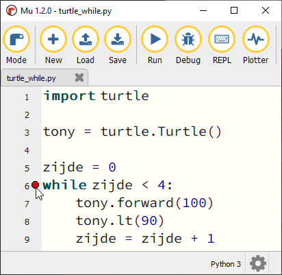
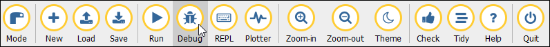
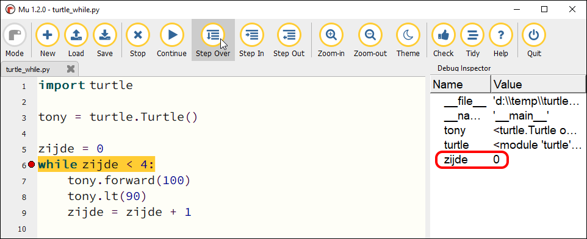

.. role:: python(code)
   :language: python

.. |br| raw:: html

    

For loops
=======================

Een while loop heeft als nadeel dat je er drie regels code voor nodig hebt:

* één om de teller variabele te maken met een assignment statement;
* één waarin het keyword :python:`while` staat, gevolgd door de voorwaarde(n);
* één waarin de waarde van de teller variabele wordt bijgewerkt.

.. code-block:: python

    n = 0
    while n < 10:
        ...
        ...
        n = n + 1
        

.. dropdown:: Wat leer je in dit hoofdstuk
    :open:
    :color: primary
    :icon: book

    * ...

For en range()
--------------

Maak in Mu editor een nieuw bestand, kopieer en plak de onderstaande code erin en sla het op als :file:`turtle_while.py`.

.. code-block:: python
    :linenos:
    :caption: turtle_while.py
    :name: turtle_while_v01

    import turtle

    tony = turtle.Turtle()

    zijde = 0
    while zijde < 4:
        tony.fd(100)
        tony.lt(90)
        zijde = zijde + 1

Run de code om het resultaat te bekijken. Snap je hoe deze code werkt? Het Python keyword :python:`while` in regel 6, kun je vertalen als *terwijl* of *zolang*. En het :python:`<`  symbool betekent *kleiner dan*. Schematisch weergegeven doet de code het volgende:

.. uml::
    :align: center 

    @startuml
    
    start
    :zijde = 0;
    while (zijde < 4) is (True)
        :tony.fd(100);
        :tony.lt(90);
        :zijde = zijde + 1;
    endwhile (False)
    stop
    @enduml

Eerst krijgt de variabele :python:`zijde` de waarde :python:`0`. Vervolgens checkt Python of :python:`zijde` kleiner is dan :python:`4`. Als dat zo is, wordt :python:`tony` vooruit gestuurd en gedraaid. Daarna wordt de waarde van :python:`zijde` met :python:`1` opgehoogd. We springen terug naar regel 6 en Python checkt weer of :python:`zijde` kleiner is dan :python:`4`.

Doordat we de waarde van :python:`zijde` telkens iets groter maken, zal de check in regel 6 op een zeker moment :python:`False` zijn. De uitvoering van de loop stopt, en in dit geval is het programma dan ook afgelopen.  

Debugging mode
----------------

Mu editor biedt de mogelijkheid om de uitvoering van een programma stap voor stap te volgen. Je kunt op die manier goed zien hoe de while loop werkt.

Klik op regel 6 in :file:`turtle_while.py` met de muiscursor in het grijze stukje rechts naast het regelnummer 6 om een zogenoemd **breakpoint** te plaatsen.

Klik daarna op :guilabel:`Debug` bovenin de knoppenbalk.

Nu start Mu editor de uitvoering van de code, maar pauzeert op regel 6, waar je zojuist het breakpoint plaatste. Gebruik de knop :guilabel:`Step over` om de code vanaf het breakpoint telkens een stapje verder uit te voeren. Houd daarbij in de gaten wat er in de turtle tekening gebeurt, maar ook wat de waarde van de variabele :python:`zijde` is. Die waarde wordt in Mu editor aan de rechterkant getoond. 

Begrijp je nu hoe de while loop werkt? Klik op :guilabel:`Stop` om het debuggen te stoppen. 

In de volgende opdrachten ga je je eigen while loops schrijven. Je zult merken dat je met loops mooie patronen kunt tekenen.

Indentation
------------

Kijk nog eens goed naar de regels 7, 8 en 9 van :file:`turtle_while.py`. Deze regels zijn ingesprongen. Dat is belangrijk! Daardoor weet Python dat die drie regels binnen de 'while lus' vallen. In Python bepaalt de inspringing (Engels: indentation) van een coderegel tot welk blok die regel behoort. Kopieer de onderstaande code naar Mu editor (in een bestand :file:`hello_while.py`) om te zien hoe dat werkt:

.. code-block:: python
    :linenos:
    :caption: hello_while.py
    :name: hello_while

    i = 0
    while i < 3:
        print('Deze zin wordt drie keer geprint.')
        print('En deze zin valt ook binnen de while lus.')
        i = i + 1
    print('Maar deze zin wordt slechts één keer geprint.')

De regels 3, 4 en 5 van :file:`hello_while.py` zijn ingesprongen: ze worden voorafgegaan door 4 spaties. Daardoor weet Python dat die regels één blokje vormen binnen de while lus.
Regel 6 is niet ingesprongen en hoort daardoor niet bij het blokje dat wordt herhaald.

Bestudeer nu de volgende code eens, nadat je hem in Mu editor hebt uitgevoerd. Je ziet hier een while lus bínnen een andere while lus.

.. code-block:: python
    :linenos:
    :caption: turtle_while.py
    :name: turtle_while_v02

    import turtle

    tony = turtle.Turtle()

    vierkant = 0
    while vierkant < 3:
        zijde = 0
        while zijde < 4:
            tony.fd(100)        # Deze regels
            tony.lt(90)         # vallen binnen
            zijde = zijde + 1   # de 2e while lus
        tony.pu()
        tony.lt(120)
        tony.fd(100)
        tony.pd()
        vierkant = vierkant + 1

De regels 7 t/m 16 in deze code vallen binnen de while lus die begint op regel 6. Maar in dat blok begint op regel 8 een tweede while lus, die de regels 9 t/m 11 herhaalt. Let op de inspringing van regel 12: die valt niet meer onder de tweede while lus.

Wanneer je in Mu editor op :kbd:`Enter` drukt nadat je regel 6 hebt getypt, springt de volgende regel automatisch in. Wil je handmatig een regel laten inspringen, dan kun je daarvoor de :kbd:`Tab` toets gebruiken (links naast de :kbd:`Q`).

.. dropdown:: Spaties of tabs?
    :open:
    :color: warning
    :icon: alert

    Gebruik voor het inspringen van coderegels nooit de spatiebalk! Ten eerste is het heel onhandig om telkens spaties te moeten tellen, en ten tweede krijg je sneller indentation errors.

    .. figure:: images/keyboard_tab_vs_space.png

    Met de :kbd:`Tab` toets kun je in één keer een grotere inspringing maken. Ook is het mogelijk in Mu editor een aantal regels code te selecteren en vervolgens op :kbd:`Tab` te drukken om die regels tegelijkertijd te laten inspringen; probeer het maar eens. Om ze weer te laten terugspringen gebruik je :kbd:`Shift` + :kbd:`Tab`.

Opdrachten
-----------

.. dropdown:: Opdracht 01
    :open:
    :color: secondary
    :icon: pencil

    Maak een nieuw bestand in Mu editor en sla het op als :file:`driehoeken.py`. Kopieer de code van :file:`turtle_while.py` naar je nieuwe bestand. Pas de code zodanig aan dat in plaats van een vierkant een driehoek met zijden van 100 pixels wordt getekend, uiteraard met gebruikmaking van een while loop. Na het tekenen van een zijde moet de turtle telkens 120 graden draaien.

    .. dropdown:: Oplossing
        :color: secondary
        :icon: check-circle

        .. code-block:: python
            :linenos:
            :caption: driehoeken.py
            :name: turtle_while_opdr01

            # While loops - opdracht 01
            
            import turtle

            tony = turtle.Turtle()

            zijde = 0
            while zijde < 3:
                tony.fd(100)
                tony.lt(120)
                zijde = zijde + 1

.. dropdown:: Opdracht 02
    :open:
    :color: secondary
    :icon: pencil

    Breid de code in :file:`driehoeken.py` van opdracht 01 uit, opdat met behulp van een **while loop binnen een andere while loop** vier driehoeken op een rij worden getekend zoals hieronder afgebeeld.

    .. image:: images/triangles_in_a_row.png
        
    .. dropdown:: Hint
        :color: secondary
        :icon: light-bulb

        Gebruik voor je programma de volgende structuur:

        .. code-block:: python
            :name: turtle_while_opdr02_hint

            # While loops - opdracht 02

            import turtle

            tony = turtle.Turtle()

            driehoek = 0
            while driehoek < 4:
                zijde = 0
                while zijde < 3:
                    ...
                    ...
                    ...
                ...
                ...

    .. dropdown:: Oplossing
        :color: secondary
        :icon: check-circle

        .. code-block:: python
            :linenos:
            :caption: driehoeken.py
            :name: turtle_while_opdr02

            # While loops - opdracht 02

            import turtle

            tony = turtle.Turtle()

            driehoek = 0
            while driehoek < 4:
                zijde = 0
                while zijde < 3:
                    tony.fd(100)
                    tony.lt(120)
                    zijde = zijde + 1
                tony.fd(100)
                driehoek = driehoek + 1

.. dropdown:: Opdracht 03
    :open:
    :color: secondary
    :icon: pencil

    Kopieer de code van :file:`turtle_while.py` naar een nieuw bestand dat je opslaat als :file:`bloem.py`. Breid de code zodanig uit dat met behulp van een **while loop binnen een andere while loop** 20 vierkanten worden getekend, waarbij elk vierkant 18 graden gedraaid is ten opzicht van het vorige. Dit moet de volgende figuur opleveren:
    
    .. image:: images/star_of_squares.png

    .. dropdown:: Hint
        :color: secondary
        :icon: light-bulb

        Je programma bestaat uit twee while loops, waarvan de binnenste het tekenen van één vierkant verzorgt. Na het tekenen van een vierkant moet de turtle 18 graden linksom draaien.

        .. code-block:: python
            :name: turtle_while_opdr03_hint

            ...
            while ...:
                # Deze while loop zorgt voor 20 herhalingen.
                ...
                while ...:
                    # Deze while loop zorgt voor één vierkant.
                    ...
                    ...
                tony.lt(18)  # Draai tony 18 graden linksom
                ...

.. dropdown:: Opdracht 04
    :open:
    :color: secondary
    :icon: pencil

    Maak een nieuw bestand in Mu editor, kopieer onderstaande de code erin en sla het op onder de naam :file:`turtle_dots.py`. 

    .. code-block:: python
        :linenos:
        :emphasize-lines: 8, 10, 12-18
        :caption: turtle_dots.py
        :name: turtle_dots

        import turtle

        tony = turtle.Turtle()
        tony.hideturtle()
        tony.speed(0)

        rij = 0
        while ...:
            kolom = 0
            while ...:
                tony.dot(20, 'red')
                ...
                ...
                ...
                ...
            ...
            ...
            ...
    
    Vervang de puntjes in de gemarkeerde regels door code die ervoor zorgt dat een rooster van 10 bij 10 rode puntjes wordt getekend.

    .. image:: images/red_dots.png

.. dropdown:: Opdracht 05
    :open:
    :color: secondary
    :icon: pencil

    Schrijf een programma dat de onderstaande figuur tekent. Je mag zelf de kleur en de pendikte bepalen, maar voor het daadwerkelijke tekenen mag je **maximaal 5 regels code** gebruiken.

    .. image:: images/five_pointed_star.png
        :align: center

    .. dropdown:: Hint
        :color: secondary
        :icon: light-bulb

        Vind je het lastig om de draaiingshoek te bepalen? Bedenk dan dat de turtle in totaal 2 keer volledig ronddraait (dus de totale draaiingshoek is 2 * 360° = 720°) en dat die volledige draai over 5 stappen wordt verdeeld.

Het wordt nóg interessanter wanneer je de while loop variabele niet alleen als *teller* gebruikt, maar bijvoorbeeld ook aan :python:`turtle.fd()` meegeeft zoals in onderstaand voorbeeld :file:`turtle_spiral.py`.

.. code-block:: python
    :linenos:
    :caption: turtle_spiral.py
    :name: turtle_spiral_v01

    import turtle

    tony = turtle.Turtle()

    lengte = 2
    while lengte < 300:
        tony.fd(lengte)
        tony.lt(30)
        lengte = lengte + 2

Deze code tekent eerst een lijnstukje van 2 pixels, vervolgens een lijnstukje van 4 pixels, dan 6 pixels, dan 8 pixels, enzovoort. En tussendoor draait de turtle telkens 30 graden. Kijk maar eens wat dat oplevert, door de code in Mu editor uit te proberen.

.. dropdown:: Opdracht 06
    :open:
    :color: secondary
    :icon: pencil

    Experimenteer met de code in :file:`turtle_spiral.py` door telkens één getal een te veranderen en te bekijken hoe de figuur verandert. Je zou :python:`tony` bijvoorbeeld telkens 91° kunnen laten draaien in plaats van 30°. En wat gebeurt er als je op regel 8 :python:`tony.lt(30)` vervangt door :python:`tony.lt(lengte)` of :python:`tony.lt(3 * lengte)`? Probeer maar uit!

.. dropdown:: Opdracht 07
    :open:
    :color: secondary
    :icon: pencil

    Kopieer onderstaande code in een nieuw bestand, dat je opslaat als :file:`turtle_veelhoeken.py`.

    .. code-block:: python
        :linenos:
        :caption: turtle_veelhoeken.py

        import turtle

        tony = turtle.Turtle()

        aantal_hoeken = 5
        draaiingshoek = ...

        hoek = ...
        while ...:
            tony.fd(100)
            tony.lt(draaiingshoek)
            hoek = hoek + 1  

    Op regels 6, 8 en 9 ontbreekt code. Vul zelf in wat op de puntjes moet staan, opdat het programma een regelmatige vijfhoek tekent.

    Wanneer je vervolgens in regel 5 de waarde van :python:`aantal_hoeken` wijzigt naar bijvoorbeeld 7, zou een regelmatige zevenhoek moeten worden getekend.

    Gelukt? Breid dan je programma uit met een :python:`input()` aanroep waarmee aan de gebruiker wordt gevraagd hoeveel hoeken de veelhoek moet hebben en sla het antwoord van de gebruiker op in :python:`aantal_hoeken`.  