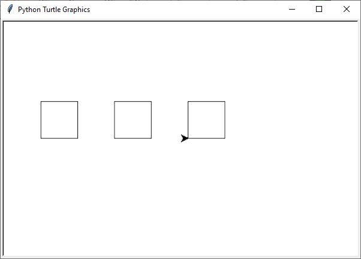
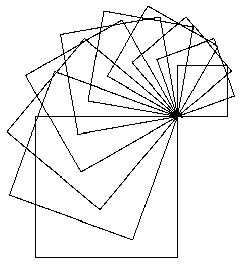

.. role:: python(code)
   :language: python

.. |br| raw:: html

    

Functies
========

In Python kun je een functie herkennen aan haakjes achter de naam. Bijvoorbeeld :python:`print()` en :python:`turtle.penup()` zijn functies. Aan sommige functies kun je informatie meegeven waarmee de functie iets moet doen. Die informatie zet je dan tussen de haakjes. Bijvoorbeeld :python:`print('Hello, World!')` geeft aan dat de functie :python:`print()` de tekst :python:`'Hello, World!'` moet afdrukken. Er zijn ook functies die geen informatie nodig hebben, zoals :python:`turtle.penup()`, maar toch moet je de haakjes typen, omdat Python anders niet snapt dat je een functie aanroept.

.. dropdown:: Wat leer je in dit hoofdstuk
    :open:
    :color: primary
    :icon: book

    * Hoe maak je je eigen functies in Python.
    * Wat is het verschil tussen een functiedefinitie en een functieaanroep.
    * Hoe maak je een functie die input kan ontvangen.

Het :python:`def` keyword
-------------------------

Om een functie te maken heb je het :python:`def` keyword nodig. Keywords zijn woorden met een speciale betekenis in Python. Je kent bijvoorbeeld al de keywords :python:`while` en :python:`for` om loops te maken en je hebt in het :ref:`hoofdstuk Variabelen <python-keywords>` een overzicht van de Python keywords gezien. Met het :python:`def` keyword **def**\inieer je een functie.

Kopieer onderstaande code naar een nieuw bestand in Mu editor en sla het op als function_square.py. 

.. code-block:: python
    :linenos:
    :caption: function_square.py
    :name: function_square_v01

    import turtle

    tony = turtle.Turtle()

    # Functie square() tekent een vierkant
    def square():
        z = 0
        while z < 4:
            tony.fd(50)
            tony.lt(90)
            z = z + 1

Wanneer je :file:`function_square.py` runt, zul je zien dat er niets gebeurt! Daar is een goede reden voor. In regel 6 wordt de functie :python:`square()` gedefinieerd. Let op de dubbele punt :python:`:` aan het einde van de regel. Net als bij de while loop moeten de coderegels die binnen de functie horen ingesprongen zijn. Python weet dat het deze regels pas moet uitvoeren wanneer de functie wordt aangeroepen. En dat is waarom er niets gebeurt: de functie is nog niet aangeroepen. Dat is snel op te lossen door een coderegel toe te voegen:

.. code-block:: python
    :linenos:
    :emphasize-lines: 13, 14
    :caption: function_square.py
    :name: function_square_v02

    import turtle

    tony = turtle.Turtle()

    # Functie square() tekent een vierkant
    def square():
        z = 0
        while z < 4:
            tony.fd(50)
            tony.lt(90)
            z = z + 1

    # Hoofdprogramma
    square()

Het commentaar op regels 5 en 13 is voor Python niet interessant (Python negeert commentaar bij het uitvoeren van het programma), maar maakt de code wel beter leesbaar. Met :python:`# Hoofdprogramma` in regel 13 geven we aan dat vanaf daar het eigenlijke programma begint. In regel 14 roepen we de functie :python:`square()` aan, waardoor het vierkant daadwerkelijk wordt getekend. Probeer maar.

Het is belangrijk twee zaken goed te onderscheiden:

.. grid:: 2

    .. grid-item-card:: Functiedefinitie
        :class-card: bgcolor-khaki

        Een functiedefinitie is de code die de functie beschrijft. In de functiedefinitie staat wat de functie doet. De functie wordt nog niet uitgevoerd; dat gebeurt pas wanneer hij wordt aangeroepen.

        In :file:`function_square.py` bevatten de regels 6 t/m 11 de functiedefinitie.

    .. grid-item-card:: Functieaanroep
        :class-card: bgcolor-khaki

        De functieaanroep staat in het hoofdprogramma (of in de definitie van een andere functie). De functieaanroep zorgt ervoor dat de functie daadwerkelijk wordt uitgevoerd.

        In :file:`function_square.py` staat op regel 14 de functieaanroep. Merk op dat op regels 9 en 10 ook functieaanroepen staan: :python:`tony.fd(50)` en :python:`tony.lt(90)`.

Elke keer dat we nu een vierkantje met zijden van 50 pixels willen tekenen, hoeven we slechts de functie :python:`square()` aan te roepen. Dat scheelt een hoop typwerk. Wijzig de code in :file:`function_square.py` als volgt:

.. code-block:: python
    :linenos:
    :emphasize-lines: 17, 21, 25
    :caption: function_square.py
    :name: function_square_v03

    import turtle

    tony = turtle.Turtle()

    # Functie square() tekent een vierkant
    def square():
        z = 0
        while z < 4:
            tony.fd(50)
            tony.lt(90)
            z = z + 1

    # Hoofdprogramma
    tony.pu()
    tony.goto(-200, 0)
    tony.pd()
    square()
    tony.pu()
    tony.goto(-100, 0)
    tony.pd()
    square()
    tony.pu()
    tony.goto(0, 0)
    tony.pd()
    square()

Dit programma tekent drie vierkantjes:

Uiteraard kunnen we dit efficiënter doen met een loop. Probeer de code hieronder maar eens, die tien vierkantjes tekent.

.. code-block:: python
    :linenos:
    :emphasize-lines: 14-23
    :caption: function_square.py
    :name: function_square_v03

    import turtle

    tony = turtle.Turtle()

    # Functie square() tekent een vierkant
    def square():
        z = 0
        while z < 4:
            tony.fd(50)
            tony.lt(90)
            z = z + 1

    # Hoofdprogramma
    tony.pu()
    tony.goto(-375, 0)
    tony.pd()
    vierkant = 0
    while vierkant < 10:
        square()
        tony.pu()
        tony.fd(75)
        tony.pd()
        vierkant = vierkant + 1

.. dropdown:: Opdracht 01
    :color: secondary
    :icon: pencil

    Maak een nieuw bestand in Mu editor met de naam :file:`function_triangle.py`. Schrijf een functie :python:`triangle()` die een driehoekje tekent met zijden van 80 pixels en hoeken van 60°. Gebruik de onderstaande structuur.
    Roep de functie :python:`triangle()` in het hoofdprogramma aan om de driehoek te tekenen. 

    .. code-block:: python
        :caption: function_triangle.py
        :name: function_triangle_opdracht_1

        import turtle

        tony = turtle.Turtle()

        # Functie triangle() tekent een gelijkzijdige driehoek
        ...

        # Hoofdprogramma
        ...

    .. dropdown:: Hint
        :color: secondary
        :icon: light-bulb

        Om een driehoek met hoeken van 60° te maken, moet je de turtle telkens 120° laten draaien.

.. dropdown:: Opdracht 02
    :color: secondary
    :icon: pencil

    Wijzig de code in :file:`function_triangle.py` uit opdracht 01 zodat niet één driehoek wordt getekend, maar vijf driehoeken op een rij, zoals in onderstaande figuur. Hiervoor heb je slechts 5 regels code nodig in je hoofdprogramma.

    .. image:: images/function_triangle.png

Argumenten en parameters
------------------------

Aan de functie :python:`square()` kun je geen informatie tussen de haakjes meegeven. Maar zou het niet handig zijn als we :python:`square(100)` konden gebruiken om een vierkant met zijden van 100 pixels te tekenen en :python:`square(200)` voor zijden van 200 pixels? Ja dat zou heel handig zijn! We willen dus graag informatie kunnen meegeven aan onze functies. In Python noem je die informatie *argumenten*. Om argumenten mee te kunnen geven aan een functie, voeg je aan de functiedefinitie *parameters* toe. Het volgende voorbeeld maakt het verschil tussen argumenten en parameters duidelijk.

.. code-block:: python
    :caption: arguments_and_parameters.py
    :linenos:

    # Functie begroet()
    def begroet(naam):          # naam is een parameter
        print(f'Hallo {naam}!')

    # Hoofdprogramma
    begroet('Alan')             # 'Alan' is een argument

Bij het aanroepen van de functie :python:`begroet()` in regel 6 geven we het argument :python:`'Alan'` mee. Dit argument wordt door de functie ontvangen in de parameter :python:`naam`. De functie :python:`begroet()` zal dan de tekst :python:`'Hallo Alan!'` afdrukken. 

.. grid:: 2

    .. grid-item-card:: Parameter
        :class-card: bgcolor-khaki

        Een parameter is een variabele die tussen de haakjes in een functiedefinitie staat. In het voorbeeld hieronder zijn :python:`a` en :python:`b` parameters.

        .. code-block:: python

            def print_som(a, b):
                uitkomst = a + b
                print(f'{a} + {b} = {uitkomst}')  

    .. grid-item-card:: Argument
        :class-card: bgcolor-khaki

        Een argument is een waarde die je tussen haakjes meegeeft in een functieaanroep. In het voorbeeld hieronder zijn :python:`3` en :python:`4` argumenten.

        .. code-block:: python

            print_som(3, 4)          

Terug naar onze turtle functies. We gaan de functie :python:`square()` aanpassen zodat het mogelijk wordt om één argument mee te geven: de zijdelengte. Maak weer een nieuw bestand in Mu editor en noem het :file:`turtle_functions.py`. In dit bestand zullen we namelijk meerdere verschillende functies gaan definiëren. Kopieer onderstaande code naar het bestand.

.. code-block:: python
    :linenos:
    :caption: turtle_functions.py
    :name: turtle_functions_v01

    import turtle

    tony = turtle.Turtle()

    # Functie square() tekent een vierkant
    def square(side_length):
        for i in range(4):
            tony.fd(side_length)
            tony.lt(90)
            
    # Hoofdprogramma
    square(200)

Deze code lijkt sterk op :ref:`function_square_v02`. Op regel zes is tussen de haakjes echter de parameter :python:`side_length` toegevoegd. Deze parameter wordt in regel 8 gebruikt in de aanroep :python:`tony.fd(side_length)`. Door deze eenvoudige toevoegingen kunnen we nu in regel 12 een argument meegeven aan de functie: :python:`square(200)`. |br| Overigens is er nog een verschil met  :ref:`function_square_v02`: in plaats van een :python:`while` loop gebruiken we een :python:`for` loop. Dit is efficiënter en levert minder typwerk op.

Nu we een argument aan :python:`square()` kunnen meegeven, hebben we nog meer mogelijkheden om te spelen met loops. Gebruik bijvoorbeeld de loopvariabele als volgt:

.. code-block:: python
    :linenos:
    :caption: turtle_functions.py
    :name: turtle_functions_v02

    import turtle

    tony = turtle.Turtle()

    # Functie square() tekent een vierkant
    def square(side_length):
        for i in range(4):
            tony.fd(side_length)
            tony.lt(90)
            
    # Hoofdprogramma
    for i in range(10):
        square(100 + 20 * i)
        tony.lt(20)

De for loop zorgt er nu voor dat 10 vierkanten worden getekend. De eerste met zijden van 100 + 20 * 0 = 100 pixels, de tweede met zijden van 100 + 20 * 1 = 120 pixels, de derde met zijden van 100 + 20 * 2 = 140 pixels, enzovoort. En tussen elk vierkant draait de turtle 20 graden. Het resultaat is een mooie spiraal van vierkanten.

.. dropdown:: Opdracht 03
  :color: secondary
  :icon: pencil

  Voeg aan :file:`turtle_functions.py` de functie :python:`triangle(side_length)` toe, die een driehoekje tekent met zijden met lengte :python:`side_length` en hoeken van 60°. Plaats deze functie onder de :python:`square(side_length)` functie, maar boven het hoofdprogramma. Vervang vervolgens in het hoofdprogramma de aanroep van :python:`square()` door een aanroep van :python:`triangle()`. De structuur ziet er dus zo uit: 

  .. code-block:: python
      :caption: turtle_functions.py
      :name: turtle_functions_opdracht_03

      import turtle

      tony = turtle.Turtle()

      # Functie square() tekent een vierkant
      def square(side_length):
          ...

      # Functie triangle() tekent een driehoek
      def triangle(side_length):
          ...
              
      # Hoofdprogramma
      for i in range(10):
          triangle(100 + 20 * i)
          tony.lt(20)

.. dropdown:: Opdracht 04
  :color: secondary
  :icon: pencil

  Voeg aan :file:`turtle_functions.py` de functie :python:`teleport(x, y)` toe, die de turtle verplaatst naar het punt met coördinaten (x, y) zonder een lijn te tekenen. De functie bestaat uit drie regels code:

  1.  Een instructie om de pen van het papier te halen.
  2.  Een verplaatsing naar het punt (x, y).
  3.  Een instructie om de pen weer op het papier te zetten.

  Plaats je functie weer boven het hoofdprogramma. Test vervolgens de functie met het volgende hoofdprogramma:

  .. code-block:: python
      :caption: turtle_functions.py
      :name: turtle_functions_opdracht_04

      ...

      # Hoofdprogramma
      for i in range(20):
          teleport(-10 * i, -10 * i)
          square(40 + 20 * i)
 
  .. dropdown:: Resultaat
      :color: secondary
      :icon: eye-closed

      Je code zou in de volgende tekening moeten resulteren:

      .. image:: images/turtle_functions_wormhole_of_squares.png

  .. dropdown:: Oplossing
      :color: secondary
      :icon: check-circle

      .. code-block:: python
          :linenos:
          :emphasize-lines: 17-21
          :caption: turtle_functions.py
          :name: turtle_functions_opdracht_03_antwoord

          import turtle

          tony = turtle.Turtle()

          # Functie square() tekent een vierkant
          def square(side_length):
              for i in range(4):
                  tony.fd(side_length)
                  tony.lt(90)
                  
          # Functie triangle() tekent een vierkant
          def triangle(side_length):
              for i in range(3):
                  tony.fd(side_length)
                  tony.lt(120)   

          # Functie teleport() verplaatst de turtle zonder te tekenen   
          def teleport(x, y):
              tony.pu()
              tony.goto(x, y)
              tony.pd()
                  
          # Hoofdprogramma
          for i in range(20):
              teleport(-10 * i, -10 * i)
              square(40 + 20 * i)
    
.. dropdown:: Opdracht 05
    :color: secondary
    :icon: pencil

    :bdg-secondary:`Uitdaging!`

    Voeg aan :file:`turtle_functions.py` de functie :python:`veelhoek(aantal_hoeken)` toe, die een regelmatige veelhoek tekent.

    Test je functie met de volgende aanroepen:

    * :python:`veelhoek(3)`
    * :python:`veelhoek(4)`
    * :python:`veelhoek(5)`

    Met deze aanroepen zouden achtereenvolgens een driehoek, een vierkant en een vijfhoek moeten worden getekend.

.. dropdown:: Opdracht 06
    :color: secondary
    :icon: pencil

    :bdg-secondary:`Uitdaging!`
    
    Breid de functie :python:`veelhoek(aantal_hoeken)` uit naar :python:`veelhoek(aantal_hoeken, kleur)` zodat je bij een aanroep tussen de haakjes ook een kleur mee kunt geven waarin de veelhoek moet worden getekend.

    Test je functie met bijvoorbeeld de volgende aanroepen:

    * :python:`veelhoek(3, "red")`
    * :python:`veelhoek(4, "green")`
    * :python:`veelhoek(5, "blue")`

    Met deze aanroepen zouden achtereenvolgens een rode driehoek, een groen vierkant en een blauwe vijfhoek moeten worden getekend.