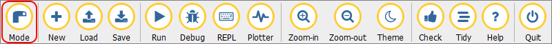
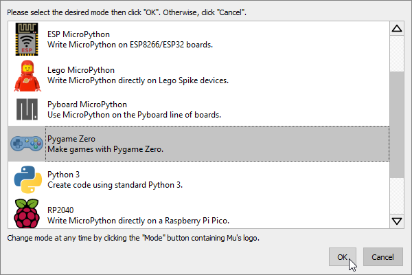

.. role:: python(code)
   :language: python

.. |br| raw:: html

    

Samenvatting Pygame Zero H1 t/m H4
====================================

Voor de toets in maart over Pygame Zero moet je de volgende technieken beheersen:

.. dropdown:: Kennen en kunnen voor de toets
    :open:
    :color: primary
    :icon: book

    * Mu Editor in Pygame Zero mode zetten.
    * De vensterafmetingen van een game instellen.
    * Een Actor variabele (met een sprite) aanmaken.
    * De Actor tonen in het gamevenster.
    * De Actor nauwkeurig positioneren in het gamevenster (bijvoorbeeld exact in het midden, tegen een rand aan, in een hoek).
    * De Actor laten bewegen met een bepaalde snelheid, horizontaal, verticaal en schuin.
    * Detecteren wanneer de Actor het venster verlaat of een vensterrand raakt en vervolgens een actie uitvoeren (bijvoorbeeld de Actor terug laten bewegen of verplaatsen naar een andere positie).
    * De game laten reageren op muisklikken met behulp van de on_mouse_down() functie.
    * De game laten reageren op toetsenbordactiviteit door in de update() functie met een if statement te checken of een toets wordt ingedrukt. Je moet bijvoorbeeld met de pijltjestoetsen de Actor kunnen laten bewegen.

Hieronder wordt elke techniek nog eens kort toegelicht.

Mu Editor in Pygame Zero mode zetten
-------------------------------------
Klik in Mu Editor op de :guilabel:`Mode` knop en kies vervolgens uit de lijst voor Pygame Zero.

Vensterafmetingen instellen
----------------------------
De vensterafmetingen van een game stel je in met de constanten :python:`WIDTH` en :python:`HEIGHT`. Let op het gebruik van hoofdletters en maak geen typfouten in de namen.

.. code-block:: python

   # Vensterafmetingen
   WIDTH = 800
   HEIGHT = 600

Actor variabele aanmaken
-------------------------
Een Actor variabele maak je aan met de functie :python:`Actor()`. Je kunt de naam van een sprite meegeven als argument, uiteraard tussen aanhalingstekens.

.. code-block:: python

   # Actors
   player_01 = Actor('alien_pink')
   player_02 = Actor('alien_green')

Mu Editor zoekt de sprites in de map :file:`images` die in dezelfde map staat als je Python bestand. Om zeker te weten dat je sprites op de goede plek staan, kun je in Mu Editor op de knop :guilabel:`Images` klikken. Mu Editor opent dan de juiste map. Staan je sprites daar niet? Dan werkt je game niet.

Wil je dit zelf proberen, download dan de sprites :download:`alien_pink.png <../game_assets/alien/images/alien_pink.png>` en :download:`alien_green.png <../game_assets/alien/images/alien_green.png>` en plaats ze in de juiste :file:`images` map.

Actor tonen in het gamevenster
-------------------------------
Om een Actor te tonen in het gamevenster, roep je de :python:`.draw()` functie van de Actor variabele aan in de :python:`draw()` functie van je game.

.. code-block:: python

   # draw() functie van de game
   def draw():
      player_01.draw()
      player_02.draw()

Elke Actor variabele heeft zijn eigen :python:`.draw()` functie, die je aanroept met de punt-notatie.

Actor positioneren
-------------------
Voor het positioneren van de Actor moet je goed begrijpen hoe coördinaten in Pygame werken. De linkerbovenhoek van het gamevenster is het punt :python:`(0, 0)`. De x-coördinaat neemt toe naar rechts en de y-coördinaat neemt toe naar beneden. De rechteronderhoek van het gamevenster is dus :python:`(WIDTH, HEIGHT)`.

Elke Actor heeft een :python:`.x` en :python:`.y` variabele. Je kunt de waarden van deze variabelen instellen om de Actor te positioneren.

.. code-block:: python

   # Startposities
   # player_01 begint op (100, 300)
   player_01.x = 100
   player_01.y = 300
   # player_02 begint op (700, 300)
   player_02.x = 700
   player_02.y = 300

Wil je een Actor exact in het midden van het gamevenster plaatsen, gebruik dan de constanten :python:`WIDTH` en :python:`HEIGHT`.

.. code-block:: python

   # player_01 begint in het midden van het venster
   player_01.x = WIDTH / 2
   player_01.y = HEIGHT / 2

Ook als je een Actor op een bepaalde afstand van de rechter- of onderkant van het venster wilt plaatsen, gebruik je de constanten :python:`WIDTH` en :python:`HEIGHT`.

.. code-block:: python

   # player_02 begint op 50 pixels van de rechterrand 
   # en 200 pixels van de onderrand
   player_02.x = WIDTH - 50
   player_02.y = HEIGHT - 200

De variabelen :python:`.x` en :python:`.y` bevatten de coördinaten van het middelpunt van de sprite. Soms wil je echter niet het middelpunt positioneren, maar bijvoorbeeld de rechterbovenhoek van de sprite, of de linkeronderhoek. Dan gebruik je de variabelen :python:`.left`, :python:`.right`, :python:`.top` en :python:`.bottom`.

.. code-block:: python

   # player_01 begint in linksonder in het venster
   # plaats de linkeronderhoek van de sprite op (0, HEIGHT)
   player_01.left = 0
   player_01.bottom = HEIGHT

   # player_02 begint in rechtsboven in het venster
   # plaats de rechterbovenhoek van de sprite op (WIDTH, 0)
   player_02.right = WIDTH
   player_02.top = 0

Actor laten bewegen
--------------------
Om een Actor te laten bewegen, verander je de waarden van de :python:`.x` en :python:`.y` variabelen in de :python:`update()` functie van je game. Deze functie wordt automatisch 60 keer per seconde aangeroepen.

.. code-block:: python

   # update() functie van de game
   def update():
      # beweeg player_01 1 pixel naar rechts
      player_01.x += 1
      # beweeg player_02 2 pixels omhoog
      player_02.y -= 2

Wil je de Actor schuin laten bewegen, dan moet je zowel de :python:`.x` als de :python:`.y` variabele veranderen.

.. code-block:: python

   # update() functie van de game
   def update():
      # beweeg player_01 naar linksonder
      player_01.x -= 5
      player_01.y += 5

Denk eraan dat je in de :python:`draw()` functie :python:`screen.clear()` aanroept om de achtergrond te verversen. Anders blijven de oude posities van de Actors zichtbaar.

.. code-block:: python

   # draw() functie van de game
   def draw():
      screen.clear()
      player_01.draw()
      player_02.draw()

Detecteren van vensterranden
-----------------------------
In de :python:`update()` functie kun je controleren of een Actor het venster verlaat. Je doet dat met een :python:`if` statement. Je gebruikt hierbij vaak de variabelen :python:`.left`, :python:`.right`, :python:`.top` en :python:`.bottom` van de Actor en de constanten :python:`WIDTH` en :python:`HEIGHT` van het venster.

.. code-block:: python

   # update() functie van de game
   def update():
      # beweeg player_01 naar rechts
      player_01.x += 3
      # als player_01 de rechterrand raakt, zet hem dan terug naar de linkerrand
      if player_01.right > WIDTH:
         player_01.left = 0

In de code hierboven wordt de Actor naar de linkerkant van het venster verplaatst zodra zijn rechterkant voorbij de rechter vensterrand komt. Je kunt ook wachten tot de Actor helemaal uit beeld is verdwenen:

.. code-block:: python

   # update() functie van de game
   def update():
      # beweeg player_01 naar rechts
      player_01.x += 3
      # als player_01 rechts buiten beeld is, zet hem dan terug naar links buiten beeld
      if player_01.left > WIDTH:
         player_01.right = 0

In bovenstaande code gebeurt er pas iets zodra de linkerkant van de Actor voorbij de rechter vensterrand is. De Actor wordt dan links net buiten beeld geplaatst.

Als je de bewegingsrichting van de Actor wilt veranderen zodra hij een vensterrand raakt, dan heb je een extra variabele nodig die de snelheid van de Actor bevat. Deze variabele kun je dan veranderen van positief naar negatief of andersom.

.. code-block:: python

   player_01 = Actor('alien_pink')
   player_01.speed = 3

   # update() functie van de game
   def update():
      player_01.x += player_01.speed

      if player_01.right >= WIDTH:
         player_01.speed = -3
      elif player_01.left <= 0:
         player_01.speed = 3

Bovenstaande code kun je korter schrijven op de volgende manier:

.. code-block:: python

   player_01 = Actor('alien_pink')
   player_01.speed = 3

   # update() functie van de game
   def update():
      player_01.x += player_01.speed

      if (player_01.right >= WIDTH) or (player_01.left <= 0):
         player_01.speed = -player_01.speed

Uiteraard kun je deze technieken ook gebruiken met de boven- en onderkant van het venster.

Reageren op muisklikken
------------------------
Voor het reageren op muisklikken gebruik je de :python:`on_mouse_down()` functie. Deze functie wordt automatisch aangeroepen zodra de speler op een muisknop drukt. Via de parameters :python:`button` en :python:`pos` kun je achterhalen welke muisknop is ingedrukt en waar de muiscursor zich bevindt.

.. code-block:: python

   # on_mouse_down() event handler
   def on_mouse_down(button, pos):
      if button == mouse.LEFT:
         print(f'Linkermuisknop ingedrukt op positie {pos}.')
      elif button == mouse.RIGHT:
         print(f'Rechtermuisknop ingedrukt op positie {pos}.') 

Met de collision detection functie :python:`.collidepoint()` van de Actor kun je controleren of de muisklik op de Actor was.

.. code-block:: python

   # on_mouse_down() event handler
   def on_mouse_down(button, pos):
      if player_01.collidepoint(pos):
         print('De roze alien is aangeklikt!')
      elif player_02.collidepoint(pos):
         print('De groene alien is aangeklikt!')

