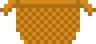
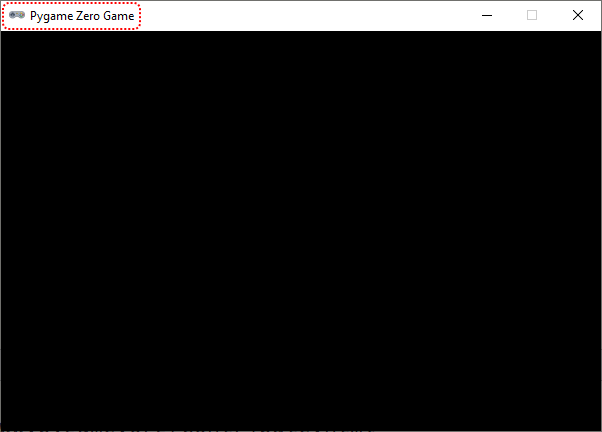
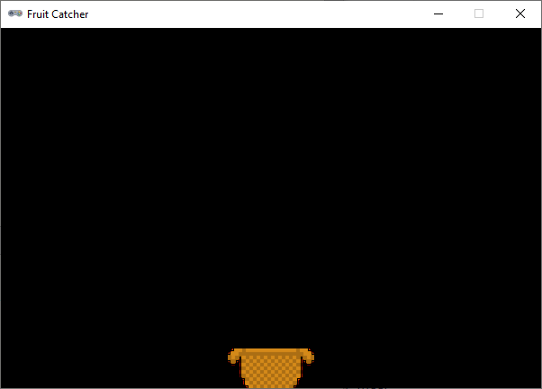

.. role:: python(code)
   :language: python

.. |br| raw:: html

    

De basket
=============

Je beschikt over de benodigde assets voor Fruitcatcher en je hebt een leeg codebestand, dus je bent klaar om te gaan programmeren. Laten we beginnen met het programmeren van het mandje. Dat moet onderin het venster heen en weer bewegen wanneer de speler op de pijltjestoetsen drukt.

Vensterinstellingen
-------------------

Zoals je eerder zag, begint het maken van een spel in Python met het instellen van de vensterafmetingen. Voor Fruitcatcher heb je een venster nodig van 600 pixels breed en 400 pixels hoog. 

.. dropdown:: Opdracht 01
   :color: secondary
   :icon: pencil

   Typ drie regels in je codebestand. Begin met een commentaarregel waarin je aangeeft dat je de vensterinstellingen gaat programmeren. Geef op de volgende twee regels de Pygame Zero constanten :python:`WIDTH` en :python:`HEIGHT` de juiste waarden, opdat je een venster krijgt van 600 bij 400 pixels. 

   .. dropdown:: Commentaar
    :color: warning
    :icon: alert
    :open:

    Commentaar is belangrijk! Dit programma gaat uiteindelijk vele coderegels bevatten en commentaar zorgt ervoor dat je straks zelf nog de weg kunt vinden in je code. Ook maakt het je code beter leesbaar voor anderen.

   .. dropdown:: Oplossing
      :color: secondary
      :icon: check-circle

      .. code-block:: python
         :class: no-copybutton
         :linenos:
         :caption: fruitcatcher.py

         # Vensterinstellingen
         WIDTH = 600
         HEIGHT = 400

Als je opdracht 01 goed hebt gedaan en je code runt, verschijnt het lege venster. Hoewel, leeg? In de titelbalk staat Pygame Zero Game.

Het is natuurlijk mooier als daar de naam van je spel staat. Ook dit is een vensterinstelling. Door de Pygame Zero constante :python:`TITLE` een waarde te geven, kun je de tekst in de titelbalk aanpassen. 

.. dropdown:: Opdracht 02
   :color: secondary
   :icon: pencil

   Voeg een regel aan je code toe waarin je de constante :python:`TITLE` de waarde :python:`Fruit Catcher` geeft. Run je code om te testen of het werkt.

De basket sprite
----------------

Voor de basket sprite maak je een :python:`Actor` variabele aan:

.. code-block:: python
    :class: no-copybutton
    :linenos:
    :caption: fruitcatcher.py
    :emphasize-lines: 6,7

    # Vensterinstellingen
    WIDTH = 600
    HEIGHT = 400
    TITLE = 'Fruit Catcher'

    # Sprite voor het mandje
    basket = Actor('basket')

Voor het tekenwerk hebben we weer een :python:`draw()` functie nodig en voor de beweging een :python:`update()` functie. Omdat we de :python:`update()` functie pas later gaan invullen en Python geen *lege* functies accepteert, gebruiken we het keyword :python:`pass`. Dat betekent 'doe niets'. Hieronder zie je de code.

.. code-block:: python
    :class: no-copybutton
    :linenos:
    :caption: fruitcatcher.py
    :emphasize-lines: 9-15

    # Vensterinstellingen
    WIDTH = 600
    HEIGHT = 400
    TITLE = 'Fruit Catcher'

    # Sprite voor het mandje
    basket = Actor('basket')

    # Draw() functie
    def draw():
        basket.draw()
        
    # Update() functie
    def update():
        pass

.. dropdown:: Copy paste?
    :color: warning
    :icon: alert
    :open:

    Natuurlijk kun je de code hierboven kopiëren naar je eigen programma, maar het is beter om het over te typen. Door zelf te typen denk je automatisch na over de code en begrijp je beter wat je doet.

Startpositie
-------------

Bij aanvang van het spel moet de mand midden onderin het venster staan. Wanneer de speler tijdens het spel een leven verliest, moet de mand ook weer terug naar het midden. Daarom is het handig voor deze startpositie een aparte functie te maken. Deze noemen we :python:`init_basket()`. De term :python:`init` komt van *initialiseren*, wat betekent *gereed maken voor een eerste gebruik*.

Voeg de volgende regels aan je programma toe:

.. code-block:: python
    :class: no-copybutton
    :linenos:
    :caption: fruitcatcher.py
    :emphasize-lines: 9-11,21-22

    # Vensterinstellingen
    WIDTH = 600
    HEIGHT = 400
    TITLE = 'Fruit Catcher'

    # Sprite voor het mandje
    basket = Actor('basket')

    # Initialisatie mandje
    def init_basket():
        pass

    # Draw() functie
    def draw():
        basket.draw()
        
    # Update() functie
    def update():
        pass
        
    # HOOFDPROGRAMMA
    init_basket()

Op regel 11 zie je wederom het keyword :python:`pass` omdat de functie nu nog leeg is. Op regel 22 wordt in het hoofdprogramma de functie :python:`init_basket()` aangeroepen. Nu heeft dat nog geen enkel effect maar zodra je de functie van code voorziet, verandert dat.

.. dropdown:: Opdracht 03
    :color: secondary
    :icon: pencil

    Vervang het :python:`pass` keyword in de :python:`init_basket()` functie door code die ervoor zorgt dat de mand midden onderin het venster wordt gepositioneerd. De onderkant van het mandje moet precies de onderkant van het venster raken. |br|
    Let op: je mag in deze code slechts één getal gebruiken!

    .. dropdown:: Hint 1
        :color: secondary
        :icon: light-bulb

        Gebruik twee regels code: één om de horizontale positie van de mand in te stellen en één voor de verticale positie.   

    .. dropdown:: Hint 2
        :color: secondary
        :icon: light-bulb

        Gebruik de constanten WIDTH en HEIGHT in je code.

Als je opdracht 03 goed hebt uitgevoerd, staat de mand nu precies midden onderin het venster:

.. dropdown:: Functieaanroepen
    :color: info
    :icon: info
    :open:

    Zoals je eerder hebt geleerd, wordt een functie pas uitgevoerd wanneer je hem aanroept. Verwijder de aanroep van :python:`init_basket()` maar eens uit het hoofdprogramma (of beter: maak er commentaar van door er een :python:`#` voor te zetten). Je ziet dan dat het mandje weer op de standaardpositie linksboven wordt gezet.

    Maar hoe zit het dan met de :python:`draw()` en de :python:`update()` functies? Die worden in het hoofdprogramma niet aangeroepen, maar tóch wordt de mand getekend. Dat komt doordat deze twee functies bijzonder zijn. Ze worden automatisch door Pygame aangeroepen; de :python:`update()` functie 60 keer per seconde en de :python:`draw()` functie wanneer Pygame merkt dat het nodig is.

Besturing
---------

We willen dat het mandje beweegt wanneer de speler een pijltjestoets indrukt. Het indrukken van een toets is een *event*. Bij het :ref:`Alien spel <alien-events>` gebruikte je de :python:`on_mouse_down()` functie om te reageren op muisklik events. Pygame Zero beschikt ook over een :python:`on_key_down()` functie waarmee je keyboard events kunt afhandelen. Deze heeft echter als nadeel dat het gedurende langere tijd ingedrukt *houden* van een toets niet wordt gedetecteerd. Daarom gebruiken we voor Fruitcatcher een andere manier: de :python:`update()` functie. Deze wordt 60 keer per seconde uitgevoerd. Als we in de :python:`update()` functie checken of de speler op dat moment een pijltjestoets ingedrukt houdt, kunnen we de mand laten bewegen.

Vervang het :python:`pass` keyword in de :python:`update()` functie door de volgende code:

.. code-block:: python
    :class: no-copybutton
    :caption: fruitcatcher.py
    :emphasize-lines: 3-7

    # Update() functie
    def update():
        # Keyboard events
        if keyboard.left:
            pass
        elif keyboard.right:
            pass

.. dropdown:: Opdracht 04
    :color: secondary
    :icon: pencil

    Vervang de :python:`pass` keywords in de zojuist toegevoegde regels door code die ervoor zorgt dat de :python:`basket` sprite naar links of naar rechts beweegt.

    .. dropdown:: Hint
        :color: secondary
        :icon: light-bulb

        Om de horizontale positie van de mand te wijzigen, kun je het beste de :python:`basket.x` variabele gebruiken.

.. dropdown:: Opdracht 05
    :color: secondary
    :icon: pencil

    Je loopt nu tegen hetzelfde probleem aan als bij het :ref:`Alien spel <no-screen-clear>`: de mand beweegt, maar 'oude versies' van de mand blijven zichtbaar.
    
    .. figure:: images/basket_no_clear.png
    
    Los dit op zoals je ook bij het Alien spel deed.

.. dropdown:: Opdracht 06
    :color: secondary
    :icon: pencil

    Het is mogelijk om de mand uit het venster te laten verdwijnen. Voeg aan je :python:`if` statement in de :python:`update()` functie code toe die ervoor zorgt dat dat niet gebeurt. Je kunt dit op meerdere manieren doen.

    .. dropdown:: Hint manier 1
        :color: secondary
        :icon: light-bulb

        Je zou na het huidige :python:`if` statement een nieuw :python:`if` statement kunnen toevoegen dat checkt of de rechterkant van de mand zich rechts van de rechterzijde van het venster bevindt. Als dat het geval is, zorgt het statement ervoor dat de recherzijde van de mand precies gelijk wordt aan de rechterzijde van het scherm.

        .. grid:: 3

            .. grid-item::
                :columns: 5

                .. image:: images/basket_right_out_of_bounds.png

            .. grid-item:: 
                :columns: 2
                :child-align: center
                
                .. centered:: :octicon:`arrow-right;2em`

            .. grid-item::
                :columns: 5

                .. image:: images/basket_right_on_bounds.png

        .. code-block:: python

            if basket.right > WIDTH:
                basket.right = WIDTH

        Je :python:`update()` functie bevat dan dus twee :python:`if` statements:
        
        * Het eerste checkt of er toetsen zijn ingedrukt en verandert overeenkomstig de positie van de mand.
        * Het tweede checkt of die positie wel is toegestaan en past zo nodig de positie aan. 

        Iets soortgelijks kun je doen om te voorkomen dat de mand aan de linkerkant buiten het venster komt.

    .. dropdown:: Hint manier 2
        :color: secondary
        :icon: light-bulb

        Je zou het huidige :python:`if` statement met behulp van het :python:`and` keyword kunnen uitbreiden met extra voorwaarden. Bijvoorbeeld om ervoor te zorgen dat de mand alleen naar links beweegt als de linker pijltjestoets is ingedrukt én als de linkerkant zich nog rechts van de linkerrand bevindt.

        .. code-block:: python

            if keyboard.left and basket.left > 0:
                # beweeg de mand naar links
        
        Iets soortgelijks kun je doen voor de beweging naar rechts.

        Deze manier kan soms een minder mooi resultaat opleveren dan manier 1. Misschien kun je zelf bedenken waarom?

Snelheid
--------

Hoe heb je de beweging van de mand geprogrammeerd? Om de mand naar links te laten bewegen, zou je :python:`basket.x -= 1` kunnen gebruiken. En om hem sneller te laten bewegen, kun je bijvoorbeeld :python:`basket.x -= 5` gebruiken. Dit *hard-coden* van de snelheid met een getal is echter niet slim; een echte programmeur zou dat nooit doen. Het is veel beter om hiervoor een variabele te gebruiken. Voeg direct na het aanmaken van de :python:`basket` variabele de volgende regel toe:

.. code-block:: python
    :class: no-copybutton
    :caption: fruitcatcher.py
    :linenos:
    :lineno-start: 6
    :emphasize-lines: 3

    # Sprite voor het mandje
    basket = Actor('basket')
    basket.speed = 5

Met :python:`basket.speed` geven we aan dat de :python:`speed` variabele onderdeel is van de :python:`basket` variabele. Het is een notatie die hoort bij *object-geörienteerd* programmeren, een onderwerp waarin we ons nu niet verder zullen verdiepen.

.. dropdown:: Opdracht 07
    :color: secondary
    :icon: pencil

    Gebruik de :python:`basket.speed` variabele in je code die de mand laat bewegen.

Het voordeel van deze manier van werken mag duidelijk zijn. Als je de snelheid van de mand wilt veranderen hoef je slechts regel 8 aan te passen. Bovendien is het nu ook mogelijk om de snelheid van de mand nog tijdens het spel te variëren. Je zou bijvoorbeeld de mand steeds sneller kunnen laten bewegen naarmate de pijltjestoets langer wordt ingedrukt.