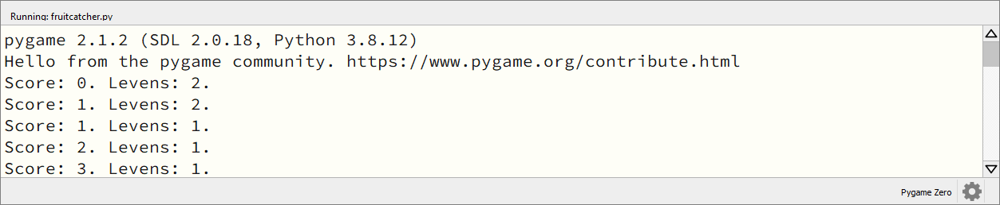
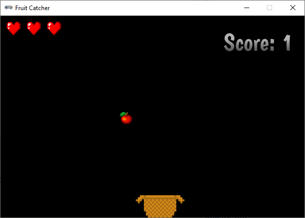

.. role:: python(code)
   :language: python

.. |br| raw:: html

    

Score en levens
===============

Als de vallende appel in het mandje wordt opgevangen, krijgt de speler een punt. Maar wanneer de appel naast het mandje valt, verliest de speler een leven. In dit deel gaan we dat programmeren.

Variabelen
----------

Om de score en het aantal levens bij te houden, gebruiken we twee variabelen. Maak deze na de vensterinstellingen:

.. code-block:: python
    :linenos:
    :caption: fruitcatcher.py
    :emphasize-lines: 9-11

    import random

    # Vensterinstellingen
    WIDTH = 600
    HEIGHT = 400
    TITLE = 'Fruit Catcher'
    MARGIN = 20

    # Variabelen voor score en levens
    score = 0
    lives = 3

Wanneer we deze variabelen straks in functies een andere waarde willen geven, moeten we het :python:`global` keyword gebruiken. Weet je niet meer precies wat dat betekent, kijk dan nog even terug bij het :ref:`Alien spel <globale-variabelen>`. Voor nu komt het er op neer dat je aan de :python:`update()` functie de volgende regel moet toevoegen, direct na de regel waarop de functie wordt gedefinieerd: 

.. code-block:: python
    :linenos:
    :lineno-start: 37
    :caption: fruitcatcher.py
    :emphasize-lines: 3

    # Update() functie
    def update():
        global score, lives
        
        # Keyboard events
        ...    

Collision detection
-------------------

Bij het :ref:`Alien spel <collision-detection>` heb je gezien wat *collision detection* is. Voor Fruit Catcher moeten we detecteren of de appel en de mand elkaar raken. Dat hoeven we echter pas te doen op het moment dat de appel laag genoeg is. In de :python:`update()` functie gaan we dit onderzoeken met een :python:`if` statement.

.. dropdown:: Opdracht 01
    :color: secondary
    :icon: pencil

    Hieronder zie je de vorm van het *geneste* :python:`if` statement waarmee we gaan checken of de appel in de mand valt, in gewone-mensentaal. Vertaal dit statement naar Python code. Om te checken of het middelpunt van de appel sprite zich binnen de mand bevindt, gebruik je :python:`basket.collidepoint(fruit.center)`.

    .. code-block::
        :class: no-copybutton
        :linenos:
        :lineno-start: 54

        # Collision detection
        Als de bovenkant van de appel lager is dan de bovenkant van de mand:
            Als het middelpunt van de appel sprite zich binnen de mand sprite bevindt:
                Tel 1 punt bij de score op.
            Anders:
                Haal 1 van de levens af.

Voeg in de buitenste lus van het :python:`if` statement dat je in opdracht 01 maakte de volgende twee regels toe:

.. code-block:: python
    :linenos:
    :lineno-start: 54
    :caption: fruitcatcher.py
    :emphasize-lines: 7-8

    # Collision detection
    if ...:
        if ...:
            ...
        else:
            ...
        print(f'Score: {score}. Levens: {lives}.')
        init_fruit()
            
Regel 60 print de score en het aantal levens in de console en regel 61 plaatst de appel weer op een willekeurige positie boven het venster. Wanneer je de code runt, kun je in de console zien hoe de score en het aantal levens verloopt.

De basis van het spel is nu klaar, het is speelbaar. Het is echter niet zo mooi om de score en het aantal levens in de console te printen; we willen natuurlijk dat die in het speelvenster zichtbaar zijn. Bovendien kan de speler nu gewoon doorspelen wanneer de drie levens op zijn. Ook dat moeten we verbeteren.

Score tonen
-----------

Voor het tonen van tekst gebruik je in Pygame Zero de functie :python:`screen.draw.text()`. Aan deze functie kun je allerlei argumenten meegeven zoals positie, grootte, kleur en lettertype van de tekst. En natuurlijk de tekst zelf. Kijk voor meer informatie over de mogelijkheden in de `Pygame Zero handleiding <https://pygame-zero.readthedocs.io/en/stable/ptext.html>`_.

Voeg boven de :python:`draw()` functie een nieuwe functie :python:`draw_score()` toe:

.. code-block:: python
    :linenos:
    :lineno-start: 31
    :caption: fruitcatcher.py

    # Functie draw_score() tekent de score
    def draw_score():
        screen.draw.text(f'Score: {score}', topright=(580,20), width=360, fontname="boogaloo", fontsize=48, color="#DDDDDD", gcolor="#666666", owidth=1.5, ocolor="black", alpha=0.8)

En roep deze nieuwe functie aan in de :python:`draw()` functie:

.. code-block:: python
    :linenos:
    :lineno-start: 35
    :caption: fruitcatcher.py
    :emphasize-lines: 6

    # Draw() functie
    def draw():
        screen.clear()
        fruit.draw()
        basket.draw()
        draw_score()

Run de code om het resultaat te zien.

Levens tonen
------------

Het aantal levens willen we niet met tekst tonen, maar met afbeeldingen van hartjes. Net zoals we voor de score een aparte functie :python:`draw_score()` maakten, maken we voor de levens een functie :python:`draw_lives()`. Voeg deze toe onder de :python:`draw_score()` functie. 

.. code-block:: python
    :linenos:
    :lineno-start: 31
    :caption: fruitcatcher.py
    :emphasize-lines: 5-8

    # Functie draw_score() tekent de score
    def draw_score():
        screen.draw.text(f'

    # Functie draw_lives() tekent de hartjes die de levens voorstellen
    def draw_lives():
        for life in range(lives):
            screen.blit('heart', (10 + 40*life, 10))

In deze functie gebruiken we een :python:`for` loop die de tellervariabele :python:`life` van :python:`0` tot aan de waarde van :python:`lives` laat lopen (let op: niet tot *en met*). Bij aanvang van het spel is :python:`lives = 3`, dus dan krijgt :python:`life` in de :python:`for` loop achtereenvolgens de waarden 0, 1 en 2.

Voor elk van deze waarden wordt de regel :python:`screen.blit('heart', (10 + 40*life, 10))` uitgevoerd. De :python:`screen.blit()` functie gebruik je meestal wanneer je een *statische* afbeelding wilt laten tekenen. Dat wil zeggen een afbeelding die tijdens het spel niet beweegt. Je moet twee argumenten meegeven: de naam van de afbeelding (in je :file:`images` map) en de positie (van de linker bovenhoek van de afbeelding). |br| In regel 38 wordt als positie :python:`(10 + 40*life, 10)` meegegeven. Daardoor worden de drie hartjes mooi naast elkaar getekend:

* hartje 1 (:python:`life = 0`) op positie :python:`(10, 10)`
* hartje 2 (:python:`life = 1`) op positie :python:`(50, 10)`
* hartje 3 (:python:`life = 2`) op positie :python:`(90, 10)`

Dat tekenen gebeurt echter pas wanneer we de :python:`draw_lives()` functie aanroepen in de :python:`draw()` functie:

.. code-block:: python
    :linenos:
    :lineno-start: 40
    :caption: fruitcatcher.py
    :emphasize-lines: 7

    # Draw() functie
    def draw():
        screen.clear()
        fruit.draw()
        basket.draw()
        draw_score()
        draw_lives()

Voilà het spel toont de score en de levens en het ziet er al behoorlijk goed uit. Maar we zijn nog niet helemaal klaar. Er wordt nog geen *game over* getoond; de speler kan gewoon blijven doorspelen. En ook begint het spel meteen nadat je in Mu editor op de :guilabel:`Run` knop hebt geklikt. Het is beter om de speler te laten bepalen wanneer het spel begint, bijvoorbeeld door drukken op de spatiebalk. Dat ga je in het volgende deel programmeren.