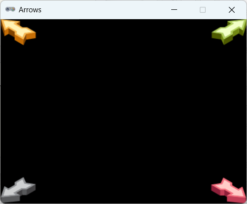

.. role:: python(code)
   :language: python

.. |br| raw:: html

    

Extra oefening: Arrows
========================

Sprites
-----------

Download de volgende sprites:

* :download:`arrow_green.png <images/arrow_green.png>`
* :download:`arrow_grey.png <images/arrow_grey.png>`
* :download:`arrow_red.png <images/arrow_red.png>`
* :download:`arrow_yellow.png <images/arrow_yellow.png>`

Mappenstructuur
----------------

Maak voor deze oefening in je :file:`games` map een nieuwe map met de naam :file:`arrows`. Maak in Mu editor een nieuw bestand en sla het op in je :file:`arrows` map onder de naam :file:`arrows.py`. Plaats de gedownloade sprites naar de :file:`images` map in de :file:`arrows` map.

.. card:: 
   
   .. uml::
      :align: left
      :html_format: svg

      @startuml
         @startfiles
         /games/arrows/images/arrow_green.png
         /games/arrows/images/arrow_grey.png
         /games/arrows/images/arrow_red.png
         /games/arrows/images/arrow_yellow.png
         /games/arrows/arrows.py
         @endfiles
      @enduml

Opdracht
---------

Begin met de volgende code in :file:`arrows.py`:

.. code-block:: python
   :linenos:

   # Vensterinstellingen
   WIDTH = 400
   HEIGHT = 300
   TITLE = 'Arrows'

Maak vervolgens een programma dat vier pijlen op de onderstaande manier op het scherm toont. De pijlen moeten precies zijn uitgelijnd in de hoeken van het venster.

