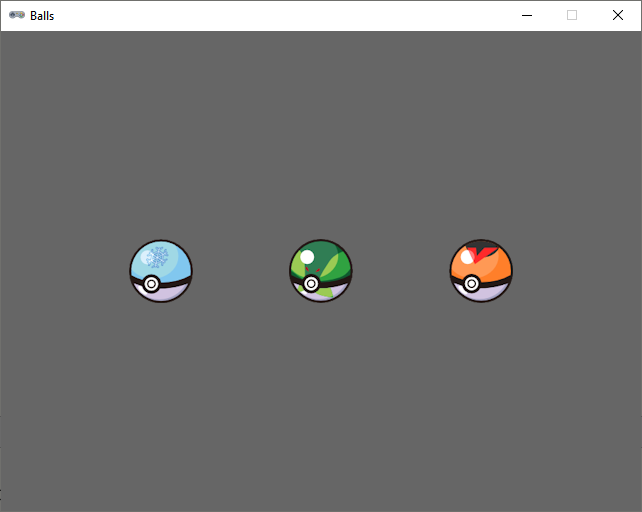

.. role:: python(code)
   :language: python

.. |br| raw:: html

    

Extra oefening: Balls
========================

Deze opdracht gaat over het reageren op muisklikken.

Sprites
-----------

Download de volgende sprites:

* :download:`ball_blue.png <images/ball_blue.png>`
* :download:`ball_green.png <images/ball_green.png>`
* :download:`ball_orange.png <images/ball_orange.png>`

Mappenstructuur
----------------

Maak voor deze oefening in je :file:`games` map een nieuwe map met de naam :file:`balls`. Maak in Mu editor een nieuw bestand en sla het op in je :file:`balls` map onder de naam :file:`balls.py`. Plaats de gedownloade sprites in de :file:`images` map in de :file:`balls` map.

.. card::

   .. uml::
      :align: left
      :html_format: svg

      @startuml
         @startfiles
         /games/balls/images/ball_blue.png
         /games/balls/images/ball_green.png
         /games/balls/images/ball_orange.png
         /games/balls/balls.py
         @endfiles
      @enduml

Starter code
-------------

Begin met de volgende code in :file:`balls.py`:

.. code-block:: python
   :linenos:

   # Vensterinstellingen
   WIDTH = 640
   HEIGHT = 480
   TITLE = 'Balls'

   # Actors
   ball_blue = Actor('ball_blue')
   ball_green = Actor('ball_green')
   ball_orange = Actor('ball_orange')

   # Startposities
   ball_blue.x = 0.25 * WIDTH
   ball_green.x = 0.50 * WIDTH
   ball_orange.x = 0.75 * WIDTH
   ball_blue.y = HEIGHT / 2
   ball_green.y = HEIGHT / 2
   ball_orange.y = HEIGHT / 2

   # Stapgrootte
   step = 20

   # Functie draw()
   def draw():
      screen.fill('gray40')
      ball_blue.draw()
      ball_green.draw()
      ball_orange.draw()
      
   # Functie on_mouse_down()
   def on_mouse_down(pos, button):
      if ball_blue.collidepoint(pos) and button == mouse.LEFT:
         ball_blue.y -= step

Bekijk de code goed. Probeer van elke regel de betekenis te begrijpen.

Run de code en klik met de linkermuisknop op de blauwe bal. Wat gebeurt er?

Opdracht
---------

Breid de code uit met de volgende functionaliteit:

* Als je met de *rechter*\muisknop op de oranje bal klikt, moet die één stapgrootte omlaag bewegen.
* Als je met een willekeurige muisknop op de groene bal klikt, moet de blauwe bal één stapgrootte omlaag en de oranje bal één stapgrootte omhoog bewegen.
* De ballen mogen niet buiten beeld bewegen. Ze moeten volledig binnen de grenzen van het venster blijven.

