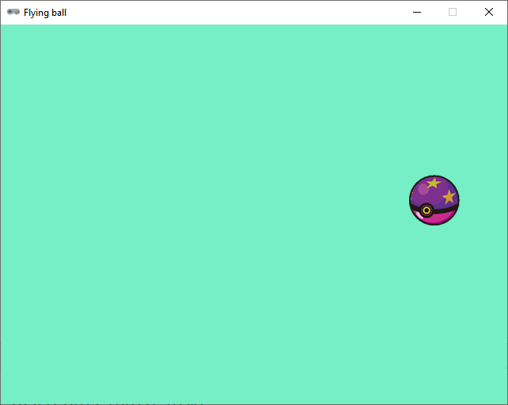

.. role:: python(code)
   :language: python

.. |br| raw:: html

    

Extra oefening: Flying ball
============================

Deze opdracht gaat over het reageren op muisklikken en het werken met snelheid.

Sprites
-----------

Download de volgende sprite:

* :download:`ball_purple.png <images/ball_purple.png>`

Mappenstructuur
----------------

Maak voor deze oefening in je :file:`games` map een nieuwe map met de naam :file:`flying_ball`. Maak in Mu editor een nieuw bestand en sla het op in je :file:`flying_ball` map onder de naam :file:`flying_ball.py`. Plaats de gedownloade sprite in de :file:`images` map in de :file:`flying_ball` map.

.. card::

   .. uml::
      :align: left
      :html_format: svg

      @startuml
         @startfiles
         /games/flying_ball/images/ball_purple.png
         /games/flying_ball/flying_ball.py
         @endfiles
      @enduml

Starter code
-------------

Begin met de volgende code in :file:`flying_ball.py`:

.. code-block:: python
   :linenos:

   import random

   # Vensterinstellingen
   WIDTH = 640
   HEIGHT = 480
   TITLE = 'Flying ball'

   # Actors
   ball = Actor('ball_purple')

   # Startpositie en snelheid
   ball.right = 0
   ball.y = random.randint(50, HEIGHT-50)
   ball.speed = 6

   # Functie draw()
   def draw():
      screen.fill('aquamarine2')
      ball.draw()
      
   # Functie update()
   def update():
      ball.x += ball.speed
      if ball.left > WIDTH:
         ball.right = 0
         ball.y = random.randint(50, HEIGHT-50)

Bekijk de code goed. Probeer van elke regel de betekenis te begrijpen.

Opdracht
---------

Breid de code uit met de volgende functionaliteit:

* Als je met de linkermuisknop op de bal klikt, moet die in tegengestelde richting gaan bewegen. Dus als de bal naar rechts beweegt, moet hij na een muisklik naar links bewegen en vice versa.
* Als de bal aan de linkerkant uit het venster verdwijnt, moet hij aan de rechterkant weer verschijnen.

Extra uitdaging:

* Als je met de rechtermuisknop op de bal klikt, moet de snelheid van de bal verdubbelen. Als je nogmaals met rechts op de bal klikt, moet de snelheid weer halveren.

