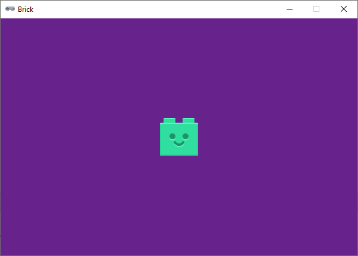

.. role:: python(code)
   :language: python

.. |br| raw:: html

    

Extra oefening: Brick
============================

Deze opdracht gaat over het reageren op toetsenbordaanslagen.

Sprites
-----------

Download de volgende sprite:

* :download:`green_brick.png <images/green_brick.png>`

Mappenstructuur
----------------

Maak voor deze oefening in je :file:`games` map een nieuwe map met de naam :file:`brick`. Maak in Mu editor een nieuw bestand en sla het op in je :file:`brick` map onder de naam :file:`brick.py`. Plaats de gedownloade sprite in de :file:`images` map in de :file:`brick` map.

.. card::

   .. uml::
      :align: left
      :html_format: svg

      @startuml
         @startfiles
         /games/brick/images/green_brick.png
         /games/brick/brick.py
         @endfiles
      @enduml

Starter code
-------------

Begin met de volgende code in :file:`flying_ball.py`:

.. code-block:: python
   :linenos:

   # Vensterinstellingen
   WIDTH = 600
   HEIGHT = 400
   TITLE = 'Brick'

   # Snelheid
   SPEED = 2

   # Actor
   player = Actor('green_brick')
   player.x = WIDTH / 2
   player.y = HEIGHT / 2

   # Functie draw()
   def draw():
      screen.fill('darkorchid4')
      player.draw()

   # Functie update()
   def update():
      pass

Deze code maakt een venster aan met een groene legosteen in het midden. De legosteen beweegt niet en er gebeurt verder niets.

Opdracht
---------

Breid de code uit met de volgende functionaliteit:

* De legosteen moet bestuurd kunnen worden met de pijltjestoetsen. Verwijder het keyword :python:`pass` in de functie :python:`update()` en voeg code toe om de legosteen te laten bewegen. Gebruik de constante :python:`SPEED` in je code. 
* De legosteen mag niet buiten het venster bewegen.