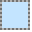
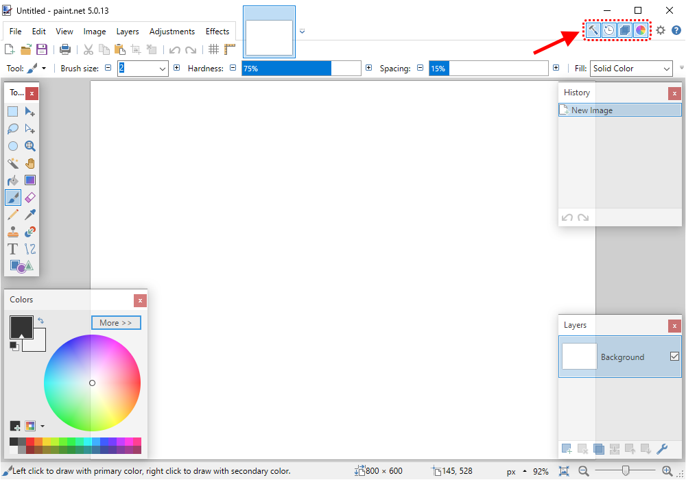
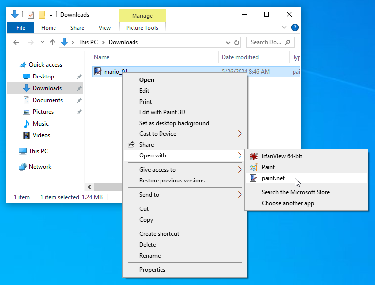
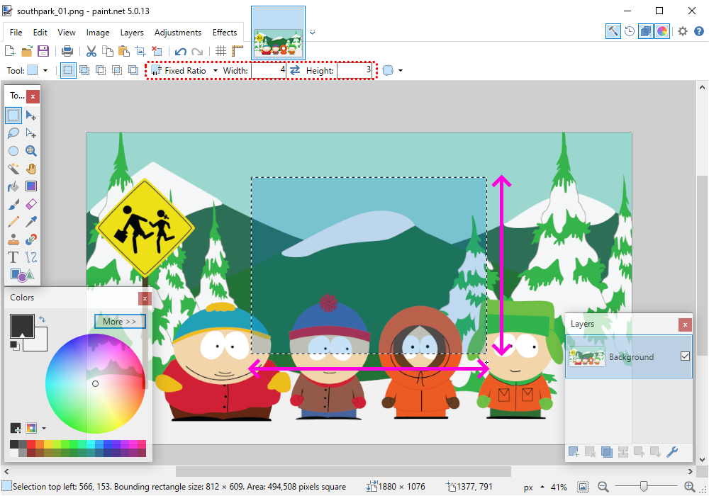
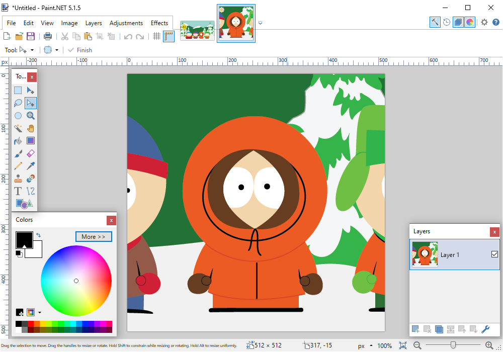
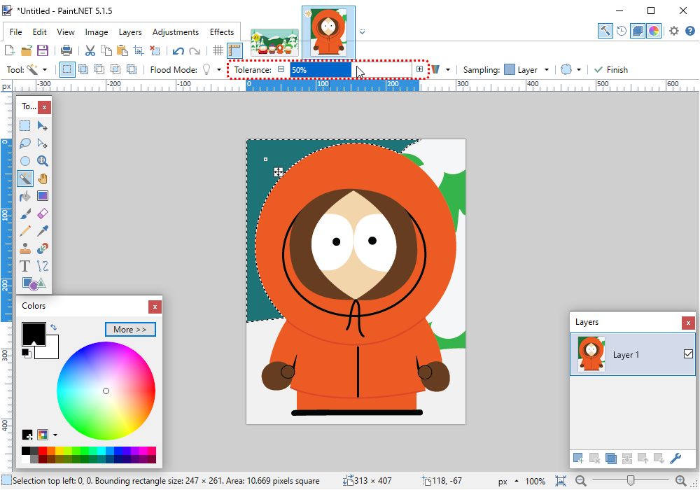

.. role:: python(code)
   :language: python

.. |br| raw:: html

    

Sprites bewerken in Paint.NET
==============================

.. dropdown:: Auteursrechten
   :open:
   :color: warning
   :icon: alert

   Wanneer je afbeeldingen van het internet gebruikt in je games, moet je altijd controleren of je de afbeeldingen mag gebruiken. Veel afbeeldingen zijn beschermd door auteursrechten en mogen niet zomaar worden gebruikt. Zoek daarom altijd naar afbeeldingen met een Creative Commons licentie of maak je eigen afbeeldingen. In deze opdracht gebruiken we een afbeelding van Kenny uit de animatieserie South Park, die is gevonden door in Google afbeeldingen te zoeken met de Creative Commons license. Je vind die optie onder :guilabel:`Tools` en :guilabel:`Usage rights` in Google Afbeeldingen.

   .. figure:: images/licensing.png
      :class: image-border
   

Om je eigen sprites te kunnen maken en bewerken heb je een grafisch programma nodig. Twee bekende gratis programma's zijn:

.. grid:: 2

   .. grid-item::
      :columns: 6

      .. image:: images/icon_gimp.png
         :width: 64
         :align: center
         :target: https://www.gimp.org/
      
      .. rst-class:: center

         `GIMP <https://www.gimp.org/>`_

   .. grid-item::
      :columns: 6

      .. image:: images/icon_paint_net.png
         :width: 64
         :align: center
         :target: https://www.getpaint.net/
      
      .. rst-class:: center

         `Paint.NET <https://www.getpaint.net/>`_

Omdat de schrijver dezes enkel ervaring heeft met Paint.NET zullen we dat programma gebruiken. Je moet Paint.NET overigens niet verwarren met Paint, het tekenprogramma dat standaard in Microsoft Windows zit. Paint.NET is vele malen geavanceerder.

Paint.NET downloaden en installeren
------------------------------------

Downloaden
^^^^^^^^^^^^^^^^

Het downloaden van Paint.NET kan een beetje lastig zijn, omdat de website helaas veel advertenties en neplinks bevat. Volg onderstaande stappen (klik op de tabbladen om naar een volgende stap te gaan):

.. tab-set:: 

   .. tab-item:: Stap 1

      Ga naar `www.getpaint.net <https://www.getpaint.net/>`_ en klik aan de rechterkant op de link zoals aangegeven in onderstaande afbeelding.

      .. figure:: images/download_paint_net_01.png

   .. tab-item:: Stap 2

      Scroll iets naar beneden en klik op het plaatje met dotPDN.

      .. figure:: images/download_paint_net_02.png

   .. tab-item:: Stap 3

      Klik aan de rechterkant op de downloadlink.

      .. figure:: images/download_paint_net_03.png

   .. tab-item:: Stap 4

      Het installatie bestand wordt gedownload naar je :file:`Downloads` map.

      .. figure:: images/download_paint_net_04.png

Installeren
^^^^^^^^^^^^^^^^

Het installeren is eenvoudig. Open het gedownloade bestand en start de installatie:

.. tab-set:: 

   .. tab-item:: Stap 1

      .. figure:: images/download_paint_net_05.png
         :class: image-border
         
   .. tab-item:: Stap 2

      .. figure:: images/download_paint_net_06.png
         :class: image-border
         
   .. tab-item:: Stap 3

      .. figure:: images/download_paint_net_07.png
         :class: image-border    

   .. tab-item:: Stap 4

      .. figure:: images/download_paint_net_08.png
         :class: image-border

   .. tab-item:: Stap 5

      .. figure:: images/download_paint_net_09.png
         :class: image-border

Werken met Paint.NET
---------------------

.. dropdown:: Muis in plaats van touchpad
    :open:
    :color: warning
    :icon: alert

    Gebruik voor het werken met Paint.NET een muis en niet het touchpad van je laptop. Met een muis kun je veel nauwkeuriger werken.

Het venster van Paint.NET ziet eruit zoals veel tekenprogramma's: een groot wit canvas waarop je kunt tekenen en aan de randen enkele hulpvensters zoals een toolbox met tekengereedschappen en een kleurenpalet. Die hulpvensters kun je (on)zichtbaar maken met de vier knoppen rechtsboven.

.. dropdown:: Opdracht 01
    :open:
    :color: secondary
    :icon: pencil

    Maak het History hulpvenster onzichtbaar.

Een afbeelding kopiëren
^^^^^^^^^^^^^^^^^^^^^^^^^^

Wanneer je een afbeelding hebt gedownload, kun je die eenvoudig openen via het :guilabel:`File` menu in Paint.NET. Een andere mogelijkheid is in de Windows Verkenner met de rechtermuisknop op het bestand klikken en kiezen voor :guilabel:`Open with`:

Maar meestal zoek je afbeeldingen voor je games met je web browser, en dan is de volgende manier het gemakkelijkst:

1. Klik met de rechtermuisknop op de afbeelding in je web browser.
2. Selecteer :guilabel:`Afbeelding kopiëren`.
3. Ga naar Paint.NET en typ :kbd:`Ctrl` + :kbd:`Alt` + :kbd:`V` (of ga in de menubalk naar :guilabel:`Edit` en kies :guilabel:`Paste into New Image`).

Let op: je moet behalve de :kbd:`Ctrl` toets dus ook de :kbd:`Alt` toets ingedrukt houden, om ervoor te zorgen dat de afbeelding als *nieuw* bestand in Paint.NET wordt geplakt.

.. dropdown:: Opdracht 02
    :open:
    :color: secondary
    :icon: pencil

    Kopieer onderstaande afbeelding en plak die in Paint.NET op de hierboven beschreven manier.

    .. image:: images/southpark_01.png
      :align: center
      :class: image-border

Selectiegereedschappen
^^^^^^^^^^^^^^^^^^^^^^^^

In de toolbox vind je een aantal gereedschappen waarmee je onderdelen van een afbeelding kunt selecteren. Klik op het *Rectangle Select* |rectangleselect| gereedschap in de linkerbovenhoek van de toolbox en je zult zien dat de knoppenbalk bovenin zich daarop aanpast.

.. grid:: 2

   .. grid-item::
      :columns: 3

      .. image:: images/selection_tools.png
         :class: image-border
         :align: center

   .. grid-item::
      :columns: 9

      .. image:: images/selection_rectangle.png
         :class: image-border         
         :align: center

Met name de *size* opties :guilabel:`Any Size`, :guilabel:`Fixed Ratio` en :guilabel:`Fixed Size` van dit gereedschap zijn interessant. Probeer ze alle drie uit door een optie te kiezen en vervolgens iets in de afbeelding te selecteren.

In de onderstaande afbeelding zie je dat voor :guilabel:`Fixed Ratio` is gekozen met een breedte-hoogteverhouding van 4:3.

.. dropdown:: Opdracht 03
   :open:
   :color: secondary
   :icon: pencil

   Kies het *Rectangle Select* |rectangleselect| gereedschap. Stel de afmeting in op :guilabel:`Fixed Ratio` met breedte-hoogteverhouding 1:1.
   Selecteer met deze instelling Kenny (het derde mannetje van links).

   .. figure:: images/selection_rectangle_03.png
      :class: image-border

   Kopieer de selectie met de toetscombinatie :kbd:`Ctrl` + :kbd:`C` en plak die vervolgens als een nieuw bestand met de toetscombinatie :kbd:`Ctrl` + :kbd:`Alt` + :kbd:`V`.

Als je opdracht 03 goed hebt uitgevoerd, beschik je nu over een afbeelding van Kenny zoals hieronder getoond. In de volgende paragraaf gaan we die afbeelding bewerken.

Achtergrondelementen verwijderen
^^^^^^^^^^^^^^^^^^^^^^^^^^^^^^^^^^

Om Kenny te kunnen gebruiken in een game, moeten we de achtergrond verwijderen. Laten we beginnen met de hoeveelheid achtergrond rondom Kenny te verkleinen.

.. dropdown:: Opdracht 04
   :open:
   :color: secondary
   :icon: pencil

   Kies het *Rectangle Select* |rectangleselect| gereedschap. Stel de afmeting in op :guilabel:`Any Size` en selecteer een rechthoek rondom Kenny. Kies vervolgens in de menubalk :guilabel:`Image` en :guilabel:`Crop to Selection`, of gebruik de toetscombinatie :kbd:`Ctrl` + :kbd:`Shift` + :kbd:`X`.

   .. figure:: images/kenny_03.png
      :class: image-border

   Het resultaat van dit *croppen* (uitsnijden) zie je hieronder.

   .. figure:: images/kenny_04.png
      :class: image-border

Je zou de resterende achtergrond kunnen verwijderen met het gum gereedschap, maar dat is een tijdrovende klus en bovendien moet je daar een vaste hand voor hebben. Gelukkig is er een gemakkelijkere manier: de *Magic Wand*.

Selecteer het |magicwand| gereedschap in de toolbox en klik op het donkergroene deel linksboven in de afbeelding. Je zult zien dat de *Magic Wand* het complete groene stuk selecteert.

In deze afbeeldingen zijn de randen heel scherp, maar dat is niet altijd het geval. Je kunt dan de *Tolerance* instellen in de knoppenbalk bovenin. Hoe hoger de *Tolerance*, hoe meer kleuren er worden geselecteerd. Probeer het eens uit.

.. dropdown:: Opdracht 05
   :open:
   :color: secondary
   :icon: pencil

   Selecteer met het *Magic Wand*  gereedschap de donkergroene achtergrond links achter Kenny en druk op de :kbd:`Delete` toets. Selecteer vervolgens de witte achtergrond en druk weer op de :kbd:`Delete` toets. Verwijder op deze manier alle achtergrondelementen rondom Kenny.

   .. figure:: images/kenny_06.png
      :class: image-border

Het lijkt nu alsof de achtergrond volledig is verwijderd, maar de kans is groot dat er nog wat restanten zijn achtergebleven. Je kunt dat beter zien door een tijdelijke achtergrondkleur toe te voegen. Daarvoor gaan we een nieuwe layer (laag) toevoegen.

.. dropdown:: Opdracht 06
   :open:
   :color: secondary
   :icon: pencil

   Rechtsonder in Paint.NET zie je het *Layers* venster. Voeg een nieuwe laag toe met het |addlayer| knopje linksonder in het *Layers* venster. Sleep deze nieuwe laag vervolgens onder de laag met Kenny (of gebruik het |layerdown| knopje.

   .. grid:: 

      .. grid-item:: 
         :columns: 6

         .. figure:: images/layers_01.png

      .. grid-item:: 
         :columns: 6

         .. figure:: images/layers_02.png
   
Vanaf nu moet je goed opletten welke layer is geselecteerd wanneer je iets in de afbeelding wilt veranderen. Wanneer je bijvoorbeeld iets wilt weggummen en er lijkt niets te gebeuren, dan is waarschijnlijk de verkeerde layer geselecteerd.

.. dropdown:: Opdracht 07
   :open:
   :color: secondary
   :icon: pencil

   Zorg dat de nieuwe layer is geselecteerd. Kies het verfemmergereedschap |bucket| in de toolbox en klik vervolgens met de *rechter*\muisknop ergens in de afbeelding. Je mag zelfs op Kenny klikken, want die zit in een andere layer.

   .. figure:: images/kenny_white.png
      :class: no-scaled-link
      :width: 150

   Waarom klik je met de rechtermuisknop en niet met de linkermuisknop? Probeer het eens uit.

   In het kleurenpalet zie je linksboven twee kleuren staan. De bovenste kleur is de voorgrondkleur, die je krijgt met de linkermuisknop, en de onderste kleur is de achtergrondkleur, die onder de rechtermuisknop zit.

   .. figure:: images/colors.png

   In welke figuur zie je de resterende achtergrondpixels het beste? In de figuur met de witte achtergrond of in de figuur met de zwarte achtergrond?

   .. grid:: 

      .. grid-item:: 
         :columns: 6

         .. figure:: images/kenny_white.png
            :width: 150

      .. grid-item:: 
         :columns: 6

         .. figure:: images/kenny_black.png
            :width: 150

   Waarschijnlijk is in dit geval de zwarte achtergrond het beste, maar dat kan per afbeelding verschillen.
      
.. dropdown:: Opdracht 08
   :open:
   :color: secondary
   :icon: pencil

   Om de resterende achtergrondpixels te verwijderen, doe je het volgende:
   
   1. Selecteer de laag met Kenny.
   2. Selecteer in de toolbox het gumgereedschap |eraser|.
   3. Stel bovenin het venster de brush size in op 20 pixels.
   4. Gum de resterende achtergrondpixels weg.

   Let bij het gummen op dat je Kenny zelf niet raakt. Als je per ongeluk toch iets van Kenny weggumt, kun je dat herstellen met de toetscombinatie :kbd:`Ctrl` + :kbd:`Z`.

   .. figure:: images/kenny_07.png
      :class: image-border

   Bij dit soort bewerkingen is het vaak handig om in te zoomen op de afbeelding. Dat gaat het snelst door de :kbd:`Ctrl` toets ingedrukt te houden terwijl je aan het scrollwieltje van je muis draait. Om de gehele afbeelding weer mooi in beeld te krijgen kies je in de menubalk voor :guilabel:`View` en :guilabel:`Zoom to Window`.

.. dropdown:: Opdracht 09
   :open:
   :color: secondary
   :icon: pencil

   Verwijder de achtergrondlaag door hem te selecteren en vervolgens op het |deletelayer| knopje te klikken in het *Layers* venster. Als alles goed is gegaan, beschik je nu over Kenny met een transparante achtergrond.

   .. figure:: images/kenny_transparent.png
      :width: 150

Resizen
^^^^^^^^^^^^^^^^^^^^^^^^^^	

De afbeelding van Kenny is nu nog veel te groot om te gebruiken in een game. We gaan hem daarom resizen. Maar voordat we dat doen gebruiken we nogmaals de *crop* functie om de afbeelding zo bij te snijden dat Kenny er precies in past.

.. dropdown:: Opdracht 10
   :open:
   :color: secondary
   :icon: pencil

   Selecteer weer het *Magic Wand* |magicwand| gereedschap en klik op de transparante achtergrond. Nu is de achtergrond geselecteerd. Voor het croppen willen we echter niet de achtergrond selecteren, maar juist de afbeelding van Kenny. Kies daarom in de menubalk :guilabel:`Edit` en :guilabel:`Invert Selection`, of gebruik de toetscombinatie :kbd:`Ctrl` + :kbd:`I`.
   
   .. grid:: 

      .. grid-item:: 
         :columns: 6

         .. figure:: images/mask_01.png
            :width: 240

      .. grid-item:: 
         :columns: 6

         .. figure:: images/mask_02.png
            :width: 240   

   Om te croppen kies je in de menubalk :guilabel:`Image` en :guilabel:`Crop to Selection`, of gebruik de toetscombinatie :kbd:`Ctrl` + :kbd:`Shift` + :kbd:`X`. Nu is de afbeelding van Kenny zo groot dat Kenny er precies in past en er geen ruimte meer zit tussen de randen van de afbeelding en Kenny.

   .. figure:: images/cropped.png
      :width: 240

Hoe groot moet de afbeelding van Kenny worden? Dat hangt af van de vensterafmetingen van je game en de grootte van de andere sprites die je gebruikt. In de meeste games is de grootte van de sprites een veelvoud van 8 pixels. Laten we Kenny daarom resizen naar een breedte van 64 pixels.

.. dropdown:: Opdracht 11
   :open:
   :color: secondary
   :icon: pencil

   Kies in de menubalk :guilabel:`Image` en :guilabel:`Resize`, of gebruik de toetscombinatie :kbd:`Ctrl` + :kbd:`R`. Stel de breedte in op 64 pixels en zorg dat de optie :guilabel:`Maintain aspect ratio` is aangevinkt. Daardoor wordt de hoogte van de afbeelding automatisch aangepast.

   .. figure:: images/resize.png

   Alle overige instellingen kun je gewoon laten zoals ze zijn. Klik op :guilabel:`OK` om de afbeelding te resizen.

Nu is Kenny klaar voor gebruik in je game. Sla hem op (:kbd:`Ctrl` + :kbd:`Shift` + :kbd:`S`) als een :file:`.png` bestand, want dat is het meest geschikte bestandsformaat voor sprites.

.. figure:: images/final_result.png
   
   kenny.png

Handige sneltoetsen
^^^^^^^^^^^^^^^^^^^^

Paint.NET kent veel sneltoetsen die het werken met het programma een stuk sneller maken. Hieronder een overzicht van de belangrijkste sneltoetsen. De volledige lijst kun je op `www.getpaint.net <https://www.getpaint.net/doc/latest/KeyboardMouseCommands.html>`_ vinden.

.. list-table::
   :header-rows: 1

   * - Actie
     - Sneltoets
   * - Afbeelding slepen (pannen)
     - :kbd:`Spatiebalk` + :kbd:`Linkermuisknop` en slepen
   * - In- en uitzoomen
     - :kbd:`Ctrl` + :kbd:`Muiswiel`    
   * - Kopiëren
     - :kbd:`Ctrl` + :kbd:`C`
   * - Knippen
     - :kbd:`Ctrl` + :kbd:`X`
   * - Plakken
     - :kbd:`Ctrl` + :kbd:`V`
   * - Plakken als nieuwe afbeelding
     - :kbd:`Ctrl` + :kbd:`Alt` + :kbd:`V`
   * - Verwijderen
     - :kbd:`Delete`
   * - Alles selecteren
     - :kbd:`Ctrl` + :kbd:`A`
   * - Selectiegereedschap
     - :kbd:`S`
   * - Selectie verplaatsen
     - :kbd:`M`
   * - Selectiemasker verplaatsen
     - :kbd:`M` (nogmaals)
   * - Inverteer selectiemasker
     - :kbd:`Ctrl` + :kbd:`I`
   * - Formaat wijzigen (resize)
     - :kbd:`Ctrl` + :kbd:`R`
   * - Ongedaan maken
     - :kbd:`Ctrl` + :kbd:`Z`
   * - Opslaan
     - :kbd:`Ctrl` + :kbd:`S`    
   * - Opslaan als (onder een nieuwe naam)
     - :kbd:`Ctrl` + :kbd:`Shift` + :kbd:`S`    

Tenslotte
-----------

In deze les heb je geleerd hoe je zelf een sprite kunt maken van een afbeelding. Op internet zijn echter al heel veel kant en klare sprites te vinden, die je direct in een game kunt gebruiken. Bekende websites met gratis sprites zijn:

- `Kenney <https://kenney.nl/>`_ 
- `OpenGameArt <https://opengameart.org/>`_
- `Itch <https://itch.io/game-assets>`_
- `LudicArts <https://www.ludicarts.com/freebies/>`_

En wil je graag je eigen Southpark karakter ontwerpen, kijk dan eens op `https://www.sp-studio.de/ <https://www.sp-studio.de/>`_.