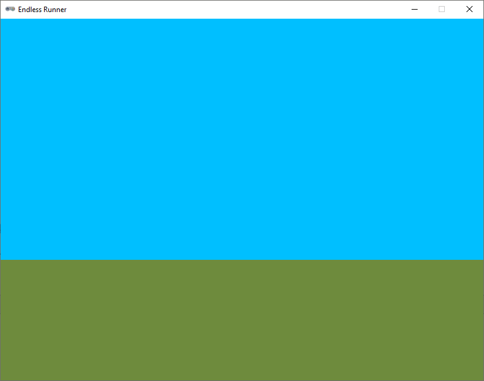

.. role:: python(code)
   :language: python

.. |br| raw:: html

    

Background
================

De achtergrond van het spel houden we in eerste instantie heel eenvoudig: hij bestaat uit twee horizontale balken, waarvan de bovenste de lucht voorstelt en de onderste de grond.

Tekenen in Pygame Zero
-----------------------

Om de twee horizontale balken te tekenen hebben we geen sprites nodig, we kunnen ze gewoon met Pygame Zero tekenen. In de `documentatie van Pygame Zero <https://pygame-zero.readthedocs.io/en/stable/builtins.html#screen>`_ kun je lezen dat de volgende tekenfuncties beschikbaar zijn:

* :python:`screen.draw.line()` 
* :python:`screen.draw.circle()`
* :python:`screen.draw.filled_circle()`
* :python:`screen.draw.rect()`
* :python:`screen.draw.filled_rect()`
* :python:`screen.draw.text()`
* :python:`screen.draw.textbox()`

Voor de blauwe en groene balk in onze achtergrond, hebben we de functie :python:`screen.draw.filled_rect()` nodig (rect slaat op *rectangle*, rechthoek). Bij het aanroepen van deze functie geef je een :python:`Rect` mee en een kleur. Een :python:`Rect` is een object dat de positie en afmetingen van een rechthoek bevat. Je kunt een :python:`Rect` maken met de functie :python:`Rect(left, top, width, height)` of :python:`Rect((left, top), (width, height))`. Klinkt ingewikkeld, maar probeer het eens uit met de volgende code in :file:`endlessrunner.py`:

.. code-block:: python
   :caption: endlessrunner.py
   :linenos:

   # Vensterinstellingen
   WIDTH = 800
   HEIGHT = 600
   TITLE = 'Endless Runner'

   # Functie draw()
   def draw():
      sky_rect = Rect(0, 0, 800, 400)
      screen.draw.filled_rect(sky_rect, 'deepskyblue')
      
   # Functie update()
   def update():
      pass
   
In regel 8 maken we een rechthoek waarvan de linkerbovenhoek op (0, 0) ligt en die een breedte en hoogte heeft van 800 en 400 pixels. Deze rechthoek noemen we :python:`sky_rect`. Vervolgens tekenen we deze rechthoek met de kleur :python:`'deepskyblue'` in regel 9. Als je dit programma uitvoert, zie je een blauwe rechthoek die het bovenste deel van het venster vult.

.. dropdown:: Het keyword pass
   :color: info
   :icon: info

   In regel 13 zie je in de :python:`update()` functie het keyword :python:`pass`. Dit is een Python keyword dat aangeeft dat er niets hoeft te gebeuren. Het is handig om :python:`pass` te gebruiken als je een functie of een codeblok nog niet wilt invullen, maar wel alvast wilt definiëren. Als je :python:`pass` niet zou gebruiken, zou je een foutmelding krijgen omdat Python verwacht dat er iets in de functie staat.

   Een voordeel van het alvast definiëren van de :python:`update()` functie is, dat Pygame Zero het venster ververst wanneer dat nodig is. Soms komt het namelijk voor dat bij aanvang van het spel een deel van het venster zich buiten je scherm bevindt. Wanneer je het venster dan versleept zodat het geheel zichtbaar is, wordt het venster niet automatisch ververst. Door de :python:`update()` functie alvast te definiëren, wordt het venster wél ververst en zie je de volledige inhoud van het venster.

.. dropdown:: Opdracht 01
   :open:
   :color: secondary
   :icon: pencil

   Maak zelf een rechthoek voor de grond. Noem deze :python:`ground_rect` en teken hem met de kleur :python:`'darkolivegreen4'`. Zorg ervoor dat de rechthoek precies onder de blauwe rechthoek in het venster past.

.. dropdown:: Kleuren in Pygame
   :color: info
   :icon: info

   In Pygame Zero kun je kleuren aangeven met namen, zoals :python:`'deepskyblue'` en :python:`'darkolivegreen4'`. Dit zijn namen die Pygame Zero herkent. Je kunt ook kleuren aangeven met RGB-waarden. Dit zijn tuples van drie getallen tussen 0 en 255 die de hoeveelheid rood (R), groen (G) en blauw (B) in een kleur aangeven. Bijvoorbeeld :python:`(255, 0, 0)` is rood, :python:`(0, 255, 0)` is groen en :python:`(0, 0, 255)` is blauw. Vaak is het echter gemakkelijker om de naam van een kleur te gebruiken.
   
   Ben je nieuwsgierig naar de kleurennamen die Pygame Zero herkent, kijk dan eens op de site van `pygame.org <https://www.pygame.org/docs/ref/color_list.html>`_.

Een aparte functie voor de background
---------------------------------------

Wanneer we straks nog meer elementen van het spel gaan tekenen, wordt de :python:`draw()` functie steeds langer en mogelijk onoverzichtelijker. Daarom is het handig de code voor het tekenen van de achtergrond in een aparte functie onder te brengen. Zo houden we het overzichtelijk.

.. dropdown:: Opdracht 02
   :open:
   :color: secondary
   :icon: pencil

   Maak een nieuwe functie met de naam :python:`draw_background()`. Verplaats de code voor het tekenen van de lucht en de grond uit de :python:`draw()` functie naar de nieuwe functie. Roep de nieuwe functie aan in de :python:`draw()` functie. Als je het goed hebt gedaan, zie je geen verschil in het venster.

   .. dropdown:: Oplossing
      :color: secondary
      :icon: check-circle

      .. code-block:: python
         :caption: endlessrunner.py
         :linenos:

         # Vensterinstellingen
         WIDTH = 800
         HEIGHT = 600
         TITLE = 'Endless Runner'

         # Functie draw_background()
         def draw_background():
            sky_rect = Rect(0, 0, 800, 400)
            screen.draw.filled_rect(sky_rect, 'deepskyblue')
            ground_rect = Rect(0, 400, 800, 200)
            screen.draw.filled_rect(ground_rect, 'darkolivegreen4')

         # Functie draw()
         def draw():
            draw_background()
            
         # Functie update()
         def update():
            pass

Variabele horizon
------------------

Op dit moment zijn de afmetingen van de horizontale balken *hard coded*. Dat wil zeggen dat de waarden 800, 400 en 200 direct in de code staan. Als we later de afmetingen van de balken willen aanpassen, moeten we dat op meerdere plaatsen in de code doen. Dat is niet handig en bovendien foutgevoelig. Het is beter hiervoor variabelen te gebruiken.

De afmetingen van de twee rechthoeken zijn nu als volgt geprogrammeerd:

.. code-block:: python

   sky_rect = Rect(0, 0, 800, 400)
   ground_rect = Rect(0, 400, 800, 200)

De hoogte van :python:`sky_rect` is 400 pixels. Je zou dus kunnen zeggen dat de horizon op 400 pixels vanaf de bovenkant van het venster ligt. We gaan deze positie van de horizon vastleggen in een *constante* met de naam :python:`HORIZON`. Een constante is een variabele waarvan de waarde niet verandert tijdens de uitvoering van het programma. In Python is het de gewoonte de naam van een constante in hoofdletters te schrijven. De vensterinstellingen :python:`WIDTH`, :python:`HEIGHT` en :python:`TITLE` zijn ook constanten.

.. code-block:: python
   :caption: endlessrunner.py
   :linenos:
   :emphasize-lines: 6-7

   # Vensterinstellingen
   WIDTH = 800
   HEIGHT = 600
   TITLE = 'Endless Runner'

   # Constanten
   HORIZON = 400

   # overige code weggelaten

.. dropdown:: Opdracht 03
   :open:
   :color: secondary
   :icon: pencil

   Wijzig de code voor het maken van de rechthoeken :python:`sky_rect` en :python:`ground_rect` zodat:
   
   * de breedte van de rechthoeken wordt bepaald door de constante :python:`WIDTH`;
   * de hoogte van de rechthoeken wordt bepaald door de constanten :python:`HEIGHT` en  :python:`HORIZON`. Let op: ook de *positie* van de onderste rechthoek is afhankelijk van :python:`HORIZON`!

   In de afmetingen van :python:`sky_rect` en :python:`ground_rect` mag naast de constanten :python:`WIDTH`, :python:`HEIGHT` en :python:`HORIZON` alleen het getal :python:`0` voorkomen. 

   Controleer of de achtergrond nog steeds correct wordt getekend.

   Bekijk de oplossingen pas nadat je zelf een oplossing hebt gevonden, of als je er na vijf minuten (niet minder!) nog niet bent uitgekomen.

   .. dropdown:: Oplossing voor :python:`sky_rect` 
      :color: secondary
      :icon: check-circle

      .. code-block:: python

         sky_rect = Rect(0, 0, WIDTH, HORIZON)

   .. dropdown:: Oplossing voor :python:`ground_rect` 
      :color: secondary
      :icon: check-circle

      .. code-block:: python

         ground_rect = Rect(0, HORIZON, WIDTH, HEIGHT - HORIZON)

Nu je de positie van de horizon in een constante hebt gedefinieerd, kun je die eenvoudig wijzigen. Probeer maar eens verschillende waarden voor :python:`HORIZON` uit. Als je de waarde van :python:`HORIZON` verandert, verandert de positie van de horizon in het venster.