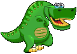
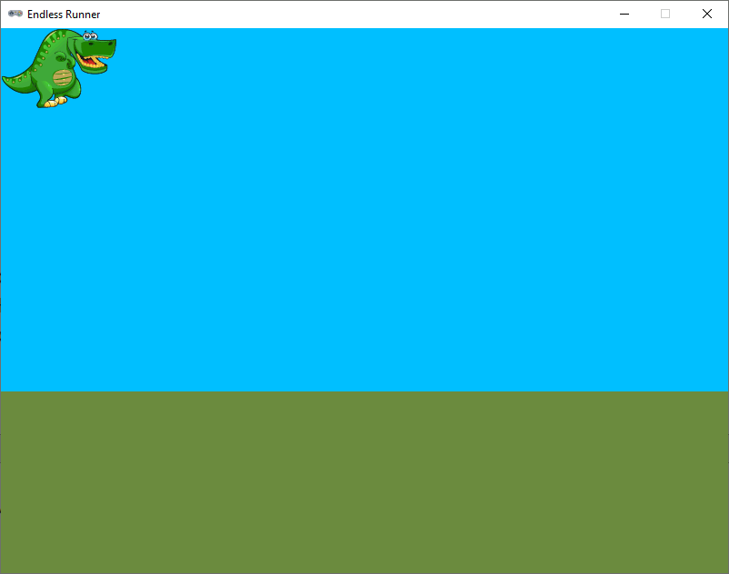
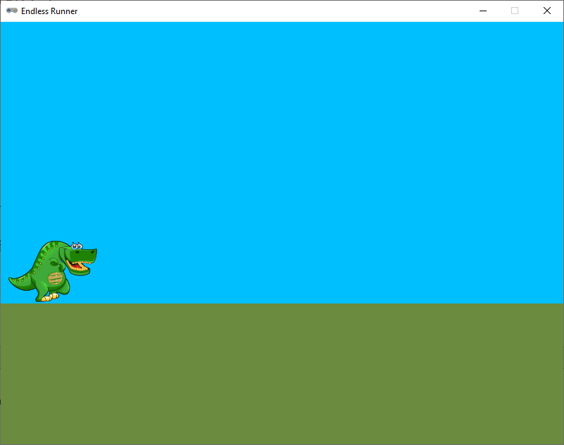
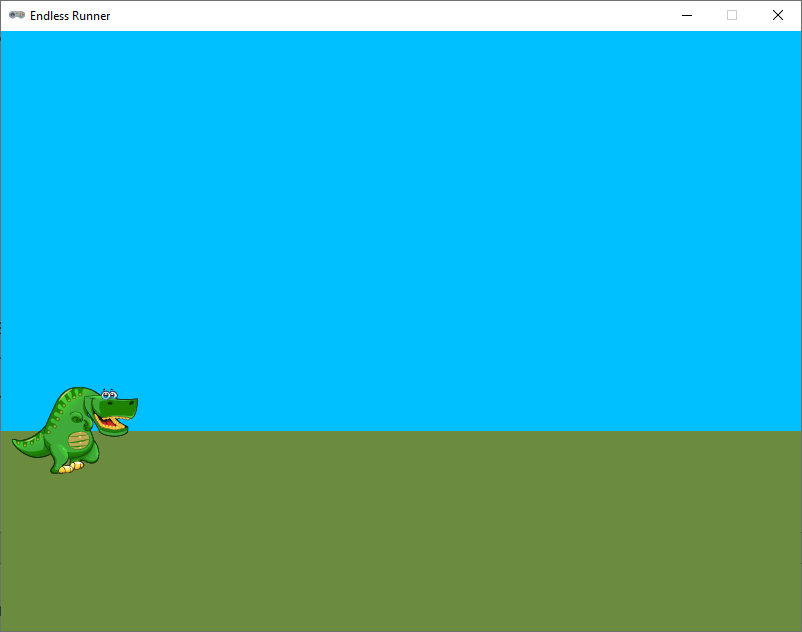

.. role:: python(code)
   :language: python

.. |br| raw:: html

    

Animatie
================

In het vorige deel hebben we de achtergrond van het spel getekend. Nu gaan we de speler tekenen. Net als in eerdere games gebruiken we hiervoor weer een :python:`Actor` variabele. In die games gaven we die :python:`Actor` één sprite afbeelding mee. Daardoor konden we de speler wel door het venster laten bewegen, maar in de *afbeelding* van de speler zat géén beweging. In Endless Runner willen we de speler animeren, zodat het lijkt of hij echt loopt.

Om dit voor elkaar te krijgen, moeten in plaats van één sprite voor de :python:`Actor` meerdere sprites gebruiken en die afwisselen, zodat het lijkt of de sprite beweegt.

Actor image veranderen
-----------------------

In Pygame Zero kun je de afbeelding van een :python:`Actor` veranderen via de :python:`.image` variabele van de :python:`Actor`. Probeer het volgende eens uit:

.. code-block:: python
   :caption: endlessrunner.py
   :linenos:
   :emphasize-lines: 9-10, 22, 26-33

   # Vensterinstellingen
   WIDTH = 800
   HEIGHT = 600
   TITLE = 'Endless Runner'

   # Constanten
   HORIZON = 400

   # Actors
   player = Actor('walk00')

   # Functie draw_background()
   def draw_background():
      sky_rect = Rect(0, 0, WIDTH, HORIZON)
      screen.draw.filled_rect(sky_rect, 'deepskyblue')
      ground_rect = Rect(0, HORIZON, WIDTH, HEIGHT - HORIZON)
      screen.draw.filled_rect(ground_rect, 'darkolivegreen4')

   # Functie draw()
   def draw():
      draw_background()
      player.draw()
      
   # Functie update()
   def update():
      if player.image == 'walk00':
         player.image = 'walk01'
      elif player.image == 'walk01':
         player.image = 'walk02'
      elif player.image == 'walk02':
         player.image = 'walk03'
      elif player.image == 'walk03':
         player.image = 'walk00'

Wanneer je deze code runt, zie je een hyperactieve dinosaurus in de linkerbovenhoek van het venster. 

Zoals je weet, wordt de :python:`update()` functie 60 keer per seconde automatisch aangeroepen. De *frame rate* van de animatie is nu dus 60 frames per seconde (fps). Voor onze game is dat veel te snel. Bovendien is deze manier van animeren met een :python:`if` statement in de :python:`update()` functie niet heel mooi. Stel je voor dat je in plaats van 4 afbeeldingen 16 afbeeldingen hebt! Dan zou je een heel lang, lelijk :python:`if` statement krijgen. Om dit probleem op te lossen, gaan we gebruik maken van de `Pygame Zero Helper module <https://www.aposteriori.com.sg/pygame-zero-helper/>`_ die je al hebt gedownload en in je :file:`endlessrunner` map hebt geplaatst. Deze pgzhelper module bevat handige functies voor Pygame Zero, waaronder een functie die het animeren van een :python:`Actor` een stuk eenvoudiger maakt.

Pygame Zero Helper module
--------------------------

Om de pgzhelper module te kunnen gebruiken, moet het bestand :file:`pgzhelper.py` in dezelfde map staan als je codebestand :file:`endlessrunner.py`. Vervolgens kun je de module importeren in je code en de functies gebruiken. Voeg de volgende regel toe, helemaal aan het begin van je bestand:

.. code-block:: python
   :caption: endlessrunner.py
   :linenos:
   :emphasize-lines: 1

   from pgzhelper import *

   # Vensterinstellingen
   WIDTH = 800
   HEIGHT = 600
   TITLE = 'Endless Runner'

   # overige code weggelaten

Voor de animatie van onze :python:`Actor` maken we een lijst van vier sprites. Vervolgens gebruiken we de pgzhelper functie :python:`next_image()` om telkens de volgende sprite in de lijst te selecteren. Pas je code als volgt aan:

.. code-block:: python
   :caption: endlessrunner.py
   :linenos:
   :emphasize-lines: 13-14, 30

   from pgzhelper import *

   # Vensterinstellingen
   WIDTH = 800
   HEIGHT = 600
   TITLE = 'Endless Runner'

   # Constanten
   HORIZON = 400

   # Actors
   player = Actor('walk00')
   walk_images = ['walk00', 'walk01', 'walk02', 'walk03']
   player.images = walk_images

   # Functie draw_background()
   def draw_background():
      sky_rect = Rect(0, 0, WIDTH, HORIZON)
      screen.draw.filled_rect(sky_rect, 'deepskyblue')
      ground_rect = Rect(0, HORIZON, WIDTH, HEIGHT - HORIZON)
      screen.draw.filled_rect(ground_rect, 'darkolivegreen4')

   # Functie draw()
   def draw():
      draw_background()
      player.draw()
      
   # Functie update()
   def update():
      player.next_image()

In regel 13 maken we een lijst met de namen van de vier sprites die de animatie van de speler vormen. In regel 14 koppelen we de lijst aan de :python:`player` Actor. In de :python:`update()` functie is het :python:`if` statement vervangen door één regel: :python:`player.next_image()`. Deze regel zorgt ervoor dat de volgende sprite in de lijst wordt geselecteerd. Als de laatste sprite is bereikt, begint de animatie weer bij het begin.

Wanneer je deze code runt, zie je dat de dino nog steeds hyperactief is! Dat komt natuurlijk doordat :python:`player.next_image()` nog stees 60 keer per seconde wordt aangeroepen. Gelukkig heeft pgzhelper ook hier een oplossing voor. Als we in plaats van de functie :python:`next_image()` de functie :python:`animate()` gebruiken, kunnen we de snelheid van de animatie instellen. Wijzig je code als volgt:

.. code-block:: python
   :caption: endlessrunner.py
   :linenos:
   :emphasize-lines: 15, 31

   from pgzhelper import *

   # Vensterinstellingen
   WIDTH = 800
   HEIGHT = 600
   TITLE = 'Endless Runner'

   # Constanten
   HORIZON = 400

   # Actors
   player = Actor('walk00')
   walk_images = ['walk00', 'walk01', 'walk02', 'walk03']
   player.images = walk_images
   player.fps = 10

   # Functie draw_background()
   def draw_background():
      sky_rect = Rect(0, 0, WIDTH, HORIZON)
      screen.draw.filled_rect(sky_rect, 'deepskyblue')
      ground_rect = Rect(0, HORIZON, WIDTH, HEIGHT - HORIZON)
      screen.draw.filled_rect(ground_rect, 'darkolivegreen4')

   # Functie draw()
   def draw():
      draw_background()
      player.draw()
      
   # Functie update()
   def update():
      player.animate()

Met een snelheid van 10 frames per seconde ziet de animatie er een stuk beter uit.

.. dropdown:: Functies in de pgzhelper module
   :open:
   :color: info
   :icon: info

   Met de pgzhelper module is het animeren van een :python:`Actor` een fluitje van een cent. In de module zitten nog veel meer handige functies die je kunt gebruiken in je games. Kijk eens op de `website van A Posteriori <https://www.aposteriori.com.sg/pygame-zero-helper/>`_ voor meer informatie.

Positioneren
---------------

Ter afsluiting van dit deel gaan we de dino nog even op de goede plek in het venster zetten. Uiteraard is het de bedoeling dat hij op de grond staat. We kunnen hierbij mooi gebruik maken van de :python:`bottom` eigenschap van de :python:`Actor` en onze :python:`HORIZON` constante.

.. code-block:: python
   :caption: endlessrunner.py
   :linenos:
   :lineno-start: 11
   :emphasize-lines: 6-7

   # Actors
   player = Actor('walk00')
   walk_images = ['walk00', 'walk01', 'walk02', 'walk03']
   player.images = walk_images
   player.fps = 10
   player.left = 10
   player.bottom = HORIZON

Het resultaat ziet er zo uit:

Nu loopt onze dinosaurus precies op de horizon, maar eigenlijk is het mooier om hem iets onder de horizon te plaatsen. Pas regel 17 aan als volgt:

.. code-block:: python
   :caption: endlessrunner.py
   :linenos:
   :lineno-start: 17

   player.bottom = HORIZON + 45

Uiteraard is het een kwestie van smaak hoe ver je de dino onder de horizon plaatst. Experimenteer gerust met de waarde 45 om te zien wat het effect is.

Nu hebben we een mooie basis voor onze Endless Runner game. In het volgende deel gaan we de dino laten springen.
