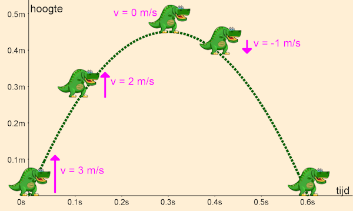

.. role:: python(code)
   :language: python

.. |br| raw:: html

    

Springen
================

Springen is omhoog bewegen en weer naar beneden vallen, hoe moeilijk kan dat zijn...? Best wel moeilijk, want om een goed springeffect te krijgen, moet je een stukje natuurkunde in je programmeerwerk gebruiken.

Zwaartekracht
----------------

Door zwaartekracht vallen objecten op aarde naar beneden. Dat vallen gebeurt niet met een constante snelheid, de snelheid neemt toe tijdens de val. De toename van snelheid noem je *versnelling*. De versnelling door zwaartekracht op aarde is ongeveer 9,81 m/s². Dit betekent dat een object dat vrij valt, elke seconde ongeveer 9,81 meter per seconde sneller gaat.

Wanneer we onze dinosaurus willen laten springen, gaan we hem een verticale snelheid omhoog geven. Tijdens de sprong snoept de zwaartekracht telkens iets van de snelheid af, totdat de snelheid nul is. Op dat moment bevindt de dinosaurus zich op het hoogste punt van de sprong. Maar de zwaartekracht blijft zijn werk doen en de dinosaurus valt terug naar de grond met een steeds groter wordende snelheid. In de figuur hieronder zie je dat weergegeven, waarbij de zwaartekrachtversnelling is afgerond op 10 m/s². In dat geval zou een sprong van 45 centimeter hoog 0,6 seconden duren.

Je ziet dat de dino aan het begin van de sprong een snelheid van 3 m/s heeft. Door de zwaartekracht neemt die af tot 0 m/s op het hoogste punt. Vervolgens neemt de snelheid verder af, en wordt dus negatief: de dino beweegt naar beneden. Meestal geven we snelheid aan met de letter *v* van *velocity*.

.. dropdown:: Positief en negatief
   :open:
   :color: warning
   :icon: alert

   Let op: in bovenstaande afbeelding is de snelheid van de dino omhoog positief en de snelheid omlaag negatief. Dit is gebruikelijk in de natuurkunde. In Pygame Zero is de y-as echter omgekeerd: de bovenkant van het venster heeft een y-coördinaat van 0 en de onderkant een y-coördinaat van 600. Dit betekent dat de snelheid van de dino omhoog negatief is en omlaag positief. Hier moeten we rekening mee houden bij het programmeren van de sprong.

Reageren op de spatiebalk
---------------------------

Tijd om deze theorie in de praktijk te brengen! We gaan de dinosaurus laten springen wanneer op de spatiebalk wordt gedrukt. Daarvoor gebruiken we de :python:`on_key_down()` event handler. De nieuwe code ziet er zo uit:

.. code-block:: python
   :caption: endlessrunner.py
   :linenos:
   :emphasize-lines: 10-11, 19-20, 38, 40-44, 46-49

   from pgzhelper import *

   # Vensterinstellingen
   WIDTH = 800
   HEIGHT = 600
   TITLE = 'Endless Runner'

   # Constanten
   HORIZON = 400
   BASELINE = HORIZON + 45
   GRAVITY = 1

   # Actors
   player = Actor('walk00')
   walk_images = ['walk00', 'walk01', 'walk02', 'walk03']
   player.images = walk_images
   player.fps = 10
   player.left = 10
   player.bottom = BASELINE
   player.vy = 0

   # Functie draw_background()
   def draw_background():
      sky_rect = Rect(0, 0, WIDTH, HORIZON)
      screen.draw.filled_rect(sky_rect, 'deepskyblue')
      ground_rect = Rect(0, HORIZON, WIDTH, HEIGHT - HORIZON)
      screen.draw.filled_rect(ground_rect, 'darkolivegreen4')

   # Functie draw()
   def draw():
      draw_background()
      player.draw()
      
   # Functie update()
   def update():
      player.animate()

      player.y += player.vy
      
      if player.bottom > BASELINE:
         player.bottom = BASELINE
         player.vy = 0
      elif player.bottom < BASELINE:
         player.vy += GRAVITY

   # Event handler on_key_down()
   def on_key_down(key):
      if key == keys.SPACE:
         player.vy = -15

Op regel 10 hebben we een nieuwe constante :python:`BASELINE` toegevoegd en in regel 19 is :python:`HORIZON + 45` vervangen door deze nieuwe constante. De reden voor deze aanpassing zie je in het nieuwe :python:`if` statement in de :python:`update()` functie. Daarin gebruiken we :python:`BASELINE` om te checken of de dino weer terug op de grond staat. |br|
De constante :python:`GRAVITY` in regel 11 is de versnelling door zwaartekracht. |br| 
We hebben de dinosaurus in regel 20 van een extra attribuut :python:`vy` voorzien, dat de verticale snelheid van de dinosaurus aangeeft (vy staat voor *velocity* in *y*-richting). De snelheid is 0 als de dinosaurus op de grond staat.

In de :python:`update()` functie verplaatsen we op regel 38 de dinosaurus met de snelheid :python:`vy` in de *y*-richting. Vervolgens controleren we of de dinosaurus onder de BASELINE is geraakt: :python:`if player.bottom > BASELINE`. Als dat het geval is, zetten we de dinosaurus terug op de BASELINE en zetten we de snelheid op 0. Als de dinosaurus nog in de lucht is (:python:`elif player.bottom < BASELINE`), verhogen we de snelheid met de zwaartekracht.

Tenslotte zie je in regels 46-49 de :python:`on_key_down()` functie. Als de spatiebalk wordt ingedrukt, zetten we de verticale snelheid van de dinosaurus op -15. Dit zorgt ervoor dat de dinosaurus omhoog gaat bewegen.

.. dropdown:: Opdracht 01
   :open:
   :color: secondary
   :icon: pencil

   Run de code en test de werking van de spatiebalk. Experimenteer met verschillende waarden voor de zwaartekracht en de beginsnelheid van de sprong. Neem bijvoorbeeld :python:`GRAVITY = 0.5` of :python:`GRAVITY = 3`. Wat gebeurt er als je de zwaartekracht verhoogt of verlaagt? En wat gebeurt er als je de beginsnelheid in :python:`on_key_down()` verhoogt of verlaagt?

.. dropdown:: Opdracht 02
   :open:
   :color: secondary
   :icon: pencil

   Wat gebeurt er als je snel achter elkaar de spatiebalk een aantal keren indrukt? De dinosaurus springt dan steeds hoger. Hoe komt dat? Kun je dat verhelpen?

   .. dropdown:: Hint
      :color: secondary
      :icon: light-bulb

      Je hoeft eigenlijk alleen maar het :python:`if` statement in de :python:`on_key_down()` functie aan te passen. Aan welke voorwaarden moet worden voldaan om de dinosaurus te laten springen?

