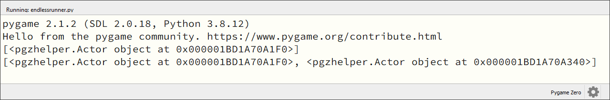
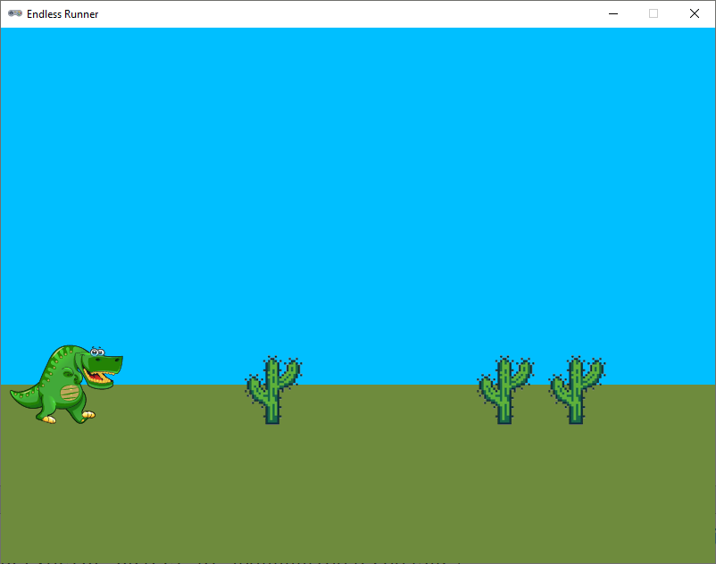
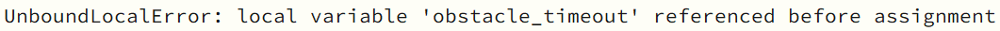
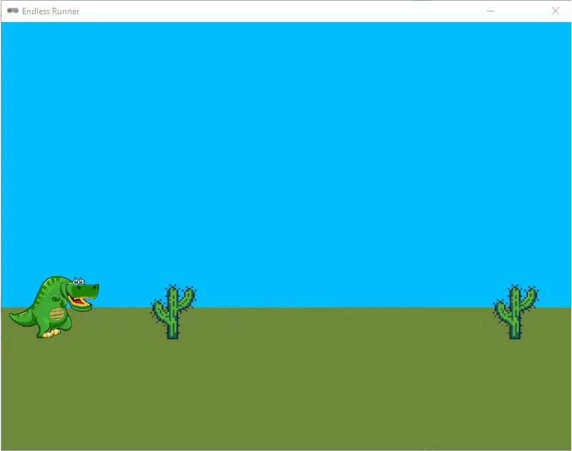

.. role:: python(code)
   :language: python

.. |br| raw:: html

    

Obstakels
================

Op dit moment is onze Endless Runner nog geen spel. We hebben een speler die kan bewegen en een achtergrond, maar er is nog geen uitdaging. Daar gaan we nu verandering in brengen door obstakels toe te voegen. De speler moet deze obstakels ontwijken om zo lang mogelijk in leven te blijven.

Lijst met Actors
------------------

Voor de obstakels gebruiken we :python:`Actor` variabelen. Het probleem is echter dat we van tevoren niet weten hoeveel obstakels er tegelijkertijd in beeld zijn. Dus hoeveel :python:`Actor` variabelen moeten we dan maken? Het antwoord is: we maken een lijst waaraan we :python:`Actor` variabelen kunnen toevoegen als dat nodig is. We noemen onze lijst :python:`obstacles` en bij aanvang van het spel is de lijst nog leeg. In het assignment statement in regel 22 zie je dat aan de twee vierkante haakjes waartussen niets staat: 

.. code-block:: python
   :caption: endlessrunner.py
   :linenos:
   :lineno-start: 13
   :emphasize-lines: 10

   # Actors
   player = Actor('walk00')
   walk_images = ['walk00', 'walk01', 'walk02', 'walk03']
   player.images = walk_images
   player.fps = 10
   player.left = 10
   player.bottom = BASELINE
   player.vy = 0

   obstacles = []

Het toevoegen van een nieuw obstakel aan de lijst doen we in een aparte functie:

.. code-block:: python
   :caption: endlessrunner.py
   :linenos:
   :lineno-start: 24

   # Functie add_obstacle()
   def add_obstacle():
      obstacle = Actor('cactus00')
      obstacle.x = WIDTH + 50
      obstacle.bottom = BASELINE
      obstacles.append(obstacle)

De functie :python:`add_obstacle()` doet het volgende:

* In regel 26 maken we een nieuwe :python:`Actor` variabele :python:`obstacle` aan met de sprite :file:`cactus00.png`.
* In regel 27 plaatsen we het obstakel buiten het zichtbare deel van het venster, 50 pixels buiten de rechterrand.
* In regel 28 plaatsen we het obstakel op de grond.
* In regel 29 voegen we het obstakel toe aan de lijst :python:`obstacles`. Daarvoor gebruiken we de lijstmethode :python:`append()`. *Append* is het Engelse woord voor toevoegen.

Om de nieuwe functie te testen, maken we een :python:`on_mouse_down()` event handler die een nieuw obstakel toevoegt wanneer we met de muis klikken:

.. code-block:: python
   :caption: endlessrunner.py
   :linenos:
   :lineno-start: 60

   # Event handler on_mouse_down()
   def on_mouse_down():
      add_obstacle()
      print(obstacles)

Met :python:`print(obstacles)` zorgen we ervoor dat telkens wanneer een muisknop ingedrukt de huidige lijst met obstakels wordt afgedrukt in de *console*. De *console* is het venster onderaan in Mu Editor waarin je de uitvoer van je programma kunt zien. Houd deze dus goed in de gaten, terwijl je het programma runt en met de muis klikt.

Als het goed is, wordt nu elke keer dat je met de muis klikt, een nieuw :python:`Actor` object toegevoegd aan de lijst. Later zullen we de :python:`on_mouse_down()` event handler weer verwijderen, want dan moeten de obstakels automatisch worden toegevoegd. Maar om te testen of alles werkt, is dit een handige manier.

Obstakels tekenen en bewegen
------------------------------

Nu we obstakels kunnen toevoegen aan de lijst, moeten we ze nog tekenen en laten bewegen. We doen dit in de :python:`draw()` en :python:`update()` functies met behulp van :python:`for` loops. Voor de beweging van de obstakels voegen we ook een nieuwe constante :python:`SPEED` toe.

.. code-block:: python
   :caption: endlessrunner.py
   :linenos:
   :lineno-start: 8
   :emphasize-lines: 5

   # Constanten
   HORIZON = 400
   BASELINE = HORIZON + 45
   GRAVITY = 1
   SPEED = 8

.. code-block:: python
   :caption: endlessrunner.py
   :linenos:
   :lineno-start: 39
   :emphasize-lines: 5-6

   # Functie draw()
   def draw():
      draw_background()
      player.draw()
      for obstacle in obstacles:
         obstacle.draw()

.. code-block:: python
   :caption: endlessrunner.py
   :linenos:
   :lineno-start: 46
   :emphasize-lines: 13-14

   # Functie update()
   def update():
      player.animate()

      player.y += player.vy

      if player.bottom > BASELINE:
         player.bottom = BASELINE
         player.vy = 0
      elif player.bottom < BASELINE:
         player.vy += GRAVITY
         
      for obstacle in obstacles:
         obstacle.x -= SPEED

Run de code en klik met de muis. Zie je cacti (je mag ook cactussen zeggen hoor) verschijnen?

.. _sec_memory_leaks:

Memory leaks voorkomen
-------------------------

Obstakels die links uit het beeld zijn verdwenen, moeten we eigenlijk weer uit de :python:`obstacles` lijst verwijderen. Als we dat niet doen, wordt de lijst steeds voller en voller. Programmeurs noemen zoiets een *memory leak*: onnodig geheugengebruik. Laten we dat lek meteen dichten door de volgende regels aan de :python:`update()` functie toe te voegen:

.. code-block:: python
   :caption: endlessrunner.py
   :linenos:
   :lineno-start: 61

      for obstacle in obstacles.copy():
         if obstacle.right < 0:
            obstacles.remove(obstacle)
            
      print(obstacles)

In regel 61 staat iets bijzonders: :python:`obstacles.copy()`. Daarmee maken we een kopie van de :python:`obstacles` lijst. Met :python:`for` gaan we langs alle obstakels in die lijst en als een obstakel links buiten beeld is geraakt, verwijderen we het uit de originele :python:`obstacles` lijst. De aanroep :python:`print(obstacles)` in regel 65 is tijdelijk toegevoegd zodat je in de console goed kunt zien hoe de lijst zich vult en weer leegt. 

.. dropdown:: Vraag
   :open:
   :color: secondary
   :icon: question

   Waarom maken we een kopie van de :python:`obstacles` lijst? Waarom zouden we niet gewoon het volgende doen?

   .. code-block:: python
      :linenos:
      :lineno-start: 61

         for obstacle in obstacles:
            if obstacle.right < 0:
               obstacles.remove(obstacle)
            
         print(obstacles)

   .. dropdown:: Antwoord
      :color: secondary
      :icon: check-circle

      Wanneer je met een :python:`for` loop door een lijst gaat, waaruit je tijdens die loop items verwijdert, werkt de loop niet meer goed. Laten we een voorbeeld bekijken met een lijst van strings:

      .. code-block:: python
         :linenos:

         stringlist = ['A', 'B', 'B', 'A', 'A']

         print(f'Voor:\t{stringlist}')

         for s in stringlist:
            if s == 'B':
               stringlist.remove(s)

         print(f'Na:\t{stringlist}')

      Vraag: wat zou het resultaat zijn van deze code?

      .. dropdown:: Antwoord
         :color: secondary
         :icon: check-circle

         Het resultaat is:

         .. code-block:: python

            Voor: ['A', 'B', 'B', 'A', 'A']
            Na:   ['A', 'B', 'A', 'A']

         Eerst wordt de volledige lijst afgedrukt, met daarin twee B's. Na het verwijderen verwacht je dat er geen B's meer in de lijst staan, maar dat is niet het geval. Hoe kan dat? Toen de eerste B uit de lijst werd verwijderd, schoven de resterende items in de lijst een plekje op. De tweede B kwam op de plek van de oude terecht, maar de :python:`for` loop ging gewoon naar het volgende item en sloeg daardoor deze tweede B over!

         Door een kopie van de lijst te maken, kunnen we de originele lijst gewoon aanpassen zonder dat dat invloed heeft op de :python:`for` loop. De :python:`for` loop gaat namelijk door de kopie van de lijst en niet door de originele lijst. Het resultaat is dat er geen B's meer in de lijst staan.

         .. code-block:: python
            :linenos:

            stringlist = ['A', 'B', 'B', 'A', 'A']

            print(f'Voor:\t{stringlist}')

            for s in stringlist.copy():
               if s == 'B':
                  stringlist.remove(s)

            print(f'Na:\t{stringlist}')

         Nu worden wel alle B's uit de lijst verwijderd:

         .. code-block:: python

            Voor: ['A', 'B', 'B', 'A', 'A']
            Na:   ['A', 'A', 'A']        

         Overigens is :python:`\\t` in regels 3 en 9 van dit voorbeeld een escape teken dat een tab maakt in de tekst. Dit is handig om de twee lijsten netjes recht onder elkaar uitgelijnd te krijgen.

Verwijder regel 65 weer uit je code. Hij was slechts bedoelt om te zien of de code goed werkte.

Obstakels automatisch *spawnen*
----------------------------------

Het toevoegen van nieuwe obstakels gebeurt nu met muisklikken, maar we willen natuurlijk dat er automatisch cacti verschijnen. Het verschijnen van nieuwe objecten in een game wordt ook wel *spawnen* genoemd. Voor het spawnen van onze obstakels hoeven we slechts een paar dingen te doen:

* een variabele maken die de tijd aangeeft tot weer een nieuw obstakel moet verschijnen;
* het toevoegen van nieuwe obstakels verwerken in de :python:`update()` functie.

De variabele voor de tijd noemen we :python:`obstacle_timeout`:

.. code-block:: python
   :caption: endlessrunner.py
   :linenos:
   :lineno-start: 23
   :emphasize-lines: 2

   obstacles = []
   obstacle_timeout = 60      

In de :python:`update()` functie voegen we code toe die de waarde van :python:`obstacle_timeout` telkens aflaagt met 1. Als de waarde nul (of eventueel kleiner) is geworden, wordt een nieuw obstakel toegevoegd en :python:`obstacle_timeout` weer op 60 gezet. Omdat de :python:`update()` functie 60 keer per seconde wordt uitgevoerd, zit er nu telkens precies een seconde tussen twee obstakels.  

.. code-block:: python
   :caption: endlessrunner.py
   :linenos:
   :lineno-start: 68

      obstacle_timeout -= 1
      if obstacle_timeout <= 0:
         add_obstacle()
         obstacle_timeout = 60

Heb je de code geprobeerd en een foutmelding gekregen? Dat klopt. We geven in de regels 68 en 71 namelijk :python:`obstacle_timeout` met een assignment statement een nieuwe waarde, terwijl die variabele van *buiten* de :python:`update()` functie komt.

Om dit op te lossen moet je aan het begin van de :python:`update()` functie aangeven dat :python:`obstacle_timeout` een zogenoemde *globale* variabele is: een variabele die buiten de functie is gecreëerd. Dat doe je met het :python:`global` keyword:

.. code-block:: python
   :caption: endlessrunner.py
   :linenos:
   :lineno-start: 47
   :emphasize-lines: 3

   # Functie update()
   def update():
      global obstacle_timeout
      
      player.animate()

Nu werkt de code. Elke seconde verschijnt een nieuwe cactus.

Willekeurigheid inbouwen
--------------------------

Het is natuurlijk niet zo leuk als de obstakels telkens met tussenpozen van precies 1 seconde verschijnen. Het is spannender wanneer er soms kort achter elkaar twee obstakels verschijnen en dan weer een tijdje niets. We gaan daarom de tijd tussen twee obstakels randomiseren, oftewel willekeurig maken. Ook gaan we de sprite van de cactus random kiezen uit de zes sprites die in de :file:`images` map staan.

Om gebruik te maken van 'random functies' hebben we de module :python:`random` nodig. Voeg daarom de volgende regel toe aan het begin van je code:

.. code-block:: python
   :caption: endlessrunner.py
   :linenos:
   :emphasize-lines: 2

   from pgzhelper import *
   import random

De :python:`random` module bevat een flink aantal functies die met willekeurigheid te maken hebben. Je vindt de documentatie van de module op de officiële `Python website <https://docs.python.org/3/library/random.html>`_ en voor een overzichtelijke lijst kun je kijken op `www.w3schools.com <https://www.w3schools.com/python/module_random.asp>`_.

Wij gebruiken voor de obstakels twee van de beschikbare functies:

* :python:`random.randint(a, b)`: geeft een willekeurig geheel getal terug tussen de getallen :python:`a` en :python:`b` (inclusief :python:`a` en :python:`b`).
* :python:`random.choice(sequence)`: geeft een willekeurig element terug uit de :python:`sequence`. Een lijst in Python is een voorbeeld van een :python:`sequence`.

Een voorbeeld van het gebruik van die laatste functie:

.. code-block:: python

   import random

   mylist = ['appel', 'banaan', 'citroen', 'druif']

   print(random.choice(mylist))

In bovenstaande code wordt een willekeurige fruitsoort uit de lijst :python:`mylist` gekozen en afgedrukt. Dit kan dus elke keer weer iets anders zijn.

.. dropdown:: Opdracht 01
   :open:
   :color: secondary
   :icon: pencil

   In regel 72 staat op dit moment :python:`obstacle_timeout = 60`. Vervang de waarde :python:`60` door een willekeurig getal tussen 30 en 90. Gebruik hiervoor de :python:`random.randint()` functie.

.. dropdown:: Opdracht 02
   :open:
   :color: secondary
   :icon: pencil

   Voeg in regel 26 een nieuwe variabele :python:`obstacle_images` toe die een lijst is van de zes cactus sprites:

   .. code-block:: python
      :caption: endlessrunner.py
      :linenos:
      :lineno-start: 24
      :emphasize-lines: 3

      obstacles = []
      obstacle_timeout = 60
      obstacle_images = ['cactus00', 'cactus01', 'cactus02', 'cactus03', 'cactus04', 'cactus05']
   
   Gebruik vervolgens in de functie :python:`add_obstacle()` in regel 30 de :python:`random.choice()` functie om een willekeurige sprite uit :python:`obstacle_images` te kiezen voor het nieuwe obstakel.

Je code bevat nu nog steeds de :python:`on_mouse_down()` event handler waarmee je met muisklikken cacti kunt laten verschijnen. Verwijder deze functie uit je code, want we hebben hem niet meer nodig.