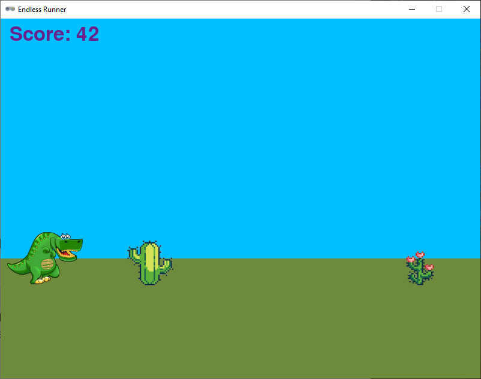
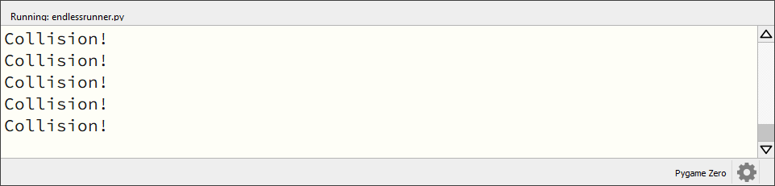
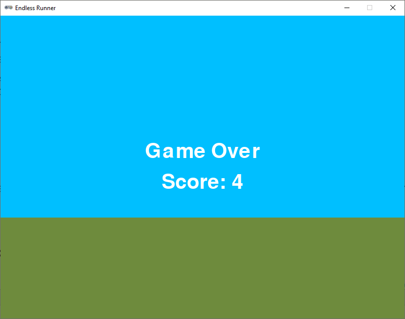

.. role:: python(code)
   :language: python

.. |br| raw:: html

    

Score en game over
===================

We hebben weliswaar obstakels aan het spel toegevoegd, maar die doen nog niets; onze dinosaurus kan er dwars doorheen lopen. In dit deel gaan we ervoor zorgen dat een score wordt bijgehouden en dat het spel afgelopen is zodra de dino tegen een cactus aanloopt.

Score bijhouden
---------------------

Om de score bij te houden, moeten we een aantal dingen doen:

1. Een globale variabele aanmaken die de score bijhoudt.
2. De score verhogen wanneer de dino een cactus voorbijloopt.
3. De score weergeven in het venster.

Maak de :python:`score` variabele net onder het blokje constanten in je code:

.. code-block:: python
   :caption: endlessrunner.py
   :linenos:
   :lineno-start: 9
   :emphasize-lines: 7-8

   # Constanten
   HORIZON = 400
   BASELINE = HORIZON + 45
   GRAVITY = 1
   SPEED = 8

   # Variabelen
   score = 0

Nogmaals: constanten zijn variabelen waarvan de waarde niet verandert tijdens de uitvoering van het programma. De waarde van de :python:`score` variabele zal (hopelijk) wél veranderen tijdens het spel, dus dat is geen constante. We schrijven de naam dan ook met kleine letters.

In het vorige deel hebben we om :ref:`Memory leaks te voorkomen <sec_memory_leaks>` in de :python:`update()` functie obstakels uit de lijst van obstakels verwijderd zodra ze links uit het scherm verdwenen. Dat is een goed moment om meteen de score te verhogen:

.. code-block:: python
   :caption: endlessrunner.py
   :linenos:
   :lineno-start: 69
   :emphasize-lines: 4

      for obstacle in obstacles.copy():
         if obstacle.right < 0:
               obstacles.remove(obstacle)
               score += 1

Let op: :python:`score` is een globale variabele. Om de waarde ervan in de :python:`update()` functie te kunnen veranderen, moeten we dat weer expliciet aangeven met het :python:`global` keyword:

.. code-block:: python
   :caption: endlessrunner.py
   :linenos:
   :lineno-start: 52
   :emphasize-lines: 3

   # Functie update()
   def update():
      global obstacle_timeout, score

Voor het weergeven van de score gebruiken we de functie :python:`screen.draw.text()`. Aan deze functie kun je een hele reeks argumenten meegeven, waaronder natuurlijk de tekst die je wilt tonen, maar ook de positie, kleur, lettertype, enzovoort. Voor meer informatie en voorbeelden kun je kijken op de `website van Pygame Zero <https://pygame-zero.readthedocs.io/en/stable/ptext.html>`_. Voeg de volgende regel toe aan de :python:`draw()` functie:

.. code-block:: python
   :caption: endlessrunner.py
   :linenos:
   :lineno-start: 45
   :emphasize-lines: 7

   # Functie draw()
   def draw():
      draw_background()
      player.draw()
      for obstacle in obstacles:
         obstacle.draw()
      screen.draw.text(f'Score: {score}', (15, 10), color = 'darkorchid4', fontsize = 48)

Run de code en zie hoe de score wordt verhoogd, telkens wanneer links een cactus uit het venster verdwijnt.

Game over
----------------

Zodra de dinosaurus een cactus raakt, moet het spel afgelopen zijn. Je weet inmiddels dat we het raken van twee sprites een *collision* noemen. Omdat we hier met meerdere cactussen in een *lijst* werken, gaan we de functie :python:`collidelist()` gebruiken. Deze functie kijkt of de :python:`player` sprite in aanraking komt met een van de cactussen in de lijst :python:`obstacles`. Zoals je op de `website van pygame <https://www.pygame.org/docs/ref/rect.html>`_ kunt lezen, is :python:`collidelist()` een functie van de :python:`Rect` class. Alle Actors in Pygame Zero kunnen deze gebruiken. In de beschrijving van :python:`collidelist()` staat het volgende:

.. card:: collidelist()
   :class-card: bgcolor-khaki

   *test if one rectangle in a list intersects* |br|
   :tt:`collidelist(list) -> index`

   Test whether the rectangle collides with any in a sequence of rectangles. The index of the first collision found is returned. If no collisions are found an index of -1 is returned.

De functie verwacht dus een lijst van rectangles (in ons geval de cactussen) en geeft de index van de eerste collision terug. Als er geen collision is, geeft de functie :python:`-1` terug. Dit gaan we gebruiken om te kijken of de dinosaurus een cactus raakt. Voeg het volgende :python:`if` statement toe aan de :python:`update()` functie:

.. code-block:: python
   :caption: endlessrunner.py
   :linenos:
   :lineno-start: 80

      if player.collidelist(obstacles) != -1:
         print(f'Collision!')

Run het programma en houd de console in de gaten. Zodra de dinosaurus een cactus raakt, verschijnt er ``Collision`` in de console.

Je ziet dat bij het raken van de eerste cactus meteen een aantal keren het woord ``Collision`` verschijnt. Dit komt doordat de :python:`collidelist()` functie 60 keer per seconde wordt uitgevoerd; hij bevindt zich immers in de :python:`update()` functie van ons spel. Zolang de dinosaurus door de cactus heen loopt, blijft in de console ``Collision`` verschijnen.

Laten we een voorlopige versie maken, waarin het spel direct afgelopen is zodra de dinosaurus een cactus raakt. Daarvoor hebben we een globale :python:`game_over` variabele nodig:

.. code-block:: python
   :caption: endlessrunner.py
   :linenos:
   :lineno-start: 15
   :emphasize-lines: 3

   # Variabelen
   score = 0
   game_over = False

De waarde van deze variabele is in eerste instantie :python:`False`. Zodra de dinosaurus een cactus raakt, zetten we de waarde op :python:`True`:

.. code-block:: python
   :caption: endlessrunner.py
   :linenos:
   :lineno-start: 81
   :emphasize-lines: 2

      if player.collidelist(obstacles) != -1:
         game_over = True

Ook van deze variabele moeten we in de :python:`update()` functie expliciet aangeven dat hij globaal is:

.. code-block:: python
   :caption: endlessrunner.py
   :linenos:
   :lineno-start: 54
   :emphasize-lines: 3

   # Functie update()
   def update():
      global obstacle_timeout, score, game_over

Om aan de speler duidelijk te maken dat het spel is afgelopen, passen we de :python:`draw()` functie aan. We geven de tekst ``Game Over`` weer in het midden van het venster en daaronder de score. Deze tekst moet alleen worden getoond als :python:`game_over` de waarde :python:`True` heeft. We gebruiken hiervoor een :python:`if` statement.

.. code-block:: python
   :caption: endlessrunner.py
   :linenos:
   :lineno-start: 46
   :emphasize-lines: 4-7

   # Functie draw()
   def draw():
      draw_background()
      if game_over:
         screen.draw.text('Game Over', midbottom = (WIDTH / 2, HEIGHT / 2 - 10), color = 'white', fontsize = 60)
         screen.draw.text(f'Score: {score}', midtop = (WIDTH / 2, HEIGHT / 2 + 10), color = 'white', fontsize = 60)
      else:
         player.draw()
         for obstacle in obstacles:
               obstacle.draw()
         screen.draw.text(f'Score: {score}', (15, 10), color = 'darkorchid4', fontsize = 48)

Run het programma en kijk of de tekst ``Game Over`` verschijnt als de dinosaurus een cactus raakt. Als het goed is, werkt dat nu, maar met de score gebeurt iets vreemds.

Wanneer het Game Over is, loopt de scoretelling nog gewoon door!

.. dropdown:: Vraag
   :open:
   :color: secondary
   :icon: question

   Hoe kan het dat de score nog steeds oploopt, terwijl het spel is afgelopen?

   .. dropdown:: Antwoord
      :color: secondary
      :icon: check-circle

      In de :python:`draw()` functie hebben we er met een :python:`if` statement voor gezorgd dat de dinosaurus en de cacti niet meer worden getekend als :python:`game_over` waar is. De :python:`update()` functie wordt echter nog steeds uitgevoerd. Er bewegen dus nog steeds obstakels van rechts naar links door het venster, we zien ze alleen niet!

Dit probleem is heel eenvoudig op te lossen. Voeg bovenaan de :python:`update()` functie het volgende :python:`if` statement toe:

.. code-block:: python
   :caption: endlessrunner.py
   :linenos:
   :lineno-start: 58
   :emphasize-lines: 5-6

   # Functie update()
   def update():
      global obstacle_timeout, score, game_over
      
      if game_over:
         return

Het keyword :python:`return` zorgt ervoor dat de functie wordt verlaten. De rest van de code in de :python:`update()` functie wordt dan niet meer uitgevoerd. Run het programma opnieuw en kijk of de score nu niet meer oploopt als het spel is afgelopen.

En nu hebben we een speelbaar spel! Hoewel... speelbaar. Je zult merken dat het met een zwaartekracht van ``1`` en een sprongetje van ``-15`` een hele uitdaging is om de dino überhaupt over de eerste cactus te laten springen. Experimenteer met andere waarden om het spel wat makkelijker te maken. Probeer bijvoorbeeld :python:`player.vy = -20` in de :python:`on_key_down()` event handler. 