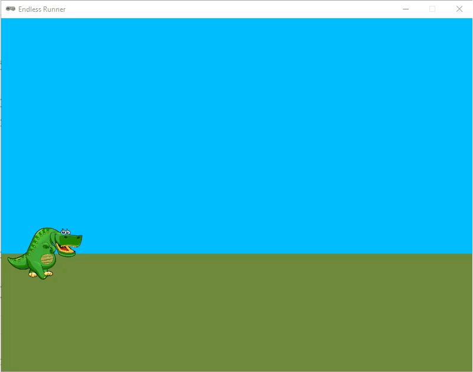

.. role:: python(code)
   :language: python

.. |br| raw:: html

    

Levens verliezen
===================

In de huidige versie van onze Endless Runner is het spel afgelopen zodra de dinosaurus een cactus raakt. Misschien vind je het leuker om de speler een aantal levens te geven en het spel pas te beëindigen als de levens op zijn. In dit deel gaan we dat programmeren.

Knipperende dino
--------------------

Als de dinosaurus een cactus raakt, en de speler een leven verliest, willen we dat de dinosaurus even knippert. Dat maakt voor de speler duidelijk dat er iets is gebeurd, en bovendien kan de dino tijdens het knipperen niet nogmaals worden geraakt door een cactus.

Er zijn meerdere manieren om het knippereffect te programmeren. Je zou bijvoorbeeld de :python:`player.images` lijst kunnen wijzigen naar een lijst waarin zich ook *lege* sprites bevinden. Dat zijn sprites die volledig transparant zijn. Als je dit wilt proberen, download dan :download:`empty.png <../game_assets/endless_runner/images/empty.png>` en plaats het in de :file:`images` map. Vervolgens voeg je aan je code een tweede lijst met sprites toe:

.. code-block:: python
   :caption: endlessrunner.py
   :linenos:
   :lineno-start: 19
   :emphasize-lines: 4

   # Actors
   player = Actor('walk00')
   walk_images = ['walk00', 'walk01', 'walk02', 'walk03']
   hit_images = ['walk00', 'empty', 'walk01', 'empty', 'walk02', 'empty', 'walk03', 'empty']
   player.images = walk_images

Wanneer de dino een cactus raakt, kun je de :python:`player.images` variabele veranderen naar de :python:`hit_images` lijst. Na een paar seconden kun je de :python:`player.images` weer terugzetten naar de :python:`walk_images` lijst. Dit is een manier om het knippereffect te programmeren.

Je kunt het knipperen echter ook laten gebeuren door in de :python:`draw()` functie de dino afwisselend wél en níet te laten tekenen. Deze manier is iets ingewikkelder, maar je hebt meer controle over de snelheid van het knipperen en je hebt geen extra sprite nodig. In dit deel beschrijven we deze manier.

Voeg allereerst een nieuwe constante toe aan de code, die de duur van het knipperen bepaalt.

.. code-block:: python
   :caption: endlessrunner.py
   :linenos:
   :lineno-start: 9
   :emphasize-lines: 6

   # Constanten
   HORIZON = 400
   BASELINE = HORIZON + 45
   GRAVITY = 1
   SPEED = 8
   BLINK_DURATION = 45

De constante :python:`BLINK_DURATION` geeft aan hoe lang de dino moet knipperen in frames. In dit geval is dat 45 frames, wat ongeveer 0,75 seconden is. Dit is een goede tijd om de dino te laten knipperen. Je kunt deze waarde natuurlijk ook aanpassen naar eigen voorkeur.

Aan de :python:`player` actor voegen we twee nieuwe variabelen toe: :python:`is_blinking` en :python:`blink_timer`. De eerste is een boolean die aangeeft of de dino aan het knipperen is. De tweede is een timer die bijhoudt hoe lang de dino al knippert. Voeg de volgende regels toe aan de code: 

.. code-block:: python
   :caption: endlessrunner.py
   :linenos:
   :lineno-start: 20
   :emphasize-lines: 9-10

   # Actors
   player = Actor('walk00')
   walk_images = ['walk00', 'walk01', 'walk02', 'walk03']
   player.images = walk_images
   player.fps = 10
   player.left = 10
   player.bottom = BASELINE
   player.vy = 0
   player.is_blinking = False
   player.blink_timer = BLINK_DURATION

In de :python:`update()` functie moeten we nu een paar dingen regelen:

#. Als de dinosaurus een cactus raakt terwijl hij knippert, mag er niets gebeuren.
#. Als de dinosaurus een cactus raakt en hij is niet aan het knipperen, moet hij gaan knipperen.
#. Als de dinosaurus aan het knipperen is, moet :python:`blink_timer`  worden verlaagd. Zodra de timer op 0 staat, moet de dinosaurus stoppen met knipperen en de timer wordt weer op :python:`BLINK_DURATION` gezet.

We pakken eerst de punten 1 en 2 aan:

.. code-block:: python
   :caption: endlessrunner.py
   :linenos:
   :lineno-start: 91

      if not player.is_blinking and player.collidelist(obstacles) != -1:
         player.is_blinking = True

De dino gaat nu alleen knipperen als hij niet al bezig was met knipperen en een cactus raakt.

Het verlagen van de timer en het stoppen met knipperen regelen we met een nieuw :python:`if` statement in de :python:`update()` functie:

.. code-block:: python
   :caption: endlessrunner.py
   :linenos:
   :lineno-start: 94

      if player.is_blinking:
         player.blink_timer -= 1
         if player.blink_timer <= 0:
               player.is_blinking = False
               player.blink_timer = BLINK_DURATION

Nu moeten we alleen nog de :python:`draw()` functie aanpassen. Dit is misschien wel het ingewikkeldste stukje. We gaan er met een :python:`if` statement voor zorgen dat:

* als :python:`player.is_blinking` :python:`False` is, de dino gewoon wordt getekend;
* als :python:`player.is_blinking` :python:`True` is, de dino wordt getekend als :python:`player.blink_timer` een even getal is en niet wordt getekend als :python:`player.blink_timer` een oneven getal is. Dit zorgt ervoor dat de dino knippert.

In code ziet dat er zo uit:

.. code-block:: python
   :caption: endlessrunner.py
   :linenos:
   :lineno-start: 49
   :emphasize-lines: 8-9

   # Functie draw()
   def draw():
      draw_background()
      if game_over:
         screen.draw.text('Game Over', midbottom = (WIDTH / 2, HEIGHT / 2 - 10), color = 'white', fontsize = 60)
         screen.draw.text(f'Score: {score}', midtop = (WIDTH / 2, HEIGHT / 2 + 10), color = 'white', fontsize = 60)
      else:
         if not player.is_blinking or player.blink_timer % 2 == 0:
               player.draw()
         for obstacle in obstacles:
               obstacle.draw()
         screen.draw.text(f'Score: {score}', (15, 10), color = 'darkorchid4', fontsize = 48)

Kun je je herinneren dat de :python:`%` operator de restwaarde van een deling geeft? Bijvoorbeeld 7 % 2 = 1 en 8 % 2 = 0. Elk even getal dat je door 2 deelt, heeft rest 0 en elk oneven getal dat je door 2 deelt, heeft rest 1. Dit is precies wat we hier gebruiken om te bepalen of de timer een even of oneven getal is. Als :python:`player.blink_timer % 2 == 0` waar is, dan is de waarde van :python:`player.blink_timer` een even getal. In dat geval wordt de dino getekend. En als de waarde oneven is, wordt de dino niet getekend.

Wanneer je nu het spel speelt, zie je dat het knippereffect werkt, maar veel te snel gaat. De dino knippert nu 30 keer per seconde. Door een extra berekening in regel 56 toe te voegen, kunnen we het knipperen vertragen:

.. code-block:: python
   :class: no-copybutton
   :caption: endlessrunner.py
   :linenos:
   :lineno-start: 56
   :emphasize-lines: 1

         if not player.is_blinking or (player.blink_timer // 5) % 2 == 0:
            player.draw()

Nu delen we de tijd eerst door 5 en bekijken dan of het resultaat even of oneven is. Dit zorgt ervoor dat de dino in een rustiger tempo knippert. Uiteraard kun je zelf experimenteren met de snelheid van het knipperen door de waarde 5 te vervangen door een andere waarde.

Levens
----------------

Om het aantal levens bij te houden, hebben we uiteraard weer een variabele nodig. Je kunt ervoor kiezen om een globale variabele te maken, maar dan moet je die telkens weer :python:`global` maken in de functies waarin je de waarde van de variabele wilt veranderen. Het is gemakkelijker om deze variabele aan de :python:`player` actor toe te voegen. Dit kan met de volgende regel code:

.. code-block:: python
   :caption: endlessrunner.py
   :linenos:
   :lineno-start: 20
   :emphasize-lines: 11

   # Actors
   player = Actor('walk00')
   walk_images = ['walk00', 'walk01', 'walk02', 'walk03']
   player.images = walk_images
   player.fps = 10
   player.left = 10
   player.bottom = BASELINE
   player.vy = 0
   player.is_blinking = False
   player.blink_timer = BLINK_DURATION
   player.lives = 3

In de :python:`draw()` functie zorgen we ervoor dat het aantal levens in het venster wordt getoond. Ook hiervoor hoeven we slechts één regel toe te voegen:

.. code-block:: python
   :caption: endlessrunner.py
   :linenos:
   :lineno-start: 50
   :emphasize-lines: 13

   # Functie draw()
   def draw():
      draw_background()
      if game_over:
         screen.draw.text('Game Over', midbottom = (WIDTH / 2, HEIGHT / 2 - 10), color = 'white', fontsize = 60)
         screen.draw.text(f'Score: {score}', midtop = (WIDTH / 2, HEIGHT / 2 + 10), color = 'white', fontsize = 60)
      else:
         if not player.is_blinking or (player.blink_timer // 5) % 2 == 0:
               player.draw()
         for obstacle in obstacles:
               obstacle.draw()
         screen.draw.text(f'Score: {score}', (15, 10), color = 'darkorchid4', fontsize = 48)
         screen.draw.text(f'Lives: {player.lives}', topright = (WIDTH - 15, 10), align = 'right', color = 'darkorchid4', fontsize = 48)

Omdat we de levens in de rechterbovenhoek willen weergeven, gebruiken we de :python:`topright` parameter. De :python:`align` parameter zorgt ervoor dat de tekst rechts uitgelijnd is.

Nu moeten we de levens ook daadwerkelijk verminderen als de dinosaurus een cactus raakt. Dit doen we in de :python:`update()` functie, waar we de waarde van :python:`player.lives` met 1 verlagen.

.. code-block:: python
   :caption: endlessrunner.py
   :linenos:
   :lineno-start: 94
   :emphasize-lines: 3-5

      if not player.is_blinking and player.collidelist(obstacles) != -1:
         player.is_blinking = True
         player.lives -= 1
         if player.lives <= 0:
            game_over = True

Test het spel nu uit. Als de dinosaurus een cactus raakt, moet hij knipperen en het aantal levens moet met 1 worden verminderd. Als de levens op zijn, moet het spel eindigen.

Er is nog wel iets vreemds aan de hand met ons spel. Run de code en laat de dino lopen zonder te springen. Je bent dan al heel snel dood en bent over geen enkele cactus gesprongen, maar tóch behaal je een score van 2 punten. Dat komt doordat de score wordt verhoogd wanneer een cactus links uit beeld verdwijnt, ongeacht of de dino hem heeft geraakt. Gelukkig kunnen we ook die euvel met één extra regel verhelpen:

.. code-block:: python
   :caption: endlessrunner.py
   :linenos:
   :lineno-start: 84
   :emphasize-lines: 4

    for obstacle in obstacles.copy():
        if obstacle.right < 0:
            obstacles.remove(obstacle)
            if not player.is_blinking:
                score += 1

Nu wordt de score alleen verhoogd als de dinosaurus niet aan het knipperen is.

Hartjes
----------------

Meestal wordt het aantal levens weergegeven met hartjes. Wij gaan dat nu ook doen. Net als voor de obstakels gaan we een lijst gebruiken, omdat we meerdere hartjes willen tekenen en we niet van tevoren weten hoeveel. Ook gaan we de hartjes animeren zoals we bij de dino hebben gedaan.

Het maken van de lijst voor de hartjes gaat op dezelfde manier als voor de obstakels. We hebben nu alleen 11 sprites in plaats van 6. Voeg de volgende regels toe aan je code:

.. code-block:: python
   :caption: endlessrunner.py
   :linenos:
   :lineno-start: 32

   hearts = []
   heart_images = ['heart00', 'heart01', 'heart02', 'heart03', 'heart04', 'heart05', 'heart06', 'heart07', 'heart08', 'heart09', 'heart10']

Voor de :python:`obstacles` lijst definieerden we een functie :python:`add_obstacle()` die een nieuwe cactus aan de lijst toevoegde telkens wanneer dat nodig was. Voor de :python:`hearts` lijst maken we een functie :python:`fill_hearts()` die de lijst vult met hartjes. Deze functie wordt straks één keer aangeroepen aan het begin van het spel. We voorzien :python:`fill_hearts()` ook van een parameter :python:`lives` voor het aantal hartjes dat we in de lijst willen stoppen. Voeg de volgende code toe onder de :python:`add_obstacle()` functie: 

.. code-block:: python
   :caption: endlessrunner.py
   :linenos:
   :lineno-start: 46

   # Functie fill_hearts()
   def fill_hearts(lives):
      for l in range(lives):
         heart = Actor('heart00')
         heart.images = heart_images
         heart.scale = 0.1
         heart.right = WIDTH - 15 - l * (heart.get_rect().width + 10)
         heart.top = 10
         heart.fps = 5
         hearts.append(heart)

De eerste regels zullen voor zich spreken, maar regel 51 roept waarschijnlijk vragen op. De :python:`pgzhelper` module bevat de functie :python:`scale()` waarmee je de grootte van een sprite kunt aanpassen. De waarde die je meegeeft aan :python:`scale()` is een percentage van de originele grootte. In dit geval is dat 0.1, wat betekent dat het hartje 10% van de originele grootte is. We hebben dit nodig omdat de heart sprites in de :file:`images` map veel te groot zijn voor ons spel. Je kunt dit zien door in de Verkenner met de rechtermuisknop op bijvoorbeeld :file:`hearts00.png` te klikken en dan te kiezen voor :guilabel:`Eigenschappen` en vervolgens het tabblad :guilabel:`details`.

De :file:`hearts00.png` afbeelding is 302 × 256 pixels groot, terwijl ons game venster maar 800 × 600 pixels groot is. Als we de hartjes niet zouden schalen, zouden ze veel te groot zijn voor ons spel.

Op regel 52 staat een ingewikkelde berekening: |br|
:python:`heart.right = WIDTH - 15 - l * (heart.get_rect().width + 10)` |br|
Deze berekening zorgt ervoor dat het eerste hartje (als :python:`l = 0` is) op 15 pixels van de rechterrand van het venster komt te staan. Het tweede hartje (als :python:`l = 1` is) komt 10 pixels links van het eerste hartje te staan, enzovoort. De waarde 10 is de ruimte tussen de hartjes. Als je dat niet mooi vindt, kun je deze waarde natuurlijk aanpassen.
Met :python:`heart.get_rect().width` krijgen we de breedte van het hartje. Dus de rechterkant van het tweede hartje komt op 10 pixels plus de breedte van een hartje van de rechterkant van het eerste hartje te staan.

Zoals gezegd, gaan we de :python:`fill_hearts()` functie maar één keer aanroepen, bij aanvang van het spel. Plaats helemaal onderaan je programma de volgende code:

.. code-block:: python
   :caption: endlessrunner.py
   :linenos:
   :lineno-start: 126

   # HOOFDPROGRAMMA
   fill_hearts(player.lives)

Om de hartjes te kunnen zien, moeten we ze nog wel even tekenen in de :python:`draw()` functie. Dit doen we met een :python:`for` loop, net zoals we dat deden voor de cacti. Vervang de regel die de levens als tekst op het scherm toont door de :python:`for` loop: 

.. code-block:: python
   :caption: endlessrunner.py
   :linenos:
   :lineno-start: 64
   :emphasize-lines: 13-14

   # Functie draw()
   def draw():
      draw_background()
      if game_over:
         screen.draw.text('Game Over', midbottom = (WIDTH / 2, HEIGHT / 2 - 10), color = 'white', fontsize = 60)
         screen.draw.text(f'Score: {score}', midtop = (WIDTH / 2, HEIGHT / 2 + 10), color = 'white', fontsize = 60)
      else:
         if not player.is_blinking or (player.blink_timer // 5) % 2 == 0:
               player.draw()
         for obstacle in obstacles:
               obstacle.draw()
         screen.draw.text(f'Score: {score}', (15, 10), color = 'darkorchid4', fontsize = 48)
         for heart in hearts:
               heart.draw()

Als je nu het programma runt, zie je de hartjes, maar ze bewegen nog niet. Om dat voor elkaar te krijgen, moeten we in de :python:`update()` functie weer de :python:`animate()` functie aanroepen voor elk hartje in de lijst:

.. code-block:: python
   :caption: endlessrunner.py
   :linenos:
   :lineno-start: 79
   :emphasize-lines: 9-10

   # Functie update()
   def update():
      global obstacle_timeout, score, game_over

      if game_over:
         return

      player.animate()
      for heart in hearts:
         heart.animate()

      player.y += player.vy

Om een hartje te laten verdwijnen zodra de speler een leven verliest, gebruiken we de :python:`pop()` functie. Deze functie verwijdert het laatste item uit een lijst.

.. code-block:: python
   :caption: endlessrunner.py
   :linenos:
   :lineno-start: 112
   :emphasize-lines: 4

      if not player.is_blinking and player.collidelist(obstacles) != -1:
         player.is_blinking = True
         player.lives -= 1
         hearts.pop()
         if player.lives <= 0:
               game_over = True

Run het spel nu nogmaals en kijk of de hartjes verdwijnen als de dinosaurus een cactus raakt. Als dat goed gaat, ben je klaar!
