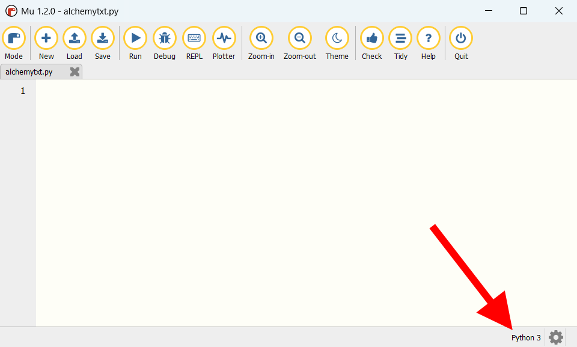

.. role:: python(code)
   :language: python

.. |br| raw:: html

    

Alchemy game
================

:bdg-info:`Deze tutorial is nog 'under construction'.`

Het idee om een tutorial te maken voor een *alchemy game* is afkomstig van twee leerlingen uit de Intermezzo klas 2024/2025. Zij wilden namelijk een spel maken dat lijkt op `Infinite Craft <https://neal.fun/infinite-craft/>`_. 

Bij een alchemy game gaat het erom zoveel mogelijk nieuwe elementen (materialen, voorwerpen) te creëren, door twee bestaande elementen te combineren. Je begint meestal met de vier elementen uit de natuur: aarde, lucht, vuur en water. Door bijvoorbeeld vuur en water te combineren, krijg je stoom. Door stoom en lucht te combineren, krijg je een wolk. Enzovoort. Het doel van het spel is om zoveel mogelijk nieuwe elementen te ontdekken door ze met elkaar te combineren.

Andere bekende alchemy games zijn `Little Alchemy <https://littlealchemy2.com/>`_ en `Doodle God <https://poki.com/en/g/doodle-god>`_

Lists en dictionaries
-------------------------

Om in het spel bij te houden welke elementen de speler heeft ontdekt en welke combinaties mogelijk zijn, gaan we gebruik maken van *lists* en *dictionaries*. Lists ben je al tegengekomen in eerdere games, maar dictionaries ken je waarschijnlijk nog niet. Om goed te begrijpen hoe deze datatypes (want dat zijn het) werken, gaan we eerst een tekstversie van het spel maken, zonder Pygame Zero. Doordat we ons niet om zaken als sprites en events hoeven te bekommeren, kunnen we ons volledig concentreren op de logica van het spel.

.. figure:: images/alchemytxt.png
   :class: image-border
   
Uiteraard zullen we na de tekstversie een grafische versie maken met Pygame Zero, die zo goed mogelijk lijkt op spellen als Infinite Craft en Little Alchemy.

Voorbereiding
---------------

Maak voor dit project in je :file:`games` map een nieuwe map aan met de naam :file:`alchemy`. Voor de tekstversie gebruiken we geen sprites, dus we hebben nog geen :file:`images` map nodig. We maken die pas aan als we de Pygame Zero versie gaan maken.

Maak in Mu Editor een nieuw bestand en sla het op in je :file:`alchemy` map onder de naam :file:`alchemytxt.py`.

.. card::

   .. uml::
      :align: left
      :html_format: svg

      @startuml
         @startfiles
         /games/alchemy/alchemytxt.py
         @endfiles
      @enduml

Waarschijnlijk heb je Mu Editor nog in Pygame Mode staan. Voor de tekstversie van het spel is dat onhandig. Stel daarom Mu Editor in op Python 3 mode (gebruik de :guilabel:`Mode` knop).

