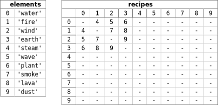
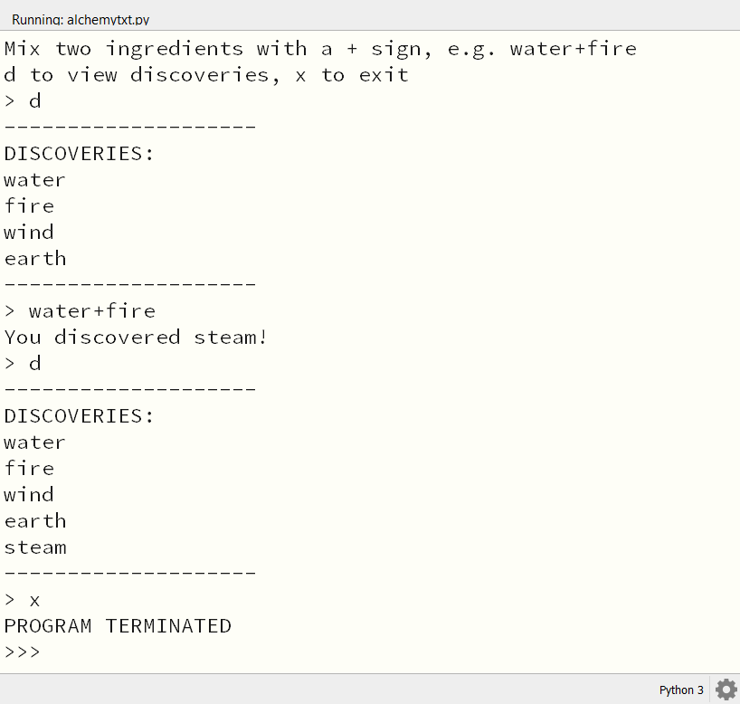

.. role:: python(code)
   :language: python

.. |br| raw:: html

    

Alchemy tekstversie
====================

Drie lijsten
------------------

In de tekstversie van de Alchemy game gebruiken we drie lijsten:

* :python:`elements`: een lijst met de namen van alle elementen die in het spel voorkomen.
* :python:`discoveries`: een lijst met de elementen die de speler heeft ontdekt. De items in deze lijst zijn integers die overeenkomen met indices van de elementen in de `elements` lijst.
* :python:`recipes`: een twee-dimensionale lijst waarin we de recepten opslaan. Je kunt deze lijst zien als een tabel waarin het rijnummer de index van het eerste element is en het kolomnummer de index van het tweede element. De waarde in de tabel is de index van het nieuwe element dat ontstaat door de combinatie van de twee elementen.

Hieronder wordt getoond hoe de :python:`elements` en :python:`recipes` lijsten werken: 

Zoals je ziet, gebruiken we Engelse namen voor de elementen, maar je mag natuurlijk zelf ook Nederlandse namen kiezen. In de :python:`recipes` tabel kun je aflezen dat bijvoorbeeld de elementen met index :python:`0` en :python:`1` samen een nieuw element opleveren met index :python:`4`. Dit betekent dat als spelers de elementen :python:`'water'` en :python:`'fire'` combineren, ze het element :python:`'steam'` ontdekken. De index van :python:`'steam'` is namelijk :python:`4`.

In de :python:`recipes` tabel staan ook veel streepjes. Dit betekent dat de combinatie van die twee elementen geen nieuw element oplevert. Bijvoorbeeld de combinatie van :python:`'wave'` (index :python:`5`) en :python:`'water'` (index :python:`0`) levert geen nieuw element op, want op het kruispunt van rij :python:`5` en kolom :python:`0` staat een streepje. Uiteraard kun je later zelf recepten toevoegen waardoor wél nieuwe elementen ontstaan.

Het is je vast al opgevallen dat de :python:`recipes` tabel symmetrisch is in de hoofddiagonaal: je kunt hem spiegelen in de diagonaal van linksboven naar rechtsonder. Dit betekent dat de volgorde waarin je de elementen combineert niet uitmaakt. De combinatie van :python:`'water'` en :python:`'fire'` levert hetzelfde resultaat op als de combinatie van :python:`'fire'` en :python:`'water'`.

Nu gaan we echt beginnen met het programmeren van het spel. Verwijder alle code uit je :file:`alchemytxt.py` bestand en voeg de volgende code toe:

.. code-block:: python
   :caption: alchemytxt.py
   :linenos:

   ################
   # ALCHEMY GAME #
   # Text version #
   ################

   # LISTS

   elements = [
      'water',
      'fire',
      'wind',
      'earth',
      'steam',
      'wave',
      'plant',
      'smoke',
      'lava',
      'dust'
   ]

   recipes = [[None for column in range(len(elements))] for row in range(len(elements))]

   discoveries = []

De moeilijkste regel is regel 21. Hier maken we de twee-dimensionale lijst :python:`recipes` aan met dezelfde afmetingen als de :python:`elements` lijst. Met een dubbele list comprehension zorgen we ervoor dat alle cellen in de tabel de waarde :python:`None` krijgen. In Python betekent :python:`None` dat er geen waarde is. :python:`None` komt dus overeen met een streepje in de tabel.

Om de :python:`recipes` lijst zichtbaar te maken, kun je op regel 22 tijdelijk de volgende code toevoegen:

.. code-block:: python
   :linenos:
   :lineno-start: 22

   for row in recipes: print(row)

Als je nu de code runt, krijg je de volgende uitvoer:

.. code-block:: python

   [None, None, None, None, None, None, None, None, None, None]
   [None, None, None, None, None, None, None, None, None, None]
   [None, None, None, None, None, None, None, None, None, None]
   [None, None, None, None, None, None, None, None, None, None]
   [None, None, None, None, None, None, None, None, None, None]
   [None, None, None, None, None, None, None, None, None, None]
   [None, None, None, None, None, None, None, None, None, None]
   [None, None, None, None, None, None, None, None, None, None]
   [None, None, None, None, None, None, None, None, None, None]
   [None, None, None, None, None, None, None, None, None, None]

Verwijder de code in regel 22 weer, want dit was slechts om te laten zien dat de lijst goed is aangemaakt.

Helper functies
------------------

Nu gaan we vier helper functies maken. De eerste is :python:`add_recipe()`. Met deze functie kunnen we recepten toevoegen aan de :python:`recipes` lijst.

Voeg de volgende code toe:

.. code-block:: python
   :linenos:
   :lineno-start: 25

   # HELPER FUNCTIONS

   def add_recipe(ingredient1, ingredient2, result):
      i1 = elements.index(ingredient1)
      i2 = elements.index(ingredient2)
      r = elements.index(result)
      recipes[i1][i2] = r
      recipes[i2][i1] = r

Op regel 27 zie je dat we :python:`add_recipe()` drie parameters meegeven: de twee ingrediënten en het resulterende element. Op regels 28-30 gebruiken we de list-functie :python:`index()` om de indices van de ingrediënten en van het resultaat op te zoeken in de :python:`elements` lijst. Op regels 31-32 vullen we de cellen in de :python:`recipes` tabel met de index van het resultaat. Je ziet hierin weer de eerder genoemde symmetrie terugkomen.

Laten we meteen een paar recepten toevoegen. Voeg de volgende regels toe onder de :python:`add_recipe()` functie:

.. code-block:: python
   :linenos:
   :lineno-start: 34

   # MAIN PROGRAM

   add_recipe('water', 'fire', 'steam')
   add_recipe('water', 'wind', 'wave')
   add_recipe('water', 'earth', 'plant')
   add_recipe('fire', 'wind', 'smoke')
   add_recipe('fire', 'earth', 'lava')
   add_recipe('wind', 'earth', 'dust')

   for row in recipes: print(row)   # Just for testing

Op regel 43 printen we de :python:`recipes` lijst uit, zodat je kunt zien dat de recepten zijn toegevoegd, wederom slechts om te testen of alles goed werkt. Als je het programma nu runt, krijg je de volgende uitvoer:

.. code-block:: python

   [None, 4, 5, 6, None, None, None, None, None, None]
   [4, None, 7, 8, None, None, None, None, None, None]
   [5, 7, None, 9, None, None, None, None, None, None]
   [6, 8, 9, None, None, None, None, None, None, None]
   [None, None, None, None, None, None, None, None, None, None]
   [None, None, None, None, None, None, None, None, None, None]
   [None, None, None, None, None, None, None, None, None, None]
   [None, None, None, None, None, None, None, None, None, None]
   [None, None, None, None, None, None, None, None, None, None]
   [None, None, None, None, None, None, None, None, None, None]

En voilà, we hebben de tabel met recepten gemaakt!

De volgende helper functie is :python:`get_recipe()`. Deze functie gaan we later gebruiken om te checken of de combinatie van twee ingrediënten een nieuw element oplevert. Eigenlijk is het een soort *lookup* functie, die het juiste item uit de :python:`recipes` lijst haalt. Voeg onderstaande code toe onder de :python:`add_recipe()` functie (en boven :python:`# MAIN PROGRAM`).

.. code-block:: python
   :linenos:
   :lineno-start: 34

   def get_recipe(ingredient1, ingredient2):
      i1 = elements.index(ingredient1)
      i2 = elements.index(ingredient2)
      r = recipes[i1][i2]
      return r

Om te testen of de functie goed werkt, kun je de volgende regel gebruiken in plaats van het eerder print statement waarmee we de receptentabel testten:

.. code-block:: python
   :linenos:
   :lineno-start: 49

   print(get_recipe('water', 'fire'))  # Just for testing

De uitvoer zou moeten zijn:

.. code-block:: python

   4

Want de combinatie van :python:`'water'` en :python:`'fire'` levert het element met index :python:`4` op, namelijk :python:`'steam'`.

De derde lijst die we in het spel gebruiken is de :python:`discoveries` lijst. Deze lijst houdt bij welke elementen de speler al heeft ontdekt. In regel 23 hebben we daarvoor een lege lijst aangemaakt: :python:`discoveries = []`. Om nieuw ontdekte elementen toe te voegen aan :python:`discoveries`, maken we de helper functie :python:`add_discovery()`. Voeg onderstaande code toe onder de :python:`get_recipe()` functie:

.. code-block:: python
   :linenos:
   :lineno-start: 40

   def add_discovery(element):
      i = elements.index(element)
      if i not in discoveries:
         discoveries.append(i)

Met de :python:`index()` functie zoeken we weer de index van het element op in de :python:`elements` lijst. Vervolgens controleren we met een :python:`if` statement of deze index al in de :python:`discoveries` lijst staat. Als dat niet zo is, voegen we de index toe aan de :python:`discoveries` lijst.

Laten we ook deze functie testen. Voeg de volgende regels toe onderaan je code, na de :python:`add_recipe()` aanroepen:

.. code-block:: python
   :linenos:
   :lineno-start: 54

   add_discovery('water')
   add_discovery('fire')
   add_discovery('wind')
   add_discovery('earth')

   print(discoveries)  # Just for testing

De uitvoer is nu:

.. code-block:: python

   [0, 1, 2, 3]

De laatste helper functie die we nodig hebben, is :python:`is_discovered()`. Deze functie controleert of een bepaald element al is ontdekt door de speler. Voeg onderstaande code toe onder de :python:`add_discovery()` functie:

.. code-block:: python
   :linenos:
   :lineno-start: 45

   def is_discovered(element):
      if element not in elements:
         return False
      i = elements.index(element)
      return i in discoveries

De functie :python:`is_discovered()` controleert eerst of de naam van het element dat we willen controleren überhaupt in de :python:`elements` lijst staat. Als dat niet zo is, geeft de functie :python:`False` terug (en wordt de rest van de functie niet uitgevoerd). Als het element wel in de lijst staat, zoeken we de index op. Met :python:`return i in discoveries` retourneren we :python:`True` als die index in :python:`discoveries` voorkomt. Zo niet, dan wordt :python:`False` teruggegeven.

Gebruik om de functie te testen de volgende code. Let daarbij op het verschil tussen de dubbele en de enkele aanhalingstekens (en bedenk waarom dat nodig is).

.. code-block:: python
   :linenos:
   :lineno-start: 65

   print(f"{is_discovered('earth') = }")  # Just for testing
   print(f"{is_discovered('smoke') = }")  # Just for testing
   print(f"{is_discovered('stone') = }")  # Just for testing

De uitvoer laat zien dat :python:`'earth'` is ontdekt, maar de andere twee elementen niet:

.. code-block:: python

   is_discovered('earth') = True
   is_discovered('smoke') = False
   is_discovered('stone') = False

.. dropdown:: f-strings met een = teken
   :color: info
   :icon: info

   Met f-strings ben je inmiddels wel enigszins bekend, maar het gebruik van een = teken in een f-string, zoals in regels 65-67, is nieuw. De techniek bestaat sinds Python 3.8 en is een manier om een expressie en het resultaat ervan in één keer weer te geven. In Python wordt dit een `Self Documenting Expression <https://docs.python.org/3/whatsnew/3.8.html#f-strings-support-for-self-documenting-expressions-and-debugging>`_ genoemd. Handig voor het debuggen van je code!

Game loop
------------------

De fundamenten van het spel zijn klaar. We hebben drie lijsten en vier helper functies gemaakt. Nu gaan we de game loop maken. Dit is de hoofdloop van het spel, die steeds opnieuw wordt uitgevoerd totdat de speler het spel beëindigt. In de loop vragen we de speler telkens om twee elementen te combineren en kijken we of ze een nieuw element opleveren. Als dat zo is, voegen we het nieuwe element toe aan de :python:`discoveries` lijst.

Naast het combineren van elementen, moet de speler ook de mogelijkheid hebben om een lijst op te vragen van de elementen die hij al heeft ontdekt, en het spel moet kunnen worden beëindigd. Laten we met die twee zaken beginnen. Voeg de volgende code toe onderaan in :python:`# MAIN PROGRAM`:

.. code-block:: python
   :linenos:
   :lineno-start: 65

   print('Mix two ingredients with a + sign, e.g. water+fire')
   print('d to view discoveries, x to exit')
   while True:
      command = input('> ')
      if command == 'x':
         print('PROGRAM TERMINATED')
         break
      elif command == 'd':
         print('-' * 20)
         print('DISCOVERIES:')
         for d in discoveries: print(elements[d])
         print('-' * 20)

Regels 65-66 geven de speler instructies over hoe hij het spel kan spelen. Regel 67 start de game loop. De loop blijft draaien totdat de speler het spel beëindigt door :python:`x` in te voeren. Als de speler :python:`d` invoert, wordt de lijst met ontdekte elementen weergegeven. De lijst wordt netjes opgemaakt met een lijn erboven en eronder.

.. dropdown:: break
   :color: info
   :icon: info

   Wellicht wekt regel 67 enige verbazing. Met :python:`while True` starten we een loop die oneindig doorgaat. Hoe kan het spel dan ooit stoppen? Daarvoor gebruiken we in regel 71 het :python:`break` keyword. Met deze instructie kun je een loop vroegtijdig beëindigen. Vergelijk de onderstaande codefragmenten:

   .. code-block:: python 

      reply = input('Typ x om te stoppen: ')
      while reply != 'x':
         reply = input('Typ x om te stoppen: ')

   .. code-block:: python

      while True:
         reply = input('Typ x om te stoppen: ')
         if reply == 'x':
            break

   Beide fragmenten doen hetzelfde. Welke techniek je kiest, hangt af van de situatie en je persoonlijke voorkeur. Het eerste codefragment telt een regel minder dan het tweede, maar de regel :python:`reply = input('Typ x om te stoppen: ')` komt twee keer voor, hetgeen minder elegant is.

Nu moeten we nog de mogelijkheid inbouwen om twee elementen met elkaar te combineren. In regel 65 zie je dat we de speler vragen om elementen te combineren met een :python:`+` teken. Onze code moet de invoer van de gebruiker dus opslitsen in twee stukken: het deel vóór het :python:`+` teken en het deel erna. Python heeft daar een handige functie voor: :python:`split()`. Deze functie splitst een string in delen, op basis van een opgegeven scheidingsteken. In ons geval is dat het :python:`+` teken. De functie geeft een lijst terug met de delen. |br|
Voeg onderstaande code toe aan het if statement dat we net hebben gemaakt:

.. code-block:: python
   :linenos:
   :lineno-start: 77

      else:
         ingredients = command.split('+')
         if len(ingredients) != 2 or not (is_discovered(ingredients[0]) and is_discovered(ingredients[1])):
               print('Unknown command')
               continue
         else:
               print(f'Combining {ingredients[0]} and {ingredients[1]}.')

In regel 78 splitsen we de invoer van de speler op het :python:`+` teken. De resulterende lijst met ingrediënten wordt opgeslagen in de variabele :python:`ingredients`. Vervolgens controleren we of de lengte van de lijst gelijk is aan 2 (de speler moet immers twee ingrediënten opgeven) en of beide ingrediënten al zijn ontdekt. Als dat niet zo is, geven we een foutmelding weer en gaan we terug naar het begin van de loop met :python:`continue`. Als alles goed is, geven we een melding weer dat we de ingrediënten gaan combineren.

.. dropdown:: continue
   :color: info
   :icon: info

   Net als het :python:`break` keyword, is ook :python:`continue` een instructie die je kunt gebruiken om een loop te beïnvloeden. Met :python:`continue` ga je terug naar het begin van de loop, zonder de rest van de code in de loop uit te voeren. Het volgende voorbeeld laat zien hoe dat werkt:

   .. code-block:: python

      for i in range(5):
         if i == 2:
            continue
         print(i)

   De output van deze code is:

   .. code-block:: python

      0
      1
      3
      4

   Wij gebruiken :python:`continue` in regel 81 om de rest van de loop over te slaan als de speler een onbekende opdracht invoert. De loop gaat dan meteen weer terug naar het begin, waar we opnieuw om een opdracht vragen.

Wanneer de speler een goede combinatie van elementen invoert, moeten we checken of er een recept bestaat voor deze combinatie. Vervolgens kunnen er drie dingen gebeuren:

#. Er bestaat geen recept voor de combinatie. In dat geval vertellen we dat aan de speler.
#. Er bestaat een recept voor de combinatie, maar het resultaat is al ontdekt. Ook dat vertellen we aan de speler.
#. Er bestaat een recept voor de combinatie en het resultaat is nog niet ontdekt. We voegen het resultaat toe aan de :python:`discoveries` lijst en vertellen dat aan de speler.

In code ziet dat er zo uit (verwijder het huidige :python:`else` statement in regels 82-83):

.. code-block:: python
   :linenos:
   :lineno-start: 82

            r = get_recipe(ingredients[0], ingredients[1])
            if r == None:
               print(f'Alas, no recipe found for {ingredients[0]} and {ingredients[1]}.')
            elif r in discoveries:
               print(f'You already discovered {elements[r]}.')
            else:
               print(f'You discovered {elements[r]}!')
               add_discovery(elements[r])

En hiermee is de tekstversie van het spel klaar! Probeer het spel uit en kijk of alles werkt. Je kunt nu elementen combineren, de ontdekkingen bekijken en het spel beëindigen.

Als je het spel nog verder wilt uitbreiden, kun je uiteraard zelf recepten toevoegen of de lijst met elementen uitbreiden. Maar het is natuurlijk nog leuker om het spel een grafische interface te geven met Pygame Zero! Echter voordat we daarmee beginnen, gaan we de tekstversie nog wat verbeteren. In plaats van lijsten met indices, gaan we *dictionaries* gebruiken en we gaan de recepten in een tekstbestand opslaan. Dat maakt de code een stuk overzichtelijker en makkelijker aan te passen.