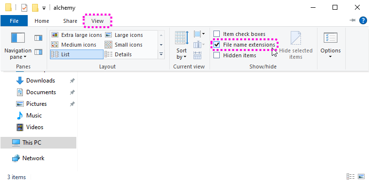
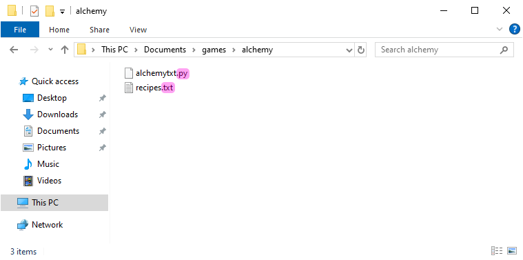

.. role:: python(code)
   :language: python

.. |br| raw:: html

    

Bestanden lezen
====================

In de huidige versie van ons Alchemy spel zijn de elementen en de recepten *hardcoded* in de programmacode. De elementen in de dictionary :python:`elements` en de recepten in de string :python:`recipes_txt`:

.. code-block:: python

   elements = {
      'fire': 'vuur',
      'water': 'water',
      'wind': 'wind',
      'earth': 'aarde',
      'steam': 'stoom',
      'wave': 'golf',
      'plant': 'plant',
      'smoke': 'rook',
      'lava': 'lava',
      'dust': 'stof'
   }

   recipes_txt = '''water
   fire
   wind
   earth
   -
   water+fire=steam
   water+wind=wave
   water+earth=plant
   fire+wind=smoke
   fire+earth=lava
   wind+earth=dust'''

Dit betekent dat we de code moeten wijzigen telkens als we een nieuw element of recept willen toevoegen. Dit is niet erg handig, vooral als we veel elementen en recepten hebben. Het is beter om deze gegevens in een apart bestand te zetten, zodat we ze gemakkelijk kunnen aanpassen zonder de programmacode te veranderen.

Recipes in een txt bestand
------------------------------------------------
We gaan de recepten in een tekstbestand zetten. In Windows kun je snel een tekstbestand maken met het programma Kladblok (Engels: Notepad). Start Kladblok en plak de inhoud van de string :python:`recipes_txt` erin.

Sla het bestand op in de map :file:`alchemy` onder de naam :file:`recipes.txt`. Het is belangrijk dat je het bestand in dezelfde map opslaat als het :file:`alchemytxt.py` bestand.

.. uml::
   :align: center
   :html_format: svg

   @startuml
      @startfiles
      /games/alchemy/alchemytxt.py
      /games/alchemy/recipes.txt
      @endfiles
   @enduml

Zie je in de Windows Verkenner de extensie :file:`.txt` staan achter de naam van het bestand? Zo niet, dan kun je de extensie zichtbaar maken door in de Verkenner naar het tabblad :guilabel:`Beeld` te gaan en daar het vinkje bij :guilabel:`Bestandsextensies` aan te zetten.

In Python bestaat het lezen van een bestand uit drie stappen:

#. Open het bestand met de functie :python:`open()`. Deze functie heeft twee argumenten: de naam van het bestand dat je wilt openen en de modus waarin je het bestand wilt openen. De standaardmodus is :python:`'r'`, wat betekent dat je het bestand alleen wilt lezen.
#. Lees de informatie in het bestand met de :python:`read()` methode.
#. Sluit het bestand met de :python:`close()` methode.

Voeg bovenaan de :python:`build_recipes()` functie de volgende code toe:

.. code-block:: python

   def build_recipes():
      file = open('recipes.txt', 'r')
      recipes_txt = file.read()
      file.close()

Verwijder vervolgens de oude :python:`recipes_txt` string in de regels 27 t/m 37 uit je code. Het eerste stuk van het programma ziet er nu zo uit:

.. code-block:: python
   :linenos:
   :lineno-start: 8

   elements = {
      'fire': 'vuur',
      'water': 'water',
      'wind': 'wind',
      'earth': 'aarde',
      'steam': 'stoom',
      'wave': 'golf',
      'plant': 'plant',
      'smoke': 'rook',
      'lava': 'lava',
      'dust': 'stof'
   }

   elements_inverse = {v: k for k, v in elements.items()}

   recipes = {}

   discoveries = []

   # HELPER FUNCTIONS

   def build_recipes():
      f = open('recipes.txt', 'r')
      recipes_txt = f.read()
      f.close()
      
      first_part, second_part = recipes_txt.split('\n-\n')
      ...

Run het programma en kijk of het nog steeds werkt. Als je nu de recepten wilt aanpassen, hoef je slechts het :file:`recipes.txt` bestand te openen en de inhoud te wijzigen. De programmacode blijft ongemoeid, waardoor de kans op errors kleiner wordt. Bovendien kan iemand die niets van Python code begrijpt nu ook de recepten aanpassen.

.. dropdown:: Een betere manier om bestanden te openen
   :open:
   :color: info
   :icon: info

   Wanneer je klaar bent met het lezen van (of schrijven naar) een bestand, moet je niet vergeten het bestand weer te sluiten met de :python:`close()` methode. Want als een bestand open staat op het moment dat je programma onverhoopt crasht of zelfs je hele computer vastloopt, kan het beschadigd raken, waardoor je de data kwijt bent.

   Om te voorkomen dat je een bestand vergeet te sluiten, kun je het :python:`with` statement gebruiken. Dit zorgt ervoor dat het bestand automatisch wordt gesloten zodra je klaar bent met het lezen of schrijven ervan. De code om een bestand te openen en te lezen zou er dan zo uitzien:

   .. code-block:: python
      :linenos:
      :lineno-start: 29
      :emphasize-lines: 2-3

      def build_recipes():
         with open('recipes.txt', 'r') as file:
            recipes_txt = file.read()

   Op deze manier hoef je je geen zorgen te maken over het sluiten van het bestand, omdat Python dit automatisch voor je doet.

Vervang de code in regels 30 t/m 32 door de code in het infoblok hierboven. Het resultaat is hetzelfde, maar het is een nettere manier om met bestanden om te gaan.

.. dropdown:: Bestandsmodi (File modes)
   :color: info
   :icon: info

   In ons spel hoeven we alleen maar informatie te lezen uit het bestand. Daarom gebruiken we de :python:`'r'` modus. Maar er zijn ook andere modi waarin je een bestand kunt openen, zoals :python:`'w'` om te kunnen schrijven naar het bestand. In de `Python documentatie <https://docs.python.org/3/library/functions.html#open>`_ vind je een overzicht van de verschillende bestandsmodi.

Elementen in een JSON bestand
------------------------------------------------

Voor de elementen gebruiken we geen txt bestand, maar een JSON bestand. Een JSON bestand is een tekstbestand waarin gegevens zijn opgeslagen in een gestructureerd formaat. Dat formaat lijkt heel sterk op de Python dictionary waarmee je in het vorige deel kennismaakte: in een JSON bestand sla je gegevens op in de vorm van sleutel-waarde paren. Voor onze Alchemy game is dat ideaal, want we kunnen zo de inhoud van het JSON bestand met slechts een paar regels code inlezen in de :python:`elements` dictionary.

Het bewerken van een JSON bestand zou je met Kladblok/Notepad kunnen doen, maar het is beter een geavanceerde teksteditor te gebruiken, zoals bijvoorbeeld `Notepad++ <https://notepad-plus-plus.org/>`_ of `Visual Studio Code <https://code.visualstudio.com/>`_ . Deze editors hebben speciale ondersteuning voor JSON bestanden en geven met kleuren aan of de opmaak van het bestand klopt. Dat maakt het makkelijker om fouten te vinden en te corrigeren. Eventueel kun je ook een online editor gebruiken, zoals `JSON Editor Online <https://jsoneditoronline.org/>`_.

Download het :download:`elements.json <../game_assets/alchemy/json_txt/elements.json>` bestand en sla het op in je :file:`alchemy` map. Open het bestand met Notepad++ (of een andere editor) om de inhoud te bekijken.

Je ziet dat de inhoud van het JSON bestand vrijwel identiek is aan de :python:`elements` dictionary in ons spel.

.. dropdown:: Aanhalingstekens in JSON
   :open:
   :color: warning
   :icon: alert

   In JSON bestanden worden altijd *dubbele* aanhalingstekens gebruikt voor strings. Dit is anders dan in Python, waar je ook *enkele* aanhalingstekens kunt gebruiken. Als je een JSON bestand maakt met enkele aanhalingstekens, krijg je een foutmelding. Zorg er dus voor dat je altijd dubbele aanhalingstekens gebruikt in JSON bestanden!

Nu is het tijd om het JSON bestand in onze code in te lezen. Om dat te kunnen doen, is het nodig dat het in dezelfde map staat als het :file:`alchemytxt.py` bestand. 

.. uml::
   :align: center
   :html_format: svg

   @startuml
      @startfiles
      /games/alchemy/alchemytxt.py
      /games/alchemy/elements.json
      /games/alchemy/recipes.txt
      @endfiles
   @enduml

Voeg bovenaan je code het volgende import statement toe:

.. code-block:: python
   :linenos:
   :emphasize-lines: 6

   ################
   # ALCHEMY GAME #
   # Text version #
   ################

   import json

   # DICTIONARIES AND LISTS

De :python:`json` module is een ingebouwde module in Python die het mogelijk maakt om JSON bestanden te lezen en te schrijven. Voeg de volgende drie regels toe aan het hoofdprogramma, vóór alle andere code:

.. code-block:: python
   :linenos:
   :lineno-start: 69
   :emphasize-lines: 3-5

   # MAIN PROGRAM

   with open('elements.json', 'r') as file:
         elements = json.load(file)
   elements_inverse = {v: k for k, v in elements.items()}

   build_recipes()

De regels 71 en 72 lijken sterk op de code die we eerder gebruikten om het :file:`recipes.txt` bestand te lezen. Het enige verschil is dat we nu de :python:`json.load()` functie gebruiken in plaats van de :python:`read()` methode. Deze functie leest het JSON bestand en zet de inhoud om in een Python dictionary. Nadat dit is gebeurd, maken we op regel 73 de inverse dictionary aan, zoals we eerder deden op regel 23.

Verwijder de oude :python:`elements` en :python:`elements_inverse`  dictionaries in de regels 10 t/m 23 uit je code. Het eerste stuk van het programma ziet er nu zo uit:

.. code-block:: python
   :linenos:
   :lineno-start: 6

   import json

   # DICTIONARIES AND LISTS

   recipes = {}

   discoveries = []

   # HELPER FUNCTIONS

   def build_recipes():
      with open('recipes.txt', 'r') as file:
         recipes_txt = file.read()
      
      first_part, second_part = recipes_txt.split('\n-\n')

Als het goed is, werkt het spel nog steeds en merk je geen verschil met de eerdere versie. Door de recepten en de elementen in aparte bestanden op te slaan, hebben we de programmacode echter korter en overzichtelijker gemaakt. Bovendien kun je het spel nu veel makkelijker uitbreiden met nieuwe elementen en recepten. Je hoeft alleen maar de JSON en TXT bestanden aan te passen, zonderde programmacode te wijzigen.

.. dropdown:: Tip: bestudeer de code
    :open:
    :color: info
    :icon: info

    In het volgende deel gaan we aan de slag met de grafische versie van het spel. Het is een goed idee om de code die we tot nu toe hebben geschreven regel voor regel door te nemen en nog eens te bedenken wat die regel doet en waarom die daar staat. Dit zal je helpen om de grafische versie van het spel beter te begrijpen en aan te passen aan je eigen wensen.