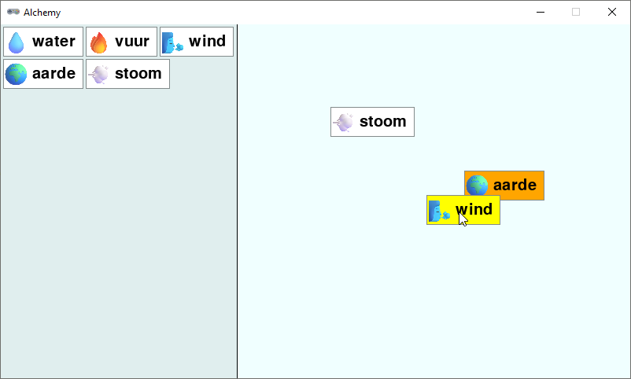

.. role:: python(code)
   :language: python

.. |br| raw:: html

    

Alchemy in Pygame
====================

Heb je de tekstversie van het spel gemaakt en begrijp je hoe het werkt? Dan ben je klaar om het spel in Pygame Zero te maken. Het eindresultaat gaat er zo uitzien:

Aan de linkerkant van het venster staan de elementen die je hebt ontdekt. De rechterzijde van het venster is het gebied waarin je elementen kunt combineren. De speler kan met de muis elementen van links naar rechts slepen. Door een element bovenop een ander element te slepen, worden ze gecombineerd.

Voorbereiding
----------------

Maak in je :file:`alchemy` map een map :file:`images` aan. Download :download:`assets.zip <../game_assets/alchemy/assets.zip>` en plaats de sprites uit dit zip-bestand in de :file:`images` map.

.. card:: 

   .. uml::
      :align: left
      :html_format: svg

      @startuml
         @startfiles
         /games/alchemy/images/dust.png
         /games/alchemy/images/earth.png
         /games/alchemy/images/fire.png
         /games/alchemy/images/lava.png
         /games/alchemy/images/plant.png
         /games/alchemy/images/smoke.png
         /games/alchemy/images/steam.png
         /games/alchemy/images/water.png
         /games/alchemy/images/water_wave.png
         /games/alchemy/images/wind.png
         /games/alchemy/alchemytxt.py
         /games/alchemy/elements.json
         /games/alchemy/recipes.txt
         @endfiles
      @enduml

.. dropdown:: Herkomst van de afbeeldingen
   :open:
   :color: info
   :icon: info

   De afbeeldingen in het :python:`assets.zip` bestand zijn afkomstig van `Emojipedia <https://emojipedia.org/>`_. Zoek bijvoorbeeld naar :tt:`fire`, klik vervolgens op :guilabel:`Emoji designs` en scroll naar de *Microsoft 3D Fluent* versie om de afbeelding voor vuur te vinden. Wil je de afbeelding opslaan, klik er dan op met de rechtermuisknop en kies de juiste optie uit het contextmenu.

   .. figure:: images/emojipedia.png