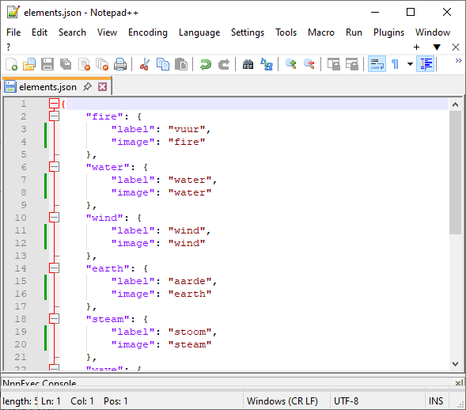
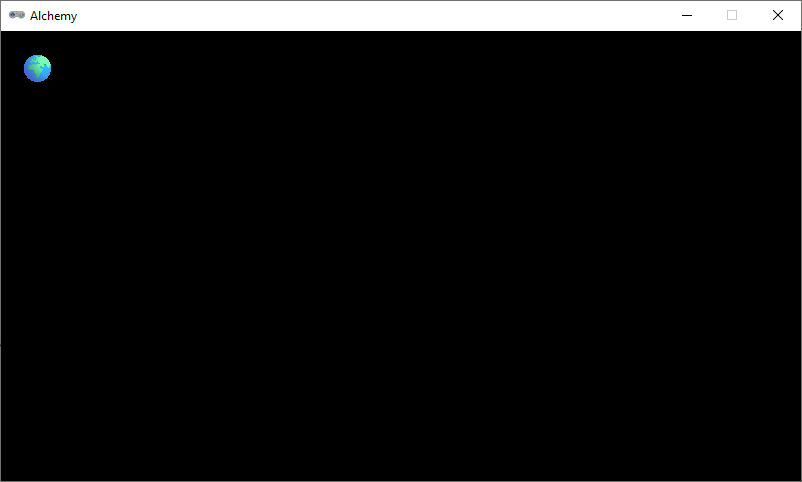
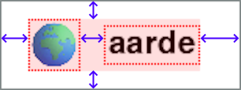
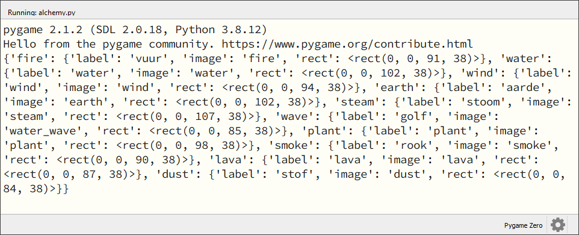
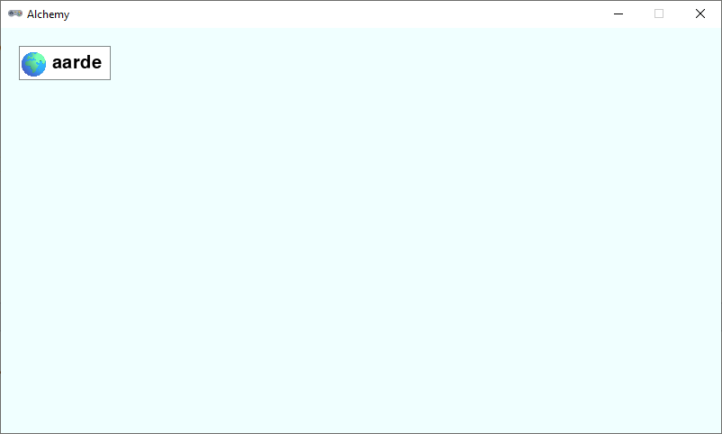

.. role:: python(code)
   :language: python

.. |br| raw:: html

    

Elementen tekenen
====================

In de grafische versie van het spel worden de elementen weergegeven als rechthoekige blokjes waarin links de afbeelding van het element staat en rechts de naam.

Voor zo'n blokje - laten we het een *element card* noemen - kunnen we geen Actor gebruiken, omdat het uit meer dan een plaatje bestaat. We zullen de element cards dus zelf moeten tekenen en dat is niet eenvoudig. Ten eerste moeten we de afbeelding van het element verkleinen naar de juiste grootte. De afbeeldingen in de images map zijn namelijk 512 x 512 pixels groot, terwijl voor ons 32 x 32 pixels meer dan genoeg is. We zouden natuurlijk alle afbeeldingen in een grafisch programma zoals Paint.NET kunnen verkleinen, maar dat is veel werk, en daarom gaan we het in Python doen. Een tweede, nog uitdagender vraagstuk is het passend maken van de rechthoek. De breedte van de rechthoek is namelijk afhankelijk van de tekst die we erin willen zetten. We moeten dus eerst de tekst meten voordat we de rechthoek kunnen tekenen. Gelukkig kunnen we dat ook in Python doen, maar het vergt wel wat rekenwerk en een paar extra functies.

Uitbreiding van de elements dictionary
------------------------------------------------

Tot nu toe staan in de :python:`elements` dictionary alleen de namen van de elementen. Om straks het juiste plaatje bij het juiste element te kunnen tekenen, breiden we de dictionary uit met de namen van de afbeeldingen. Vervang het bestand :file:`elements.json` in je :file:`alchemy` map dit nieuwe bestand: :download:`elements.json <../game_assets/alchemy/json_pygame/elements.json>`.

Als je dit bestand opent, zie je dat de values van de dictionary niet meer eenvoudige strings zijn, maar *subdictionaries* met daarin het label (de naam die wordt getoond) van het element en de naam van de afbeelding.

Omdat de Pygame versie van het spel een andere structuur heeft dan de tekstversie, beginnen we weer helemaal 'from scratch' met de code. Maak in Mu Editor een nieuw bestand aan en typ de onderstaande code erin. Sla het bestand op in je :file:`alchemy` map onder de naam :file:`alchemy.py`. 

.. code-block:: python
   :caption: alchemy.py
   :linenos:

   ################
   # ALCHEMY GAME #
   # Pygame  Zero #
   ################

   import json

   # WINDOW SETTINGS

   WIDTH = 800
   HEIGHT = 450
   TITLE = 'Alchemy'

   # DICTIONARIES AND LISTS

   elements = {}
   recipes = {}
   
   # HELPER FUNCTIONS

   def load_elements():
      global elements
      with open('elements.json', 'r') as file:
         elements = json.load(file)

   # DRAW FUNCTIONS

   def draw():
      pass
      
   # UPDATE FUNCTION

   def update():
      pass
      
   # MAIN PROGRAM

   load_elements()
   print(elements)

Probeer te voorspellen wat deze code doet voordat je hem uitvoert. De inhoud van de functie :python:`load_elements()` zou je bekend moeten voorkomen van de tekstversie. Wat denk je dat er in de console verschijnt als je de code runt? Voer de code uit en kijk of je gelijk had. Verwijder vervolgens regel 40, want die was alleen om te testen of de dictionary goed werd geladen.

Afbeeldingen verkleinen
------------------------------------------------

Pygame Zero heeft geen voor ons geschikte functie om afbeeldingen te verkleinen, maar Pygame (zonder de Zero) heeft die wél. Voeg op regel 6 de :python:`pygame` module toe aan het :python:`import` statement:

.. code-block:: python
   :linenos:
   :lineno-start: 6

   import json, pygame

Voor de element cards gaan we een aantal constanten gebruiken om de afmetingen te bepalen. De eerste is :python:`ICONSIZE`. Deze constante krijgt de waarde :python:`32` omdat we de icoontjes op de element cards 32 x 32 pixels willen maken. Voeg de volgende code in tussen de :python:`# WINDOW SETTINGS` en de :python:`# DICTIONARIES AND LISTS` secties:

.. code-block:: python
   :linenos:
   :lineno-start: 12
   :emphasize-lines: 3-5

   TITLE = 'Alchemy'

   # CARD SETTINGS

   ICONSIZE = 32

   # DICTIONARIES AND LISTS

Voor het daadwerkelijk tekenen van een element card definiëren we een nieuwe functie :python:`draw_element_card()`. Deze functie heeft de volgende parameters nodig:

* :python:`element_id`: de naam van het element dat we willen tekenen. Dit is de key waaronder het element in de dictionary vindbaar is, zoals :python:`'water'` of :python:`'fire'`.
* :python:`pos`: de positie waar we de element card willen tekenen. Dit is een tuple met de x- en y-coördinaten.

Voeg de volgende code toe aan de :python:`# DRAW FUNCTIONS` sectie:

.. code-block:: python
   :linenos:
   :lineno-start: 30
   :emphasize-lines: 3-8, 11

   # DRAW FUNCTIONS

   def draw_element_card(element_id, pos):
      element = elements[element_id]
      lbl = element['label']
      img_name = element['image']
      img = pygame.transform.scale(eval(f'images.{img_name}'), (ICONSIZE, ICONSIZE))
      screen.blit(img, pos)

   def draw():
      draw_element_card('earth', (20,20))
      
   # UPDATE FUNCTION

In regel 15 worden de gegevens van het element opgezocht in de dictionary. Vervolgens wordt op regel 16 het label van het element opgehaald en op regel 17 de naam van de bijbehorende afbeelding. |br|
In regel 18 gebeuren meerdere dingen tegelijk. De expressie :python:`eval(f'images.{img_name}')` is nodig omdat Pygame Zero alle afbeeldingen in de :file:`images` map in een object met de naam :python:`images` plaatst. Om bijvoorbeeld de afbeelding van aarde op te halen, moeten we :python:`images.earth` gebruiken. Maar onze :python:`img_name` is een string met aanhalingstekens (:python:`'earth'` ) en geen variabele (:python:`earth`).  De :python:`eval()` functie lost dit probleem op. Het maakt van de string :python:`f'images.{img_name}'` Python code. Klinkt ingewikkeld en dat is het ook. Online kun je meer informatie vinden over de :python:`eval()` functie (bijvoorbeeld `hier <https://www.w3schools.com/python/ref_func_eval.asp>`_), maar voor nu is het voldoende om te weten dat het werkt. |br|
Ook verkleinen we in regel 18 de afbeelding naar de juiste grootte met de :python:`pygame.transform.scale()` functie. Deze functie heeft twee argumenten nodig: de afbeelding die we willen verkleinen en een tuple met de nieuwe breedte en hoogte. De nieuwe breedte en hoogte zijn beide gelijk aan de constante :python:`ICONSIZE`. De verkleinde afbeelding wordt opgeslagen in de variabele :python:`img`. In regel 19 tekenen we de afbeelding op het scherm met de :python:`screen.blit()` functie, die je al eerder bent tegengekomen voor het tekenen van achtergronden. |br|
In regel 22 roepen we in de :python:`draw()` functie de :python:`draw_element_card()` functie aan om de element card van aarde te tekenen op positie (20, 20). 

Run de code en kijk of de afbeelding van het element aarde verschijnt. Uiteraard kun je ook de afbeelding van een ander element tekenen door de naam van het element in regel 22 te veranderen. Probeer dat eens uit.

Afmetingen van de rechthoek
------------------------------------------------

Om te berekenen hoe groot de rechthoek van de element card moet zijn, definiëren we eerst een aantal constanten voor de marges: de afstanden tussen de inhoud van de rechthoek en de rand van de rechthoek. In onderstaande figuur zie je welke afstanden een rol spelen.

In de code noemen we deze afstanden :python:`LEFTMARGIN`, :python:`RIGHTMARGIN`, :python:`TOPMARGIN` en :python:`BOTTOMMARGIN`. Voor de horizontale ruimte tussen de afbeelding en de tekst maken we de constante :python:`HSPACE`. Voeg deze constanten toe aan de :python:`# CARD SETTINGS` sectie:

.. code-block:: python
   :linenos:
   :lineno-start: 14
   :emphasize-lines: 4-8

   # CARD SETTINGS

   ICONSIZE = 32
   LEFTMARGIN = 0
   RIGHTMARGIN = 10
   TOPMARGIN = 3
   BOTTOMMARGIN = 3
   HSPACE = 5

Om te berekenen hoe breed de rechthoek moet worden, hebben we informatie nodig over de breedte van de tekst. Die is afhankelijk van het lettertype en de lettergrootte en de tekst. Ook deze gegevens horen bij de :python:`# CARD SETTINGS`. Voeg het volgende toe:

.. code-block:: python
   :linenos:
   :lineno-start: 14
   :emphasize-lines: 9-11

   # CARD SETTINGS

   ICONSIZE = 32
   LEFTMARGIN = 0
   RIGHTMARGIN = 10
   TOPMARGIN = 3
   BOTTOMMARGIN = 3
   HSPACE = 5
   FONTSIZE = 30
   card_font = pygame.font.SysFont(None, FONTSIZE)
   CARD_HEIGHT = TOPMARGIN + max(ICONSIZE, FONTSIZE) + BOTTOMMARGIN

In regel 22 kiezen we lettergrootte :python:`30`. Dat betekent dat het lettertype 30 pixels hoog is. |br| In regel 23 maken we een lettertype object aan met de :python:`pygame.font.SysFont()` functie (waarover je `hier <https://www.pygame.org/docs/ref/font.html#pygame.font.SysFont>`_ meer kunt vinden). Deze functie heeft twee argumenten nodig: het lettertype dat we willen gebruiken (in dit geval :python:`None`, wat betekent dat we het standaard lettertype gebruiken) en de lettergrootte. Het resultaat wordt opgeslagen in de constante :python:`card_font`. |br|
In regel 24 berekenen we de hoogte van de rechthoek. Deze is gelijk aan de grootste waarde van de constante :python:`ICONSIZE` en de constante :python:`FONTSIZE`, plus de marges aan de boven- en onderkant. De hoogte van de rechthoek is dus altijd minimaal even hoog als het plaatje of de tekst, plus de marges.

En nu begint het echte werk. We gaan een helper functie maken die:

* alle items in de :python:`elements` dictionary langsloopt;
* van elk element de breedte van de tekst berekent;
* de breedte van de rechthoek berekent;
* de afmetingen van de rechthoek opslaat in de :python:`elements` dictionary onder een nieuwe key.

In code ziet dat er zo uit:

.. code-block:: python
   :linenos:
   :lineno-start: 38

   def calc_card_rects():
      for key, value in elements.items():
         lbl_width, lbl_height = card_font.size(value['label'])
         rect_width = LEFTMARGIN + ICONSIZE + HSPACE + lbl_width + RIGHTMARGIN
         rect_height = CARD_HEIGHT
         r = Rect((0, 0), (rect_width, rect_height))
         elements[key]['rect'] = r

De code :python:`for key, value in elements.items()` in regel 40 is een handige manier om alle items in een dictionary langs te lopen. De regels 41 t/m 45 worden dus uitgevoerd voor elk item in de :python:`elements` dictionary. |br|
In regel 41 gebruiken we de :python:`card_font.size()` methode om de breedte en hoogte van de labeltekst te berekenen. De hoogte hebben we niet nodig, maar de :python:`size()` methode geeft altijd zowel de breedte als de hoogte terug, dus we moeten beide waarden opslaan in variabelen (meer info `hier <https://www.pygame.org/docs/ref/font.html#pygame.font.Font.size>`_). |br|
Vervolgens berekenen we in regels 42 en 43 de breedte en hoogte van de rechthoek. De breedte is gelijk aan de som van de linker marge, de breedte van het plaatje, de horizontale ruimte tussen het plaatje en de tekst, de breedte van de tekst en de rechter marge. |br|
In regel 44 maken we een Rect object :python:`r` aan met de zojuist berekende afmetingen en in regel 45 voegen we dit Rect object toe aan de dictionary onder de key :python:`'rect'`. Let op, :python:`key` in regel 45 is de key van het huidige element in de loop. Wanneer de loop met het element :python:`'fire'` bezig is, worden de afmetingen dus opgeslagen in :python:`elements['fire'][rect]`.

Voeg aan je hoofdprogramma de functieaanroep :python:`calc_card_rects()` toe en een print statement om te controleren of de rechthoeken goed aan de dictionary zijn toegevoegd. Je hoofdprogramma ziet er dan zo uit:

.. code-block:: python
   :linenos:
   :lineno-start: 63
   :emphasize-lines: 4-5

   # MAIN PROGRAM

   load_elements()
   calc_card_rects()
   print(elements)

De output in de console zou er zo moeten uitzien:

Elk element in de dictionary heeft nu een :python:`label` , een :python:`image` en een :python:`rect` veld. Het element :python:`'earth'` heeft bijvoorbeeld de volgende structuur:

.. code-block:: python

   'earth': {
      'label': 'aarde',
      'image': 'earth',
      'rect': <Rect(0, 0, 102, 38)>
   }

Voor dit element hebben we dus een rechthoek van 102 x 38 pixels nodig.

.. dropdown:: Pretty print
   :color: info
   :icon: info

   De output in de console ziet er tamelijk chaotisch uit. Dat komt omdat de dictionary in één lange regel wordt geprint. Om de dictionary overzichtelijker weer te geven, kun je de module :python:`pprint` gebruiken. Doe daartoe het volgende:

   Voeg :python:`pprint` toe aan de import statement op regel 6.

   .. code-block:: python
      :linenos:
      :lineno-start: 6

      import json, pygame, pprint

   Vervang het print statement in je hoofdprogramma door :python:`pprint.pp(elements)`:

   .. code-block:: python
      :linenos:
      :lineno-start: 64
      :emphasize-lines: 5

      # MAIN PROGRAM

      load_elements()
      calc_card_rects()
      pprint.pp(elements)
   
   De output in de console is nu een stuk overzichtelijker:

   .. figure:: images/element_card_rects_pprint.png

Tekenen
------------------------------------------------

Alle informatie voor de element cards is nu beschikbaar in de :python:`elements` dictionary. Breid de :python:`draw_element_card()` als volgt uit om de gehele card te tekenen:

.. code-block:: python
   :linenos:
   :lineno-start: 48
   :emphasize-lines: 1, 5, 7-11

   def draw_element_card(element_id, pos, bordercolor='azure4', bgcolor='white', fontcolor='black'):
      element = elements[element_id]
      lbl = element['label']
      img_name = element['image']
      rect = element['rect']
      img = pygame.transform.scale(eval(f'images.{img_name}'), (ICONSIZE, ICONSIZE))
      rect.topleft = pos
      screen.draw.filled_rect(rect, bgcolor)
      screen.draw.rect(rect, bordercolor)
      screen.blit(img, (rect.left + LEFTMARGIN, rect.top + TOPMARGIN))
      screen.draw.text(lbl, midleft = (rect.midleft[0] + LEFTMARGIN + ICONSIZE + HSPACE, rect.midleft[1]), fontsize=FONTSIZE, color=fontcolor)

In regel 49 zie je dat de parameters :python:`bordercolor`, :python:`bgcolor` en :python:`fontcolor` zijn toegevoegd. Dit zijn de kleuren van de rand, de achtergrond en de tekst van de element card. Ze hebben alle drie een default waarde gekregen, die wordt gebruikt als in de aanroep het argument ontbreekt. |br|
In de regels 51 t/m 53 halen we de gegevens van het element op uit de dictionary. |br|
In regel 54 stellen we de positie van de rechthoek in op de positie die is meegegeven in de aanroep van :python:`draw_element_card()`. |br|
Tenslotte tekenen we in de regels 55 t/m 59 de rechthoek, de afbeelding en de tekst. De :python:`screen.draw.filled_rect()` functie tekent de rechthoek met de achtergrondkleur, de :python:`screen.draw.rect()` functie tekent de rand van de rechthoek en de :python:`screen.blit()` functie tekent het plaatje. De :python:`screen.draw.text()` functie tekent de tekst in het rechthoek. |br|
Kijk nog even goed naar de positionering van de tekst in regel 59. Met :python:`rect.midleft[0]` krijgen we de x-coördinaat van het midden van de linkerkant van de rechthoek en met :python:`rect.midleft[1]` de y-coördinaat.

Om de element card beter zichtbaar te maken, stellen we in de :python:`draw()` functie de achtergrondkleur in op :python:`azure`:

.. code-block:: python
   :linenos:
   :lineno-start: 60
   :emphasize-lines: 2

   def draw():
      screen.fill('azure')
      draw_element_card('earth', (20,20))

Run de code en kijk of de element card van aarde goed wordt getekend.

