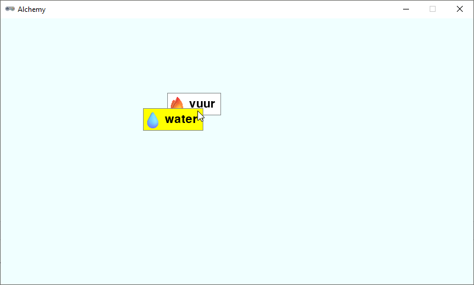

.. role:: python(code)
   :language: python

.. |br| raw:: html

    

Drag and drop
====================

De speler moet element cards met de muis kunnen verslepen. In het Engels noem je dit *drag and drop*. Om deze functionaliteit te implementeren, gebruiken we de drie mouse event handlers van Pygame Zero:

* :python:`on_mouse_down()`
* :python:`on_mouse_move()`
* :python:`on_mouse_up()`

Meer informatie over deze functies vind je in de `Pygame Zero documentatie: <https://pygame-zero.readthedocs.io/en/stable/hooks.html#event-handling-hooks>`_.

Workbench list
----------------------

In het volgende deel gaan we het spelvenster in twee delen splitsen. Aan de linkerkant komt een lijst met de elementen die de speler heeft ontdekt. Aan de rechterkant komt het werkgebied waar de speler elementen kan combineren. Dit werkgebied noemen we de *workbench*. Om bij te houden welke element cards zich in de workbench bevinden, maken we een lijst genaamd :python:`workbench`.

.. code-block:: python
   :linenos:
   :lineno-start: 26
   :emphasize-lines: 5

   # DICTIONARIES AND LISTS

   elements = {}
   recipes = {}
   workbench = []

Voor het toevoegen van elementen aan een lijst maken we een nieuwe helper functie genaamd :python:`add_element_to_list()`:

.. code-block:: python
   :linenos:
   :lineno-start: 47

   def add_element_to_list(element_id, lst, rect = None):
      if rect == None:
         rect = elements[element_id]['rect'].copy()
      lst.append({
         'id': element_id,
         'rect': rect
      })

Zoals je ziet, heeft de functie drie parameters:

* :python:`element_id`: de key van het element dat we willen toevoegen.
* :python:`lst`: de lijst waaraan we het element willen toevoegen.
* :python:`rect`: de rect van het element. Als deze waarde niet wordt meegegeven in de aanroep, krijgt :python:`rect` de default waarde :python:`None`.

De eerste actie die de functie uitvoert, is controleren of de :python:`rect` parameter de waarde :python:`None` heeft. Als dat het geval is, wordt een kopie gemaakt van de :python:`rect` van het element zoals dat in de :python:`elements` dictionary staat. Vervolgens voegen we een dictionary toe aan de lijst. Deze dictionary bevat de :python:`id` van het element en de :python:`rect` van het element. Deze twee gegevens zijn namelijk voldoende om het element later weer te kunnen tekenen in de workbench.

.. dropdown:: Waarom een kopie van de rect?
   :color: info
   :icon: info

   Je vraagt je misschien af waarom we een kopie van de rect maken. Waarom zouden we niet gewoon zeggen:
   
   .. code-block:: python
      :linenos:
      :lineno-start: 49

            rect = elements[element_id]['rect']
   
   We maken een kopie omdat we de rect van het element in de workbench willen kunnen aanpassen zonder dat dit invloed heeft op de rect van het element in de :python:`elements` dictionary. Als we geen kopie zouden maken, zou het aanpassen van de rect in de workbench ook de rect in de :python:`elements` dictionary aanpassen.

Aan het hoofdprogramma voegen we tijdelijk twee regels toe om de functie te testen:

.. code-block:: python
   :linenos:
   :lineno-start: 78
   :emphasize-lines: 5-6

   # MAIN PROGRAM

   load_elements()
   calc_card_rects()
   add_element_to_list('fire', workbench)
   print(workbench)

Met regel 83 kunnen we in de console zien of de functie werkt. Als je het programma nu uitvoert, zou je in de console de volgende output moeten zien:

.. code-block:: text

   [{'id': 'fire', 'rect': <rect(0, 0, 91, 38)>}]

Verwijder regel 83 weer uit het programma en voeg onder de :python:`draw_element_card()` functie een nieuwe functie toe die de elementen in de workbench tekent:

.. code-block:: python
   :linenos:
   :lineno-start: 69

   def draw_workbench():
      for card in workbench:
         draw_element_card(card['id'], card['rect'].topleft)

Deze functie roepen we aan in de :python:`draw()` functie. Vervang de aanroep :python:`draw_element_card('earth', (20,20))` in regel 75 door :python:`draw_workbench()`:

.. code-block:: python
   :linenos:
   :lineno-start: 73

   def draw():
      screen.fill('azure')
      draw_workbench()

Run de code en je zou nu een element card van het element vuur moeten zien in de workbench.

Selecteren, slepen en loslaten
-------------------------------------------------

Om bij te houden of de speler een element card aan het verslepen is, maken we twee nieuwe variabelen aan:

.. code-block:: python
   :linenos:
   :lineno-start: 26
   :emphasize-lines: 7-10

   # DICTIONARIES AND LISTS

   elements = {}
   recipes = {}
   workbench = []

   # VARIABLES

   dragging = False
   dragged = {}

De variabele :python:`dragging` is een boolean die aangeeft of de speler een element card aan het verslepen is. De variabele :python:`dragged` is een dictionary die de gegevens van het element dat de speler aan het verslepen is gaat bevatten.

Nu gaan we de drie mouse event handlers implementeren. We beginnen met de :python:`on_mouse_down()` functie:

.. code-block:: python
   :linenos:
   :lineno-start: 60
   
   # MOUSE EVENTS

   def on_mouse_down(pos, button):
      global dragged, dragging
      for card in workbench:
         r = card['rect']
         if r.collidepoint(pos):
               dragged = {
                  'id' : card['id'],
                  'rect' : r
               }
               workbench.remove(card)
               dragging = True
               return

De :python:`on_mouse_down()` functie wordt aangeroepen wanneer de speler op de muisknop klikt. De functie loopt alle element cards in de workbench na en controleert of de muisklik binnen de rect van een element card valt. Als dat het geval is, wordt de :python:`dragged` dictionary gevuld met de gegevens van het element. Vervolgens verwijderen we het element uit de workbench. Dat lijkt misschien een beetje vreemd. Je kunt dit zien alsof de speler het element van de werkbank pakt, waardoor het in de lucht zweeft en niet op de werkbank ligt. Straks in de :python:`on_mouse_up()` functie zullen we het element weer toevoegen. In regel 72 wordt de :python:`dragging` variabele op :python:`True` gezet om aan te geven dat de speler een element card aan het verslepen is. De :python:`return` in regel 73 zorgt ervoor dat we de functie :python:`on_mouse_down()` direct verlaten (en dus ook niet verder gaan met de :python:`for` loop) zodra we een element hebben gevonden dat de speler heeft aangeklikt.

In de :python:`on_mouse_move()` functie gaan we controleren of de speler een element aan het verslepen is. Als dat het geval is, verplaatsen we de rect van het element naar de positie van de muis:

.. code-block:: python
   :linenos:
   :lineno-start: 75

   def on_mouse_move(pos):
      if dragging:
         dragged['rect'].x = pos[0]
         dragged['rect'].y = pos[1]

De parameter :python:`pos` bevat de positie van de muis, opgeslagen in een tuple. De x-coördinaat van de muis is de eerste waarde in de tuple, de y-coördinaat de tweede waarde. Met :python:`pos[0]` en :python:`pos[1]` krijgen we dus respectievelijk de x- en y-coördinaat van de muis.

Tenslotte implementeren we de :python:`on_mouse_up()` functie. Deze functie wordt aangeroepen wanneer de speler de muisknop loslaat. We controleren of de speler een element aan het verslepen is en voegen het element weer toe aan de workbench:

.. code-block:: python
   :linenos:
   :lineno-start: 80

   def on_mouse_up():
      global dragging
      if dragging:
         dragging = False
         add_element_to_list(dragged['id'], workbench, dragged['rect'])
         dragged.clear()

Als het goed is, spreekt deze code voor zich. We zetten de :python:`dragging` variabele op :python:`False`, voegen het element weer toe aan de workbench (nu met de :python:`rect` van de huidige positie) en legen de :python:`dragged` dictionary.

Run de code om te zien dat je het element kunt verslepen. Er is echter nog wel iets vreemds aan de hand: tijdens het slepen is het element onzichtbaar! Dit komt doordat tijdens het slepen het element zich niet in de :python:`workbench` lijst bevindt en dus ook niet wordt getekend. Voeg het volgende :python:`if` statement toe aan de :python:`draw()` functie:

.. code-block:: python
   :linenos:
   :lineno-start: 105
   :emphasize-lines: 4-5

   def draw():
      screen.fill('azure')
      draw_workbench()
      if dragging:
         draw_element_card(dragged['id'], dragged['rect'].topleft, bgcolor='yellow')

Dit zorgt ervoor dat het element dat de speler aan het verslepen is, wordt getekend met een gele achtergrond. Dit maakt het ook makkelijker om te zien waar het element zich bevindt tijdens het slepen.

Valt je iets op tijdens het verslepen van de element card? Wanneer je start met slepen, verspringt de card zodat de linkerbovenhoek van de card precies op de muispositie komt te liggen. Dat komt door de twee regels in de :python:`on_mouse_move()` functie:

.. code-block:: python
   :linenos:
   :lineno-start: 77

        dragged['rect'].x = pos[0]
        dragged['rect'].y = pos[1]

De :python:`x` en :python:`y` van een :python:`rect` verwijzen altijd naar de linkerbovenhoek van de :python:`rect`. Om te voorkomen dat de card verspringt, moeten we de positie van de muis *ten opzichte van de linkerbovenhoek van de card* berekenen. Voeg de volgende regel toe aan de :python:`on_mouse_down()` functie:

.. code-block:: python
   :linenos:
   :lineno-start: 62
   :emphasize-lines: 9
   
   def on_mouse_down(pos, button):
      global dragged, dragging
      for card in workbench:
         r = card['rect']
         if r.collidepoint(pos):
               dragged = {
                  'id' : card['id'],
                  'rect' : r,
                  'click_pos' : (pos[0] - r.x, pos[1] - r.y)
               }
               workbench.remove(card)
               dragging = True
               return

En wijzig de twee regels in de :python:`on_mouse_move()` functie naar:

.. code-block:: python
   :linenos:
   :lineno-start: 76
   :emphasize-lines: 3-4

   def on_mouse_move(pos):
      if dragging:
         dragged['rect'].x = pos[0] - dragged['click_pos'][0]
         dragged['rect'].y = pos[1] - dragged['click_pos'][1]

Wat gebeurt hier precies? In regel 70 berekenen we met :python:`pos[0] - r.x` en :python:`pos[1] - r.y` de horizontale en de verticale afstand tussen de muispositie en de linkerbovenhoek van de card. Deze afstanden slaan we op als een tuple in de :python:`dragged` dictionary onder de key :python:`click_pos`. In de :python:`on_mouse_move()` functie gebruiken we de afstanden weer om de juiste positie van de linkerbovenhoek van de card te berekenen. Nu verspringt de card niet meer wanneer je begint met slepen.

Om nog iets beter te testen of de drag and drop goed werkt, voegen we een tweede element toe aan de workbench:

.. code-block:: python
   :linenos:
   :lineno-start: 117
   :emphasize-lines: 6

   # MAIN PROGRAM

   load_elements()
   calc_card_rects()
   add_element_to_list('fire', workbench)
   add_element_to_list('water', workbench)

Test de code door de twee elementen te verslepen en let vooral op wat er gebeurt als de twee elementen elkaar overlappen. De element card die bovenop ligt, is de card die je als laatste hebt versleept. Wanneer je echter met de muis klikt op een positie die binnen beide elementen valt, wordt niet het bovenste element geselecteerd, maar het onderste. Dat is niet wat je als speler zou verwachten. Kun je zelf bedenken wat de oorzaak hiervan is?

De functie :python:`draw_workbench()` tekent de element cards in de volgorde waarin ze zijn toegevoegd aan de lijst. Het laatst toegevoegde element wordt dus bovenop de andere elementen getekend. Bij het selecteren van een element in de :python:`on_mouse_down()` functie wordt de lijst echter van het begin tot het einde doorlopen en het eerste element waarmee een collision wordt gedetecteerd, wordt geselecteerd. Dit is dus het element dat het eerst in de lijst staat, en dat is het onderste element. We kunnen dit oplossen door in :python:`on_mouse_down()`  de lijst in omgekeerde volgorde te doorlopen:

.. code-block:: python
   :linenos:
   :lineno-start: 62
   :emphasize-lines: 3

   def on_mouse_down(pos, button):
      global dragged, dragging
      for card in reversed(workbench):
         r = card['rect']
         if r.collidepoint(pos):
               dragged = {
                  'id' : card['id'],
                  'rect' : r,
                  'click_pos' : (pos[0] - r.x, pos[1] - r.y)
               }
               workbench.remove(card)
               dragging = True
               return

Test nogmaals het programma. Nu zou alles moeten werken zoals je verwacht: het bovenste element wordt geselecteerd wanneer je erop klikt.

