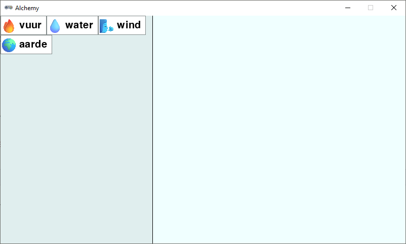
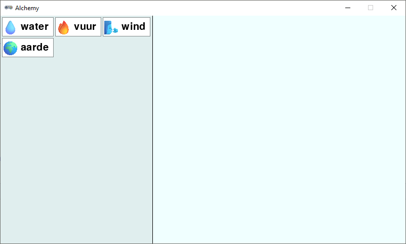
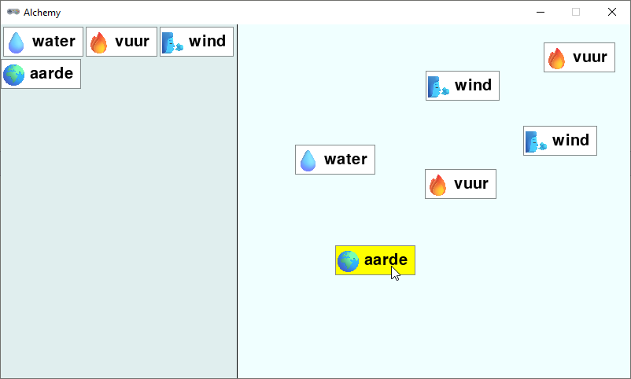

.. role:: python(code)
   :language: python

.. |br| raw:: html

    

Venster in twee delen
=========================

In deze stap gaan we het venster in twee delen splitsen. Aan de linkerkant komt de lijst met elementen die je hebt ontdekt, en aan de rechterkant het gebied waar je elementen kunt combineren. De lijst met elementen noemen we de *inventory* en het gebied waar je elementen kunt combineren is de *workbench*.

Inventory
-----------------

De gebieden voor de inventory en de workbench zijn twee rechthoeken. Voeg de volgende drie regels toe aan de :python:`# WINDOW SETTINGS` sectie:

.. code-block:: python
   :linenos:
   :lineno-start: 8
   :emphasize-lines: 7-9

   # WINDOW SETTINGS

   WIDTH = 800
   HEIGHT = 450
   TITLE = 'Alchemy'

   inventory_width = 300
   inventory_rect = Rect((0, 0), (inventory_width, HEIGHT))
   workbench_rect = Rect((inventory_width, 0), (WIDTH-inventory_width, HEIGHT))   

Voeg ook een lijst toe voor de elementen in de inventory:

.. code-block:: python
   :linenos:
   :lineno-start: 30
   :emphasize-lines: 6

   # DICTIONARIES AND LISTS

   elements = {}
   recipes = {}
   workbench = []
   inventory = []

De element cards in de inventory worden naast elkaar getekend, maar als er niet meer genoeg ruimte is, moeten ze naar een volgende regel gaan. Om het rekenwerk een beetje makkelijker te maken, voegen we het volgende :python:`return` statement toe aan de :python:`draw_element_card()` functie:

.. code-block:: python
   :linenos:
   :lineno-start: 95
   :emphasize-lines: 12

   def draw_element_card(element_id, pos, bordercolor='azure4', bgcolor='white', fontcolor='black'):
      element = elements[element_id]
      lbl = element['label']
      img_name = element['image']
      rect = element['rect']
      img = pygame.transform.scale(eval(f'images.{img_name}'), (ICONSIZE, ICONSIZE))
      rect.topleft = pos
      screen.draw.filled_rect(rect, bgcolor)
      screen.draw.rect(rect, bordercolor)
      screen.blit(img, (rect.left + LEFTMARGIN, rect.top + TOPMARGIN))
      screen.draw.text(lbl, midleft = (rect.midleft[0] + LEFTMARGIN + ICONSIZE + HSPACE, rect.midleft[1]), fontsize=FONTSIZE, color=fontcolor)
      return rect

Deze regel zorgt ervoor dat de functie het :python:`Rect` object van de zojuist getekende element card retourneert, dat we later kunnen gebruiken om de positie van de volgende card te bepalen.

Voor het tekenen van de inventory maken we een functie :python:`draw_inventory()`:

.. code-block:: python
   :linenos:
   :lineno-start: 108

   def draw_inventory():
      screen.draw.filled_rect(inventory_rect, 'azure2')
      last_pos = (0, 0)
      for card in inventory:
         card_width = card['rect'].width
         if (last_pos[0] + card_width) > inventory_width:
            last_pos = (0, last_pos[1] + CARD_HEIGHT)
         r = draw_element_card(card['id'], last_pos)
         card['rect'] = r
         last_pos = (r.right, r.top)

De achtergrond van de inventoryrechthoek maken we :python:`azure2`, zodat hij contrasteert met de rest van het venster. In de variabele :python:`last_pos` houden we de positie van rechterbovenhoek van de laatste getekende element card bij. Het :python:`if` statement in regel 113 checkt of het nodig is naar een nieuw regel te gaan. Als de rechterkant van de laatste card verder naar rechts zou komen dan de breedte van de inventory, dan zetten we :python:`last_pos` op de linkerbovenhoek van de volgende regel. In regel 116 updaten we het :python:`Rect` object van de element card.

In de :python:`draw()` functie roepen we nu de :python:`draw_inventory()` functie aan en we tekenen een lijn om de inventory van de rest van het venster te scheiden:

.. code-block:: python
   :linenos:
   :lineno-start: 123
   :emphasize-lines: 4-5

   def draw():
      screen.fill('azure')
      draw_workbench()
      draw_inventory()
      screen.draw.line((inventory_width, 0), (inventory_width, HEIGHT), 'black')
      if dragging:
         draw_element_card(dragged['id'], dragged['rect'].topleft, bgcolor='yellow')

Om te testen voegen we in het hoofdprogramma een paar elementen toe aan de inventory:

.. code-block:: python
   :linenos:
   :lineno-start: 137
   :emphasize-lines: 5-8

   # MAIN PROGRAM

   load_elements()
   calc_card_rects()
   add_element_to_list('fire', inventory)
   add_element_to_list('water', inventory)
   add_element_to_list('wind', inventory)
   add_element_to_list('earth', inventory)

Test het programma nu uit. Je zou nu een venster moeten zien met aan de linkerkant de inventory met de vier elementen die we hebben toegevoegd. De elementen staan naast elkaar en gaan naar een nieuwe regel als er niet genoeg ruimte is.

De element cards in de inventory kunnen nog niet worden versleept, maar we gaan ze eerst nog iets mooier positioneren. Ze staan nu namelijk dicht tegen elkaar aan en het is mooier als er wat ruimte tussen zit. We voegen een constante toe voor de ruimte tussen de cards:

.. code-block:: python
   :linenos:
   :lineno-start: 14
   :emphasize-lines: 4

   inventory_width = 300
   inventory_rect = Rect((0, 0), (inventory_width, HEIGHT))
   workbench_rect = Rect((inventory_width, 0), (WIDTH-inventory_width, HEIGHT))
   PADDING = 3

En we passen de :python:`draw_inventory()` functie aan om rekening te houden met deze ruimte:

.. code-block:: python
   :linenos:
   :lineno-start: 109
   :emphasize-lines: 3, 6-7, 10

   def draw_inventory():
      screen.draw.filled_rect(inventory_rect, 'azure2')
      last_pos = (PADDING, PADDING)
      for i in inventory:
         card_width = i['rect'].width
         if (last_pos[0] + card_width + PADDING) > inventory_width:
            last_pos = (PADDING, last_pos[1] + CARD_HEIGHT + PADDING)
         r = draw_element_card(i['id'], last_pos)
         i['rect'] = r
         last_pos = (r.right + PADDING, r.top)

Dit ziet er beter uit:

In het hoofdprogramma hebben we zojuist handmatig vier elementen toegevoegd aan de inventory, maar in de tekstversie van het spel maakten we de functie :python:`build_recipes()` die automatisch de *primes* (de basiselementen) kan toevoegen aan de inventory. We kunnen deze functie bijna identiek gebruiken in de Pygame Zero versie. Voeg onderstaande code toe na de :python:`add_element_to_list()` functie. De regel die verschilt van de tekstversie is gemarkeerd.

.. code-block:: python
   :linenos:
   :lineno-start: 66
   :emphasize-lines: 10

   def build_recipes():
      with open('recipes.txt', 'r') as file:
         recipes_txt = file.read()
      first_part, second_part = recipes_txt.split('\n-\n')
      primes = first_part.split('\n')
      combinations = second_part.split('\n')
      for prime in primes:
         if prime not in elements:
               raise Exception('Recipe error: unknown prime element.')
         add_element_to_list(prime, inventory)
      for combination in combinations:
         left, right = combination.split('=')
         ingredients = left.split('+')
         if (len(ingredients) != 2):
               raise Exception('Recipe error: number of ingredients must be exactly 2.')
         if ingredients[0] not in elements or ingredients[1] not in elements:
               raise Exception('Recipe error: unknown ingredients.')
         ingredients.sort()
         if ingredients[0] not in recipes:
               recipes[ingredients[0]] = {ingredients[1]: right}
         else:
               recipes[ingredients[0]][ingredients[1]] = right

Verwijder nu de vier :python:`add_element_to_list()` aanroepen uit het hoofdprogramma en roep in plaats daarvan de :python:`build_recipes()` functie aan:

.. code-block:: python
   :linenos:
   :lineno-start: 160
   :emphasize-lines: 5

   # MAIN PROGRAM

   load_elements()
   calc_card_rects()
   build_recipes()

Run het programma opnieuw. Je zou dezelfde vier elementen in de inventory moeten zien, maar nu zijn ze automatisch toegevoegd vanuit de :python:`recipes.txt` file.

Slepen vanuit de inventory of workbench
--------------------------------------------

Nu we het venster in twee delen hebben gesplitst, moeten we daar bij het slepen van elementen rekening mee houden. Het maakt namelijk uit of een element vanuit de inventory wordt gesleept of vanuit de workbench. En ook bij het 'droppen' van een element moeten we detecteren of dat gebeurt in de inventory of in de workbench. 

In de :python:`on_mouse_down()` functie plaatsen we een :python:`if` statement om te controleren of de muis zich in de inventory of in de workbench bevindt:

.. code-block:: python
   :linenos:
   :lineno-start: 91
   :emphasize-lines: 3-16

   def on_mouse_down(pos, button):
      global dragged, dragging
      if pos[0] < inventory_width:
         # Clicked in inventory
         for card in inventory:
               r = card['rect']
               if r.collidepoint(pos):
                  dragged = {
                     'id' : card['id'],
                     'rect' : r.copy(),
                     'click_pos' : (pos[0] - r.x, pos[1] - r.y),
                  }
                  dragging = True
                  return
      else:
         # Clicked in workbench
         for card in reversed(workbench):
               r = card['rect']
               if r.collidepoint(pos):
                  dragged = {
                     'id' : card['id'],
                     'rect' : r,
                     'click_pos' : (pos[0] - r.x, pos[1] - r.y),
                  }
                  workbench.remove(card)
                  dragging = True
                  return

In regel 93 controleren we of de x-coördinaat van muis :python:`pos[0]` kleiner is dan de breedte van de inventory. Als dat zo is, dan is de muis in de inventory en gaan we zoeken naar een element card die overeenkomt met de muispositie. De :python:`for` loop waarmee we dat doen lijkt sterk die in regels 107-117, maar er zijn enkele verschillen:

* De :python:`workbench` lijst doorlopen we in omgekeerde volgorde, omdat we de laatst getekende element cards het eerst willen checken. Voor de inventory is dat niet nodig, want daarin overlappen de element cards elkaar niet.
* Een belangrijker verschil is dat in regel 115 de opgepikte element card wordt verwijderd uit de workbench, terwijl we dat in de inventory niet doen. In de inventory blijven de element cards altijd staan, ook als je ze oppakt.
* In regel 100 maken we een kopie van de :python:`Rect` van de opgepikte element card, zodat we de positie kunnen wijzigen zonder de :python:`Rect` van de card in de inventory te veranderen.

Run het programma en sleep elementen vanuit de inventory naar de workbench. Versleep daarna ook elementen binnen de workbench. Je ziet dat van de element cards in de inventory een kopie wordt gemaakt, terwijl de element cards in de workbench daadwerkelijk worden verplaatst. Dit is precies wat we willen.

Wat zou er gebeuren als we een element in de inventory droppen? We hebben nog geen code geschreven om die gebeurtenis af te handelen, maar het lijkt erop dat de element card dan verdwijnt. Hoe komt dat, denk je? Als je geen idee hebt, verwissel dan de volgorde van de regels 163 en 164 in de :python:`draw()` functie:

.. code-block:: python
   :linenos:
   :lineno-start: 161
   :emphasize-lines: 3-4

   def draw():
      screen.fill('azure')
      draw_workbench()
      draw_inventory()
      screen.draw.line((inventory_width, 0), (inventory_width, HEIGHT), 'black')
      if dragging:
         draw_element_card(dragged['id'], dragged['rect'].topleft, bgcolor='yellow')

Als we eerst de workbench tekenen en daarna de inventory, dan zie je dat element cards die in de inventory worden gedropt daar gewoon blijven staan. Eerder zagen we dat niet, doordat het inventory gebied bovenop de workbench werd getekend. We lossen het probleem op door in de :python:`on_mouse_up()` functie te controleren of de element card wordt gedropt in de workbench:

.. code-block:: python
   :linenos:
   :lineno-start: 124
   :emphasize-lines: 5-7

   def on_mouse_up():
      global dragging
      if dragging:
         dragging = False
         r = dragged['rect']
         if workbench_rect.contains(r):
               add_element_to_list(dragged['id'], workbench, r)
         dragged.clear()

In regel 129 gebruiken we :python:`workbench_rect.contains(r)` om te controleren of de :python:`Rect` van de opgepikte element card binnen de workbench valt. Als dat zo is, dan voegen we de element card toe aan de workbench. Test de code om te zien of het werkt. Als je een element card in de workbench dropt, dan zou deze daar moeten blijven staan. Maar als een stukje van de card zich buiten de workbench bevindt, dan verdwijnt de card.