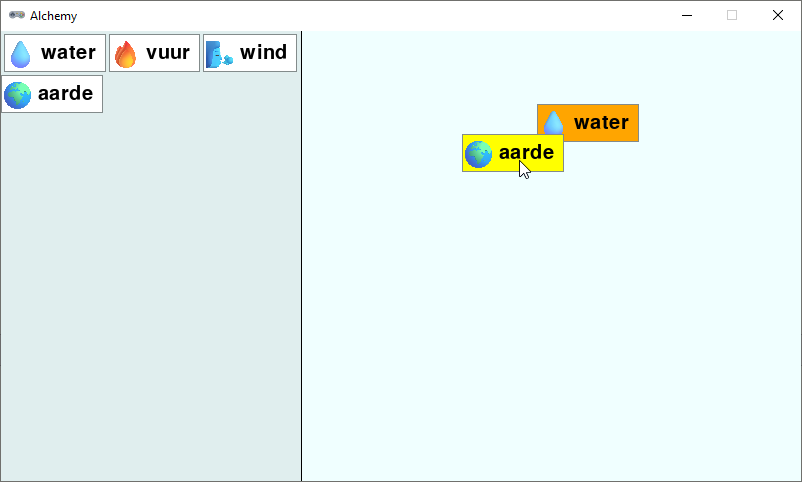
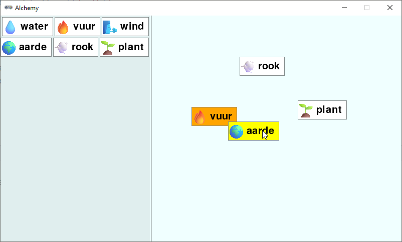

.. role:: python(code)
   :language: python

.. |br| raw:: html

    

Elementen combineren
=========================

Er ontbreekt nog één cruciaal onderdeel van het spel: de mogelijkheid om elementen te combineren. Wanneer de speler een element card op een andere element card dropt, moeten we controleren of er een recept voor die combinatie bestaat. Als dat zo is, moeten we het nieuwe element tonen en de twee oorspronkelijke elementen verwijderen.

Om te beginnen voegen we een nieuwe variabele toe, waarin we de index van de element card gaan opslaan die de speler wil combineren met de element card die de speler op dat moment aan het slepen is. We noemen deze variabele :python:`other` en zetten hem standaard op -1:

.. code-block:: python
   :linenos:
   :lineno-start: 38
   :emphasize-lines: 5

   # VARIABLES

   dragging = False
   dragged = {}
   other = -1

In de :python:`on_mouse_move()` functie controleren we of de card die de speler aan het slepen is, contact maakt met een andere card in de workbench. Als dat zo is, slaan we de index van die card op in de :python:`other` variabele:

.. code-block:: python
   :linenos:
   :lineno-start: 120
   :emphasize-lines: 2, 6-10

   def on_mouse_move(pos):
      global other
      if dragging:
         dragged['rect'].x = pos[0] - dragged['click_pos'][0]
         dragged['rect'].y = pos[1] - dragged['click_pos'][1]
         for index, card in enumerate(workbench):
               if dragged['rect'].colliderect(card['rect']):
                  other = index
                  return
         other = -1

De :python:`enumerate()` functie is handig omdat we hiermee in de :python:`for` loop zowel de index als de waarde van elk element in de :python:`workbench` lijst kunnen krijgen. In regel 126 checken we mogelijke collisions tussen de :python:`dragged` card en de cards in de :python:`workbench`. Als er een collision is, slaan we de index van die card op in de :python:`other` variabele en we verlaten de functie. Als de :python:`for` loop helemaal is doorlopen en er waren geen collisions, dan zetten we :python:`other` terug op -1.

Om aan de speler duidelijk te maken dat de card die hij aan het slepen is, een andere card raakt, kunnen we die card een andere kleur geven. We doen dit in de :python:`draw_workbench()` functie:

.. code-block:: python
   :linenos:
   :lineno-start: 166

   def draw_workbench():
      for index, card in enumerate(workbench):
         if index == other:
               draw_element_card(card['id'], card['rect'].topleft, bgcolor='orange')
         else:
               draw_element_card(card['id'], card['rect'].topleft)

Ook hier gebruiken we de :python:`enumerate()` functie om de index van de card te krijgen. Als de index gelijk is aan de :python:`other` variabele, tekenen we de card met een oranje achtergrondkleur. Anders tekenen we de card met de standaard achtergrondkleur. Run de code om te zien of dit naar behoren werkt.

Tenslotte moeten we de combinatie van de twee cards verwerken. Dit doen we in de :python:`on_mouse_up()` functie. Wanneer de speler een card dropt op een andere card, kunnen drie dingen gebeuren:

* Er bestaat geen recept voor de combinatie van de twee elementen. In dat geval laten we de card terugspringen naar de oorspronkelijke positie.
* Er bestaat een recept voor de combinatie van de twee elementen en het resultaat was nog niet ontdekt. In dat geval voegen we het nieuwe element toe aan de workbench en ook aan de inventory. We verwijderen de twee oorspronkelijke elementen uit de workbench.
* Er bestaat een recept voor de combinatie van de twee elementen en het resultaat was al ontdekt. Er gebeurt hetzelfde als in het vorige geval, maar we voegen het nieuwe element niet toe aan de inventory, want het staat er al in.

Laten we eerst de functie :python:`get_recipe()` toevoegen, die de combinatie van twee elementen controleert en het resultaat teruggeeft als het recept bestaat. Deze functie is exact hetzelfde als de :python:`get_recipe()` functie uit de tekstversie van het spel:

.. code-block:: python
   :linenos:
   :lineno-start: 90

   def get_recipe(ingredient1, ingredient2):
      ingredients = sorted([ingredient1, ingredient2])
      if ingredients[0] in recipes:
         if ingredients[1] in recipes[ingredients[0]]:
            return recipes[ingredients[0]][ingredients[1]]
      return None

Om ervoor te zorgen dat een card kan terugspringen naar de oorspronkelijke positie als er geen recept bestaat, moeten we de oorspronkelijke positie van de card opslaan voordat de speler begint met slepen. Dit doen we in de :python:`on_mouse_down()` functie:

.. code-block:: python
   :linenos:
   :lineno-start: 99
   :emphasize-lines: 12, 25

   def on_mouse_down(pos, button):
      global dragged, dragging
      if pos[0] < inventory_width:
         # Clicked in inventory
         for card in inventory:
               r = card['rect']
               if r.collidepoint(pos):
                  dragged = {
                     'id' : card['id'],
                     'rect' : r.copy(),
                     'click_pos' : (pos[0] - r.x, pos[1] - r.y),
                     'old_rect' : r.copy()
                  }
                  dragging = True
                  return
      else:
         # Clicked in workbench
         for card in reversed(workbench):
               r = card['rect']
               if r.collidepoint(pos):
                  dragged = {
                     'id' : card['id'],
                     'rect' : r,
                     'click_pos' : (pos[0] - r.x, pos[1] - r.y),
                     'old_rect' : r.copy()
                  }
                  workbench.remove(card)
                  dragging = True
                  return

Aan de :python:`on_mouse_up()` functie voegen we de volgende code toe:

.. code-block:: python
   :linenos:
   :lineno-start: 140
   :emphasize-lines: 2, 7-20, 23

   def on_mouse_up():
      global dragging, other
      if dragging:
         dragging = False
         r = dragged['rect']
         if workbench_rect.contains(r):
               if other != -1:
                  result = get_recipe(dragged['id'], workbench[other]['id'])
                  if result != None:
                     # recipe available
                     if result not in [value for dict in inventory for key, value in dict.items() if key == 'id']:
                           # result not yet in discoveries
                           add_element_to_list(result, inventory)
                     add_element_to_list(result, workbench, r)
                     workbench.pop(other)
                     dragged.clear()
                     other = -1
                     return
                  else:
                     r = dragged['old_rect']
               add_element_to_list(dragged['id'], workbench, r)
         dragged.clear()
         other = -1

In regel 146 controleren we of de speler de card loslaat op een andere card. |br|
Als dat zo is, halen we in regel 147 het recept op met de :python:`get_recipe()` functie. |br|
Als een recept bestaat, controleren we in regel 150 of het resultaat nog niet in de inventory voorkomt. Dit is een ingewikkelde regel, omdat de inventory een lijst van dictionaries is, en we van elk :python:`'id'` veld in die dictionaries moeten checken of de waarde overeenkomt met :python:`result`. |br|
Vevolgens voegen we eventueel het resultaat toe aan de inventory en daarna ook aan de workbench (op de positie van de gesleepte card). We verwijderen het :python:`other` element uit de workbench en we wissen de :python:`dragged` en :python:`other` variabelen en we verlaten de functie. |br|
Als er geen recept bestaat, zetten we de card terug naar de oorspronkelijke positie. Dit doen we door de :python:`old_rect` van de card te gebruiken, die we eerder hebben opgeslagen in de :python:`on_mouse_down()` functie. |br|
Als de card helemaal niet op een andere card is losgelaten, voegen we de card toe aan de workbench zoals dat eerder ook al het geval was. |br|
In regel 162 resetten we :python:`other` naar -1. Als we dit niet doen, zou een eventuele 'other' card nog steeds oranje worden getekend, ook als de gesleepte card is teruggesprongen naar de oude positie (probeer maar).

En hiermee hebben we een speelbare versie van het spel! Je kunt nu elementen combineren en nieuwe elementen ontdekken.

