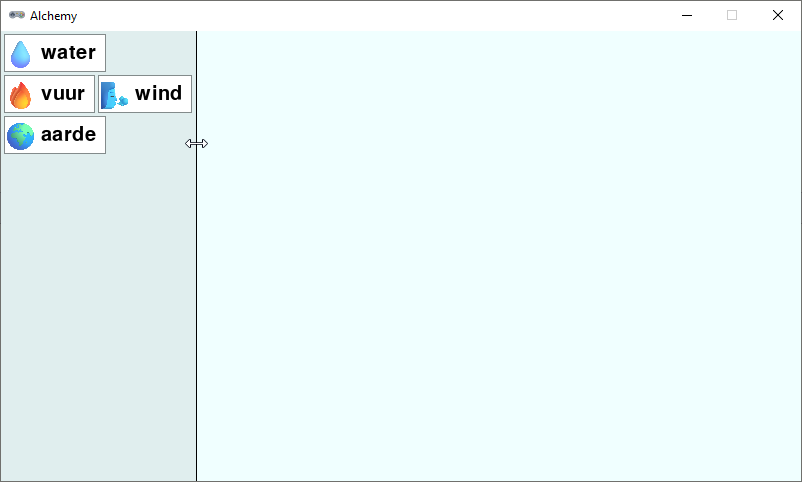

.. role:: python(code)
   :language: python

.. |br| raw:: html

    

Formaat inventory wijzigen 
============================

De breedte van de inventory hebben met :python:`inventory_width = 300` ingesteld op 300 pixels. We kunnen de speler de mogelijkheid geven om de breedte van de inventory te wijzigen door de muiscursor op de rand tussen de inventory en de workbench te plaatsen en vervolgens te slepen. Hiervoor maken we eerst twee nieuwe variabelen aan:

.. code-block:: python
   :linenos:
   :lineno-start: 8
   :emphasize-lines: 8, 34

   # WINDOW SETTINGS

   WIDTH = 800
   HEIGHT = 450
   TITLE = 'Alchemy'

   inventory_width = 300
   inventory_min_width = 300
   inventory_rect = Rect((0, 0), (inventory_width, HEIGHT))
   workbench_rect = Rect((inventory_width, 0), (WIDTH-inventory_width, HEIGHT))
   PADDING = 3

   # CARD SETTINGS

   ICONSIZE = 32
   LEFTMARGIN = 0
   RIGHTMARGIN = 10
   TOPMARGIN = 3
   BOTTOMMARGIN = 3
   HSPACE = 5
   FONTSIZE = 30
   card_font = pygame.font.SysFont(None, FONTSIZE)
   CARD_HEIGHT = TOPMARGIN + max(ICONSIZE, FONTSIZE) + BOTTOMMARGIN

   # DICTIONARIES AND LISTS

   elements = {}
   recipes = {}
   workbench = []
   inventory = []

   # VARIABLES

   resizing = False
   dragging = False
   dragged = {}
   other = -1

De :python:`inventory_min_width` variabele geeft de minimaal benodigde breedte van de inventory aan. We zetten deze in eerste instantie even op 300 pixels, maar gaan de juiste waarde straks berekenen in de :python:`calc_card_rects()` functie. De boolean variabele :python:`resizing` geeft aan of de speler het formaat van de inventory aan het aanpassen is. We zetten deze standaard op :python:`False`.

In de :python:`calc_card_rects()` functie berekenen we de juiste waarde van :python:`inventory_min_width` door de breedte van de grootste card in de inventory te nemen en daar 2 keer de :python:`PADDING` waarde bij op te tellen.

.. code-block:: python
   :linenos:
   :lineno-start: 8
   :emphasize-lines: 2-3, 9-10, 12-13

   def calc_card_rects():
      global inventory_min_width
      max_card_width = 0
      for key, value in elements.items():
         lbl_width, lbl_height = card_font.size(value['label'])
         rect_width = LEFTMARGIN + ICONSIZE + HSPACE + lbl_width + RIGHTMARGIN
         rect_height = CARD_HEIGHT
         r = Rect((0, 0), (rect_width, rect_height))
         if r.width > (inventory_width - 2 * PADDING):
               raise Exception(f'Width of element \"{key}\" ({r.width} px) too large for side bar ({inventory_width - 2 * PADDING} px).')
         elements[key]['rect'] = r
         max_card_width = max(max_card_width, r.width)
      inventory_min_width = max_card_width + 2 * PADDING

In regel 10 maken we een lokale variabele :python:`max_card_width` aan die we gaan gebruiken om de breedte van de grootste card in de inventory te bepalen. In de :python:`for` loop zetten we op regel 19 de waarde van :python:`max_card_width` op :python:`max(max_card_width, r.width)`, oftewel de grootste waarde van :python:`max_card_width` en :python:`r.width`. Dat betekent: als :python:`max_card_width` groter is dan de breedte van de huidige card, dan blijft de waarde van :python:`max_card_width` gelijk. Is de breedte van de huidige card echter groter, dan wordt :python:`max_card_width` aangepast naar die waarde. |br|
In regels 16 en 17 is een extra check toegevoegd om ervoor te zorgen dat de breedte van de element cards niet te groot is voor de inventory.

Nu moeten we nog de drie mouse event handlers aanpassen om het resizen van de inventory mogelijk te maken. Maar voordat we dat doen, maken we een eenvoudige functie om te checken of de muiscursor op de rand van de inventory staat:

.. code-block:: python
   :linenos:
   :lineno-start: 107

   def mouse_on_resize(pos):
      return abs(pos[0] - inventory_width) <= 2

Als de absolute waarde van het verschil tussen de x-coördinaat van de muiscursor en de breedte van de inventory kleiner of gelijk is aan 2, dan retourneert de functie :python:`mouse_on_resize()` :python:`True` en anders :python:`False`. Er is dus een marge van 2 pixels aan beide zijden van de rand van de inventory.

.. dropdown:: Absolute waarde
   :color: info
   :icon: info

   De absolute waarde van een getal is de waarde zonder teken. Dus de absolute waarde van :python:`-5` is :python:`5` en de absolute waarde van :python:`5` is ook :python:`5`. In Python kun je de absolute waarde van een getal berekenen met de :python:`abs()` functie.
   
   In regel 108 gebruiken we deze functie omdat de muis zowel links als rechts van de rand van de inventory kan staan. Als de muis links van de rand staat, is het verschil :python:`pos[0] - inventory_width`  negatief en als de muis rechts van de rand staat, is het verschil positief. Door de absolute waarde te nemen, kunnen we beide gevallen op dezelfde manier behandelen.

In de :python:`on_mouse_down()` functie moeten we nu checken of de muiscursor op de rand van de inventory staat. Als dat het geval is, zetten we de :python:`resizing` variabele op :python:`True` en verlaten meteen de functie:

.. code-block:: python
   :linenos:
   :lineno-start: 110
   :emphasize-lines: 2-5

   def on_mouse_down(pos, button):
      global dragged, dragging, resizing
      if mouse_on_resize(pos):
         resizing = True
         return
      if pos[0] < inventory_width:
         # Clicked in inventory
         ...

In :python:`on_mouse_move()` breiden we het :python:`if` statement als volgt uit:

.. code-block:: python
   :linenos:
   :lineno-start: 143
   :emphasize-lines: 2, 11-19

   def on_mouse_move(pos):
      global other, inventory_width
      if dragging:
         dragged['rect'].x = pos[0] - dragged['click_pos'][0]
         dragged['rect'].y = pos[1] - dragged['click_pos'][1]
         for index, card in enumerate(workbench):
               if dragged['rect'].colliderect(card['rect']):
                  other = index
                  return
         other = -1
      elif resizing:
         if pos[0] > inventory_min_width:
               inventory_width = pos[0]
               invalidate_window()
      else:
         if mouse_on_resize(pos):
               pygame.mouse.set_cursor(pygame.SYSTEM_CURSOR_SIZEWE)
         else:
               pygame.mouse.set_cursor()

Als de speler aan het resizen is, controleren we of de muiscursor zich rechts van de minimale breedte van de inventory bevindt. Als dat zo is, passen we de breedte van de inventory aan naar de x-coördinaat van de muiscursor en roepen we :python:`invalidate_window()` aan. Deze functie, die we nog moeten maken, zorgt ervoor dat het venster opnieuw wordt getekend. |br|
Als de speler geen element aan het slepen is en ook niet bezig is met resizen, dan controleren we of de muiscursor op de rand van de inventory staat. Als dat zo is, veranderen we de vorm van de muiscursor om de speler te laten zien dat hij de breedte van de inventory kan aanpassen.

Aan de :python:`on_mouse_up()` functie voegen we de volgende code toe:

.. code-block:: python
   :linenos:
   :lineno-start: 163
   :emphasize-lines: 2-8

   def on_mouse_up():
      global dragging, other, resizing
      if resizing:
         resizing = False
         for card in workbench.copy():
               if not workbench_rect.contains(card['rect']):
                  workbench.remove(card)
         return
      if dragging:
         dragging = False
         ...

Als de speler bezig was met resizen en de muisknop wordt losgelaten, zetten we de :python:`resizing` variabele weer op :python:`False`. We verwijderen ook alle cards uit de workbench die niet meer in het werkgebied passen. Met :python:`return` zorgen we ervoor dat de rest van de functie niet wordt uitgevoerd.

Zoals gezegd, moeten we nog de :python:`invalidate_window()` functie maken. Deze functie zorgt ervoor dat de breedte van de inventory en de workbench worden aangepast aan de nieuwe breedte van het venster:

.. code-block:: python
   :linenos:
   :lineno-start: 105

   def invalidate_window():
      inventory_rect.width = inventory_width
      workbench_rect.left = inventory_width
      workbench_rect.width = WIDTH - inventory_rect.width

Run het spel. Als het goed is, kun je nu de breedte van de inventory veranderen.

