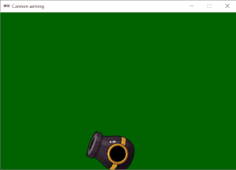
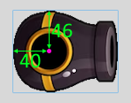
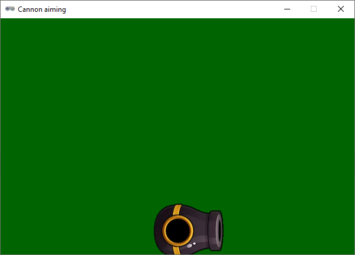
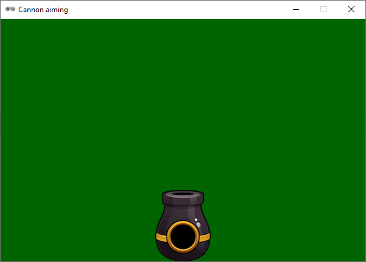
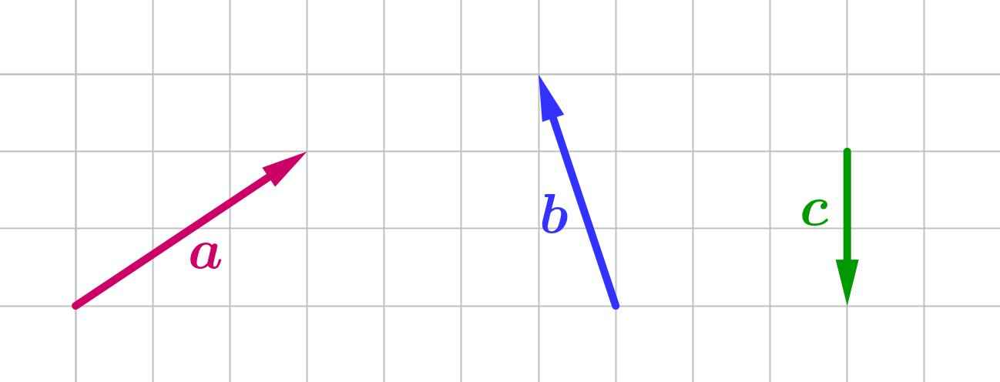
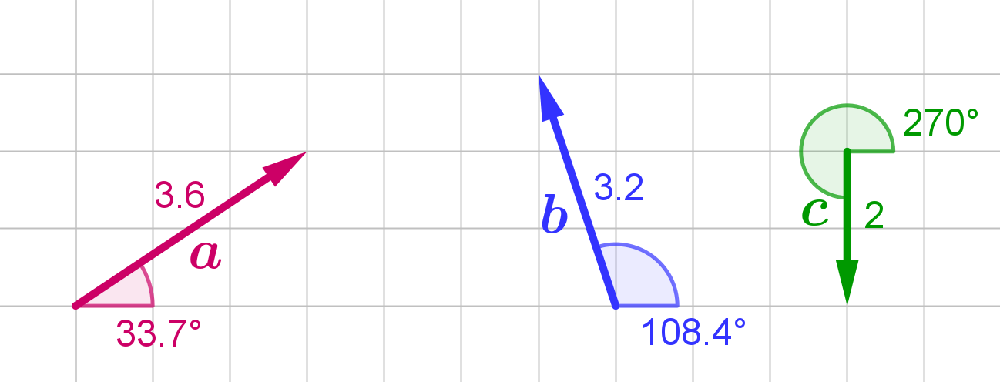
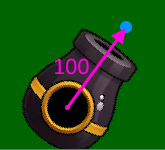
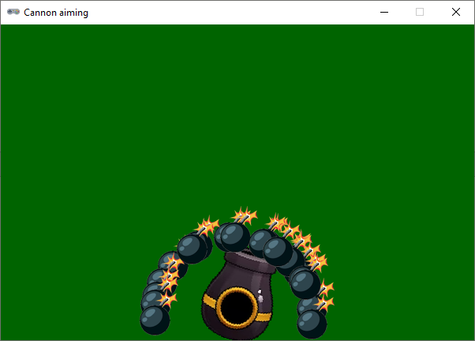

.. role:: python(code)
   :language: python

.. |br| raw:: html

    

Explainer: sprites draaien
==============================

Voor sommige spellen is het belangrijk dat sprites kunnen draaien. In deze explainer leer je hoe je sprites kunt draaien in Pygame Zero. En we gaan nog een stapje verder: hoe kun je een kanon richten op een doelwit en de kanonskogels in de juiste richting afvuren?

Voorbereidingen
---------------------

Maak voor dit project in je :file:`games` map een nieuwe map aan met de naam :file:`cannon`. Maak in die map ook een map :file:`images` aan. Download de sprites van het kanon en de kanonskogel: :download:`cannon.png <../game_assets/cannon/cannon.png>` en :download:`cannonball.png <../game_assets/cannon/cannonball.png>` en plaats ze in de :file:`images` map.

Maak in Mu Editor een nieuw bestand en sla het op in je :file:`cannon` map onder de naam :file:`cannon.py`.

.. card:: 

   .. uml::
      :align: left
      :html_format: svg

      @startuml
         @startfiles
         /games/cannon/images/cannon.png
         /games/cannon/images/cannonball.png
         /games/cannon/cannon.py
         @endfiles
      @enduml

Starter code
---------------------

Hieronder staat de starter code voor het project. Kopier de code naar je :file:`cannon.py` bestand.

.. code-block:: python
   :caption: cannon.py
   :linenos:
   
   # WINDOW SETTINGS

   WIDTH = 600
   HEIGHT = 400
   TITLE = 'Cannon aiming'

   # SPRITES

   cannon = Actor('cannon')
   cannon.anchor = (40, 46)
   cannon.x = WIDTH / 2
   cannon.y = HEIGHT - 40

   # DRAW AND UPDATE FUNCTIONS

   def draw():
      screen.fill('darkgreen')
      cannon.draw()

   def update():
      pass

In regel 10 staat :python:`cannon.anchor = (40, 46)`. Daarmee stellen we het *anchor point* van het kanon in. De ankerpositie is het punt waaromheen het kanon later gaat draaien. De coördinaten (40, 46) zijn het middelpunt van de cirkel op het kanon:

Doordat we een anchor point hebben ingesteld, verwijzen :python:`cannon.x` en :python:`cannon.y` nu ook naar het ankerpunt van het kanon. In regels 11 en 12 positioneren we het kanon dus zodanig dat het anchor point horizontaal in het midden en verticaal op 40 pixels van de onderrand komt te liggen. Meer informatie over anchor points vind je in de  `Pygame Zero documentatie <https://pygame-zero.readthedocs.io/en/stable/builtins.html#anchor-point>`_.

Het :python:`angle` attribuut
----------------------------

Het kanon is nu naar rechts gericht, maar het is mooier om het bij aanvang van het spel recht omhoog te laten wijzen. We kunnen het kanon draaien door de :python:`cannon.angle` eigenschap in te stellen:

.. code-block:: python
   :linenos:
   :lineno-start: 7
   :emphasize-lines: 7
   
   # SPRITES

   cannon = Actor('cannon')
   cannon.anchor = (40, 46)
   cannon.x = WIDTH / 2
   cannon.y = HEIGHT - 40
   cannon.angle = 90

Met regel 13 draaien we het kanon 90 graden tegen de klok in, zodat het recht omhoog wijst.

Plaats bij wijze van experiment eens de volgende regel in de :python:`update()` functie:

.. code-block:: python
   :linenos:
   :lineno-start: 21
   :emphasize-lines: 2

   def update():
      cannon.angle += 3

Run de code en je ziet dat het kanon rondjes draait. Om het belang van het juiste anchor point te demonstreren, kun je in regel 10 het anchor point een andere waarde geven, bijvoorbeeld :python:`(0, 0)`:

.. code-block:: python
   :linenos:
   :lineno-start: 10

   cannon.anchor = (0, 0)

Met deze instelling draait het kanon rond de linkerbovenhoek van de sprite. |br|
Zet nadat je klaar bent met experimenteren het anchor point weer terug naar de oorspronkelijke waarde :python:`(40, 46)` en vervang de regel in de :python:`update()` functie weer door het :python:`pass` keyword.

In de `Pygame Zero documentatie <https://pygame-zero.readthedocs.io/en/stable/builtins.html#rotation>`_ staat een voorbeeld van een sprite die draait naar de muispositie door gebruik te maken van de :python:`angle_to()` methode. Dat voorbeeld kunnen we één-op-één gebruiken om het kanon naar de muispositie te laten draaien:

.. code-block:: python
   :linenos:
   :lineno-start: 15

   # EVENT HANDLERS

   def on_mouse_move(pos):
      cannon.angle = cannon.angle_to(pos)

Run de code en beweeg de muis over het scherm. Het kanon draait nu naar de muispositie. 

Vectoren
---------------------

Zoals je ziet, is het draaien van een sprite heel eenvoudig. Het afschieten van kanonskogels is echter iets ingewikkelder. We willen namelijk dat de kanonskogel wordt afgeschoten in de richting die overeenkomt met het kanon. Hoe bepaal je die richting? En hoe laat je de sprite van de kanonskogel vervolgens in die richting bewegen? Om dat voor elkaar te krijgen, moet je eerst begrijpen wat een vector is.

Een vector is een wiskundig begrip dat meestal wordt weergegeven als een pijl. Deze pijl heeft een richting en een lengte. Hieronder zie je drie voorbeelden van vectoren.

In de wiskunde worden bovenstaande vectoren als volgt genoteerd:

.. math:: 

   \textcolor{red}{\vec{a} = \begin{pmatrix} 3 \\ 2 \end{pmatrix}}, \quad
   \textcolor{blue}{\vec{b} = \begin{pmatrix} -1 \\ 3 \end{pmatrix}}, \quad
   \textcolor{green}{\vec{c} = \begin{pmatrix} 0 \\ -2 \end{pmatrix}}

Kijk eens goed naar de getallen tussen de haakjes en naar de pijlen. Zie wat de getallen betekenen? De eerste waarde is de horizontale component van de vector en de tweede waarde is de verticale component. Bijvoorbeeld vector :math:`\vec{a}` heeft een horizontale component van 3 en een verticale component van 2. Dat betekent dat de pijl 3 hokjes naar rechts wijst en 2 hokjes omhoog.

We kunnen vectoren ook op een andere manier noteren, namelijk door de lengte en de hoek van de vector te gebruiken. De lengte van een vector is de afstand tussen het begin- en eindpunt van de pijl. De hoek is de richting waarin de pijl wijst, gemeten vanaf de positieve x-as (de horizontale as).

.. math:: 

   \textcolor{red}{\vec{a} = \begin{pmatrix} 3.6, 33.7^{\circ} \end{pmatrix}}, \quad
   \textcolor{blue}{\vec{b} = \begin{pmatrix} 3.2, 108.4^{\circ} \end{pmatrix}}, \quad
   \textcolor{green}{\vec{c} = \begin{pmatrix} 2, 270^{\circ} \end{pmatrix}}

Blijkbaar heeft vector :math:`\vec{a}` een lengte van 3.6 en een hoek van 33.7°. Hoe je deze waarden kunt berekenen, is een onderwerp voor een andere keer. Voor nu is het voldoende om te begrijpen dat het mogelijk is om de x- en y-componenten van een vector om te rekenen naar de lengte en de hoek van de vector, en vice versa.

De :python:`Vector2` class
------------------------------- 

In de module :python:`pygame.math` bevindt zich de class :python:`Vector2`, waarmee je 2-dimensionale vectoren kunt maken en bewerken. Deze class heeft een aantal handige methoden die het ingewikkelde rekenwerk voor je doen. Meer informatie vind je in de `Pygame documentatie <https://www.pygame.org/docs/ref/math.html#pygame.math.Vector2>`_.
We gaan de :python:`Vector2` class gebruiken om de richting van de kanonskogels te bepalen.

.. dropdown:: Wat is een class?
   :color: info
   :icon: info

   De term *class* komt uit het *objectgeoriënteerd programmeren*. Objectgeoriënteerd programmeren is een techniek waarbij je je code organiseert met behulp van objecten. Die objecten hebben hun eigen variabelen (*properties*) en functies (*methods*). Een class is een soort sjabloon of blauwdruk voor het maken van objecten.

   In Pygame is :python:`Actor` een voorbeeld van een class. De :python:`Actor` class heeft properties zoals :python:`image`, :python:`x`, :python:`y` en methoden zoals :python:`draw()`. De :python:`Actor` class is een soort blauwdruk voor het maken van acteurs (sprites) in Pygame.

   Wil je meer weten over classes en objecten? Kijk dan eens `hier <https://www.w3schools.com/python/python_classes.asp>`_.

Om de :python:`Vector2` class te gebruiken, moeten we deze eerst importeren:

.. code-block:: python
   :linenos:
   :lineno-start: 1
   
   from pygame.math import Vector2

Vervolgens maken we een lege lijst aan waarin we de kanonskogels gaan opslaan, en we definiëren een constante voor de snelheid van de kanonskogels:

.. code-block:: python
   :linenos:
   :lineno-start: 9
   :emphasize-lines: 9-10

   # SPRITES

   cannon = Actor('cannon')
   cannon.anchor = (40, 46)
   cannon.x = WIDTH / 2
   cannon.y = HEIGHT - 40
   cannon.angle = 90

   cannonballs = []
   SPEED = 6

De helper functie :python:`spawn_cannonball()` maakt een nieuwe kanonskogel aan en voegt deze toe aan de lijst van kanonskogels. De spawn positie en de richting zijn parameters van deze functie:

.. code-block:: python
   :linenos:
   :lineno-start: 20

   # HELPER FUNCTIONS

   def spawn_cannonball(pos, velocity):
      cannonball = Actor('cannonball')
      cannonball.center = pos
      cannonball.velocity = velocity
      cannonballs.append(cannonball)

En nu komt het moeilijkste deel. We maken een helper functie :python:`fire_cannon()` die de kanonskogel afvuurt. Deze functie berekent de richting van de kanonskogel op basis van de hoek van het kanon. We gebruiken hiervoor de :python:`Vector2` class:

.. code-block:: python
   :linenos:
   :lineno-start: 28

   def fire_cannon():
      direction = Vector2(1, 0).rotate(-cannon.angle)
      direction.scale_to_length(100)
      spawn_pos = Vector2(cannon.x, cannon.y) + direction
      direction.scale_to_length(SPEED)
      spawn_cannonball(spawn_pos, direction)

In regel 29 wordt een nieuwe vector gemaakt die naar rechts wijst :python:`(1, 0)`. Deze vector wordt vervolgens gedraaid met de negatieve waarde van de hoek van het kanon. Waarom de negatieve waarde? Omdat in Pygame de y-as omgedraaid is (zie ook `hier <https://www.pygame.org/docs/ref/math.html#pygame.math.Vector2.rotate>`_). Door deze rotatie wijst de vector in de richting waarin het kanon gericht is. |br|
In regel 30 wordt de lengte van de vector aangepast naar 100 pixels. Dit is de afstand tussen het ankerpunt van het kanon en de spawn positie van de kanonskogel.

In regel 31 berekenen we de spawn positie van de kanonskogel door de :python:`direction` vector op te tellen bij de ankerpositie van het kanon. De spawn positie is dus het ankerpunt van het kanon plus een afstand van 100 pixels in de richting van de kanonskogel. |br|
In regel 32 passen we de lengte van de vector opnieuw aan, maar nu naar de waarde van :python:`SPEED`. Daarmee wordt de lengte van de vector de snelheid waarmee de kanonskogel zich straks gaat verplaatsen. |br|
In regel 33 roepen we :python:`spawn_cannonball()` aan om de kanonskogel te maken en toe te voegen aan de lijst van kanonskogels.

Om de kanonskogel af te vuren, moeten we de :python:`fire_cannon()` functie aanroepen. We doen dit in de :python:`on_mouse_down()` event handler:

.. code-block:: python
   :linenos:
   :lineno-start: 35
   :emphasize-lines: 6-7

   # EVENT HANDLERS

   def on_mouse_move(pos):
      cannon.angle = cannon.angle_to(pos)
      
   def on_mouse_down(pos, button):
      fire_cannon()

Als je nu de code runt, zie je geen kanonskogels verschijnen. Dat komt doordat we de kanonskogels nog niet tekenen. We doen dit in de :python:`draw()` functie:

.. code-block:: python
   :linenos:
   :lineno-start: 45
   :emphasize-lines: 4-5

   def draw():
      screen.fill('darkgreen')
      cannon.draw()
      for cannonball in cannonballs:
         cannonball.draw()

Als het goed is, zie je nu de kanonskogels verschijnen wanneer je in het venster klikt. We hebben de beweging nog niet geprogrammeerd, dus de kanonskogels blijven op hun plaats staan, maar je kunt wel zien dat ze op de goede plek verschijnen.

Doordat de :python:`velocity` van de kanonskogel een vector is, kunnen we de kanonskogel eenvoudig laten bewegen door in de :python:`update()` functie de :python:`x` en :python:`y` coördinaten van de kanonskogel bij te werken met de :python:`velocity` vector:

.. code-block:: python
   :linenos:
   :lineno-start: 51
   :emphasize-lines: 2-4

   def update():
      for cannonball in cannonballs:
         cannonball.x += cannonball.velocity.x
         cannonball.y += cannonball.velocity.y

Dat is alles! Nu schieten de kanonskogels alle richtingen op, afhankelijk van de hoek van het kanon.

Gravity
----------------------

In het echt vliegen kanonskogels niet in een rechte lijn, maar vallen ze naar beneden door de zwaartekracht. We kunnen dit simuleren met slechts twee regels code. We voegen eerst een constante :python:`GRAVITY` toe:

.. code-block:: python
   :linenos:
   :lineno-start: 17
   :emphasize-lines: 3

   cannonballs = []
   SPEED = 6
   GRAVITY = 0.1

En vervolgens verhogen we in de :python:`update()` functie de y-component van de :python:`velocity` vector van de kanonskogel met de zwaartekracht:

.. code-block:: python
   :linenos:
   :lineno-start: 52
   :emphasize-lines: 5

   def update():
      for cannonball in cannonballs:
         cannonball.x += cannonball.velocity.x
         cannonball.y += cannonball.velocity.y
         cannonball.velocity.y += GRAVITY

Memory leaks voorkomen
--------------------------

Wanneer je een kanonskogel afvuurt, wordt deze toegevoegd aan de lijst van kanonskogels. Maar als de kanonskogel het scherm verlaat, blijft deze in de lijst staan. Dit kan leiden tot een *memory leak*, waarbij het geheugen volloopt met onnodige objecten. Om dit te voorkomen, moeten we de kanonskogels verwijderen die het scherm verlaten.
We doen dit door in de :python:`update()` functie te controleren of de kanonskogel buiten het scherm is. Als dat het geval is, verwijderen we de kanonskogel uit de lijst:

.. code-block:: python
   :linenos:
   :lineno-start: 52
   :emphasize-lines: 2-5

   def update():
      for cannonball in cannonballs.copy():
         if cannonball.top > HEIGHT:
               cannonballs.remove(cannonball)
         else:
               cannonball.x += cannonball.velocity.x
               cannonball.y += cannonball.velocity.y
               cannonball.velocity.y += GRAVITY

Waarom we in regel 53 een kopie van de :python:`cannonballs` lijst gebruiken kun je :ref:`hier <sec_memory_leaks>` teruglezen. |br|
In regel 54 controleren we of de bovenkant van de kanonskogel onder de onderkant van het venster ligt. Omdat we gravity gebruiken, is dat voldoende; alle kanonskogels komen op een bepaald moment onder de vensterrand. Maar stel dat je laserstralen afvuurt die niet vallen, dan zou je ook moeten controleren of de straal links, rechts of boven buiten het venster is.

Tenslotte
----------------------

Uiteraard kun je deze code zelf verder aanpassen en uitbreiden. In plaats van de muis zou je het toetsenbord kunnen gebruiken om het kanon te draaien en de kanonskogels af te vuren. Je zou ook de snelheid van de kanonskogels kunnen aanpassen op basis van de positie van de muis of van hoe lang een toets is ingedrukt. En natuurlijk zou je een doelwit kunnen toevoegen dat moet worden geraakt.

