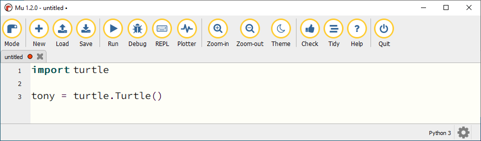
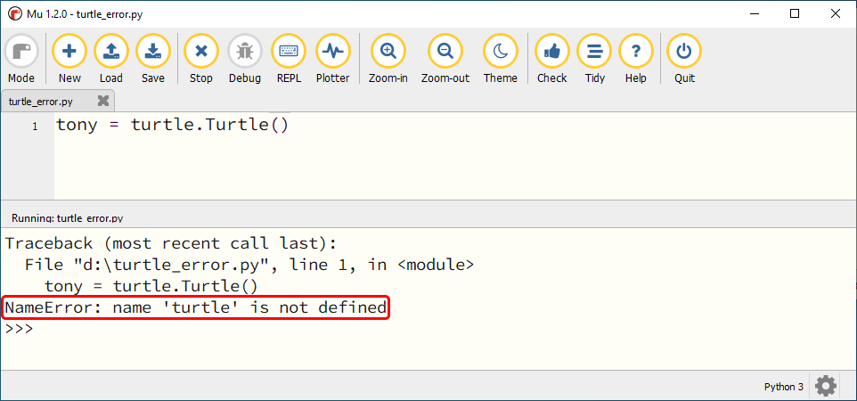
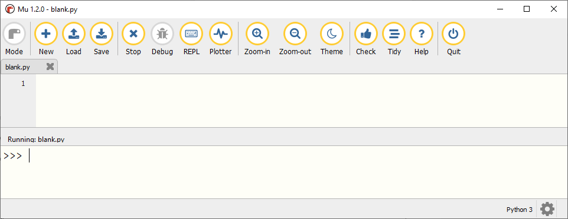

.. role:: python(code)
   :language: python

.. |br| raw:: html

    

Variabelen
==========

.. dropdown:: Wat leer je in dit hoofdstuk
    :open:
    :color: primary
    :icon: book

    * Wat keywords zijn.
    * Wat een variabele is.
    * Hoe je een variabele maakt met een assignment statement.
    * Hoe je in Mu editor een Command Line Interface (CLI) start.
    * Hoe je met variabelen kunt experimenteren in de CLI.
    * Hoe je de waarde van een variabele opvraagt.
    * Hoe je met variabelen kunt rekenen.
    * Hoe je variabelen in turtle programma's kunt toepassen.

Keywords
--------

Voordat we het over variabelen gaan hebben, is het handig dat je iets weet van *keywords*. Net als een gewone taal maakt een programmeertaal gebruik van woorden. De Nederlandse taal telt miljoenen woorden; in de Taaldatabank van het `Instituut voor de Nederlandse Taal <https://ivdnt.org/>`_ zijn er meer dan 60 miljoen opgeslagen! Daarmee vergeleken is Python een lachtertje; dat kent slechts 35 woorden:

.. grid:: 3 4 5 7 
 
    .. grid-item:: 
  
        :python:`and`
    
    .. grid-item:: 
  
        :python:`as` 

    .. grid-item:: 
  
        :python:`assert` 

    .. grid-item:: 
  
        :python:`async` 

    .. grid-item:: 
  
        :python:`await` 

    .. grid-item:: 
  
        :python:`break` 

    .. grid-item:: 
  
        :python:`class` 

    .. grid-item:: 
  
        :python:`continue` 

    .. grid-item:: 
  
        :python:`def`

    .. grid-item:: 
  
        :python:`del`

    .. grid-item:: 
  
        :python:`elif`

    .. grid-item:: 
  
        :python:`else`

    .. grid-item:: 
  
        :python:`except`

    .. grid-item:: 
  
        :python:`finally`

    .. grid-item:: 
  
        :python:`for`

    .. grid-item:: 
  
        :python:`from`

    .. grid-item:: 
  
        :python:`global`

    .. grid-item:: 
  
        :python:`if`

    .. grid-item:: 
  
        :python:`import`

    .. grid-item:: 
  
        :python:`in`

    .. grid-item:: 
  
        :python:`is`

    .. grid-item:: 
  
        :python:`lambda`

    .. grid-item:: 
  
        :python:`nonlocal`

    .. grid-item:: 
  
        :python:`not`

    .. grid-item:: 
  
        :python:`or`

    .. grid-item:: 
  
        :python:`pass`

    .. grid-item:: 
  
        :python:`raise`

    .. grid-item:: 
  
        :python:`return`

    .. grid-item:: 
  
        :python:`try`

    .. grid-item:: 
  
        :python:`while`

    .. grid-item:: 
  
        :python:`with`

    .. grid-item:: 
  
        :python:`yield`

    .. grid-item:: 
  
        :python:`None`

    .. grid-item:: 
  
        :python:`False`

    .. grid-item:: 
  
        :python:`True`

Deze 35 woorden zijn de zogeheten *keywords* in Python. Wanneer je in Mu editor een keyword typt, wordt dat automatisch dikgedrukt. In de code hieronder zie je dat dat is gebeurd met het keyword :python:`import`.

Maar hoe zit het dan met de andere woorden die je in deze code ziet, zoals :python:`turtle` en :python:`tony`? Dat zijn geen keywords, maar *namen*. Op regel 3 wordt bijvoorbeeld een turtle variabele aangemaakt met de naam :python:`tony` door een functie met de naam :python:`Turtle` uit de module genaamd :python:`turtle` aan te roepen.

Wanneer je zou vergeten de :python:`turtle` module te importeren, geeft Python een :python:`NameError`. Daarmee geeft het aan dat de naam turtle onbekend is.

Variabelen maken
----------------

.. grid:: 2
    :padding: 0

    .. grid-item::
        :columns: 6

        Een *variabele* is een plaats in het geheugen van de computer waar je een *waarde* kunt opslaan. Je kunt een variabele vergelijken met een lade in een ladenkast. De lade heeft een label dat aangeeft wat er in zit, en in de lade zit inhoud. Een variabele heeft een *naam* die (meestal) aangeeft wat er in zit, en in de variabele zit een *waarde*.

    .. grid-item::
        :columns: 6

        .. image:: images/variables.png

.. dropdown:: Waarden
    :open:
    :color: info
    :icon: info

    Bij het woord *waarde* denk je wellicht aan een getal. Je kunt in een variabele inderdaad een getal opslaan, maar ook andere informatie zoals een stukje tekst of een afbeelding is mogelijk. 
          
Maak in Mu editor een nieuw bestand door op de knop :guilabel:`New` te klikken.  Laat het bestand leeg en sla het op onder de naam :file:`blank.py` (in het Engels heet een leeg bestand ook wel een *blank file*). Klik vervolgens op :guilabel:`Run`. Ook al staat er geen code in het bestand, Mu editor runt het programma zonder problemen:

Wanneer Mu in *running mode*  is, zie je in de onderste helft van het venster de Python *prompt* :python:`>>>` en een knipperende cursor. Dit is de zogenoemde Command Line Interface (CLI) van Python. Je kunt hierin regels code typen, die direct worden uitgevoerd zodra je op :kbd:`Enter` drukt. Het is een handige voorziening om rechtstreeks met Python te communiceren en bij uitstek geschikt om te experimenteren met variabelen.

Typ in de CLI de som :python:`2 + 3`: 

.. prompt:: python >>> auto

    >>> 2 + 3

Als je nu op :kbd:`Enter` drukt, voert Python de code direct uit, hetgeen resulteert in:

.. prompt:: python >>> auto

    >>> 2 + 3
    5

Nu gaan we een variabele maken. Typ in de CLI de code :python:`aantal = 12` en druk op :kbd:`Enter`.

.. prompt:: python >>> auto

    >>> aantal = 12
    >>>

Het lijkt misschien alsof er niks is gebeurd, maar niets is minder waar. Je hebt een variabele gemaakt met de naam :python:`aantal` waarin de waarde :python:`12` is opgeslagen. In Python creëer je variabelen met een zogenoemd *assignment statement*, dat je kunt herkennen aan het :python:`=` teken.

.. card:: :octicon:`info` Assignment statement

    | Een assignment statement heeft de vorm
    | :python:`<variabelenaam> = <waarde>`

Laten we nog een paar variabelen maken:

.. prompt:: python >>> auto

    >>> aantal = 12
    >>> prijs = 2.50
    >>> titel = "Speciale aanbieding"

Wanneer je een tekstwaarde in een variabele wilt opslaan, moet je aanhalingstekens gebruiken, zoals je hierboven ziet in :python:`"Speciale aanbieding"`. Door die aanhalingstekens begrijpt Python waar de tekst begint en eindigt.

We hebben nu drie variabelen gemaakt.

.. grid:: 3
    :gutter: 2

    .. grid-item-card:: Variabele
        :columns: auto
        :class-card: card-variable-bg

        .. list-table::
            :stub-columns: 1 

            * - Naam:
              - :python:`aantal` 
            * - Waarde:
              - :python:`12` 

    .. grid-item-card:: Variabele
        :columns: auto
        :class-card: card-variable-bg

        .. list-table::
            :stub-columns: 1 

            * - Naam:
              - :python:`prijs` 
            * - Waarde:
              - :python:`2.50` 

    .. grid-item-card:: Variabele
        :columns: auto
        :class-card: card-variable-bg

        .. list-table::
            :stub-columns: 1 

            * - Naam:
              - :python:`titel` 
            * - Waarde:
              - :python:`"Speciale aanbieding"` 

Hoe weet je zeker dat de variabelen daadwerkelijk zijn gemaakt door Python? Heel eenvoudig door in de CLI de naam van de variabele te typen.

.. prompt:: python >>> auto

    >>> aantal
    12
    >>> prijs
    2.5
    >>> titel
    'Speciale aanbieding'

Je ziet dat Python de waarde van de variabele teruggeeft. Daarbij vallen twee zaken op:

1.  De waarde van de variabele :python:`prijs` is niet meer :python:`2.50` zoals we hadden ingevoerd, maar :python:`2.5`. Python laat de nul weg.
2.  De waarde van de variabele :python:`titel` is niet meer :python:`"Speciale aanbieding"` (met dubbele aanhalingstekens) maar :python:`'Speciale aanbieding'` (met enkele aanhalingstekens).      

Over die aanhalingstekens leer je later meer in het hoofdstuk Strings.

:bdg-danger:`ToDo: verwijzing naar hoofdstuk Strings.`

.. dropdown:: Variabelenamen
    :open:
    :color: info
    :icon: info

    De naam van een variabele mag je zelf bedenken. Kies bij voorkeur een naam die past bij de betekenis van de variabele en houd de volgende regels in de gaten:

    * De naam moet beginnen met een letter of het underscore karakter (:python:`_`).
    * De naam mag niet met een cijfer beginnen.
    * De naam mag alleen letters, cijfers en het underscore karakter bevatten.
    * De naam mag niet een Python keyword zijn.

    Als je een naam kiest die uit meerdere woorden bestaat, gebruik dan underscores tussen de woorden:

    .. prompt:: python >>> auto

        >>> aantal_appels = 8
        >>> aantal_peren = 5

Variabelen gebruiken
--------------------

Nadat je een variabele hebt gemaakt, kun je hem gebruiken. Bijvoorbeeld in berekeningen:

.. _code_example_using_variables:

.. prompt:: python >>> auto

    >>> aantal = 12
    >>> prijs = 2.50
    >>> titel = "Speciale aanbieding"
    >>> aantal + 6
    18
    >>> aantal * prijs
    30.0

Wellicht valt je op dat Python bij :python:`aantal * prijs` niet :python:`30` teruggeeft, maar :python:`30.0`. Daarover leer je later meer in het hoofdstuk Datatypes.

:bdg-danger:`ToDo: verwijzing naar hoofdstuk Datatypes.`

Met variabelen die tekst bevatten kun je ook een beetje 'rekenen'

.. prompt:: python >>> auto

    >>> titel + titel
    'Speciale aanbiedingSpeciale aanbieding'
    >>> 3 * (titel + "! ")
    'Speciale aanbieding! Speciale aanbieding! Speciale aanbieding! '

Natuurlijk kun je het resultaat van een berekening ook weer in een nieuwe variabele opslaan:

.. prompt:: python >>> auto

    >>> totale_prijs = aantal * prijs
    >>> totale_prijs
    30.0

Of de waarde van een bestaande variabele overschrijven:

.. prompt:: python >>> auto

    >>> korting = 5.00
    >>> totale_prijs = totale_prijs - korting
    >>> totale_prijs
    25.0

.. dropdown:: Opdracht 01
    :color: secondary
    :icon: pencil

    Bekijk de onderstaande code en probeer eerst uit je hoofd te beredeneren wat de waarden van de variabelen :python:`getal1`, :python:`getal2`, :python:`getal3`  en :python:`getal4` zijn nadat deze code is uitgevoerd. Controleer daarna je voorspelling door in Mu editor in de CLI (terwijl :file:`blank.py` in running mode is) de code over te nemen en de waarden van de variabelen op te vragen. Klopte je voorspelling?
    
    .. prompt:: python >>> auto

        >>> getal1 = 3
        >>> getal2 = getal1 + 2
        >>> getal3 = getal2 * (getal1 + getal2)
        >>> getal4 = getal3 - getal2

    .. dropdown:: Oplossing
        :color: secondary
        :icon: check-circle

        .. prompt:: python >>> auto

            >>> getal1 = 3
            >>> getal2 = getal1 + 2
            >>> getal3 = getal2 * (getal1 + getal2)
            >>> getal4 = getal3 - getal2
            >>> getal1
            3
            >>> getal2
            5
            >>> getal3
            40
            >>> getal4
            35  

Variabelen en turtle
--------------------

Bij het maken van Python turtle programma's, kunnen variabelen goed van pas komen. Kijk eens naar de verschillen tussen de volgende twee programma's, die beide een vierkant met zijden van 100 pixels tekenen:

.. grid:: 2

    .. grid-item:: 

        .. code-block:: python
            :linenos:
            :caption: turtle_square.py

            import turtle

            tony = turtle.Turtle()

            tony.fd(100)
            tony.lt(90)
            tony.fd(100)
            tony.lt(90)
            tony.fd(100)
            tony.lt(90)
            tony.fd(100)

    .. grid-item:: 

        .. code-block:: python
            :linenos:
            :emphasize-lines: 5
            :caption: turtle_square_variable.py

            import turtle

            tony = turtle.Turtle()

            lengte = 100
            tony.fd(lengte)
            tony.lt(90)
            tony.fd(lengte)
            tony.lt(90)
            tony.fd(lengte)
            tony.lt(90)
            tony.fd(lengte)

.. dropdown:: Vraag
    :open:
    :color: secondary
    :icon: question

    Wat is het voordeel van het programma aan de rechterkant, waarin de variabele :python:`lengte` is gebruikt? 

    .. dropdown:: Antwoord
        :color: secondary
        :icon: check-circle

        Stel dat je een vierkant met zijden van 200 pixels wilt tekenen in plaats van 100 pixels. Hoeveel coderegels moet je dan wijzigen in het linkerprogramma? En hoeveel in het rechterprogramma?

        Door een variabele te gebruiken, maak je je code flexibeler. Je hoeft slechts regel 5 te wijzigen in :python:`lengte = 200` om een vierkant met zijden van 200 pixels te verkrijgen. 

.. dropdown:: Opdracht 02
    :color: secondary
    :icon: pencil

    Maak een nieuw bestand aan, kopieer onderstaande code erin en sla het op als :file:`turtle_variables.py`. Run het programma en probeer te begrijpen wat de code doet.

    .. code-block:: python
        :linenos:
        :caption: turtle_variables.py

        import turtle

        tony = turtle.Turtle()

        lengte = 100
        breedte = lengte / 2

        tony.fd(lengte)
        tony.lt(90)
        tony.fd(breedte)
        tony.lt(90)
        tony.fd(lengte)
        tony.lt(90)
        tony.fd(breedte)

    Pas regels 5 en 6 in :file:`turtle_variables.py` zodanig aan dat een rechthoek wordt getekend waarvan de breedte 20 pixels minder is dan de lengte en waarvan de lengte 180 pixels is.

    .. dropdown:: Oplossing
        :color: secondary
        :icon: check-circle

        .. code-block:: python
            :linenos:
            :emphasize-lines: 5,6
            :caption: turtle_variables.py
            :name: turtle_variables_opdr01

            import turtle

            tony = turtle.Turtle()

            lengte = 180
            breedte = lengte - 20

            tony.fd(lengte)
            tony.lt(90)
            tony.fd(breedte)
            tony.lt(90)
            tony.fd(lengte)
            tony.lt(90)
            tony.fd(breedte)

.. dropdown:: Opdracht 03
    :color: secondary
    :icon: pencil

    Vervang de code in :file:`turtle_variables.py` door onderstaande code.

    .. code-block:: python
        :linenos:
        :caption: turtle_variables.py

        import turtle

        tony = turtle.Turtle()
        tony.pensize(3)

        r = 40

        tony.circle(r)

    Vul de code aan zodat :python:`tony` om de cirkel een vierkant tekent, zoals hieronder getoond. Je moet daarbij de variabele :python:`r` gebruiken.

    Als je de code hebt gemaakt, geef dan in regel 6 de variabele :python:`r` een andere waarde, bijvoorbeeld :python:`r = 60` en controleer dat nog steeds het juiste vierkant wordt getekend. 

    .. image:: images/circle_in_square.png