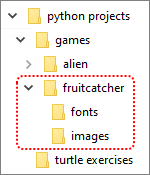
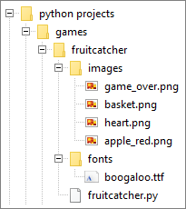

.. role:: python(code)
   :language: python

.. |br| raw:: html

    

Voorbereiding
=============

Mappen aanmaken
---------------
Maak voor dit project in je :file:`games` map een nieuwe map aan met de naam :file:`fruitcatcher`. Maak in die nieuwe map alvast de mappen :file:`images` en :file:`fonts` aan. Hieronder zie je de gewenste structuur.

Weet je niet meer hoe je nieuwe mappen aanmaakt? Kijk dan nog even terug bij de :ref:`vorige les <mappen-structuur-maken>`.

Assets downloaden
-----------------
Game developers noemen de bestanden die ze in hun game gebruiken, zoals afbeeldingen, geluiden en lettertypes, vaak *assets*. Download de volgende vier afbeeldingen en zorg dat ze terechtkomen in de :file:`fruitcatcher\\images` map die je zojuist maakte.

.. grid:: 2
   :gutter: 3

   .. grid-item-card::

      .. image:: ../game_assets/fruitcatcher/images/basket.png
         :height: 44

      :download:`basket.png <../game_assets/fruitcatcher/images/basket.png>`

   .. grid-item-card:: 
      
      .. image:: ../game_assets/fruitcatcher/images/apple_red.png
         :height: 44

      :download:`apple_red.png <../game_assets/fruitcatcher/images/apple_red.png>`

   .. grid-item-card:: 
      
      .. image:: ../game_assets/fruitcatcher/images/heart.png
         :height: 44

      :download:`heart.png <../game_assets/fruitcatcher/images/heart.png>`

   .. grid-item-card:: 
      
      .. image:: ../game_assets/fruitcatcher/images/game_over.png
         :height: 44

      :download:`game_over.png <../game_assets/fruitcatcher/images/game_over.png>`

Download vervolgens het onderstaande lettertype en plaats het in de map :file:`fruitcatcher\\fonts`.

.. grid:: 2
   :gutter: 3

   .. grid-item-card::

      .. image:: images/boogaloo_font.png
         :height: 44

      :download:`boogaloo.ttf <../game_assets/fruitcatcher/fonts/boogaloo.ttf>`

Je beschikt nu over alle assets voor het basisspel.

.. dropdown:: Tip
    :color: info
    :icon: light-bulb
    :open:

    Wil je een game maken en ben je op zoek naar leuke sprites? Typ in je zoekmachine dan `free game assets <https://duckduckgo.com/?va=g&t=hh&q=free+game+assets&ia=web>`_.

    .. image:: images/free_game_assets.png

Codebestand maken
-----------------

Maak in Mu editor een nieuw bestand en sla het op in je :file:`fruitcatcher` map onder de naam :file:`fruitcatcher.py`.

Check nog eens of je alle bestanden op de juiste plek hebt staan. De structuur zou de volgende moeten zijn:

Klopt het allemaal? Dan kan het programmeren beginnen!
