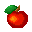

.. role:: python(code)
   :language: python

.. |br| raw:: html

    

Het fruit
=============

Het bewegende mandje is klaar en nu kunnen we ons met het fruit gaan bezighouden, in eerste instantie alleen een rode appel. Deze moet op een random positie vanuit de bovenkant van het venster naar beneden vallen.

De fruit sprite
-------------------

Voeg de volgende regels aan je programma toe:

.. code-block:: python
    :linenos:
    :caption: fruitcatcher.py
    :emphasize-lines: 1, 7, 13-15, 25

    import random

    # Vensterinstellingen
    WIDTH = 600
    HEIGHT = 400
    TITLE = 'Fruit Catcher'
    MARGIN = 20

    # Sprite voor het mandje
    basket = Actor('basket')
    basket.speed = 5

    #Sprite voor het fruit
    fruit = Actor('apple_red')
    fruit.speed = 5

    # Initialisatie mandje
    def init_basket():
        basket.x = WIDTH // 2
        basket.bottom = HEIGHT

    # Draw() functie
    def draw():
        screen.clear()
        fruit.draw()
        basket.draw()

Omdat de appel op een willekeurige plek bovenin het venster moet starten, hebben we de :python:`random` module nodig, die we op regel 1 importeren. |br| Het is niet zo mooi als de appel de linker- of rechterrand van het venster raakt en daarom maken we op regel 7 een :python:`MARGIN` constante aan met waarde :python:`20`. Deze constante geeft aan dat tussen de appel en de zijranden minstens 20 pixels afstand moet zitten. We gaan :python:`MARGIN` straks gebruiken bij het bepalen van de startpositie. |br| Op regels 14 en 15 zie je dat een :python:`fruit` variabele wordt aangemaakt, die we ook meteen van een :python:`speed` variabele voorzien. |br| In de :python:`draw()` functie voegen we op regel 25 de :python:`fruit.draw()` aanroep toe, opdat de appel wordt getekend.

Startpositie
-------------

Voor de :python:`basket` sprite creëerden we een :python:`init_basket()` functie om de startpositie te bepalen. Zoiets gaan we voor de :python:`fruit` sprite ook doen. 

1. Voeg onder de :python:`init_basket()` functie een :python:`init_fruit()` functie toe.
2. Voeg aan het hoofdprogramma de aanroep :python:`init_fruit()` toe.

.. code-block:: python
    :caption: fruitcatcher.py
    :emphasize-lines: 6-8, 20

    # Initialisatie mandje
    def init_basket():
        basket.x = WIDTH // 2
        basket.bottom = HEIGHT
        
    # Initialisatie fruit
    def init_fruit():
        pass

    # Draw() functie
    def draw():
        ...

    # Update() functie
    def update():
        ...
        
    # HOOFDPROGRAMMA
    init_basket()
    init_fruit()

.. dropdown:: Opdracht 01
    :color: secondary
    :icon: pencil

    Vervang het :python:`pass` keyword in de :python:`init_fruit()` functie door twee regels waarmee je de startpositie van de appel instelt.

    Voor de horizontale positie gebruik je de functie :python:`random.randint(start, stop)`.  Deze functie genereert een willekeurige integerwaarde tussen :python:`start` en :python:`stop`. Bijvoorbeeld :python:`random.randint(3, 7)` levert één van de getallen 3, 4, 5, 6, of 7 op.
    
    .. code-block:: python

        fruit.x = random.randint(..., ...)
    
    Voor de positie van de appel geldt dat die tussen de linker- en rechterkant van het venster moet zitten en minstens op een afstand :python:`MARGIN`. Bedenk zelf tussen welke :python:`start` en :python:`stop` waarden de random horizontale positie van de :python:`fruit` sprite dan moet zitten. Gebruik daarbij de onderstaande afbeelding.

    .. figure:: images/margins.png

    Test de juiste werking van de code voor de horizontale positie vóórdat je de verticale positie programmeert. Dan is de appel namelijk nog zichtbaar. Je kunt testen door aan de :python:`update()` functie tijdelijk een regel toe te voegen waarin je :python:`init_fruit()` aanroept. Daardoor wordt 60 keer per seconde de startpositie van de appel opnieuw ingesteld. Na het testen verwijder je deze aanroep weer.

    .. code-block:: python

        # Update() functie
        def update():
            # Keyboard events
            ...

            init_fruit()

    Voor de verticale positie geef je de variabele :python:`fruit.bottom` een zodanige waarde dat de sprite zich net boven de bovenrand van het venster bevindt, en dus nog niet zichtbaar is. 

    .. code-block:: python

        fruit.bottom = ...

Beweging
---------

Om de appel naar beneden te laten vallen, hoef je slechts één regel code aan de :python:`update()` functie toe te voegen.

.. dropdown:: Opdracht 02
    :color: secondary
    :icon: pencil

    Voeg onder de huidige code in de :python:`update()` functie een regel toe die de appel naar beneden laat bewegen met snelheid :python:`fruit.speed`. Laat deze regel voorafgaan door een commentaarregel met toelichting.

    .. code-block:: python

        # Update() functie
        def update():
            # Keyboard events
            ...

            # Beweeg fruit
            ...

Als alles goed is gegaan, heb je nu een mandje dat kan bewegen en een appel die naar beneden valt. In het volgende deel ga je werken aan de score en het verliezen van levens.