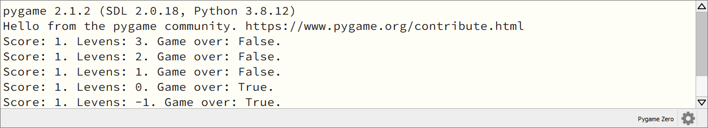

.. role:: python(code)
   :language: python

.. |br| raw:: html

    

Game start en game over
=======================

Het spel werkt, maar het begin en einde behoeven verbetering. We willen graag dat de speler het startmoment van het spel zelf kan bepalen en tevens moet 'game over' worden getoond wanneer de levens op zijn. We beginnen met het programmeren van dat laatste.

Game over
----------

Om de status van het spel (game over of niet game over) bij te houden, maken we een *boolean*  variabele aan:

.. code-block:: python
    :linenos:
    :caption: fruitcatcher.py
    :emphasize-lines: 13-14

    import random

    # Vensterinstellingen
    WIDTH = 600
    HEIGHT = 400
    TITLE = 'Fruit Catcher'
    MARGIN = 20

    # Variabelen voor score en levens
    score = 0
    lives = 3

    # Variabelen om de status van het spel bij te houden
    game_over = False

Bij aanvang van het spel is het natuurlijk nog niet meteen game over en daarom geef je de variabele :python:`game_over` de waarde :python:`False`.

Wanneer moet :python:`game_over` de waarde :python:`True` krijgen? Als het aantal levens nul (of zelfs negatief) is. Dat gaan we in de :python:`update()` functie checken. Om de waarde van :python:`game_over` daadwerkelijk te kunnen wijzigen in de :python:`update()` functie, dien je hem globaal te maken, net als we eerder deden met :python:`score` en :python:`lives`.   

.. code-block:: python
    :caption: fruitcatcher.py
    :linenos:
    :lineno-start: 51
    :emphasize-lines: 3

    # Update() functie
    def update():
        global score, lives, game_over

.. dropdown:: Opdracht 01
    :color: secondary
    :icon: pencil

    Voeg aan de :python:`update()` functie een :python:`if` statement toe waarin :python:`game_over` op :python:`True` wordt gezet als het aantal levens kleiner of gelijk aan nul is. Doe dit in het :python:`else` codeblok dat de :python:`lives` variabele met :python:`1` aflaagt:  

    .. code-block:: python
        :caption: fruitcatcher.py
        :linenos:
        :lineno-start: 68
        :emphasize-lines: 7    

        # Collision detection
        if fruit.top > basket.top:
            if basket.collidepoint(fruit.center):
                score += 1
            else:
                lives -= 1
                # VOEG HIER HET IF STATEMENT IN
            print(f'Score: {score}. Levens: {lives}.')
            init_fruit()

Je kunt controleren of het :python:`if` statement van opdracht 01 werkt, door de waarde van :python:`game_over` in de console te printen:

.. code-block:: python
    :caption: fruitcatcher.py
    :linenos:
    :lineno-start: 68
    :emphasize-lines: 9

    # Collision detection
    if fruit.top > basket.top:
        if basket.collidepoint(fruit.center):
            score += 1
        else:
            lives -= 1
            if ...:
                ...
        print(f'Score: {score}. Levens: {lives}. Game over: {game_over}.')
        init_fruit()

Run de code om te zien dat :python:`game_over` van :python:`False` naar :python:`True` gaat zodra :python:`lives` nul wordt.

Maar we willen natuurlijk dat de tekst 'Game Over' in het spelvenster verschijnt, in plaats van in de console. Daar hebben we de :python:`draw()` functie voor nodig. Voeg daaraan het volgende :python:`if` statement toe:

.. code-block:: python
    :caption: fruitcatcher.py
    :linenos:
    :lineno-start: 43
    :emphasize-lines: 5-7

    # Draw() functie
    def draw():
        screen.clear()
        
        if game_over:
            screen.blit('game_over', ((WIDTH-256)//2, (HEIGHT-170)//2))
            return
            
        fruit.draw()
        basket.draw()
        draw_score()
        draw_lives()

De :python:`screen.blit()` functie gebruikte je eerder om de hartjes te tekenen. Helaas gebruikt deze functie voor de positie altijd de linkerbovenhoek van de afbeelding, waardoor je een berekening moet uitvoeren om het plaatje mooi in het midden van het venster te krijgen. De afmetingen van onze :file:`game_over.png` afbeelding zijn ``256 x 170`` pixels, dus de linkerbovenhoek moet terechtkomen op positie :python:`((WIDTH-256)//2, (HEIGHT-170)//2)`.

  
In regel 49 zie je het keyword :python:`return`. Dit gebruik je om direct de functie te verlaten. We willen namelijk niet dat regels 51 tot en met 54 nog worden uitgevoerd als het game over is. We hadden hiervoor ook een :python:`else` kunnen gebruiken (zie de code hieronder), maar met het oog op wat we hierna gaan doen (het starten van de game programmeren), is het gebruik van :python:`return` handiger.

.. code-block:: python
    :caption: fruitcatcher.py
    :linenos:
    :lineno-start: 43

    # Draw() functie
    def draw():
        screen.clear()
        
        if game_over:
            screen.blit('game_over', ((WIDTH-256)//2, (HEIGHT-170)//2))
        else:
            fruit.draw()
            basket.draw()
            draw_score()
            draw_lives()

Game start
-------------------

Voor de status *game over* maakten we een boolean :python:`game_over` variabele en dat kunnen we voor *game started* ook doen:

.. code-block:: python
    :caption: fruitcatcher.py
    :linenos:
    :lineno-start: 13
    :emphasize-lines: 3

    # Variabelen om de status van het spel bij te houden
    game_over = False
    game_started = False

Vervolgens voegen we aan de :python:`draw()` functie een :python:`if` statement toe dat de tekst ``Druk op de spatiebalk`` toont zolang :python:`game_started` de waarde :python:`False` heeft:

.. code-block:: python
    :caption: fruitcatcher.py
    :linenos:
    :lineno-start: 44
    :emphasize-lines: 5-7

    # Draw() functie
    def draw():
        screen.clear()
        
        if not game_started:
            screen.draw.text('Druk op de spatiebalk', center=(WIDTH/2, HEIGHT/2))
            return
        
        if game_over:
            screen.blit('game_over', ((WIDTH-256)//2, (HEIGHT-170)//2))
            return
            
        fruit.draw()
        basket.draw()
        draw_score()
        draw_lives()

Ook hier gebruiken we weer het :python:`return` keyword om de :python:`draw()` functie direct te verlaten. In de nu complete :python:`draw()` functie gebeurt dus het volgende:

1. Wis alle vensterinhoud (:python:`screen.clear()`).
2. Als het spel nog niet is gestart, toon dan de tekst ``Druk op de spatiebalk`` en verlaat de :python:`draw()` functie (eerste :python:`if` statement).
3. Als het spel afgelopen is, toon dan de afbeelding ``Game Over`` en verlaat de :python:`draw()` functie (tweede :python:`if` statement).
4. Teken het fruit, de mand, de score en de levens.

Door de :python:`returns` in de :python:`if` statements wordt stap 4 alleen uitgevoerd als het spel is begonnen en het nog geen game over is.

Als je nu de code runt, wordt ``Druk op de spatiebalk getoond`` maar er gebeurt nog niets wanneer de speler daadwerkelijk op die spatiebalk drukt. Daarvoor moeten we aan de :python:`update()` functie code toevoegen die detecteert of de spatiebalk wordt ingedrukt.

.. dropdown:: Opdracht 02
    :color: secondary
    :icon: pencil

    Voeg aan de :python:`update()` functie een :python:`if` statement toe waarin :python:`game_started` op :python:`True` wordt gezet wanneer de speler op de spatiebalk drukt én de game nog niet is gestart. Doe dit in het blokje :python:`#Keyboard events`. Denk eraan de :python:`game_started` variabele globaal te maken, anders kun je de waarde niet wijzigen in de functie.   

    .. code-block:: python
        :caption: fruitcatcher.py
        :linenos:
        :lineno-start: 61
        :emphasize-lines: 3, 15   

        # Update() functie
        def update():
            global score, lives, game_over, game_started
            
            # Keyboard events
            if keyboard.left:
                basket.x -= basket.speed
            elif keyboard.right:
                basket.x += basket.speed
            if basket.right > WIDTH:
                basket.right = WIDTH
            if basket.left < 0:
                basket.left = 0
                
            # VOEG HIER HET IF STATEMENT TOE

    Voor de linker- en rechterpijltjestoets gebruikten we in regels 66 en 68 :python:`keyboard.left` en :python:`keyboard.right`. Wat zou je voor de spatiebalk moeten gebruiken?

    .. dropdown:: Hint
        :color: secondary
        :icon: light-bulb

        Gebruik :python:`keyboard.space` om indrukken van de spatiebalk te detecteren. 

    .. dropdown:: Oplossing
        :color: secondary
        :icon: check-circle

        .. code-block:: python
            :class: no-copybutton
            :linenos:
            :lineno-start: 75
            :caption: fruitcatcher.py

            if keyboard.space and not game_started:
                game_started = True

Run je code om te testen of alles werkt zoals het hoort.