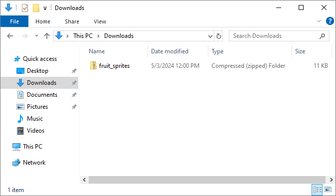
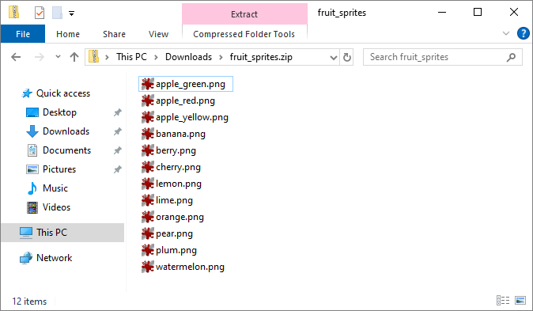
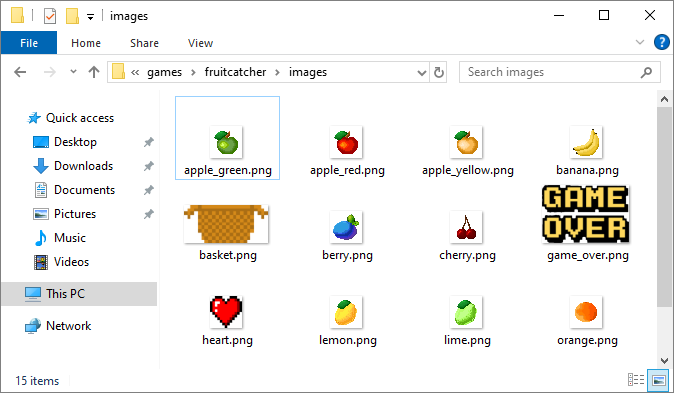

.. role:: python(code)
   :language: python

.. |br| raw:: html

    

Uitbreidingen
=======================

In principe is het spel klaar, maar uiteraard kun je er nog allerlei extra's aan toevoegen, bijvoorbeeld:

* verschillende soorten fruit gebruiken in plaats van alleen een appel;
* verschillende stukken fruit tegelijk laten vallen in plaats van telkens slechts één;
* objecten laten vallen die juist niet mogen worden opgevangen, zoals bommen;
* handige upgrades laten vallen, bijvoorbeeld een breder mandje of een extra leven;
* de valsnelheid variëren, bijvoorbeeld gelijdelijk laten toenemen om het moeilijker te maken;
* de snelheid van mand verhogen naarmate langer op een pijltjestoets wordt gedrukt;
* een explosie tonen wanneer het fruit naast de mand valt;
* verschillende levels maken.

En uiteraard kun je het spel nog verfraaien met achtergrondafbeeldingen, muziek en geluiden.

Hieronder staan programmeertips voor enkele van de zojuist genoemde uitbreidingen.

Verschillende fruitsoorten
---------------------------

Download het *zip-bestand* :download:`fruit_sprites.zip <../game_assets/fruitcatcher/images/fruit_sprites.zip>`. Een zip-bestand is een bestand waarin weer andere bestanden verpakt zijn. Je ziet in de Verkenner dat Windows dit bestand een *Compressed (zipped) Folder* noemt.

Als je in Windows het bestand opent, lijkt het ook net alsof je een map hebt geopend.

Sleep alle afbeeldingen vanuit het zip-bestand naar de :file:`fruitcatcher\\images` folder:

We gaan voor de verschillende fruitsoorten niet verschillende :python:`Actor` variabelen aanmaken. We gebruiken de variabele :python:`fruit` die we al hadden en veranderen alleen maar de afbeelding ervan, telkens wanneer een nieuw stuk fruit valt. Daartoe maken we eerst een *lijst* variabele :python:`FRUIT_IMAGES` aan met de namen van alle fruit afbeeldingen:

.. code-block:: python
    :caption: fruitcatcher.py
    :linenos:
    :lineno-start: 3
    :emphasize-lines: 7

    # Vensterinstellingen
    WIDTH = 600
    HEIGHT = 400
    TITLE = 'Fruit Catcher'
    MARGIN = 20

    FRUIT_IMAGES = ['apple_green', 'apple_red', 'apple_yellow', 'banana', 'berry', 'cherry', 'lemon', 'lime', 'orange', 'pear', 'plum', 'watermelon']

    # Variabelen voor score en levens
    score = 0
    lives = 3

Om willekeurig een fruitafbeelding te kiezen, gebruiken we de :python:`random.choice()` functie van de :python:`random` module, die we toch al hadden geïmporteerd. We hoeven slechts de volgende regel toe te voegen aan de :python:`init_fruit()` functie om het te laten werken:

.. code-block:: python
    :caption: fruitcatcher.py
    :linenos:
    :lineno-start: 32
    :emphasize-lines: 3

    # Initialisatie fruit
    def init_fruit():
        fruit.image = random.choice(FRUIT_IMAGES)
        fruit.x = random.randint(0 + MARGIN, WIDTH - MARGIN)
        fruit.bottom = -1

Elke :python:`Actor` in Pygame Zero heeft een :python:`image` variabele. De waarde van die variabele is de naam van de afbeelding die moet worden getekend. In regel 34 vullen we de :python:`fruit.image` variabele met een willekeurige naam uit de lijst :python:`FRUIT_IMAGES`.        

