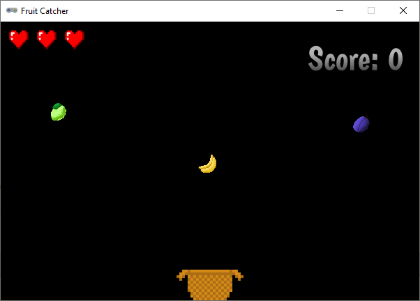

.. role:: python(code)
   :language: python

.. |br| raw:: html

    

Uitbreidingen
=======================

In principe is het spel klaar, maar uiteraard kun je er nog allerlei extra's aan toevoegen, bijvoorbeeld:

* verschillende soorten fruit gebruiken in plaats van alleen een appel;
* verschillende stukken fruit tegelijk laten vallen in plaats van telkens slechts één;
* objecten laten vallen die juist niet mogen worden opgevangen, zoals bommen;
* handige upgrades laten vallen, bijvoorbeeld een breder mandje of een extra leven;
* de valsnelheid variëren, bijvoorbeeld gelijdelijk laten toenemen om het moeilijker te maken;
* de snelheid van mand verhogen naarmate langer op een pijltjestoets wordt gedrukt;
* een explosie tonen wanneer het fruit naast de mand valt;
* verschillende levels maken.

En uiteraard kun je het spel nog verfraaien met achtergrondafbeeldingen, muziek en geluiden.

In dit deel staan programmeertips voor enkele van de zojuist genoemde uitbreidingen. Uitgangspunt is de code die je tot nu toe hebt gemaakt en waarvan je hieronder een complete weergave ziet.

.. code-block:: python
    :caption: fruitcatcher.py
    :linenos:

    import random

    # Vensterinstellingen
    WIDTH = 600
    HEIGHT = 400
    TITLE = 'Fruit Catcher'
    MARGIN = 20

    # Variabelen voor score en levens
    score = 0
    lives = 3

    # Variabelen om de status van het spel bij te houden
    game_over = False
    game_started = False

    # Sprite voor het mandje
    basket = Actor('basket')
    basket.speed = 5

    # Sprite voor het fruit
    fruit = Actor('apple_red')
    fruit.speed = 5

    # Initialisatie mandje
    def init_basket():
        basket.x = WIDTH // 2
        basket.bottom = HEIGHT

    # Initialisatie fruit
    def init_fruit():
        fruit.x = random.randint(0 + MARGIN, WIDTH - MARGIN)
        fruit.bottom = -1

    # Functie draw_score() tekent de score
    def draw_score():
        screen.draw.text(f'Score: {score}', topright=(580,20), width=360, fontname="boogaloo", fontsize=48, color="#DDDDDD", gcolor="#666666", owidth=1.5, ocolor="black", alpha=0.8)

    # Functie draw_lives() tekent de hartjes die de levens voorstellen
    def draw_lives():
        for life in range(lives):
            screen.blit('heart', (10 + 40*life, 10))

    # Draw() functie
    def draw():
        screen.clear()

        if not game_started:
            screen.draw.text('Druk op de spatiebalk', center=(WIDTH/2, HEIGHT/2))
            return

        if game_over:
            screen.blit('game_over', ((WIDTH-256)//2, (HEIGHT-170)//2))
            return

        fruit.draw()
        basket.draw()
        draw_score()
        draw_lives()

    # Update() functie
    def update():
        global score, lives, game_over, game_started

        # Start game
        if keyboard.space and not game_started:
            game_started = True

        # Exit de update() functie als de game nog niet is gestart of als het game over is
        if not game_started or game_over:
            return

        # Keyboard events
        if keyboard.left:
            basket.x -= basket.speed
        elif keyboard.right:
            basket.x += basket.speed
        if basket.right > WIDTH:
            basket.right = WIDTH
        if basket.left < 0:
            basket.left = 0

        # Beweeg fruit
        fruit.y += fruit.speed

        # Collision detection
        if fruit.top > basket.top:
            if basket.collidepoint(fruit.center):
                score += 1
            else:
                lives -= 1
                if lives <= 0:
                    game_over = True
            init_fruit()

    # HOOFDPROGRAMMA
    init_basket()
    init_fruit()

Verschillende fruitsoorten
---------------------------

Download het *zip-bestand* :download:`fruit_sprites.zip <../game_assets/fruitcatcher/images/fruit_sprites.zip>`. Een zip-bestand is een bestand waarin weer andere bestanden verpakt zijn. Je ziet in de Verkenner dat Windows dit bestand een *Compressed (zipped) Folder* noemt.

.. figure:: images/extra_different_fruits_01.png

Als je in Windows het bestand opent, lijkt het ook net alsof je een map hebt geopend.

.. figure:: images/extra_different_fruits_02.png

Sleep alle afbeeldingen vanuit het zip-bestand naar de :file:`fruitcatcher\\images` folder:

.. figure:: images/extra_different_fruits_03.png

We gaan voor de verschillende fruitsoorten niet verschillende :python:`Actor` variabelen aanmaken. We gebruiken de variabele :python:`fruit` die we al hadden en veranderen alleen maar de afbeelding ervan, telkens wanneer een nieuw stuk fruit valt. Daartoe maken we eerst een *lijst* variabele :python:`FRUIT_IMAGES` aan met de namen van alle fruit afbeeldingen:

.. code-block:: python
    :caption: fruitcatcher.py
    :linenos:
    :lineno-start: 3
    :emphasize-lines: 7

    # Vensterinstellingen
    WIDTH = 600
    HEIGHT = 400
    TITLE = 'Fruit Catcher'
    MARGIN = 20

    FRUIT_IMAGES = ['apple_green', 'apple_red', 'apple_yellow', 'banana', 'berry', 'cherry', 'lemon', 'lime', 'orange', 'pear', 'plum', 'watermelon']

    # Variabelen voor score en levens
    score = 0
    lives = 3

Om willekeurig een fruitafbeelding te kiezen, gebruiken we de :python:`random.choice()` functie van de :python:`random` module, die we toch al hadden geïmporteerd. We hoeven slechts de volgende regel toe te voegen aan de :python:`init_fruit()` functie om het te laten werken:

.. code-block:: python
    :caption: fruitcatcher.py
    :linenos:
    :lineno-start: 32
    :emphasize-lines: 3

    # Initialisatie fruit
    def init_fruit():
        fruit.image = random.choice(FRUIT_IMAGES)
        fruit.x = random.randint(0 + MARGIN, WIDTH - MARGIN)
        fruit.bottom = -1

Elke :python:`Actor` in Pygame Zero heeft een :python:`image` variabele. De waarde van die variabele is de naam van de afbeelding die moet worden getekend. In regel 34 vullen we de :python:`fruit.image` variabele met een willekeurige naam uit de lijst :python:`FRUIT_IMAGES`.        

Verschillende stukken fruit
---------------------------

Het spel wordt uitdagender als er meerdere stukken fruit tegelijk naar beneden vallen.

Wat echter ook uitdagender wordt is het programmeerwerk, want om dit voor elkaar te krijgen gaan we een *lijstvariabele* gebruiken. Dat deden we in de uitbreiding hiervoor ook al, maar dat was nog relatief eenvoudig.

Lijsten in Python
^^^^^^^^^^^^^^^^^^

In Python maak je een lijstvariabele door rechte haken te gebruiken:

.. code-block:: python
    :class: no-copybutton
    
    >>> mijn_lijst = ['boter', 'kaas', 'eieren']

In dit voorbeeld is :python:`mijn_lijst` een lijst met stringwaarden, maar je mag allerlei datatypes door elkaar gebruiken in een lijst:

.. code-block:: python
    :class: no-copybutton
    
    >>> mijn_lijst = ['A', 100, True, 3.1415, 'Fabiola']

Je haalt een item uit een lijst op door zijn positie in de lijst in te voeren tussen vierkante haken. Deze positie noemen we de *index* positie. Het eerste item in een lijst heeft altijd index 0.

.. code-block:: python
    :class: no-copybutton
    
    >>> mijn_lijst = ['A', 100, True, 3.1415, 'Fabiola']
    >>> mijn_lijst[0]
    'A'
    >>> mijn_lijst[2]
    True

In dit voorbeeld heeft het item :python:`'Fabiola'` index 4, maar je kunt in een lijst ook van achter naar voor tellen met negatieve indices. Zo heeft het item :python:`'Fabiola'` óók index -1:

.. code-block:: python
    :class: no-copybutton

    >>> mijn_lijst = ['A', 100, True, 3.1415, 'Fabiola']
    >>> mijn_lijst[4]
    'Fabiola'
    >>> mijn_lijst[-1]
    'Fabiola'

Je kunt het aantal items in een lijst opvragen met de :python:`len()` functie:

.. code-block:: python
    :class: no-copybutton
    
    >>> mijn_lijst = ['A', 100, True, 3.1415, 'Fabiola']
    >>> len(mijn_lijst)
    5

Een item in een lijst wijzigen is heel eenvoudig:

.. code-block:: python
    :class: no-copybutton
    :emphasize-lines: 4
    
    >>> mijn_lijst = ['A', 100, True, 3.1415, 'Fabiola']
    >>> mijn_lijst
    ['A', 100, True, 3.1415, 'Fabiola']
    >>> mijn_lijst[2] = False
    >>> mijn_lijst
    ['A', 100, False, 3.1415, 'Fabiola']

Met de :python:`.append()` functie, kun je een item toevoegen aan een lijst:

.. code-block:: python
    :class: no-copybutton

    >>> letters = ['A', 'B', 'C']
    >>> letters.append('D')
    >>> letters
    ['A', 'B', 'C', 'D']

En met de :python:`.remove()` functie, verwijder je een item uit een lijst:

.. code-block:: python
    :class: no-copybutton

    >>> letters = ['A', 'B', 'C']
    >>> letters.remove('B')
    >>> letters
    ['A', 'C']

Met een :python:`for` loop kun je alle items in een lijst langslopen:

.. grid:: 2
    :padding: 0

    .. grid-item::
        :columns: 6

        .. code-block:: python
            :class: no-copybutton
            :caption: Code
            :linenos:

            letters = ['A', 'B', 'C']
            for letter in letters:
                print(letter)

    .. grid-item:: 
        :columns: 6

        .. code-block:: text
            :caption: Output

            'A'
            'B'
            'C'

Lijst van 
