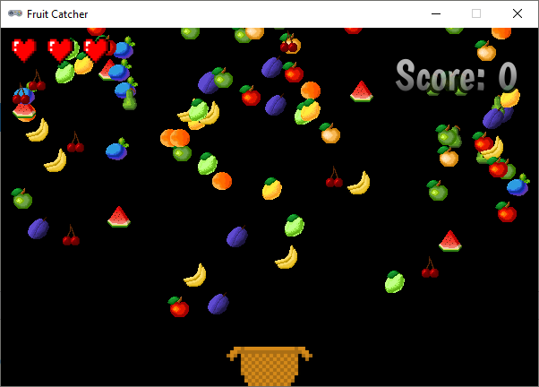
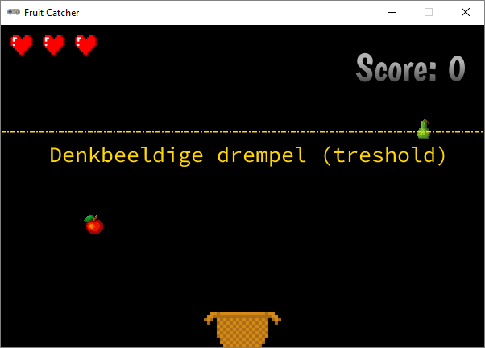
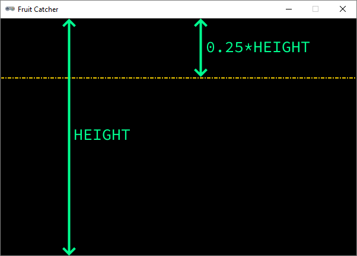

.. role:: python(code)
   :language: python

.. |br| raw:: html

    

Uitbreidingen
=======================

In principe is het spel klaar, maar uiteraard kun je er nog allerlei extra's aan toevoegen, bijvoorbeeld:

* verschillende soorten fruit gebruiken in plaats van alleen een appel;
* verschillende stukken fruit tegelijk laten vallen in plaats van telkens slechts één;
* objecten laten vallen die juist niet mogen worden opgevangen, zoals bommen;
* handige upgrades laten vallen, bijvoorbeeld een breder mandje of een extra leven;
* de valsnelheid variëren, bijvoorbeeld gelijdelijk laten toenemen om het moeilijker te maken;
* de snelheid van mand verhogen naarmate langer op een pijltjestoets wordt gedrukt;
* een explosie tonen wanneer het fruit naast de mand valt;
* verschillende levels maken.

En uiteraard kun je het spel nog verfraaien met achtergrondafbeeldingen, muziek en geluiden.

In dit deel staan programmeertips voor de eerste twee van de zojuist genoemde uitbreidingen. Uitgangspunt is de code die je tot nu toe hebt gemaakt en waarvan je hieronder een complete weergave ziet.

.. code-block:: python
    :caption: fruitcatcher.py
    :linenos:

    import random

    # Vensterinstellingen
    WIDTH = 600
    HEIGHT = 400
    TITLE = 'Fruit Catcher'
    MARGIN = 20

    # Variabelen voor score en levens
    score = 0
    lives = 3

    # Variabelen om de status van het spel bij te houden
    game_over = False
    game_started = False

    # Sprite voor het mandje
    basket = Actor('basket')
    basket.speed = 5

    # Sprite voor het fruit
    fruit = Actor('apple_red')
    fruit.speed = 5

    # Initialisatie mandje
    def init_basket():
        basket.x = WIDTH // 2
        basket.bottom = HEIGHT

    # Initialisatie fruit
    def init_fruit():
        fruit.x = random.randint(0 + MARGIN, WIDTH - MARGIN)
        fruit.bottom = -1

    # Functie draw_score() tekent de score
    def draw_score():
        screen.draw.text(f'Score: {score}', topright=(580,20), width=360, fontname="boogaloo", fontsize=48, color="#DDDDDD", gcolor="#666666", owidth=1.5, ocolor="black", alpha=0.8)

    # Functie draw_lives() tekent de hartjes die de levens voorstellen
    def draw_lives():
        for life in range(lives):
            screen.blit('heart', (10 + 40*life, 10))

    # Draw() functie
    def draw():
        screen.clear()

        if not game_started:
            screen.draw.text('Druk op de spatiebalk', center=(WIDTH/2, HEIGHT/2))
            return

        if game_over:
            screen.blit('game_over', ((WIDTH-256)//2, (HEIGHT-170)//2))
            return

        fruit.draw()
        basket.draw()
        draw_score()
        draw_lives()

    # Update() functie
    def update():
        global score, lives, game_over, game_started

        # Start game
        if keyboard.space and not game_started:
            game_started = True

        # Exit de update() functie als de game nog niet is gestart of als het game over is
        if not game_started or game_over:
            return

        # Keyboard events
        if keyboard.left:
            basket.x -= basket.speed
        elif keyboard.right:
            basket.x += basket.speed
        if basket.right > WIDTH:
            basket.right = WIDTH
        if basket.left < 0:
            basket.left = 0

        # Beweeg fruit
        fruit.y += fruit.speed

        # Collision detection
        if fruit.top > basket.top:
            if basket.collidepoint(fruit.center):
                score += 1
            else:
                lives -= 1
                if lives <= 0:
                    game_over = True
            init_fruit()

    # HOOFDPROGRAMMA
    init_basket()
    init_fruit()

Verschillende fruitsoorten
---------------------------

Download het *zip-bestand* :download:`fruit_sprites.zip <../game_assets/fruitcatcher/images/fruit_sprites.zip>`. Een zip-bestand is een bestand waarin weer andere bestanden verpakt zijn. Je ziet in de Verkenner dat Windows dit bestand een *Compressed (zipped) Folder* noemt.

.. figure:: images/extra_different_fruits_01.png

Als je in Windows het bestand opent, lijkt het ook net alsof je een map hebt geopend.

.. figure:: images/extra_different_fruits_02.png

Sleep alle afbeeldingen vanuit het zip-bestand naar de :file:`fruitcatcher\\images` folder:

.. figure:: images/extra_different_fruits_03.png

We gaan voor de verschillende fruitsoorten niet verschillende :python:`Actor` variabelen aanmaken. We gebruiken de variabele :python:`fruit` die we al hadden en veranderen alleen maar de afbeelding ervan, telkens wanneer een nieuw stuk fruit valt. Daartoe maken we eerst een *lijst* variabele :python:`FRUIT_IMAGES` aan met de namen van alle fruit afbeeldingen:

.. code-block:: python
    :caption: fruitcatcher.py
    :linenos:
    :lineno-start: 3
    :emphasize-lines: 7

    # Vensterinstellingen
    WIDTH = 600
    HEIGHT = 400
    TITLE = 'Fruit Catcher'
    MARGIN = 20

    FRUIT_IMAGES = ['apple_green', 'apple_red', 'apple_yellow', 'banana', 'berry', 'cherry', 'lemon', 'lime', 'orange', 'pear', 'plum', 'watermelon']

    # Variabelen voor score en levens
    score = 0
    lives = 3

Om willekeurig een fruitafbeelding te kiezen, gebruiken we de :python:`random.choice()` functie van de :python:`random` module, die we toch al hadden geïmporteerd. We hoeven slechts de volgende regel toe te voegen aan de :python:`init_fruit()` functie om het te laten werken:

.. code-block:: python
    :caption: fruitcatcher.py
    :linenos:
    :lineno-start: 32
    :emphasize-lines: 3

    # Initialisatie fruit
    def init_fruit():
        fruit.image = random.choice(FRUIT_IMAGES)
        fruit.x = random.randint(0 + MARGIN, WIDTH - MARGIN)
        fruit.bottom = -1

Elke :python:`Actor` in Pygame Zero heeft een :python:`image` variabele. De waarde van die variabele is de naam van de afbeelding die moet worden getekend. In regel 34 vullen we de :python:`fruit.image` variabele met een willekeurige naam uit de lijst :python:`FRUIT_IMAGES`.        

Verschillende stukken fruit
---------------------------

Het spel wordt uitdagender als er meerdere stukken fruit tegelijk naar beneden vallen.

.. figure:: images/multiple_fruits.png
    :width: 500

Wat echter ook uitdagender wordt is het programmeerwerk, want om dit voor elkaar te krijgen gaan we een *lijstvariabele* gebruiken. Dat deden we in de uitbreiding hiervoor ook al, maar dat was nog relatief eenvoudig.

Lijsten in Python
^^^^^^^^^^^^^^^^^^

In Python maak je een lijstvariabele door rechte haken te gebruiken:

.. code-block:: python
    :class: no-copybutton
    
    >>> mijn_lijst = ['boter', 'kaas', 'eieren']

In dit voorbeeld is :python:`mijn_lijst` een lijst met stringwaarden, maar je mag allerlei datatypes door elkaar gebruiken in een lijst:

.. code-block:: python
    :class: no-copybutton
    
    >>> mijn_lijst = ['A', 100, True, 3.1415, 'Fabiola']

Je haalt een item uit een lijst op door zijn positie in de lijst in te voeren tussen vierkante haken. Deze positie noemen we de *index* positie. Het eerste item in een lijst heeft altijd index 0.

.. code-block:: python
    :class: no-copybutton
    
    >>> mijn_lijst = ['A', 100, True, 3.1415, 'Fabiola']
    >>> mijn_lijst[0]
    'A'
    >>> mijn_lijst[2]
    True

In dit voorbeeld heeft het item :python:`'Fabiola'` index 4, maar je kunt in een lijst ook van achter naar voor tellen met negatieve indices. Zo heeft het item :python:`'Fabiola'` óók index -1:

.. code-block:: python
    :class: no-copybutton

    >>> mijn_lijst = ['A', 100, True, 3.1415, 'Fabiola']
    >>> mijn_lijst[4]
    'Fabiola'
    >>> mijn_lijst[-1]
    'Fabiola'

Je kunt het aantal items in een lijst opvragen met de :python:`len()` functie:

.. code-block:: python
    :class: no-copybutton
    
    >>> mijn_lijst = ['A', 100, True, 3.1415, 'Fabiola']
    >>> len(mijn_lijst)
    5

Een item in een lijst wijzigen is heel eenvoudig:

.. code-block:: python
    :class: no-copybutton
    :emphasize-lines: 4
    
    >>> mijn_lijst = ['A', 100, True, 3.1415, 'Fabiola']
    >>> mijn_lijst
    ['A', 100, True, 3.1415, 'Fabiola']
    >>> mijn_lijst[2] = False
    >>> mijn_lijst
    ['A', 100, False, 3.1415, 'Fabiola']

Met de :python:`.append()` functie, kun je een item toevoegen aan een lijst:

.. code-block:: python
    :class: no-copybutton

    >>> letters = ['A', 'B', 'C']
    >>> letters.append('D')
    >>> letters
    ['A', 'B', 'C', 'D']

En met de :python:`.remove()` functie, verwijder je een item uit een lijst:

.. code-block:: python
    :class: no-copybutton

    >>> letters = ['A', 'B', 'C']
    >>> letters.remove('B')
    >>> letters
    ['A', 'C']

Met een :python:`for` loop kun je alle items in een lijst langslopen:

.. grid:: 2
    :padding: 0

    .. grid-item::
        :columns: 6

        .. code-block:: python
            :class: no-copybutton
            :caption: Code
            :linenos:

            letters = ['A', 'B', 'C']
            for letter in letters:
                print(letter)

    .. grid-item:: 
        :columns: 6

        .. code-block:: text
            :caption: Output

            A
            B
            C

Lijst met fruit
^^^^^^^^^^^^^^^^^

Om in Fruit Catcher meerdere stukken fruit te laten vallen, gebruiken we in plaats van de huidige :python:`fruit` Actor een lijst van Actors. Om te beginnen vervangen we de :python:`fruit` Actor variabele door een lege :python:`fruits` lijst:

.. grid:: 2
    :padding: 0

    .. grid-item::
        :columns: 6

        .. code-block:: python
            :class: no-copybutton
            :caption: Oude code
            :linenos:
            :lineno-start: 19
            :emphasize-lines: 5-7

            # Sprite voor het mandje
            basket = Actor('basket')
            basket.speed = 5

            # Sprite voor het fruit
            fruit = Actor('apple_red')
            fruit.speed = 5

            # Initialisatie mandje
            def init_basket():
                basket.x = WIDTH // 2
                basket.bottom = HEIGHT

    .. grid-item:: 
        :columns: 6

        .. code-block:: python
            :class: no-copybutton
            :caption: Nieuwe code
            :linenos:
            :lineno-start: 19
            :emphasize-lines: 5-6

            # Sprite voor het mandje
            basket = Actor('basket')
            basket.speed = 5

            # Lijst voor fruit Actors
            fruits = []

            # Initialisatie mandje
            def init_basket():
                basket.x = WIDTH // 2
                basket.bottom = HEIGHT

Vervolgens vervangen we de :python:`init_fruit()` functie door een :python:`add_new_fruit_to_list()` functie, die een nieuwe Actor aanmaakt, de snelheid, afbeelding en positie instelt en het fruit toevoegt aan de :python:`fruits` lijst: 

.. grid:: 2
    :padding: 0

    .. grid-item::
        :columns: 6

        .. code-block:: python
            :class: no-copybutton
            :caption: Oude code
            :linenos:
            :lineno-start: 31

            # Initialisatie fruit
            def init_fruit():
                fruit.image = random.choice(FRUIT_IMAGES)
                fruit.x = random.randint(0 + MARGIN, WIDTH - MARGIN)
                fruit.bottom = -1

    .. grid-item:: 
        :columns: 6

        .. code-block:: python
            :class: no-copybutton
            :caption: Nieuwe code
            :linenos:
            :lineno-start: 31

            # Voeg nieuw stuk fruit toe aan de lijst
            def add_new_fruit_to_list():
                fruit = Actor('apple_red')
                fruit.speed = random.randint(2, 4)
                fruit.image = random.choice(FRUIT_IMAGES)
                fruit.x = random.randint(0 + MARGIN, WIDTH - MARGIN)
                fruit.bottom = -1
                fruits.append(fruit)

Op regel 34 krijgt :python:`fruit.speed` een random waarde, waardoor de stukken fruit met verschillende snelheden zullen vallen. 

In de :python:`draw()` functie moeten alle items in de :python:`fruits` lijst worden getekend. Dat kan eenvoudig met een :python:`for` loop:

.. grid:: 2
    :padding: 0

    .. grid-item::
        :columns: 6

        .. code-block:: python
            :class: no-copybutton
            :caption: Oude code
            :linenos:
            :lineno-start: 49
            :emphasize-lines: 13

            # Draw() functie
            def draw():
                screen.clear()

                if not game_started:
                    screen.draw.text('Druk op de spatiebalk', center=(WIDTH/2, HEIGHT/2))
                    return

                if game_over:
                    screen.blit('game_over', ((WIDTH-256)//2, (HEIGHT-170)//2))
                    return

                fruit.draw()
                basket.draw()
                draw_score()
                draw_lives()

    .. grid-item:: 
        :columns: 6

        .. code-block:: python
            :class: no-copybutton
            :caption: Nieuwe code
            :linenos:
            :lineno-start: 49
            :emphasize-lines: 13-14

            # Draw() functie
            def draw():
                screen.clear()

                if not game_started:
                    screen.draw.text('Druk op de spatiebalk', center=(WIDTH/2, HEIGHT/2))
                    return

                if game_over:
                    screen.blit('game_over', ((WIDTH-256)//2, (HEIGHT-170)//2))
                    return

                for fruit in fruits:
                    fruit.draw()
                basket.draw()
                draw_score()
                draw_lives()

Uiteraard moeten we ook de :python:`update()` functie aanpassen. Alle fruit items in de :python:`fruits` lijst moeten naar beneden vallen en van elk item moeten we checken of het in het mandje terechtkomt:

.. grid:: 2
    :padding: 0

    .. grid-item::
        :columns: 6

        .. code-block:: python
            :class: no-copybutton
            :caption: Oude code
            :linenos:
            :lineno-start: 67
            :emphasize-lines: 24, 27-34

            # Update() functie
            def update():
                global score, lives, game_over, game_started

                # Start game
                if keyboard.space and not game_started:
                    game_started = True

                # Exit de update() functie als de game nog niet is gestart of als het game over is
                if not game_started or game_over:
                    return

                # Keyboard events
                if keyboard.left:
                    basket.x -= basket.speed
                elif keyboard.right:
                    basket.x += basket.speed
                if basket.right > WIDTH:
                    basket.right = WIDTH
                if basket.left < 0:
                    basket.left = 0

                # Beweeg fruit
                fruit.y += fruit.speed

                # Collision detection
                if fruit.top > basket.top:
                    if basket.collidepoint(fruit.center):
                        score += 1
                    else:
                        lives -= 1
                        if lives <= 0:
                            game_over = True
                    init_fruit()

    .. grid-item:: 
        :columns: 6

        .. code-block:: python
            :class: no-copybutton
            :caption: Nieuwe code
            :linenos:
            :lineno-start: 67
            :emphasize-lines: 24-25, 28-37

            # Update() functie
            def update():
                global score, lives, game_over, game_started

                # Start game
                if keyboard.space and not game_started:
                    game_started = True

                # Exit de update() functie als de game nog niet is gestart of als het game over is
                if not game_started or game_over:
                    return

                # Keyboard events
                if keyboard.left:
                    basket.x -= basket.speed
                elif keyboard.right:
                    basket.x += basket.speed
                if basket.right > WIDTH:
                    basket.right = WIDTH
                if basket.left < 0:
                    basket.left = 0

                # Beweeg fruit
                for fruit in fruits:
                    fruit.y += fruit.speed

                # Collision detection
                for fruit in fruits:
                    if fruit.top > basket.top:
                        if basket.collidepoint(fruit.center):
                            score += 1
                        else:
                            lives -= 1
                            if lives <= 0:
                                game_over = True
                        fruits.remove(fruit)
                        add_new_fruit_to_list()

De nieuwe code verschilt niet veel van de oude, maar let op dat de :python:`init_fruit()` functie die we in de oude code in regel 100 aanriepen niet meer bestaat. In plaats daarvan gebruiken we :python:`fruits.remove(fruit)` om de fruit Actor uit de lijst te verwijderen en direct daarna :python:`add_new_fruit_to_list()` om een nieuwe fruit Actor te maken en in de lijst te zetten.

Als je op dit punt bent aangekomen, kun je je code testen. Wanneer je dat doet, zul je merken dat er ogenschijnlijk niks is veranderd. Er valt telkens maar één stuk fruit naar beneden. Je hebt echter nog maar één regel code nodig om heel veel fruit te laten vallen. Voeg onderaan de :python:`update()`  functie de aanroep :python:`add_new_fruit_to_list()` toe. Maak daarna van regel 99 commentaar om te voorkomen dat het spel meteen is afgelopen. 

.. grid:: 2
    :padding: 0

    .. grid-item::
        :columns: 6

        .. code-block:: python
            :class: no-copybutton
            :caption: Oude code
            :linenos:
            :lineno-start: 93

                # Collision detection
                for fruit in fruits:
                    if fruit.top > basket.top:
                        if basket.collidepoint(fruit.center):
                            score += 1
                        else:
                            lives -= 1
                            if lives <= 0:
                                game_over = True
                        fruits.remove(fruit)
                        add_new_fruit_to_list()
                    
    .. grid-item:: 
        :columns: 6

        .. code-block:: python
            :class: no-copybutton
            :caption: Nieuwe code
            :linenos:
            :lineno-start: 93
            :emphasize-lines: 7, 13

                # Collision detection
                for fruit in fruits:
                    if fruit.top > basket.top:
                        if basket.collidepoint(fruit.center):
                            score += 1
                        else:
                            #lives -= 1
                            if lives <= 0:
                                game_over = True
                        fruits.remove(fruit)
                        add_new_fruit_to_list()
                        
                add_new_fruit_to_list()

Run je code en geniet maar even van de 'hoorn des overvloeds'.

Nu valt er veel te veel fruit om de game speelbaar te laten zijn. Het ziet er mooi uit, maar voor het spel is het niet zo handig.

Door in regel 105 :python:`add_new_fruit_to_list()` aan te roepen wordt 60 keer per seconde een nieuw stuk fruit toegevoegd. De :python:`update()` functie wordt immers 60 keer per seconde uitgevoerd. Het is beter om een nieuw stuk fruit toe te voegen zodra aan een bepaalde voorwaarde is voldaan:

.. code-block:: python
    :class: no-copybutton
    :linenos:
    :lineno-start: 105

        if ...:               
            add_new_fruit_to_list()

Maar wat voor voorwaarde moet dat zijn? Je zou kunnen kiezen voor een tijdvoorwaarde, bijvoorbeeld elke 3 seconden een stuk fruit aan de lijst toevoegen. Omdat het iets gemakkelijker te programmeren is, kiezen we hier voor een positievoorwaarde: zodra het laatste stuk fruit in de lijst onder een denkbeeldige lijn komt, voegen we een nieuw stuk fruit toe.

In de figuur hierboven zie je de denkbeeldige drempel (in het engels *treshold*) getekend. De peer rechtsboven gaat juist over de drempel, en op dat moment zou een nieuw stuk fruit moeten worden gemaakt. Om dit te programmeren maken we eerst een :python:`treshold` variabele:

.. code-block:: python
    :class: no-copybutton
    :caption: fruitcatcher.py
    :linenos:
    :lineno-start: 23
    :emphasize-lines: 4-5

    # Lijst voor fruit Actors
    fruits = []

    # Drempelwaarde voordat nieuw fruit valt
    treshold = 0.25 * HEIGHT

    # Initialisatie mandje
    def init_basket():
        basket.x = WIDTH // 2
        basket.bottom = HEIGHT

In regel 27 geven we :python:`treshold` de waarde :python:`0.25*HEIGHT`. Daardoor komt de denkbeeldige lijn op een kwart van de bovenkant van het venster te liggen.

Met het volgende :python:`if` statement kunnen we er in de :python:`update()` functie voor zorgen dat een nieuwe stuk fruit aan de lijst wordt toegevoegd zodra laatste stuk fruit in de lijst (met index -1) onder de drempellijn komt:

.. code-block:: python
    :class: no-copybutton
    :caption: fruitcatcher.py
    :linenos:
    :lineno-start: 96
    :emphasize-lines: 12-14

        # Collision detection
        for fruit in fruits:
            if fruit.top > basket.top:
                if basket.collidepoint(fruit.center):
                    score += 1
                else:
                    lives -= 1
                    if lives <= 0:
                        game_over = True
                fruits.remove(fruit)

        # Check of nieuw fruit moet vallen
        if fruits[-1].y > treshold:
            add_new_fruit_to_list()

Merk op dat de aanroep :python:`add_new_fruit_to_list()` die direct onder :python:`fruits.remove(fruit)` (in regel 105) stond, is verwijderd. En in regel 102 is de :python:`#` die we eerder plaatsten om te kunnen testen weggehaald. 

Je ziet dat het gebruik van lijstvariabelen heel krachtig is. Ze maken het mogelijk om een stukje code toe te passen op een hele verzameling sprites in plaats van slechts één.