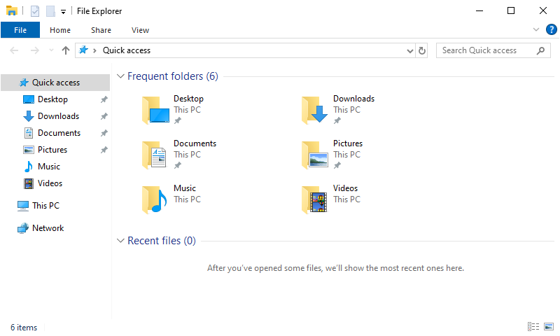
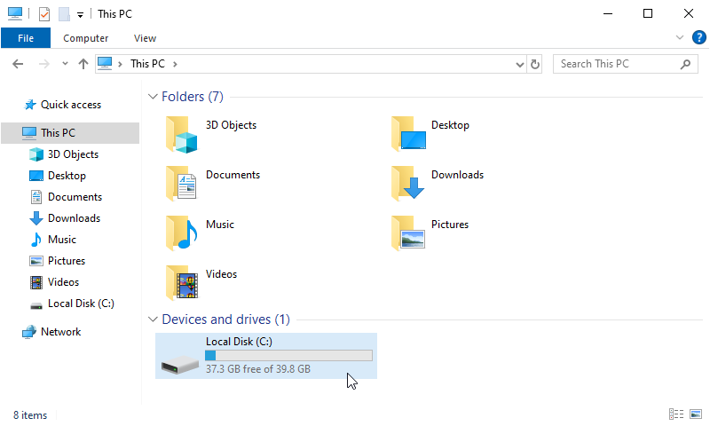
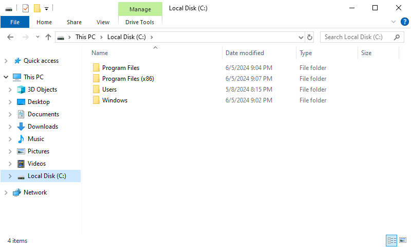
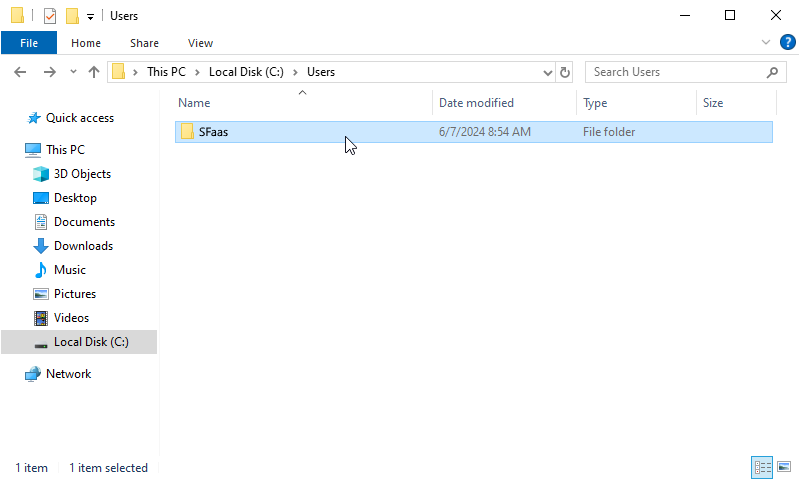
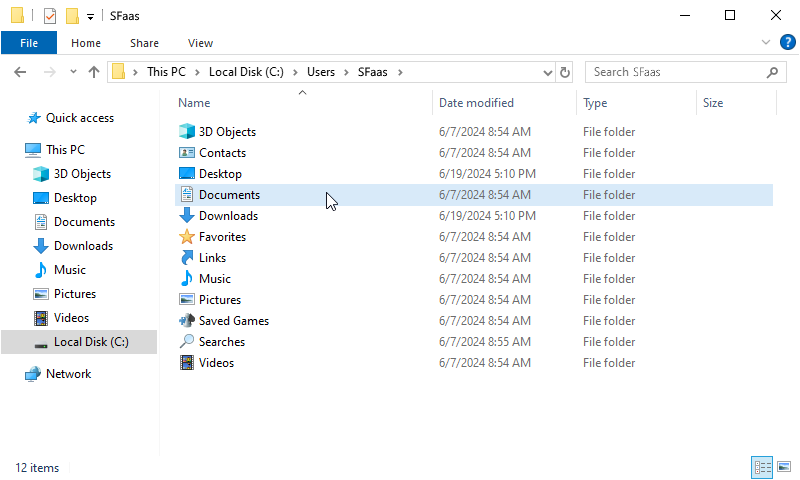
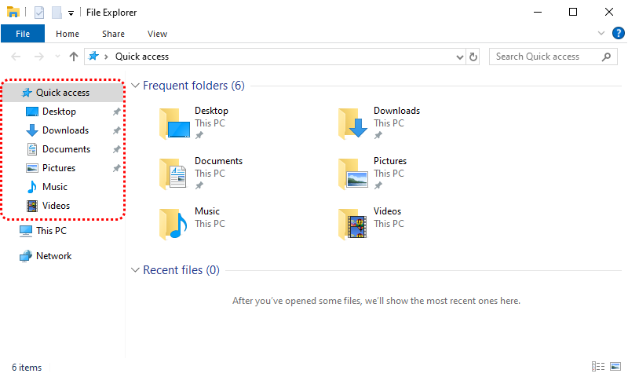

.. |br| raw:: html

    

.. |space| unicode:: U+0020 .. space
.. |nbspc| unicode:: U+00A0 .. non-breaking space

Werken met bestanden
======================================

.. dropdown:: Wat leer je in dit hoofdstuk
    :open:
    :color: primary
    :icon: book

    * ...

.. image:: images/computerparts.png
   :align: right
   :width: 50%

Elke computer bestaat uit een aantal vaste onderdelen zoals een moederbord, een processor, werkgeheugen en een harde schijf. Die laatste is nodig om bestanden te kunnen bewaren.

Vroeger was een `harde schijf <https://nl.wikipedia.org/wiki/harde_schijf>`_ nog echt een onderdeel met ronddraaiende schijven waarop de informatie met magneetkoppen werd geschreven, maar tegenwoordig is dat niet meer zo. De harde schijf van nu is een geheugenchip zonder bewegende onderdelen.

.. grid:: 2

   .. grid-item-card::
      :columns: 6
      
      .. rst-class:: center

         **Vroeger**

         .. image:: images/harddrive.png
            :width: 192
            :align: center

   .. grid-item-card::
      :columns: 6
      
      .. rst-class:: center

         **Nu**

         .. image:: images/ssd.png
            :width: 160
            :align: center

Zoals gezegd is de harde schijf in een computer de opslagplaats voor bestanden. In Windows kun je met de *Verkenner* de inhoud van de harde schijf zien.

Windows Verkenner
-------------------

.. image:: images/explorer_icon.png
   :align: right
   :width: 64

Je opent de Verkenner door op het icoontje in de Windows taakbalk te klikken. Als het daar niet staat, kun je het in het startmenu vinden, maar nog sneller wellicht is de toetscombinatie :kbd:`Win⊞` + :kbd:`E` (de Windows toets ingedrukt houden en vervolgens de E indrukken). Je kunt deze toetscombinatie onthouden door aan de Engelse term voor Verkenner te denken: *Explorer*.

Om in de Verkenner de harde schijf (of schijven) van je PC te zien, klik je in het navigatiepaneel links op :guilabel:`Deze computer` (Engels: This PC).

In de figuur hierboven zie je dat de PC één harde schijf bevat: :file:`Local Disk (C:)`. Dubbelklik op de schijf om de inhoud te zien.

Als het goed is, zie je op de harde schijf in je eigen PC de mappen :file:`Program Files`, :file:`Program Files (x86)`, :file:`Users` (of Gebruikers) en :file:`Windows` staan en waarschijnlijk nog een paar mappen meer.

.. dropdown:: Waarschuwing
    :open:
    :color: danger
    :icon: alert

    Als onervaren gebruiker kun je beter wegblijven uit de mappen :file:`Windows`, :file:`Program Files` en :file:`Program Files (x86)`. In deze mappen staan namelijk bestanden die Windows nodig heeft en bestanden van de op je PC geïnstalleerde programma's. Wanneer je hier iets aan wijzigt, loop je het risico dat Windows of je programma's niet meer goed werken.
    
In de :file:`Users` (of Gebruikers) map heeft elke gebruiker van de PC een eigen map. In die map bevinden zich de mappen voor documenten, afbeeldingen, video's, downloads etcetera.

De mappen die je verreweg het meest gebruikt tijdens het werken op de PC zijn :file:`Documents` en :file:`Downloads`. Deze open je in de praktijk meestal via het :guilabel:`Quick access` menu in het navigatiepaneel. Daarin staan shortcuts naar de mappen die je zojuist in je :file:`Users` map aantrof.

Mappenstructuur
----------------
Is je opgevallen dat we tot nu toe nog geen bestand hebben gezien, maar wel veel mappen? Dat is niet zo vreemd. Losse bestanden op je harde schijf opslaan wordt namelijk beschouwd als *bad practice* (een slechte gewoonte); het is veel beter ze op te slaan in mappen. Om alles goed georganiseerd en vindbaar te houden, heb je een handige mappenstructuur nodig. Hoe beter je die structuur maakt, hoe prettiger het werkt. Hoog tijd dus om je eigen mappenstructuur te maken.

.. dropdown:: Opdracht 01 - Mappenstructuur
   :open:
   :color: secondary
   :icon: pencil

   Open in de Verkenner je :file:`Documenten` map.

   .. figure:: images/folder_structure_01.png
      :width: 640
      :class: image-border

   Mochten er al mappen of bestanden in deze map staan dan is dat niet erg. Eventueel kun je die later reorganiseren, als je dat wilt.

   Klik in de menubalk van de Verkenner op :guilabel:`Start` (Engels: Home). Een lint met knoppen verschijnt. Klik op de knop :guilabel:`Nieuwe map` om een nieuwe map te maken.

   .. figure:: images/folder_structure_02.png
      :width: 640
      :class: image-border

   Voor schoolzaken is het handig om te beginnen met een map die je de naam geeft van het huidige schooljaar. In de figuur hieronder zie je als voorbeeld de map :file:`2024-2025`. |br| Maak een map voor jouw huidige schooljaar.

   .. figure:: images/folder_structure_03.png
      :width: 640
      :class: image-border

   Dubbelklik op je zojuist gemaakte map om hem te openen. Maak vervolgens in deze map twee nieuwe mappen met de namen :file:`Mentorzaken` en :file:`Vakken`:

   .. figure:: images/folder_structure_04.png
      :width: 640
      :class: image-border

   In de adresbalk, hierboven rood gemarkeerd, kun je zien in welke map je je momenteel bevindt. In de bovenstaande figuur is dat de map :file:`2024-2025`, die weer in de map :file:`Documents` zit, die op zijn beurt weer in :file:`This PC` zit. |br| Je kunt de adresbalk handig gebruiken om te navigeren naar hogere niveaus in je mappenstructuur. Klik bijvoorbeeld in de adresbalk op :guilabel:`Deze PC` (This PC) om twee niveaus omhoog te gaan. 

   .. figure:: images/folder_structure_06.png
      :width: 640
      :class: image-border

   Een mappenstructuur bestaat uit mappen in mappen in mappen in mappen in... enzovoort. Om de structuur overzichtelijk weer te geven, gebruiken we meestal een boomdiagram. Voor de mappen die we tot nu toe maakten, ziet dat er zo uit:

   .. figure:: images/folder_structure_07.png
      :class: image-border

   Breid nu je eigen mappenstructuur uit volgens het onderstaande boomdiagram. Kijk daarbij goed in welke map elke map zich moet bevinden. |br| Tip: om sneller een nieuwe map te maken, kun je in de Verkenner de sneltoetscombinatie :kbd:`Ctrl` + :kbd:`Shift` + :kbd:`N` gebruiken (houd :kbd:`Ctrl` ingedrukt, druk op :kbd:`Shift` en houd ook deze ingedrukt en druk dan op :kbd:`N`).

   .. figure:: images/folder_structure_08.png
      :class: image-border

   Controleer het resultaat van je werk door in het navigatiepaneel links in de Verkenner je :file:`Documenten` map in :file:`Deze computer` uit te klappen alsmede de onderliggende mappen. Als je het goed hebt gedaan, komt de structuur overeen met die in de onderstaande figuur.

   .. figure:: images/folder_structure_10.png
      :width: 640
      :class: image-border

Bestanden in mappen plaatsen
-----------------------------
Nu de mappenstructuur is gemaakt, kunnen we er bestanden in opslaan. Maar dan hebben we wel eerst bestanden nodig. In de volgende oefeningen ga je een aantal bestanden downloaden en vervolgens in de juiste mappen plaatsen.

.. dropdown:: Opdracht 02 - Bestanden downloaden
   :open:
   :color: secondary
   :icon: pencil

   Klik één maal op elk van de onderstaande links om het betreffende bestand te downloaden.

   .. grid:: 2

      .. grid-item::
         :columns: 6

         :download:`Bestand 01 <files/Boerderijdieren.xlsx>` |br|
         :download:`Bestand 02 <files/bounty island.jpg>` |br|
         :download:`Bestand 03 <files/cute.png>` |br|
         :download:`Bestand 04 <files/De prinses op de erwt.docx>` |br|
         :download:`Bestand 05 <files/Fairy-Tales.pptx>`

      .. grid-item::
         :columns: 6

         :download:`Bestand 06 <files/Frying an egg.mp4>` |br|
         :download:`Bestand 07 <files/Oostenrijkse kaiserschmarrn.pdf>` |br|
         :download:`Bestand 08 <files/sprookjesfiguren.zip>` |br|
         :download:`Bestand 09 <files/The_Parthenon_in_Athens.bmp>` |br|
         :download:`Bestand 10 <files/Wolf.jpg>`

   Het downloaden van de bestanden doet je web browser op de achtergrond; je merkt vrijwel niet dat er iets gebeurt. Wellicht toont je browser een melding nadat een bestand is gedownload:

   .. figure:: images/files_01.png
      :width: 640

   Nadat je alle bestanden hebt gedownload, vind je ze terug in je :file:`Downloads` map. Deze kun je via de Verkenner opzoeken, of rechtstreeks vanuit je browser openen door op het mapknopje te klikken naast een download:

   .. figure:: images/files_02.png
      :width: 640

   Als het goed is, toont de Verkenner dat je 10 bestanden hebt gedownload:

   .. figure:: images/files_03.png
      :width: 640
      :class: image-border

.. dropdown:: Opdracht 03 - Bestanden kopiëren of verplaatsen
   :open:
   :color: secondary
   :icon: pencil

...

.. dropdown:: Handige sneltoetsen
    :open:
    :color: primary
    :icon: codespaces

    .. list-table::
      :header-rows: 1

      * - Sneltoets
        - Werking
      * - :kbd:`Win⊞` + :kbd:`E`
        - Open nieuwe verkenner
      * - :kbd:`Ctrl` + :kbd:`N`
        - Open duplicaatvenster van huidige verkennervenster
      * - :kbd:`Ctrl` + :kbd:`Shift` + :kbd:`N`
        - Maak nieuwe map
      * - :kbd:`F2`
        - Wijzig de naam van het geselecteerde item

