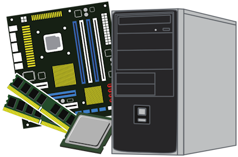

.. |br| raw:: html

    

Bestanden opslaan in de cloud
======================================

Elke computer bestaat uit een aantal vaste onderdelen zoals een moederbord, een processor, werkgeheugen en een harde schijf. Die laatste is nodig om bestanden te kunnen bewaren. Vroeger was een `harde schijf <https://nl.wikipedia.org/wiki/harde_schijf>`_ nog echt een onderdeel met ronddraaiende schijven waarop de informatie met magneetkoppen werd geschreven, maar tegenwoordig is dat niet meer zo. De harde schijf van nu is een geheugenchip zonder bewegende onderdelen.

.. grid:: 2

   .. grid-item-card::
      :columns: 6
      
      .. rst-class:: center

         **Vroeger**

         .. image:: images/harddrive.png
            :width: 192
            :align: center

   .. grid-item-card::
      :columns: 6
      
      .. rst-class:: center

         **Nu**

         .. image:: images/ssd.png
            :width: 160
            :align: center

Zoals gezegd is de harde schijf in een computer de opslagplaats voor bestanden. In Windows kun je met de *Verkenner* de inhoud van de harde schijf zien.

Je opent de Verkenner door op het icoontje in de Windows taakbalk te klikken. Als het daar niet staat, kun je het in het startmenu vinden, maar nog sneller wellicht is de toetscombinatie :kbd:`⊞` + :kbd:`E` (de Windows toets ingedrukt houden en vervolgens de E indrukken). Je kunt deze toetscombinatie onthouden door aan de Engelse term voor Verkenner te denken: *Explorer*.