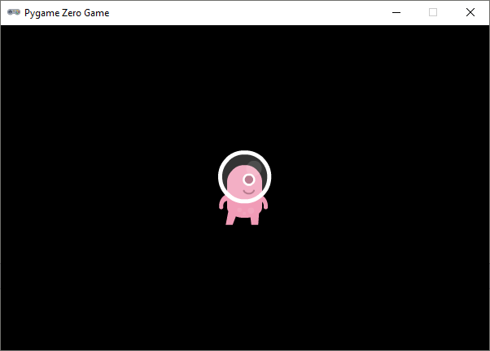
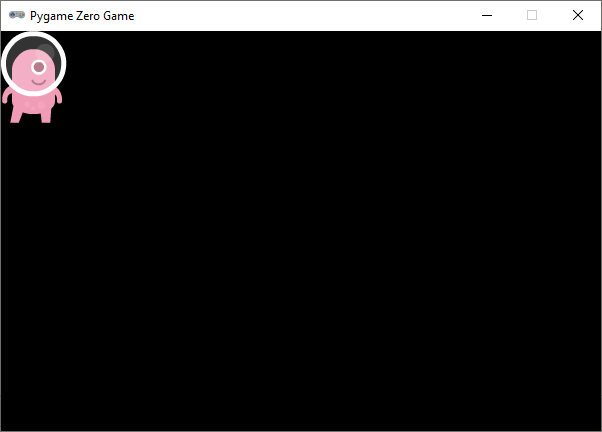
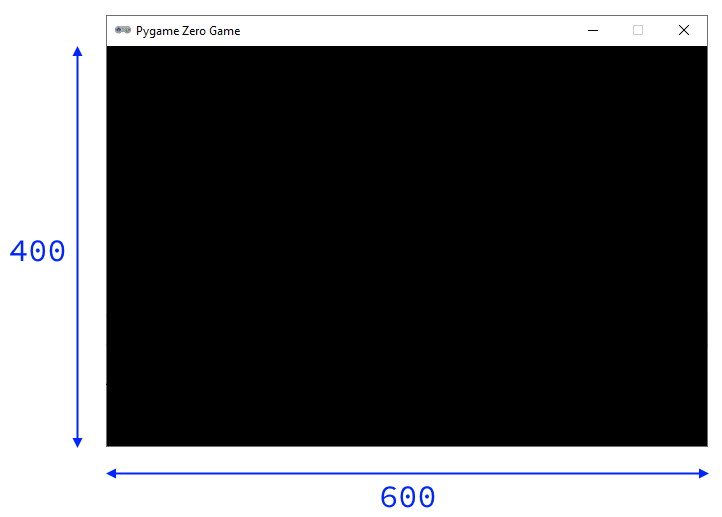
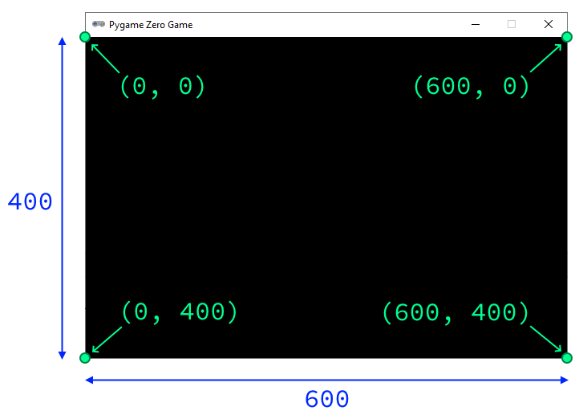
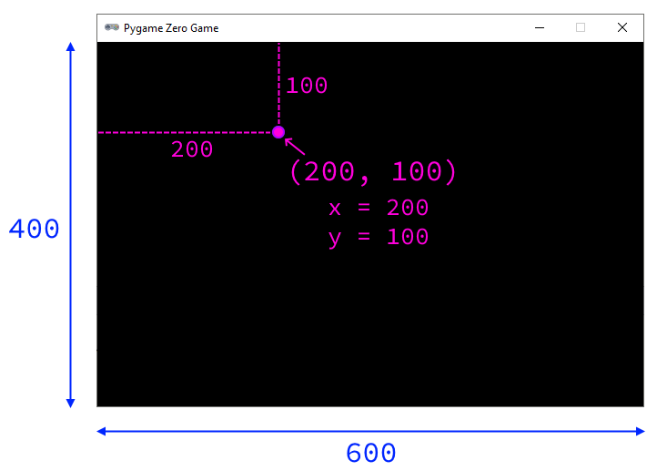
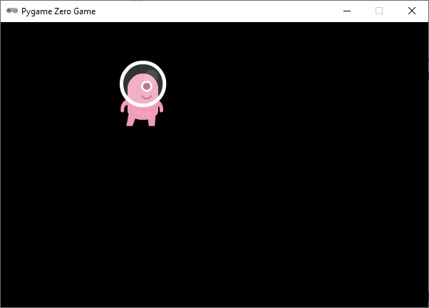
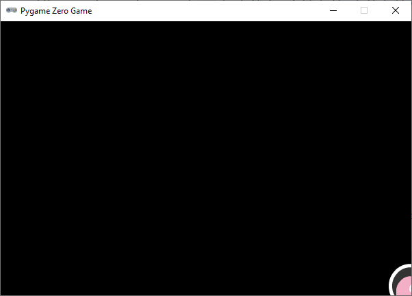
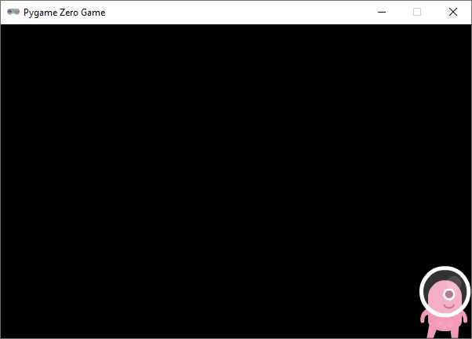

.. role:: python(code)
   :language: python

.. |br| raw:: html

    

Sprites
===========

Zoals gezegd is een zwart venster niet heel spannend. Laten we er daarom  snel wat leven in brengen, door onze hoofdrolspeler te introduceren: een roze alien.

De alien is een afbeelding (Engels: image) die we straks uiteraard gaan laten bewegen. Afbeeldingen van karakters en objecten in games noemen we **sprites**.

Images map
----------

Voordat je hem kunt gebruiken, moet je de alien sprite downloaden en in de juiste map plaatsen. Volg onderstaande stappen om dat te doen.

1. Klik in Mu editor op de knop :guilabel:`Images`. Daardoor creëert Mu editor zelf een map met de naam :file:`images` in je :file:`alien` map. Er wordt automatisch een Windows Verkenner geopend waarin je dat kunt zien.

   .. image:: images/images_folder_01.png

   Alle sprites die je gebruikt in een game moeten in deze map staan, anders kan Mu editor ze niet vinden.

2. Download de :download:`alien sprite <../game_assets/alien/images/alien_pink.png>`.

   .. image:: ../game_assets/alien/images/alien_pink.png

3. Het gedownloade bestand komt waarschijnlijk terecht in je :file:`Downloads` map. Verplaats het bestand met behulp van de Windows Verkenner naar de :file:`alien\\images` map. Dit kan op verschillende manieren, bijvoorbeeld door het bestand van het ene venster naar het andere te verslepen. Je kunt ook het bestand in de :file:`Downloads` map selecteren, vervolgens :kbd:`Ctrl` + :kbd:`X` gebruiken om het te knippen en :kbd:`Ctrl` + :kbd:`V` in de :file:`alien\\images` map om het te plakken.

   .. image:: images/download_move.png
   
   |br|

   .. dropdown:: Tip
      :color: info
      :icon: info

      In plaats van met de linker muisknop kun je ook met de rechter muisknop op de downloadlink klikken. Als je vervolgens :guilabel:`Link opslaan als` selecteert, kun je de sprite direct in de :file:`alien\\images` map opslaan. Je hoeft hem dan niet meer uit je :file:`Downloads` map te halen.

      .. image:: images/context_menu.png

4. Als je dit goed hebt gedaan, dan bevindt het bestand :file:`alien_pink.png` zich nu op de juiste plek.

   .. image:: images/images_folder_02.png

   Ziet het er bij jou iets anders uit? Je kunt in het lint van de Verkenner het tablad :guilabel:`Beeld` selecteren en daar kiezen voor grotere icoontjes en het tonen van bestandsextensies. Een bestandsextensie is de toevoeging aan een bestandsnaam die achter de punt staat. Dus van het bestand :file:`alien_pink.png` is de naam :file:`alien_pink` en de extensie :file:`png`.

   .. image:: images/images_folder_03.png

Actors
----------

Om de alien sprite in je game te laten verschijnen, moet je drie dingen doen:

1. Een :python:`Actor` variabele aanmaken.
2. De :python:`draw()` functie van je game definiëren.
3. De :python:`draw()` functie van de :python:`Actor` variabele aanroepen.

In de volgende code zie je deze stappen in de regels 5 tot en met 10.

.. code-block:: python
   :class: no-copybutton
   :linenos:
   :emphasize-lines: 5-10
   :caption: alien.py
   :name: alien_v02

   # Vensterafmetingen
   WIDTH = 600
   HEIGHT = 400

   # Roze alien Actor
   alien = Actor('alien_pink')

   # De draw() functie van de game
   def draw():
      alien.draw()

Op regel 6 wordt met :python:`alien = Actor('alien_pink')` een Actor variabele aangemaakt met de naam :python:`alien`. Tussen de haakjes staat de naam van de sprite die we willen gebruiken voor deze Actor.

Op regel 9 definiëren we de :python:`draw()` functie. Elk Pygame Zero programma moet zo'n functie bevatten. Pygame roept deze functie automatisch aan wanneer het game venster opnieuw moet worden getekend. Als we de sprite straks laten bewegen, wordt :python:`draw()` heel vaak aangeroepen, telkens wanneer de sprite een stukje is verplaatst. Let op: je programma kan niet meer dan één :python:`draw()` functie hebben; alle tekenwerk moet door deze ene functie worden geregeld.

Op regel 10 roepen we :python:`alien.draw()` aan. Dat is de :python:`draw()` functie van de :python:`alien` Actor (en dus een andere dan de :python:`draw()` functie die we op regel 9 definieerden). Elke Actor in Pygame Zero heeft een eigen voorgeprogrammeerde :python:`draw()` functie die ervoor zorgt dat de sprite wordt getekend. 

Run je code om te zien of het werkt.

Positionering
--------------

Op dit moment staat de alien linksboven in het venster. Om de sprite op een andere positie te plaatsen, gaan we coördinaten gebruiken. Hieronder lees je hoe dat werkt.

In regel 2 en 3 van :file:`alien.py` stelden we de breedte en de hoogte van ons game venster in op 600 en 400 pixels:

Elke pixel in dit venster heeft twee coördinaten:

* x-coördinaat: de horizontale afstand tot de linker bovenhoek.
* y-coördinaat: de verticale afstand tot de linker bovenhoek.

Vaak schrijf je de twee coördinaten van een pixel tussen haakjes, gescheiden door een komma. Dus :python:`(200, 100)` is de pixel met x-coördinaat :python:`200` en y-coördinaat :python:`100`. De hoekpunten van ons venster hebben dus de coördinaten :python:`(0, 0)`, :python:`(600, 0)`, :python:`(0, 400)` en :python:`(600, 400)`.

De pixel die vanuit de linker bovenhoek 200 naar rechts en 100 naar beneden ligt, heeft de coördinaten :python:`(200, 100)`:

.. dropdown:: Verschillende coördinatenstelsels
   :open:
   :color: warning
   :icon: alert

   Let op het verschil tussen het coördinatenstelsel in Pygame Zero en dat in de turtle module. In de turtle module is :python:`(0, 0)` het midden van het venster. In Pygame Zero is :python:`(0, 0)`  de linker bovenhoek. Bovendien is de positieve richting van de y-as in de turtle module naar boven en in Pygame Zero naar beneden!

   .. grid:: 2

      .. grid-item:: 
         :columns: 6

         .. image:: images/turtle_axes.png
         
         Coördinatenstelsel turtle

      .. grid-item:: 
         :columns: 6

         .. image:: images/pygame_axes.png

         Coördinatenstelsel Pygame
     

Laten we de alien eens op dit punt :python:`(200, 100)` positioneren: 

.. code-block:: python
   :class: no-copybutton
   :linenos:
   :emphasize-lines: 7-8
   :caption: alien.py
   :name: alien_v03

   # Vensterafmetingen
   WIDTH = 600
   HEIGHT = 400

   # Roze alien Actor
   alien = Actor('alien_pink')
   alien.x = 200
   alien.y = 100

   # De draw() functie van de game
   def draw():
      alien.draw()

Run de code om te controleren of de alien inderdaad op de juiste positie staat.

|br|

.. dropdown:: Opdracht 01
  :color: secondary
  :icon: pencil
  :open:

  Wijzig de code in :file:`alien.py` zodat de alien op 500 pixels van de linkerzijde en 300 pixels van de bovenzijde van het venster staat.   

  .. dropdown:: Oplossing
      :color: secondary
      :icon: check-circle

      .. code-block:: python
         :class: no-copybutton
         :linenos:
         :emphasize-lines: 7-8
         :caption: alien.py

         # Vensterafmetingen
         WIDTH = 600
         HEIGHT = 400

         # Roze alien Actor
         alien = Actor('alien_pink')
         alien.x = 500
         alien.y = 300

         # De draw() functie van de game
         def draw():
            alien.draw()

.. dropdown:: Opdracht 02
  :color: secondary
  :icon: pencil
  :open:

  Wijzig de code in :file:`alien.py` zodat de alien op 150 pixels van de **rechter**\zijde en 50 pixels van de **onder**\zijde van het venster staat.   

.. dropdown:: Opdracht 03
  :color: secondary
  :icon: pencil
  :open:

  Wijzig de code in :file:`alien.py` zodat de alien exact in het midden van het venster staat.   

Vensterafmetingen gebruiken
^^^^^^^^^^^^^^^^^^^^^^^^^^^^^^^^^^^^^^^^^^^^^^^^

Wellicht heb je de opdrachten 02 en 03 als volgt opgelost:

.. grid:: 2

   .. grid-item:: 
      :columns: 6

      .. code-block:: python
         :class: no-copybutton
         :linenos:
         :lineno-start: 7
         :caption: Opdracht 02

         alien.x = 450
         alien.y = 350

   .. grid-item:: 
      :columns: 6

      .. code-block:: python
         :class: no-copybutton
         :linenos:
         :lineno-start: 7
         :caption: Opdracht 03

         alien.x = 300
         alien.y = 200

Met deze code komt de alien inderdaad op de juiste plek terecht. Het is echter beter om bij deze opdrachten de vensterafmetingen :python:`WIDTH` en :python:`HEIGHT` te gebruiken voor het positioneren van de alien:

.. grid:: 2

   .. grid-item:: 
      :columns: 6

      .. code-block:: python
         :class: no-copybutton
         :linenos:
         :lineno-start: 7
         :caption: Opdracht 02

         alien.x = WIDTH - 150
         alien.y = HEIGHT - 50

   .. grid-item:: 
      :columns: 6

      .. code-block:: python
         :class: no-copybutton
         :linenos:
         :lineno-start: 7
         :caption: Opdracht 03

         alien.x = WIDTH / 2
         alien.y = HEIGHT / 2

.. dropdown:: Vraag 01
    :color: secondary
    :icon: question
    :open:

    Waarom is het beter :python:`alien.x = WIDTH / 2` te gebruiken dan :python:`alien.x = 300` om de sprite horizontaal in het midden van het venster te positioneren?  

    .. dropdown:: Antwoord
        :color: secondary
        :icon: check-circle

        Met :python:`alien.x = WIDTH / 2` is je code flexibeler. Stel dat je later besluit om de breedte van je venster te vergroten naar 800 pixels, dan komt de sprite nog steeds in het midden terecht. Had je :python:`alien.x = 300` gebruikt, dan zou de sprite niet meer in het midden staan.

.. dropdown:: Opdracht 04
   :color: secondary
   :icon: pencil
   :open:

   Wijzig de code in :file:`alien.py` zodat de alien op een kwart van de vensterbreedte en de helft van de vensterhoogte staat.

   .. dropdown:: Oplossing
      :color: secondary
      :icon: check-circle

      .. code-block:: python
         :class: no-copybutton
         :linenos:
         :lineno-start: 7
         :caption: Opdracht 04

         alien.x = WIDTH / 4     # Of alien.x = 0.25 * WIDTH
         alien.y = HEIGHT / 2    # Of alien.y = 0.5 * HEIGHT

Ankerpunten
^^^^^^^^^^^^^^^^

.. dropdown:: Opdracht 05
  :color: secondary
  :icon: pencil
  :open:

  Plaats de alien in de rechter onderhoek van het venster. Gebruik niet de getallen :python:`600` en :python:`400`, maar de constanten :python:`WIDTH` en :python:`HEIGHT`.   

  .. dropdown:: Oplossing
      :color: secondary
      :icon: check-circle

      .. code-block:: python
         :class: no-copybutton
         :linenos:
         :emphasize-lines: 7-8
         :caption: alien.py
         :name: alien_v06

         # Vensterafmetingen
         WIDTH = 600
         HEIGHT = 400

         # Roze alien Actor
         alien = Actor('alien_pink')
         alien.x = WIDTH
         alien.y = HEIGHT

         # De draw() functie van de game
         def draw():
            alien.draw()

Als je de vorige opdracht goed hebt uitgevoerd, dan was dit het resultaat:

Dat is waarschijnlijk niet helemaal wat je voor ogen hebt wanneer je de alien in de rechter onderhoek wilt positioneren. Kijk even goed naar de onderstaande afbeeldingen om de oorzaak te begrijpen van deze 'fout'.

.. grid:: 2

   .. grid-item:: 
      :columns: 6

      .. image:: images/sides.png

   .. grid-item:: 
      :columns: 6

      .. image:: images/anchorpoints.png

De alien sprite heeft een breedte en een hoogte. Wanneer je :python:`alien.x` en :python:`alien.y` een waarde geeft, zorgt Pygame ervoor dat het middelpunt (:python:`center`) van de sprite op die positie terecht komt. Het middelpunt is namelijk het standaard *ankerpunt*  van een sprite. Wij willen echter graag dat het punt rechtsonder (:python:`bottomright`) op de coördinaten :python:`(600, 400)` terecht komt. Dit kun je doen door regels 7 en 8 van je programma als volgt aan te passen:

.. code-block:: python
   :class: no-copybutton
   :linenos:
   :lineno-start: 7
   :caption: alien.py
   :name: alien_v07

   alien.right = WIDTH
   alien.bottom = HEIGHT

Je kunt het ook in één regel doen:

.. code-block:: python
   :class: no-copybutton
   :linenos:
   :lineno-start: 7
   :caption: alien.py
   :name: alien_v08

   alien.bottomright = (WIDTH, HEIGHT)

Nu staat de alien precies op de plek die we wilden:

|br|

.. dropdown:: Opdracht 06
   :color: secondary
   :icon: pencil
   :open:

   Plaats de alien in de rechter bovenhoek van het venster.

   .. image:: images/alien_topright.png
      :scale: 75%

   |br|

   .. dropdown:: Oplossing
      :color: secondary
      :icon: check-circle

      .. code-block:: python
         :class: no-copybutton
         :linenos:
         :lineno-start: 7
         :caption: alien.py
         :name: alien_v09

         alien.right = WIDTH
         alien.top = 0

      of

      .. code-block:: python
         :class: no-copybutton
         :linenos:
         :lineno-start: 7
         :caption: alien.py
         :name: alien_v10

         alien.topright = (WIDTH, 0)

.. dropdown:: Opdracht 07
   :color: secondary
   :icon: pencil
   :open:

   Plaats de alien in de linker onderhoek van het venster.

   .. image:: images/alien_bottomleft.png
      :scale: 75%

   |br|

   .. dropdown:: Oplossing
      :color: secondary
      :icon: check-circle

      .. code-block:: python
         :class: no-copybutton
         :linenos:
         :lineno-start: 7
         :caption: alien.py
         :name: alien_v11

         alien.left = 0
         alien.bottom = HEIGHT

      of

      .. code-block:: python
         :class: no-copybutton
         :linenos:
         :lineno-start: 7
         :caption: alien.py

         alien.bottomleft = (0, HEIGHT)