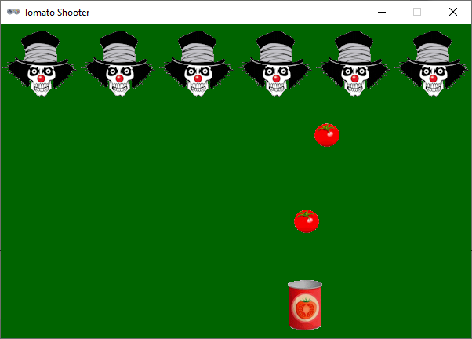

.. role:: python(code)
   :language: python

.. |br| raw:: html

    

Projectielen afvuren (schietspellen)
======================================

In schietspellen kun je schieten op vijanden. Uiteraard moeten alle afgeschoten projectielen (kogels of anderszins) worden getoond en op de juiste wijze door het speelvenster bewegen. Het aantal projectielen verschilt echter per moment. Soms vuurt de speler een reeks kogels na elkaar af en soms helemaal geen. Hoe kun je dat dan programmeren? Door gebruik te maken van een lijstvariabele!

Het voorbeeld dat we in deze uitleg gebruiken heet Tomato Shooter. Daarin bestuurt de speler een blikje dat tomaten kan afschieten op enge clowns. Zie de afbeelding hieronder.

Sprite afbeeldingen
--------------------

Voor deze oefening gebruiken we drie afbeeldingen:

.. grid:: 3

   .. grid-item::
      :columns: 4

      .. image:: ../game_assets/tomato_shooter/tomato.png
         :width: 32
         :align: center

   .. grid-item::
      :columns: 4

      .. image:: ../game_assets/tomato_shooter/can.png
         :width: 64
         :align: center

   .. grid-item::
      :columns: 4

      .. image:: ../game_assets/tomato_shooter/evil_clown.png
         :width: 96
         :align: center

Je kunt de afbeeldingen :download:`hier <../game_assets/tomato_shooter/tomato_shooter.zip>` downloaden in één zip bestand. Plaats de afbeeldingen in de :file:`images` map van je game.

De clowns lijst
---------------------------

Zoals gezegd gaan we voor het programmeren van de tomaten een lijstvariabele gebruiken. Maar ook voor de clowns is zo'n lijstvariabele handig. Omdat de clowns niet hoeven te bewegen, zijn ze iets eenvoudiger te programmeren dan de tomaten.

.. code-block:: python
   :caption: tomato_shooter.py
   :linenos:

   # Vensterinstellingen
   WIDTH = 600
   HEIGHT = 400
   TITLE = 'Tomato Shooter'

   NUMBER_OF_CLOWNS = 6

   # Clowns lijst
   clowns = []
   for i in range(NUMBER_OF_CLOWNS):
      clown = Actor('evil_clown')
      clown.x = (i + 1/2) * (WIDTH / NUMBER_OF_CLOWNS)
      clown.y = 50
      clowns.append(clown)
      
   # Draw() functie
   def draw():
      screen.fill('darkgreen')
      for clown in clowns:
         clown.draw()
         
   # Update() functie
   def update():
      pass

In regel 6 definiëren we de constante :python:`NUMBER_OF_CLOWNS`. Dat is handig voor als je later het aantal clowns wilt wijzigen.

In regel 9 definiëren we een lege lijst :python:`clowns`, die door de :python:`for` loop in regels 10 t/m 14 zal worden gevuld. |br|
De lastigste regel is regel 12. Hierin wordt elke clown gepositioneerd. Met de formule :python:`(i + 1/2) * (WIDTH / NUMBER_OF_CLOWNS)` zorgen we ervoor dat de clowns gelijkmatig over de breedte van het venster worden verdeeld. Als je de waarden van :python:`i`, :python:`WIDTH` en :python:`NUMBER_OF_CLOWNS` invult, kun je bedenken hoe de formule werkt. De vensterbreedte is 600 pixels en het aantal clowns is 6. Elke clown krijgt dus een ruimte van 100 pixels; daar zorgt :python:`(WIDTH / NUMBER_OF_CLOWNS)` voor. In de :python:`for` loop begint :python:`i` met de waarde 0. De horizontale positie van de eerste clown wordt dan :python:`(0 + 1/2) * 100` en dat is 50. De horizontale positie van de tweede clown (:python:`i` is 1) wordt 150, van de derde clown (:python:`i` is 2) 250 enzovoort. |br|
Om de :python:`clown` Actor in de :python:`clowns` lijst (let op het verschil tussen enkelvoud en meervoud) op te nemen, roepen we in regel 14 de :python:`.append()` functie aan. Dat is een handige manier om elementen aan een lijst toe te voegen.

In de :python:`draw()` functie tekenen we alle clowns in de lijst door een :python:`for` loop te gebruiken. Let op het verschil tussen de :python:`for` loop in regel 10 en die in regel 19. Bij de eerste gebruikten we de :python:`range()` functie om het codeblok binnen de loop een aantal keren uit te voeren, net zo vaak als :python:`NUMBER_OF_CLOWNS` aangeeft. Bij de laatste wordt code binnen de loop (regel 20) uitgevoerd voor elk element in de :python:`clowns` lijst.

Het blikje
------------

Als je het spel Fruitcatcher hebt gemaakt, is het programmeren van het blikje niet moeilijk. Het is een sprite die door drukken op de pijltjestoetsen naar links en naar rechts beweegt.

.. code-block:: python
   :caption: tomato_shooter.py
   :linenos:
   :emphasize-lines: 7, 17-20, 25, 31-35

   # Vensterinstellingen
   WIDTH = 600
   HEIGHT = 400
   TITLE = 'Tomato Shooter'

   NUMBER_OF_CLOWNS = 6
   CAN_SPEED = 4

   # Clowns lijst
   clowns = []
   for i in range(NUMBER_OF_CLOWNS):
      clown = Actor('evil_clown')
      clown.x = (i + 1/2) * (WIDTH / NUMBER_OF_CLOWNS)
      clown.y = 50
      clowns.append(clown)
      
   # Blikje
   can = Actor('can')
   can.x = WIDTH / 2
   can.bottom = HEIGHT - 10
      
   # Draw() functie
   def draw():
      screen.fill('darkgreen')
      can.draw()
      for clown in clowns:
         clown.draw()
         
   # Update() functie
   def update():
      # Keyboard events
      if keyboard.left and can.left > 0:
         can.x -= CAN_SPEED
      if keyboard.right and can.right < WIDTH:
         can.x += CAN_SPEED

Misschien vraag je je af waarom we in de :python:`draw()` functie niet :python:`screen.clear()` aanroepen zoals we bij Fruitcatcher en het Alien spel deden. In plaats daarvan gebruiken we hier in regel 24 :python:`screen.fill('darkgreen')`. Daarmee geven we het venster een donkergroene achtergrondkleur, en is de aanroep :python:`screen.clear()` overbodig geworden.

De tomaten
------------

Waar we de :python:`clowns` lijst bij aanvang van het spel al vulden met clowns, is de lijst met tomaten in eerste instantie leeg. Er komt pas een tomaat in de lijst zodra de speler schiet door op de spatiebalk te drukken. Voor het creëren van een nieuwe tomaat en het toevoegen aan de lijst, maken we een functie :python:`spawn_tomato(x, y)`.

.. code-block:: python
   :caption: tomato_shooter.py
   :linenos:
   :emphasize-lines: 8, 23-24, 26-30, 32-35, 43-44

   # Vensterinstellingen
   WIDTH = 600
   HEIGHT = 400
   TITLE = 'Tomato Shooter'

   NUMBER_OF_CLOWNS = 6
   CAN_SPEED = 4
   TOMATO_SPEED = 10

   # Clowns lijst
   clowns = []
   for i in range(NUMBER_OF_CLOWNS):
      clown = Actor('evil_clown')
      clown.x = (i + 1/2) * (WIDTH / NUMBER_OF_CLOWNS)
      clown.y = 50
      clowns.append(clown)
      
   # Blikje
   can = Actor('can')
   can.x = WIDTH / 2
   can.bottom = HEIGHT - 10

   # Tomaten lijst
   tomatoes = []

   # Functie spawn_tomato() maakt een tomato Actor op positie (x, y) encode
   # voegt deze toe aan de tomatoes lijst.
   def spawn_tomato(x, y):
      tomato = Actor('tomato', (x, y))
      tomatoes.append(tomato)

   # Event on_key_down()
   def on_key_down(key):
      if key == keys.SPACE:
         spawn_tomato(can.x, can.top)
      
   # Draw() functie
   def draw():
      screen.fill('darkgreen')
      can.draw()
      for clown in clowns:
         clown.draw()
      for tomato in tomatoes:
         tomato.draw()
         
   # Update() functie
   def update():
      # Keyboard events
      if keyboard.left and can.left > 0:
         can.x -= CAN_SPEED
      if keyboard.right and can.right < WIDTH:
         can.x += CAN_SPEED

Voor het afhandelen van het drukken op de spatiebalk gebruiken we de Pygame Zero functie :python:`on_key_down()`. Daarin wordt :python:`spawn_tomato(x, y)` aangeroepen met als x-waarde :python:`can.x` en als y-waarde :python:`can.top`, waardoor de tomaat dezelfde positie krijgt als de bovenkant van het blikje.

Run de code. Wanneer je op de spatiebalk drukt, verschijnt een tomaat. Deze beweegt echter nog niet richting de clowns. Daarvoor gebruiken we uiteraard de update functie:

.. code-block:: python
   :caption: tomato_shooter.py
   :linenos:
   :lineno-start: 46
   :emphasize-lines: 8-17

   # Update() functie
   def update():
      # Keyboard events
      if keyboard.left and can.left > 0:
         can.x -= CAN_SPEED
      if keyboard.right and can.right < WIDTH:
         can.x += CAN_SPEED
      # Tomaten beweging en collision detection    
      for tomato in tomatoes:
         tomato.y -= TOMATO_SPEED
         if tomato.bottom < 0:
               tomatoes.remove(tomato)
               return
         hit_clown = tomato.collidelist(clowns)
         if hit_clown >= 0:
               del clowns[hit_clown]
               tomatoes.remove(tomato)

Dit is best een ingewikkeld stukje code. Omdat alle tomaten in de :python:`tomatoes` list moeten bewegen en worden gecheckt op collisions, gebruiken we een :python:`for` loop. |br|
In regel 55 bewegen we de tomaat naar boven met :python:`tomato.y -= TOMATO_SPEED`. |br|
In regels 56 t/m 58 checken we of de tomaat aan de bovenkant uit het venster is verdwenen en als dat het geval is, verwijderen we hem uit de lijst met :python:`tomatoes.remove(tomato)`. Vervolgens verlaten we met :python:`return` direct de functie. |br|
In regel 59 roepen we de functie :python:`collidelist()` aan. Dat is een Pygame functie die checkt of er een collision is tussen een sprite en een lijst van andere sprites. Als dat het geval is, dan retourneert de functie de index (het nummer) van de sprite uit de lijst. Als er geen collision is, retourneert de functie :python:`-1`. Je kunt `hier <https://www.pygame.org/docs/ref/rect.html#pygame.Rect.collidelist>`_ de officiële beschrijving van deze functie vinden. Het getal dat :python:`collidelist()` teruggeeft, slaan we op in de variabele :python:`hit_clown`. |br|
In regels 61-62 checken we of er een clown is geraakt (als er geen collision is gedetecteerd, heeft :python:`hit_clown` de waarde :python:`-1` gekregen). Als dat het geval is, verwijderen we de clown uit de :python:`clowns`  lijst en de tomaat uit de :python:`tomatoes` lijst.

Is je opgevallen dat we in regels 61 en 62 op twee verschillende manieren hetzelfde doen? Beide regels verwijderen een element uit een lijst. Met de :python:`del` instructie kun je een element verwijderen waarvan je de index weet. Met de :python:`remove()` functie verwijder je een element waarvan je de index niet weet. Hieronder een voorbeeld:

.. code-block:: python
   :emphasize-lines: 2, 5, 8

      >>> letters = ['A', 'B', 'C', 'A']
      >>> del letters[1]
      >>> letters
      ['A', 'C', 'A']
      >>> letters.remove('C')
      >>> letters
      ['A', 'A']
      >>> letters.remove('A')
      >>> letters
      ['A']

Tenslotte
-----------

Tomato shooter is op dit moment natuurlijk geen volwaardig spel; het is bedoeld als voorbeeld voor het programmeren van een schietspelletje. Je kunt het zelf naar believen uitbouwen, bijvoorbeeld door:

* de clowns random te laten verschijnen en weer verdwijnen, zodat de speler op tijd moet schieten;
* de clowns te laten bewegen, zodat het moeilijker wordt om te raken;
* de clowns terug te laten schieten, zodat de speler levens kan verliezen;
* geluiden toe te voegen;
* explosies te tonen wanneer een clown wordt geraakt;
* de groene achtergrond te vervangen door een afbeelding.
  
En probeer ook eens om de afhandeling van het drukken op de spatiebalk te programmeren in de :python:`update()` functie, net zoals het drukken op de pijltjestoetsen. Nu gebruikten we de functie :python:`on_key_down()` hiervoor, maar dat hoeft niet per se. Het verschil tussen beide manieren merk je wanneer je het uitprobeert.