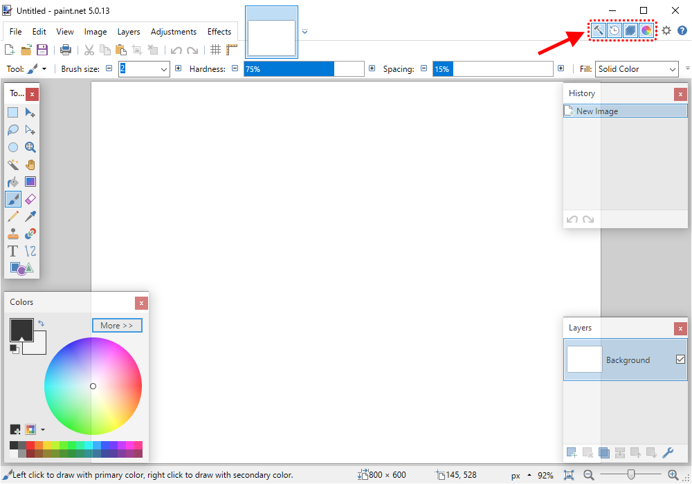

.. role:: python(code)
   :language: python

.. |br| raw:: html

    

Sprites bewerken in Paint.NET
==============================

Om je eigen sprites te kunnen maken en bewerken heb je een grafisch programma nodig. Twee bekende gratis programma's zijn:

.. grid:: 2

   .. grid-item::
      :columns: 6

      .. image:: images/icon_gimp.png
         :width: 64
         :align: center
         :target: https://www.gimp.org/
      
      .. rst-class:: center

         `GIMP <https://www.gimp.org/>`_

   .. grid-item::
      :columns: 6

      .. image:: images/icon_paint_net.png
         :width: 64
         :align: center
         :target: https://www.getpaint.net/
      
      .. rst-class:: center

         `Paint.NET <https://www.getpaint.net/>`_

Omdat de schrijver dezes enkel ervaring heeft met Paint.NET zullen we dat programma gebruiken. Je moet Paint.NET overigens niet verwarren met Paint, het tekenprogramma dat standaard in Microsoft Windows zit. Paint.NET is vele malen geavanceerder.

Paint.NET downloaden en installeren
------------------------------------

Downloaden
^^^^^^^^^^^^^^^^

Het downloaden van Paint.NET kan een beetje lastig zijn, omdat de website helaas veel advertenties en neplinks bevat. Volg onderstaande stappen (klik op de tabbladen om naar een volgende stap te gaan):

.. tab-set:: 

   .. tab-item:: Stap 1

      Ga naar `www.getpaint.net <https://www.getpaint.net/>`_ en klik aan de rechterkant op de link zoals aangegeven in onderstaande afbeelding.

      .. figure:: images/download_paint_net_01.png

   .. tab-item:: Stap 2

      Scroll iets naar beneden en klik op het plaatje met dotPDN.

      .. figure:: images/download_paint_net_02.png

   .. tab-item:: Stap 3

      Klik aan de rechterkant op de downloadlink.

      .. figure:: images/download_paint_net_03.png

   .. tab-item:: Stap 4

      Het installatie bestand wordt gedownload naar je :file:`Downloads` map.

      .. figure:: images/download_paint_net_04.png

Installeren
^^^^^^^^^^^^^^^^

Het installeren is eenvoudig. Open het gedownloade bestand en start de installatie:

.. tab-set:: 

   .. tab-item:: Stap 1

      .. figure:: images/download_paint_net_05.png
         :class: image-border
         
   .. tab-item:: Stap 2

      .. figure:: images/download_paint_net_06.png
         :class: image-border
         
   .. tab-item:: Stap 3

      .. figure:: images/download_paint_net_07.png
         :class: image-border    

   .. tab-item:: Stap 4

      .. figure:: images/download_paint_net_08.png
         :class: image-border

   .. tab-item:: Stap 5

      .. figure:: images/download_paint_net_09.png
         :class: image-border

Werken met Paint.NET
---------------------

Het venster van Paint.NET ziet eruit zoals veel tekenprogramma's: een groot wit canvas waarop je kunt tekenen en aan de randen enkele hulpvensters zoals een toolbox met tekengereedschappen en een kleurenpalet. Die hulpvensters kun je (on)zichtbaar maken met de vier knoppen rechtsboven.

.. dropdown:: Opdracht 01
    :color: secondary
    :icon: pencil

    Maak het History hulpvenster onzichtbaar.

Een afbeelding kopiëren
^^^^^^^^^^^^^^^^^^^^^^^^^^

Wanneer je een afbeelding hebt gedownload, kun je die eenvoudig openen via het :guilabel:`File` menu in Paint.NET. Een andere mogelijkheid is in de Windows Verkenner met de rechtermuisknop op het bestand klikken en kiezen voor :guilabel:`Open with`:

Maar meestal zoek je afbeeldingen voor je games met je web browser, en dan is de volgende manier het gemakkelijkst:

1. Klik met de rechtermuisknop op de afbeelding in je web browser.
2. Selecteer :guilabel:`Afbeelding kopiëren`.
3. Ga naar Paint.NET en typ :kbd:`Ctrl` + :kbd:`Alt` + :kbd:`V` (of ga in de menubalk naar :guilabel:`Edit` en kies :guilabel:`Paste into New Image`).

Let op: je moet behalve de :kbd:`Ctrl` toets dus ook de :kbd:`Alt` toets ingedrukt houden, om ervoor te zorgen dat de afbeelding als *nieuw* bestand in Paint.NET wordt geplakt.

.. dropdown:: Opdracht 02
    :color: secondary
    :icon: pencil

    Kopieer onderstaande afbeelding en plak die in Paint.NET op de hierboven beschreven manier.

    .. image:: images/southpark_01.png
      :align: center
      :class: image-border

Selectiegereedschappen
^^^^^^^^^^^^^^^^^^^^^^^^

In de toolbox vind je een aantal gereedschappen waarmee je onderdelen van een afbeelding kunt selecteren. Klik op het :guilabel:`Rectangle Select` gereedschap in de linkerbovenhoek van de toolbox en je zult zien dat de knoppenbalk bovenin zich daarop aanpast.

.. grid:: 2

   .. grid-item::
      :columns: 3

      .. image:: images/selection_tools.png
         :class: image-border
         :align: center

   .. grid-item::
      :columns: 9

      .. image:: images/selection_rectangle.png
         :class: image-border         
         :align: center

Met name de *size* opties :guilabel:`Any Size`, :guilabel:`Fixed Ratio` en :guilabel:`Fixed Size` van dit gereedschap zijn interessant. Probeer ze alle drie uit door een optie te kiezen en vervolgens iets in de afbeelding te selecteren.

In de onderstaande afbeelding zie je dat voor :guilabel:`Fixed Ratio` is gekozen met een breedte-hoogteverhouding van 4:3.

.. figure:: images/selection_rectangle_02.png
   :class: image-border

.. dropdown:: Opdracht 03
   :color: secondary
   :icon: pencil

   Kies het :guilabel:`Rectangle Select` gereedschap. Stel de afmeting in op :guilabel:`Fixed Ratio` met breedte-hoogteverhouding 1:1.
   Selecteer met deze instelling Kenny (het derde mannetje van links).

   .. figure:: images/selection_rectangle_03.png
      :class: image-border

:bdg-info:`Deze tekst wordt nog uitgebreid.`