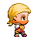

.. role:: python(code)
   :language: python

.. |br| raw:: html

    

Sprite animatie: een lopend poppetje
======================================

In veel games kun je een poppetje met de pijltjestoetsen besturen. Om het poppetje 'echt' te laten lopen, moeten we de sprite animeren: in plaats van één afbeelding wisselen we een aantal afbeeldingen af, zodat het lijkt of het poppetje beweegt.

Pygame Zero Helper
-------------------

Je zou de animatie van de sprite zelf kunnen programmeren, maar waarom zou je moeilijk doen als het makkelijk(er) kan: we gaan de Pygame Zero Helper library gebruiken. Dat is een verzameling (een bibliotheek) van functies waarmee je Pygame Zero kunt uitbreiden om extra mogelijkheden toe te voegen. Met deze library is sprite animatie tamelijk eenvoudig te bewerkstelligen.

Je vindt de Pygame Zero Helper library op de website `A Posteriori <https://www.aposteriori.com.sg/pygame-zero-helper/>`_. Download daar het bestand :file:`pgzhelper.py` en sla het op in dezelfde map als het codebestand van je spel.

AFBEELDINGEN INVOEGEN (DOWNLOADEN EN MAP)

Om de functies van de Pygame Zero Helper library te kunnen gebruiken in je code, voeg je helemaal bovenaan, op de eerste regel, het volgende :python:`import` statement toe:

.. code-block:: python
   :linenos:

   from pgzhelper import *

Sprite afbeeldingen
--------------------

Voor het bewegende poppetje gebruiken we 12 afbeeldingen, 3 voor elke looprichting:

.. grid:: 4

   .. grid-item::
      :columns: 3

      .. image:: ../game_assets/walking_character/walk00.png
         :width: 42

      .. image:: ../game_assets/walking_character/walk01.png
         :width: 42

      .. image:: ../game_assets/walking_character/walk02.png
         :width: 42

   .. grid-item::
      :columns: 3

      .. image:: ../game_assets/walking_character/walk03.png
         :width: 42

      .. image:: ../game_assets/walking_character/walk04.png
         :width: 42

      .. image:: ../game_assets/walking_character/walk05.png
         :width: 42

   .. grid-item::
      :columns: 3

      .. image:: ../game_assets/walking_character/walk06.png
         :width: 42

      .. image:: ../game_assets/walking_character/walk07.png
         :width: 42

      .. image:: ../game_assets/walking_character/walk08.png
         :width: 42

   .. grid-item::
      :columns: 3

      .. image:: ../game_assets/walking_character/walk09.png
         :width: 42

      .. image:: ../game_assets/walking_character/walk10.png
         :width: 42

      .. image:: ../game_assets/walking_character/walk11.png
         :width: 42

Je kunt de afbeeldingen :download:`hier downloaden in één zip bestand <../game_assets/walking_character/walking_character.zip>`. Plaats de afbeeldingen in de :file:`images` map van je game.