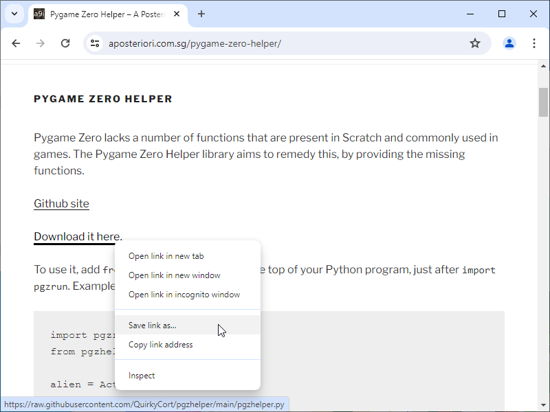
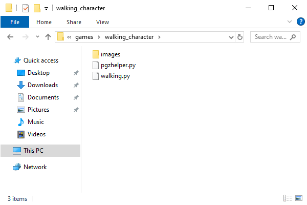
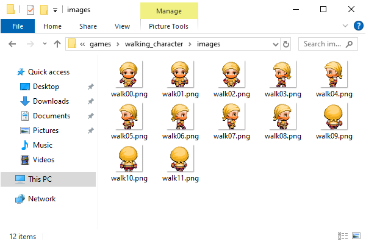

.. role:: python(code)
   :language: python

.. |br| raw:: html

    

Sprite animatie: een lopend poppetje
======================================

In veel games kun je een poppetje met de pijltjestoetsen besturen. Om het poppetje 'echt' te laten lopen, moeten we de sprite animeren: in plaats van één afbeelding wisselen we een aantal afbeeldingen af, zodat het lijkt of het poppetje beweegt.

.. image:: images/walking.gif
   :align: center

Pygame Zero Helper
-------------------

Je zou de animatie van de sprite zelf kunnen programmeren, maar waarom zou je moeilijk doen als het makkelijk(er) kan: we gaan de Pygame Zero Helper library gebruiken. Dat is een verzameling (een bibliotheek) van functies waarmee je Pygame Zero kunt uitbreiden om extra mogelijkheden toe te voegen. Met deze library is sprite-animatie tamelijk eenvoudig te bewerkstelligen.

Je vindt de Pygame Zero Helper library op de website `A Posteriori <https://www.aposteriori.com.sg/pygame-zero-helper/>`_. Download daar het bestand :file:`pgzhelper.py` en sla het op in dezelfde map als het codebestand van je spel.

In de bovenstaande afbeelding zie je dat :file:`pgzhelper.py` zich in dezelfde map bevindt als ons codebestand :file:`walking.py`. 

Om de functies van de Pygame Zero Helper library te kunnen gebruiken in je code, voeg je helemaal bovenaan, op de eerste regel, het volgende :python:`import` statement toe:

.. code-block:: python
   :linenos:

   from pgzhelper import *

Sprite afbeeldingen
--------------------

Voor het bewegende poppetje gebruiken we 12 afbeeldingen, 3 voor elke looprichting:

.. grid:: 4

   .. grid-item::
      :columns: 3

      .. image:: ../game_assets/walking_character/walk00.png
         :width: 42
         :align: center

      .. image:: ../game_assets/walking_character/walk01.png
         :width: 42
         :align: center

      .. image:: ../game_assets/walking_character/walk02.png
         :width: 42
         :align: center

   .. grid-item::
      :columns: 3

      .. image:: ../game_assets/walking_character/walk03.png
         :width: 42
         :align: center

      .. image:: ../game_assets/walking_character/walk04.png
         :width: 42
         :align: center

      .. image:: ../game_assets/walking_character/walk05.png
         :width: 42
         :align: center

   .. grid-item::
      :columns: 3

      .. image:: ../game_assets/walking_character/walk06.png
         :width: 42
         :align: center

      .. image:: ../game_assets/walking_character/walk07.png
         :width: 42
         :align: center

      .. image:: ../game_assets/walking_character/walk08.png
         :width: 42
         :align: center

   .. grid-item::
      :columns: 3

      .. image:: ../game_assets/walking_character/walk09.png
         :width: 42
         :align: center

      .. image:: ../game_assets/walking_character/walk10.png
         :width: 42
         :align: center

      .. image:: ../game_assets/walking_character/walk11.png
         :width: 42
         :align: center

Je kunt de afbeeldingen :download:`hier <../game_assets/walking_character/walking_character.zip>` downloaden in één zip bestand. Plaats de afbeeldingen in de :file:`images` map van je game.

De animate() functie
---------------------------

Om de sprite te animeren, gebruiken we de :python:`animate()` functie uit de :python:`pgzhelper` module. Daarvoor is het nodig dat we de afbeeldingen voor de animatie in een lijst zetten en meegeven aan de :python:`.images` variabele van de :python:`Actor`. De onderstaande code toont hoe dit werkt.

.. code-block:: python
   :caption: walking.py
   :linenos:

   from pgzhelper import *

   # Vensterinstellingen
   WIDTH = 600
   HEIGHT = 400

   # Afbeeldingen voor de geanimeerde sprite
   walk_images = ['walk00', 'walk01', 'walk02']

   # Player Actor 
   player = Actor('walk00')
   player.x = WIDTH/2
   player.y = HEIGHT/2
   player.images = walk_images
   player.fps = 10

   # Draw() functie
   def draw():
      screen.clear()
      player.draw()

   # Update() functie
   def update():
      player.animate()

De meeste regels zullen voor zich spreken. De animatie komt tot stand door de volgende instructies:

* In regel 8 maken we een lijst variabele :python:`walk_images` aan, die wordt gevuld met alle afbeeldingen die we voor de animatie willen gebruiken.
* In regel 14 geven we de :python:`walk_images` lijst door aan de :python:`.images` variabele van de :python:`player` Actor.
* In regel 15 stellen we de snelheid van de animatie in op 10 frames per seconde. Uiteraard kun je hier zelf een waarde kiezen die je geschikt vindt.
* In regel 24 roepen we :python:`player.animate()` aan om de sprite daadwerkelijk te animeren.

Vier richtingen
-----------------

Om het poppetje in vier richtingen te laten lopen, geven we elke looprichting een nummer. Links is 0, rechts is 1, naar voor is 2 en naar achter is 3. In de code definiëren we hiervoor de constanten :python:`LEFT`, :python:`RIGHT`, :python:`FRONT` en :python:`BACK`. Tevens gebruiken we in plaats van één lijst :python:`walk_images` vier lijsten: één voor elke looprichting. In de code hieronder zijn de wijzigingen gemarkeerd.

.. code-block:: python
   :caption: walking.py
   :linenos:
   :emphasize-lines: 8-11, 14, 17-20, 26, 27

   from pgzhelper import *

   # Vensterinstellingen
   WIDTH = 600
   HEIGHT = 400

   # Vier looprichtingen
   LEFT = 0
   RIGHT = 1
   FRONT = 2
   BACK = 3

   # Snelheid van het poppetje
   SPEED = 2

   # Afbeeldingen voor de geanimeerde sprite
   walk_images_front = ['walk00', 'walk01', 'walk02']
   walk_images_left = ['walk03', 'walk04', 'walk05']
   walk_images_right = ['walk06', 'walk07', 'walk08']
   walk_images_back = ['walk09', 'walk10', 'walk11']

   # Player Actor 
   player = Actor('walk00')
   player.x = WIDTH/2
   player.y = HEIGHT/2
   player.direction = FRONT
   player.images = walk_images_front
   player.fps = 10

Je ziet dat in regel 26 de richting van het poppetje wordt ingesteld op 'naar voor' met :python:`player.direction = FRONT`. Op regel 27 geven we :python:`player.images` de bijbehorende afbeeldingenlijst mee.

Zodra de speler op een pijltjestoets drukt, moet het poppetje gaan lopen en eventueel van richting veranderen. Dat programmeren we in de :python:`update()` functie:

.. code-block:: python
   :caption: walking.py
   :linenos:
   :lineno-start: 35

   # Update() functie
   def update():
      # Keyboard events
      if keyboard.left and player.left > 0:
         if player.direction != LEFT:
               player.images= walk_images_left
               player.direction = LEFT
         player.animate()
         player.x -= SPEED
      elif keyboard.right and player.right < WIDTH:
         if player.direction != RIGHT:
               player.images= walk_images_right
               player.direction = RIGHT
         player.animate()
         player.x += SPEED
      elif keyboard.up and player.top > 0:
         if player.direction != BACK:
               player.images= walk_images_back
               player.direction = BACK
         player.animate()
         player.y -= SPEED
      elif keyboard.down and player.bottom < HEIGHT:
         if player.direction != FRONT:
               player.images= walk_images_front
               player.direction = FRONT
         player.animate()
         player.y += SPEED

Voor elk van de vier pijltjestoetsen is de code min of meer hetzelfde. Als bijvoorbeeld de linker pijltjestoets wordt ingedrukt, gebeurt het volgende:

* In regel 38 wordt gecheckt of de linkerkant van het poppetje zich nog binnen het venster bevindt met :python:`player.left > 0`. Als dat het geval is, kan het poppetje naar links bewegen en anders niet.
* In regel 39 wordt gecheckt of de richting van het poppetje misschien al 'naar links' was. Immers, als het poppetje al naar links ging voordat deze pijltjestoets werd ingedrukt, is het niet nodig :python:`player.images` en :python:`player.direction` te updaten. Alleen als het poppetje níet al naar links ging (:python:`player.direction != LEFT`), is het nodig om :python:`player.images` van een nieuwe afbeeldingenlijst te voorzien en de waarde van :python:`player.direction` aan te passen.
* In regel 42 roepen we :python:`player.animate()` aan. Daardoor beweegt het poppetje alleen als de pijltjestoets wordt ingedrukt. Wanneer de speler geen toets indrukt, staat de animatie stil.
* In regel 43 bewegen we de :python:`player` Actor naar links met de snelheid :python:`SPEED`.

Run je code en voilà het poppetje loopt!
